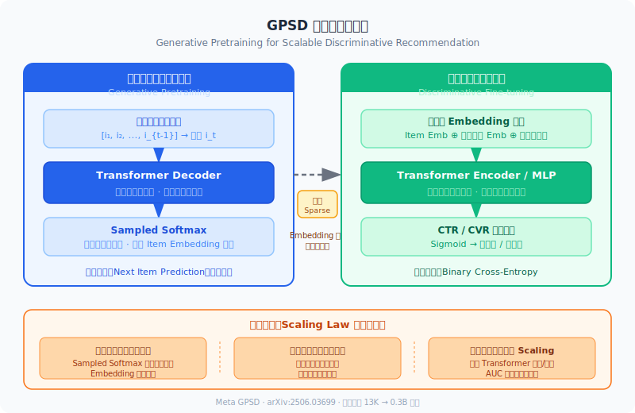
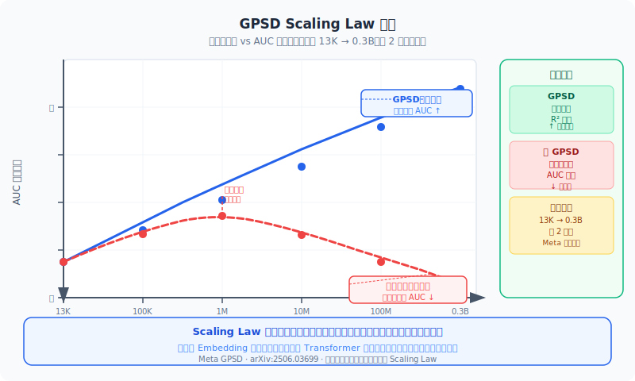

> 本文是关于最新论文《Scaling Transformers for Discriminative Recommendation via Generative Pretraining》（[arXiv:2506.03699](https://arxiv.org/pdf/2506.03699)）的阅读笔记。

在大语言模型（LLM）领域，增加参数量和数据量通常能带来性能的对数线性增长，即 **Scaling Law**。然而在推荐系统领域，特别是用于排序（Ranking）的**判别式模型**（如 CTR/CVR 预测），这一规律却迟迟没有出现。

Meta 团队最近提出的 **GPSD (Generative Pretraining for Scalable Discriminative Recommendation)** 框架，通过引入生成式预训练，成功打破了这一僵局，让判别式推荐模型也能随着参数规模的扩大而变强。本文将从核心问题、方法设计、实验分析、与现有方法对比、优缺点以及工程实践启示等多个角度，对这篇论文进行全面解读。

## 1. 为什么推荐大模型容易”掉点”？

### 1.1 NLP 与推荐系统的数据差异

在自然语言处理中，数据是密集的 token 流——词表通常在几万到十几万量级，而且每个 token 在海量文本中都会被反复观测到，天然具备良好的统计充分性。但在推荐系统中，情况截然不同：

- **物品空间极度庞大**：工业级推荐场景下，物品 ID（Item ID）可达数十亿规模，远超 NLP 词表大小。
- **用户交互极其稀疏**：绝大多数用户只消费过全部物品中极小的一部分（通常远低于 0.01%），导致大量 Embedding 参数缺乏有效的梯度更新。
- **标签信号分布不均**：点击率（CTR）通常在个位数百分比，转化率（CVR）更是远低于 1%，正样本极度稀缺。

### 1.2 判别式训练的过拟合困境

论文指出，直接在判别式任务（点击/转化预测）上训练大规模 Transformer，会遇到严重的**数据稀疏导致的过拟合（Overfitting）**问题。具体表现为：

- **稀疏参数（Embedding 表）难以充分训练**：当物品空间巨大但每个物品的观测样本有限时，Embedding 表中大量参数处于”欠训练”状态，容易记忆噪声而非学习泛化特征。
- **泛化误差随模型规模增大而扩大**：随着模型层数（Dense 参数）增加，模型在训练集上的 loss 持续下降，但验证集上的 loss 却反向增大，泛化差距（Generalization Gap）迅速扩大。
- **”越大越差”的逆直觉现象**：模型参数越多，在测试集上的表现反而可能不如简单的小模型，这与 NLP/CV 领域”越大越好”的经验形成鲜明对比。

### 1.3 过拟合的根源：稀疏参数 vs 稠密参数

论文通过系统性实验，进一步定位了过拟合的根源：

- **稀疏参数（Sparse Parameters）**：主要指 Embedding 表，参数量通常占模型总参数的 90% 以上。由于推荐场景的数据稀疏性，这些参数是过拟合的”重灾区”。
- **稠密参数（Dense Parameters）**：指 Transformer 层中的注意力权重、前馈网络权重等。这些参数被所有样本共享更新，理论上不易过拟合。
- **关键发现**：当稀疏参数的质量得到保障后，增加稠密参数反而能带来持续的性能增益——这正是 GPSD 框架的理论基础。

## 2. GPSD：生成式预训练的”桥接”艺术

GPSD 框架的核心思想是：**先用生成式任务训练稀疏参数，再在判别式任务中冻结它们。** 整个流程分为三个清晰的阶段：生成式预训练、桥接迁移、判别式微调。

### 2.1 阶段一：生成式预训练 (Generative Pretraining)

#### 2.1.1 训练目标

生成式预训练阶段采用经典的**自回归（Autoregressive）**范式：给定用户的历史行为序列 $[i_1, i_2, ..., i_{t-1}]$，模型的目标是预测下一个交互物品 $i_t$。这与 GPT 系列模型在文本上的预训练目标本质上是一致的，只是将”预测下一个 token”替换为了”预测下一个 item”。

#### 2.1.2 Sampled Softmax 机制

由于物品空间极其庞大（数十亿级别），直接在全量物品上计算 Softmax 是不现实的。GPSD 采用 **Sampled Softmax** 来解决这一问题：

- **核心思路**：在每次前向计算时，从全量物品中采样一批负样本（通常数千到数万个），仅在正样本 + 采样负样本构成的子集上计算 Softmax。
- **关键优势**：每次训练步骤中，不同的负样本被随机采入，这意味着整个训练过程中，几乎所有物品的 Embedding 都会被频繁地更新到。这与判别式训练中负样本仅来自实际曝光（impression）形成了鲜明对比。
- **对抗过拟合的效果**：由于 Sampled Softmax 引入了广泛的随机负采样，大量原本在判别式训练中”沉睡”的 Embedding 得以被激活和优化，从根本上解决了稀疏参数欠训练的问题。

#### 2.1.3 模型架构

预训练阶段使用的是标准的 **Transformer Decoder** 架构：

- 输入为用户行为序列的 Embedding 拼接
- 使用因果注意力掩码（Causal Attention Mask）确保自回归性质
- 输出层通过 Sampled Softmax 映射到物品空间
- 位置编码采用可学习的绝对位置编码

#### 2.1.4 生成式预训练的关键优势

与直接在判别式任务上训练相比，生成式预训练具备以下优势：

- **数据利用效率更高**：每条用户序列可以生成多个训练样本（序列中的每个位置都是一个预测目标），数据利用率远高于判别式训练。
- **隐式的负采样覆盖更广**：Sampled Softmax 机制确保了海量物品的 Embedding 都能得到有效更新。
- **语义表示质量更优**：生成式目标天然鼓励模型学习物品之间的序列依赖关系和语义相似性，产生的 Embedding 包含更丰富的语义信息。

### 2.2 阶段二：桥接与冻结 (Sparse Freeze Strategy)

这是 GPSD 最关键的创新点。在将模型从生成式任务迁移到判别式任务（如 CTR 预测）时，如果简单地进行全参数微调，稀疏参数的过拟合问题会再次出现。GPSD 采取了**”冻结稀疏参数（Sparse Freeze）”**的桥接策略：

#### 2.2.1 具体操作步骤

1. **继承预训练好的 Embedding 参数**：将生成式预训练阶段学到的所有 Embedding 参数（包括 Item Embedding、Feature Embedding 等）直接迁移到判别式模型中。
2. **在判别式微调阶段，固定住所有稀疏参数不更新**：冻结 Embedding 表的梯度，使其在整个微调过程中保持预训练阶段学到的状态。
3. **仅更新稠密参数**：只对 Transformer 层、MLP Head、交叉网络等稠密参数进行梯度更新。

#### 2.2.2 为什么冻结而非微调？

论文通过对比实验系统地回答了这个问题：

- **全参数微调（Full Fine-tune）**：虽然初始收敛速度更快，但随着训练推进，泛化差距迅速扩大，最终效果反而低于冻结策略。
- **稀疏冻结（Sparse Freeze）**：虽然初始收敛较慢，但泛化差距始终保持在较小水平，最终效果显著优于全参数微调。
- **根本原因**：判别式训练的负样本来自有限的曝光日志，无法为稀疏参数提供足够多样的梯度信号。继续更新稀疏参数反而会”破坏”预训练阶段学到的高质量表示。

#### 2.2.3 冻结策略的数学直觉

从优化理论角度来看，冻结稀疏参数可以理解为：

- 将高维优化问题分解为两步低维优化
- 第一步在”数据丰富”的环境（生成式训练，Sampled Softmax 提供广泛负采样）中优化稀疏参数
- 第二步在”数据有限”的环境（判别式训练，仅曝光日志）中优化稠密参数
- 通过这种分而治之的策略，避免了在数据有限的环境中同时优化海量参数导致的过拟合

### 2.3 阶段三：判别式微调 (Discriminative Fine-tuning)

在冻结稀疏参数之后，判别式微调阶段的任务是训练稠密参数来适配具体的业务目标（如 CTR 预估、CVR 预估）：

- **输入**：候选物品的冻结 Embedding + 用户序列的冻结 Embedding + 上下文特征
- **模型结构**：Transformer 编码器或 MLP 交叉网络（稠密参数可训练）
- **输出**：通过 Sigmoid 得到点击率或转化率的预估值
- **损失函数**：标准的二元交叉熵（Binary Cross-Entropy）

## 3. 架构流程图

## 4. Scaling Law 在推荐系统中的分析

### 4.1 什么是 Scaling Law？

Scaling Law 最初由 OpenAI 在 2020 年提出，揭示了语言模型性能与模型参数量、训练数据量、计算量之间的幂律关系。具体来说：

- **模型越大，性能越好**：在充足数据和计算的前提下，增加参数量能带来可预测的性能提升
- **幂律关系**：性能提升遵循幂律的形式，即损失随参数量增加呈对数线性下降

### 4.2 推荐系统中 Scaling Law 的缺失

在 GPSD 之前，推荐系统领域几乎没有观测到类似的 Scaling Law。原因在于：

- **传统方法的参数扩展主要集中在 Embedding 表**：增加 Embedding 维度或增加特征数量带来的收益迅速饱和
- **稠密参数扩展受限于过拟合**：直接增加 Transformer 层数或宽度会导致泛化性能下降
- **缺乏有效的预训练范式**：NLP 领域的 Scaling Law 建立在大规模自监督预训练之上，而推荐系统缺乏对应的预训练方法

### 4.3 GPSD 如何实现推荐系统的 Scaling Law

GPSD 的核心贡献之一，是首次在判别式推荐模型中验证了 Scaling Law 的存在：

- **实验设置**：将稠密参数从 13K 逐步扩展到 0.3B（约 2 万倍），观察离线 AUC 指标的变化
- **关键结果**：在使用 GPSD 框架后，AUC 随稠密参数量的增加呈现出平滑的幂律增长曲线
- **对照实验**：不使用 GPSD（直接端到端判别式训练），增加参数量到一定规模后 AUC 开始下降，完全无法观测到 Scaling Law

### 4.4 Scaling Law 成立的前提条件

GPSD 的实验揭示了推荐系统 Scaling Law 成立的关键前提：

- **稀疏参数必须被高质量预训练**：只有当 Embedding 表具备良好的泛化表示时，增加稠密参数才有意义
- **稀疏参数在微调阶段必须冻结**：防止判别式训练破坏预训练的表示质量
- **稠密参数是 Scaling 的真正受益者**：当稀疏参数质量有保障时，增加 Transformer 深度/宽度能够持续提升模型的特征交叉能力

## 5. 与其他预训练方法的对比

为了更好地理解 GPSD 的贡献，以下从多个维度将 GPSD 与其他主流推荐预训练方法进行对比：

| 维度 | GPSD（本文） | SASRec / BERT4Rec | PinnerSage（Pinterest） | LLM4Rec（基于 LLM） |
|------|-------------|-------------------|----------------------|-------------------|
| **预训练任务** | 自回归生成式（Next Item Prediction + Sampled Softmax） | 自回归 / 掩码语言模型 | 基于图的 PinSage Embedding | 直接使用 LLM 文本理解 |
| **目标下游任务** | 判别式排序（CTR/CVR） | 序列推荐（Top-K 召回） | 召回 / 粗排 | 排序 / 会话推荐 |
| **参数迁移策略** | 冻结稀疏参数 + 微调稠密参数 | 全参数微调 | 仅使用 Embedding，不迁移模型结构 | 全参数微调或 LoRA |
| **是否验证 Scaling Law** | 是（首次在判别式模型验证） | 否 | 否 | 部分（继承 LLM 的 Scaling 特性） |
| **工业部署验证** | 是（Meta 线上 A/B 测试） | 学术实验为主 | 是（Pinterest 线上部署） | 少量工业验证 |
| **Embedding 覆盖度** | 高（Sampled Softmax 覆盖全量物品） | 低（仅序列内物品参与训练） | 中等（图邻居扩展） | 不涉及（使用文本特征） |
| **训练效率** | 中等（两阶段训练） | 高（单阶段端到端） | 低（需要构建图） | 低（LLM 训练成本高） |

**对比分析要点**：

- **vs SASRec/BERT4Rec**：这类方法虽然也采用序列建模，但其预训练和下游任务都聚焦于召回场景，未涉及判别式排序。更重要的是，它们在微调时采用全参数更新，无法避免稀疏参数的过拟合问题。
- **vs PinnerSage**：PinnerSage 通过图神经网络学习物品 Embedding，但仅将 Embedding 作为特征输入下游模型，不涉及模型结构的迁移，因此无法充分利用预训练模型的深层知识。
- **vs LLM4Rec**：基于 LLM 的方法虽然能利用文本语义，但在处理 ID 特征和用户行为建模方面存在天然短板，且部署成本极高。GPSD 直接在推荐原生的 ID 空间中工作，与现有推荐系统架构兼容性更好。

## 6. 实验结果详细分析

### 6.1 离线实验

GPSD 在多个维度上验证了其有效性：

#### 6.1.1 Scaling Law 验证

- **实验规模**：稠密参数从 13K 扩展到 0.3B，跨越约 4 个数量级
- **核心发现**：使用 GPSD 后，AUC 随稠密参数增加呈现平滑的幂律增长，拟合幂律曲线的 R-squared 值极高
- **对照组表现**：不使用 GPSD 的端到端判别式训练，在参数量超过一定阈值后 AUC 显著下降

#### 6.1.2 泛化差距分析

- **GPSD + Sparse Freeze**：训练 loss 与验证 loss 之间的差距始终保持在较小水平，且不随模型规模增大而显著扩大
- **端到端判别式训练**：泛化差距随模型规模增大而急剧扩大，表明严重的过拟合
- **全参数微调（不冻结稀疏参数）**：介于两者之间，但仍然存在明显的过拟合问题

#### 6.1.3 消融实验

论文通过系统的消融实验验证了各组件的贡献：

- **移除生成式预训练**：AUC 显著下降，证明预训练是 Scaling 的必要条件
- **移除稀疏冻结**：泛化差距迅速扩大，证明冻结策略对于维持预训练质量至关重要
- **仅使用预训练 Embedding 不迁移模型结构**：AUC 有所提升但幅度有限，说明模型结构的迁移也贡献了一定价值

### 6.2 线上实验

- **部署平台**：Meta 内部的推荐排序系统
- **实验形式**：标准的 A/B 测试，实验组使用 GPSD 框架训练的模型，对照组使用现有的判别式模型
- **核心指标收益**：论文报告了在核心业务指标（如点击率、转化率、用户互动时长等）上取得了统计显著的正向收益
- **稳定性**：线上指标在持续运行期间保持稳定，无退化现象

### 6.3 训练效率分析

- **预训练开销**：生成式预训练阶段需要额外的计算资源，但由于可以离线进行且模型收敛较快，总体开销可控
- **微调加速**：由于冻结了大量稀疏参数（占总参数 90% 以上），判别式微调阶段的梯度计算量和内存占用均大幅减少
- **综合效率**：两阶段训练的总计算成本与直接端到端训练的大模型相当，但最终效果显著更优

## 7. 优缺点分析

### 7.1 优势

- **首次在判别式推荐模型中验证 Scaling Law**：这是该论文最核心的贡献，为推荐系统领域的”大模型化”提供了可行路径和理论支撑。
- **方法设计简洁且工程友好**：两阶段训练流程清晰，冻结策略实现简单（只需在优化器中排除稀疏参数），不需要对现有推荐系统架构做大幅改动。
- **经过工业级验证**：在 Meta 的真实业务场景中完成了线上 A/B 测试并取得正收益，证明了方法的实用性和可靠性。
- **理论洞察深刻**：系统性地分析了稀疏参数与稠密参数在过拟合中的不同角色，为后续研究提供了清晰的理论框架。
- **开源代码**：作者公开了实现代码，降低了复现和跟进研究的门槛。

### 7.2 不足与局限

- **两阶段训练的流程复杂性**：虽然单看每个阶段都很简单，但两阶段训练意味着需要维护两套训练流水线、两套超参数配置，以及处理阶段之间的模型兼容性问题。在工程实践中，这增加了系统的维护成本。
- **冻结策略可能丢失任务特异性信息**：完全冻结稀疏参数意味着 Embedding 无法适配判别式任务的特定需求。对于某些与生成式预训练分布差异较大的下游任务，这种”一刀切”的冻结可能不是最优选择。论文未探讨部分冻结或渐进解冻等更灵活的策略。
- **对预训练数据质量的强依赖**：稀疏参数的质量完全由预训练阶段决定，如果预训练数据存在偏差（如热门物品过度曝光、冷启动物品缺乏交互），这些偏差会被”冻结”到下游模型中且无法修正。
- **Scaling Law 的验证范围有限**：实验仅在 Meta 的特定业务场景中验证，是否能推广到其他领域（如电商、短视频、音乐推荐等）尚需进一步证实。同时，论文主要关注了参数量维度的 Scaling，对数据量和计算量维度的 Scaling 关系探讨较少。

## 8. 工程实践启示

### 8.1 推荐系统工程师的实践建议

基于 GPSD 的核心发现，以下是一些可以在工程实践中借鉴的经验：

- **优先投资 Embedding 质量**：与其盲目增大模型规模，不如先确保 Embedding 表的训练质量。可以考虑在正式的排序模型训练之前，通过对比学习、生成式预训练等手段预热 Embedding。
- **分阶段训练的思路值得借鉴**：即使不完全复制 GPSD 的方案，”将困难的稀疏参数优化和稠密参数优化分开处理”这一思路本身就极具价值，可以在各种变体中灵活应用。
- **冻结策略可以渐进式采用**：在工程实践中，可以先尝试冻结最容易过拟合的低频特征 Embedding，观察效果后再逐步扩大冻结范围。
- **监控泛化差距作为模型健康指标**：论文中使用的泛化差距（训练 loss 与验证 loss 的差距）是一个非常实用的模型健康监控指标，建议在日常模型迭代中持续追踪。

### 8.2 架构设计启示

- **预训练与微调解耦**：将推荐系统架构设计为支持模块化的预训练和微调，便于独立优化各个组件。
- **稀疏参数服务化**：预训练好的 Embedding 可以作为独立的服务（Embedding Service）对外提供，供多个下游任务共享，降低重复训练的成本。
- **动态更新机制**：考虑设计增量更新机制，在新物品上线时能够快速生成高质量的 Embedding，而不需要重新运行完整的预训练流程。

## 9. 未来方向

基于 GPSD 的研究成果，以下几个方向值得关注：

- **推荐系统基础模型（Foundation Models for RecSys）**：GPSD 为推荐领域的基础模型奠定了初步基础。未来可以探索更大规模、跨场景、跨平台的预训练，构建真正意义上的推荐基础模型。
- **更灵活的参数迁移策略**：探索部分冻结、渐进解冻、LoRA 适配等更精细的参数迁移方法，在保持预训练质量的同时允许一定程度的任务适配。
- **多模态预训练**：将 GPSD 的思路扩展到多模态推荐场景，结合文本、图像、视频等多模态信息进行生成式预训练。
- **数据量与计算量的 Scaling Law**：GPSD 主要探索了参数量维度的 Scaling，未来可以系统性地研究训练数据量和计算量对推荐模型性能的影响。
- **冷启动问题**：研究如何利用生成式预训练的知识来改善新用户和新物品的冷启动表现。

## 总结

GPSD 框架证明了推荐系统也可以像 LLM 一样通过 Scaling Up 变得更聪明。它的核心贡献可以归纳为以下几点：

- **问题定位精准**：准确识别出稀疏参数过拟合是阻碍推荐模型 Scaling 的关键瓶颈。
- **方法设计精巧**：通过生成式预训练为 Embedding 表奠定坚实基础，再通过”参数冻结”策略在判别式微调阶段避免过拟合，实现了”分而治之”的优雅解决方案。
- **首次验证推荐系统的 Scaling Law**：在工业级场景中证实了判别式推荐模型也能随着参数规模扩大而持续变强。
- **工业落地验证**：在 Meta 的真实业务中完成了线上验证，证明了方法的实用价值。

这一研究为未来推荐领域的”基础大模型（Foundation Models）”提供了关键的路径，也为整个推荐系统社区带来了一个重要的信号：**推荐模型的 Scaling 之路已经打通，关键在于找到正确的预训练和参数迁移策略。**

**开源代码**：[github.com/chqiwang/gpsd-rec](https://github.com/chqiwang/gpsd-rec)
