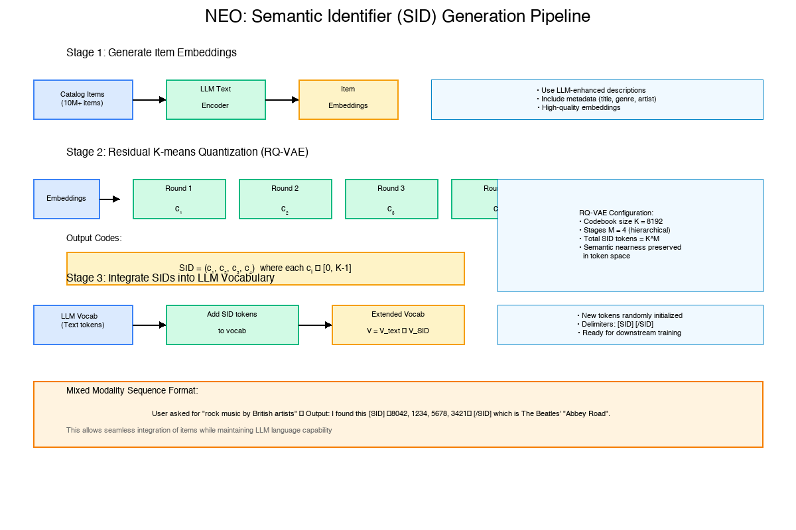

> 本文是关于 Spotify 团队论文《A Unified Language Model for Large Scale Search, Recommendation, and Reasoning》（[arXiv:2603.17533](https://arxiv.org/abs/2603.17533)）的深度精读笔记。这篇论文提出了 NEO 框架，将预训练 LLM 改造为无需外部工具、目录受限的生成模型，在超过 1000 万物品的工业级目录上统一了推荐、搜索和用户理解等多种发现任务。

---

## 1. 引言：搜索与推荐的"大一统"时刻

### 1.1 搜索和推荐的传统割裂

在大多数互联网公司中，搜索和推荐是两个独立的系统。搜索系统接收用户的文本查询，通过倒排索引或向量检索返回匹配结果；推荐系统则基于用户历史行为，通过协同过滤或深度模型预测用户可能感兴趣的内容。两者在数据管线、模型架构、评估体系上几乎完全独立。

这种割裂带来了显而易见的问题：

- **重复建设**：搜索和推荐分别维护独立的特征工程、模型训练、在线服务系统
- **知识无法共享**：用户在搜索中表达的意图信息无法被推荐系统利用，反之亦然
- **体验不一致**：用户在搜索和推荐中看到的内容可能存在风格和质量的割裂
- **多模态支持困难**：当目录中包含多种类型的实体（歌曲、播客、有声书、艺术家），每种实体需要独立的处理管线

### 1.2 LLM 带来的新可能

大语言模型（LLM）的崛起让人们看到了统一这些任务的可能性。LLM 天然具备以下能力：

1. **语言可控性**：通过自然语言指令控制任务类型、输出格式
2. **多任务学习**：在统一的 next-token prediction 框架下训练多种任务
3. **泛化能力**：预训练知识可以迁移到下游任务

但将 LLM 直接用于工业级推荐/搜索面临一个核心困难：**LLM 的输出是自然语言文本，而推荐/搜索需要输出的是明确、无歧义的目录物品**。

这个鸿沟具体体现为：

| 方案 | 问题 |
|------|------|
| 纯文本输出物品名称 | 歧义（同名物品）、不稳定（hallucination）、无法保证目录有效性 |
| 向量嵌入方式 | 需要修改模型架构，破坏预训练知识 |
| 工具增强（先生成查询再检索） | 增加编排复杂度和延迟，引入级联误差 |

### 1.3 NEO 的核心洞察

NEO 的核心洞察在于：**可以将目录物品表示为一种新的"语言"——语义标识符（Semantic Identifiers, SIDs），让 LLM 在自然语言和物品标识符之间自由切换**。

这种设计的精妙之处在于：
- SID 是离散 token，完全兼容 LLM 的 next-token prediction 范式
- SID 保持了语义邻域结构，语义相近的物品有相似的 SID
- 通过约束解码（Constrained Decoding）保证生成的 SID 一定对应真实目录物品
- 自然语言指令可以控制任务类型、目标实体类型和输出格式

一个直观的类比：如果说 LLM 学会了"说人话"，那么 NEO 就是让 LLM 同时学会了"说人话"和"说物品话"，并且能在两种语言之间自由切换。

---

## 2. 方法论：三阶段训练框架

NEO 的方法论可以概括为一个三阶段训练框架（论文中描述为四阶段，但第四阶段留作未来工作）：


graph LR
    S1["阶段一<br/>语义基础<br/>构建 SID"] --> S2["阶段二<br/>领域对齐<br/>SID ↔ 文本"]
    S2 --> S3["阶段三<br/>能力注入<br/>多任务指令微调"]
    S3 -.-> S4["阶段四<br/>任务特化<br/>（未来工作）"]
    
    style S1 fill:#4ecdc4,color:#fff
    style S2 fill:#45b7d1,color:#fff
    style S3 fill:#f7dc6f,color:#333
    style S4 fill:#ccc,color:#666


### 2.1 阶段一：语义标识符（SID）的构建

#### 什么是 SID？

SID 是将目录中每个物品映射为一个短的离散 token 序列的方法。具体来说，每个物品 $e$ 被表示为 $SID(e) = (c_1, c_2, ..., c_M)$，其中每个 $c_i$ 来自一个大小为 $K$ 的码本。

NEO 使用 **残差 K-means 量化（Residual K-means）** 来构建 SID，这是一种层级化的向量量化方法：



1. 首先将物品的内容嵌入（content embedding）通过第一个码本量化，捕获粗粒度的语义区域
2. 计算残差（原始向量 - 量化向量），用第二个码本量化残差
3. 重复这一过程 $M$ 次，逐步精细化表示

这种残差量化方式产生了**从粗到细的层级结构**：

- 第一个 token：大的语义类别（如"喜剧播客"）
- 第二个 token：细分领域（如"科技脱口秀"）
- 第三、四个 token：进一步区分具体物品

#### NEO 的具体配置

| 实体类型 | 嵌入来源 | 码本数 M | 码本大小 K | SID 长度 |
|----------|----------|----------|------------|----------|
| 艺术家 | 音频频谱嵌入（track 级聚合） | 4 | 1024 | 4 tokens |
| 节目/剧集/有声书 | Qwen3 Embedding (8B) 文本嵌入 | 4 | 256 | 4 tokens |

几个关键设计决策值得注意：

**为什么艺术家用音频嵌入而非文本嵌入？** 因为艺术家的核心特征是其音乐风格，而音乐风格最好通过音频信号来捕捉。文本描述（如艺术家简介）往往不能充分反映其音乐特征。

**为什么艺术家的码本更大（K=1024 vs K=256）？** 音频嵌入空间的复杂度更高，需要更大的码本来保持足够的区分度。

**为什么不同实体类型使用独立的量化器？** 不同类型的物品可能存在于不同的潜在空间中（音频 vs 文本），强制使用同一个量化器会损害表示质量。

#### 数据增强的重要性

论文特别提到了一个实用的工程经验：剧集的文本描述往往很短或重复性高（如"第 42 集"），直接用这些低质量文本生成的嵌入会导致大量 SID 碰撞。解决方案是使用 LLM 从多个元数据字段生成增强的描述，显著改善了 SID 的区分度。

消融实验表明，不使用数据增强会导致 HR@10 下降 2.9%。虽然看起来不大，但在工业级系统中，这个差距意味着数百万用户的体验差异。

#### 与 LLM 词表的融合

SID 构建完成后，需要将其整合到 LLM 的词表中：

- 扩展词表：$V = V_{text} \cup V_{SID}$
- 新增 $M \times K$ 个 SID token（随机初始化）+ 2 个定界符 `[SID]` 和 `[/SID]`
- NEO 实际新增了 **7,170 个 token**（3 种文本实体 × 4 × 256 + 1 种音频实体 × 4 × 1024 + 2 个定界符 = 3072 + 4096 + 2）

序列格式采用定界符约定：

```
⟨自然语言文本⟩ [SID] ⟨c₁ c₂ c₃ c₄⟩ [/SID] ⟨自然语言文本⟩
```

这种设计使得模型可以在一个序列中自由交织自然语言和物品引用。

### 2.2 阶段二：领域对齐（Domain Grounding）

#### 核心问题

阶段一生成的 SID token 是随机初始化的，与 LLM 预训练的文本嵌入空间没有任何关联。如果直接进行下游任务训练，模型需要同时学习"SID 是什么"和"如何用 SID 完成任务"，这两个目标的耦合会严重影响学习效率。

#### 三种对齐目标

NEO 设计了三种互补的对齐目标，建立 SID 和自然语言之间的双向映射：

**1. SID → 文本（语言化）**

给定一个 SID，预测其对应的自然语言描述：
```
输入：这个 [SID] ⟨c₁c₂c₃c₄⟩ [/SID] 是什么？
输出：这是一档科技脱口秀节目，由...主持，讨论...
```

**2. 文本 → SID（受限检索）**

给定自然语言查询，预测对应物品的 SID：
```
输入：找到名为"The Daily"的新闻播客
输出：[SID] ⟨c₁c₂c₃c₄⟩ [/SID]
```

**3. SID → 类型（类型消歧）**

给定一个 SID，预测其实体类型：
```
输入：这个 [SID] ⟨c₁c₂c₃c₄⟩ [/SID] 是什么类型？
输出：播客节目
```

#### 参数化策略：防止灾难性遗忘

这个阶段的训练策略非常谨慎：

- **冻结预训练骨干网络的所有参数**
- **只优化新引入的 SID token 嵌入**
- **只优化 LLM 输出头中与 SID 相关的 logits**

这种策略的好处是在建立 SID-文本映射的同时，完全保留了 LLM 的语言能力。论文的消融实验证明，这一设计至关重要：跳过对齐阶段会导致下游任务性能下降 6-8%，而将对齐和任务训练合并为一个阶段则会导致 7-10% 的下降。

#### 对齐数据

对齐阶段使用约 **500 万条**配对数据，包括物品标题、描述、摘要、话题、类别、风格、维基百科片段等多种文本信息与 SID 的配对。

### 2.3 阶段三：多任务指令微调

#### 训练设置

这一阶段解冻所有参数，在统一词表上进行有监督的指令微调。训练集规模达到 **1000 万条**，覆盖以下四大类任务：

#### 任务一：下一物品推荐

```
指令：Based on this user's recent listening history, recommend the next 
      podcast episode they would enjoy.
上下文：User has listened to [SID]⟨...⟩[/SID], [SID]⟨...⟩[/SID], ...
输出：[SID]⟨c₁c₂c₃c₄⟩[/SID]
```

给定用户历史交互序列（以 SID 表示），预测用户下一个可能消费的物品。这是最经典的推荐任务。

#### 任务二：文本检索

```
指令：Find the audiobook that best matches this search query.
查询："a thriller about artificial intelligence taking over"
输出：[SID]⟨c₁c₂c₃c₄⟩[/SID]
```

给定自然语言查询（可选地结合用户上下文），生成最相关物品的 SID。这对应传统的搜索检索任务。

#### 任务三：推荐解释（Recsplanation）

```
指令：Recommend a show for this user and explain why.
上下文：User has listened to [SID]⟨...⟩[/SID], [SID]⟨...⟩[/SID], ...
输出：I recommend [SID]⟨c₁c₂c₃c₄⟩[/SID] because based on your 
      interest in true crime podcasts and investigative journalism, 
      this show offers...
```

这是一个混合生成任务：模型需要同时生成推荐物品的 SID 和自然语言解释。这是 NEO 的独特贡献之一——传统系统要么只能推荐物品（没有解释），要么需要额外的解释生成模块。

#### 任务四：用户理解（Interest Profiling）

```
指令：Describe this user's interests based on their listening history.
上下文：User has listened to [SID]⟨...⟩[/SID], [SID]⟨...⟩[/SID], ...
输出：This user shows a strong interest in technology and science 
      podcasts, particularly those discussing AI and machine learning. 
      They also enjoy...
```

从用户的 SID 交互历史中生成自然语言的兴趣画像。这个任务没有现成的标注数据，NEO 使用了一个巧妙的方案——**从更大的 LLM（32B 参数）蒸馏**：先用大模型读取物品文本描述生成兴趣摘要，然后训练 NEO 直接从 SID 历史生成同样的摘要。

#### 指令模板设计

论文使用了 20 种不同的指令模板，随机选择并填入用户信息。指令模板显式指定：
- **任务类型**：推荐、检索、解释、用户理解
- **目标实体类型**：剧集、节目、有声书、艺术家
- **输出格式**：纯 SID、纯文本、或混合格式

这种设计使模型具备了**语言可控性（Language Steerability）**——通过改变指令就可以控制模型的行为，而无需训练不同的模型。

### 2.4 推理：约束解码

#### 组合爆炸的挑战

4 个 token、每个 token 有 256 种选择，意味着约 43 亿（$256^4$）种可能的 SID 组合。但实际目录中只有约 1000 万个有效物品。如果不加约束，模型可能生成不存在于目录中的 SID。

#### Trie 约束解码

NEO 采用 **前缀 Trie（Prefix Trie）** 进行约束解码：

1. 预先计算所有有效 SID 元组
2. 构建前缀 Trie 数据结构
3. 在 `[SID]...[/SID]` 跨度内，每一步只允许 Trie 中合法的后续 token
4. 在自由文本区域不施加约束


graph TD
    Root["根节点"] --> A1["c₁=5"]
    Root --> A2["c₁=12"]
    Root --> A3["c₁=..."]
    A1 --> B1["c₂=3"]
    A1 --> B2["c₂=87"]
    A2 --> B3["c₂=3"]
    A2 --> B4["c₂=45"]
    B1 --> C1["c₃=22"]
    B1 --> C2["c₃=156"]
    C1 --> D1["c₄=7 ✓ Item A"]
    C1 --> D2["c₄=200 ✓ Item B"]
    
    style D1 fill:#4ecdc4,color:#fff
    style D2 fill:#4ecdc4,color:#fff


**图：Trie 约束解码示意。** 每一步解码只在 Trie 的合法子节点中选择，确保最终生成的 SID 对应真实目录物品。

#### 碰撞处理

多个物品可能共享同一个 SID（因为量化不可避免地引入信息损失）。NEO 使用基于流行度的启发式方法：将每个 SID 映射到其中最流行的物品。实验表明碰撞在推理时很少发生，随机碰撞解析与流行度解析没有显著差异。

#### 性能开销

约束解码带来的延迟开销非常小（<5%），但提供了额外的灵活性——例如可以在推理时动态限制只生成特定子集的物品（如新上线内容）。

---

## 3. 实验设置

### 3.1 数据集与规模

NEO 在 Spotify 的真实数据集上进行评估：

| 维度 | 规模 |
|------|------|
| 目录物品数 | >1000 万 |
| 物品类型 | 剧集、节目、有声书、艺术家 |
| 用户数 | ~1500 万 |
| 对齐训练数据 | ~500 万条 |
| 任务训练数据 | 1000 万条 |
| 测试数据 | ~10 万条 |

### 3.2 评估协议

NEO 采用**全局时间评估协议（Global Temporal Evaluation）**：

- 上下文：截至第 $t$ 天的交互历史
- 标签：第 $t+k$ 天的消费物品（剧集/节目 $k=1$，有声书 $k=7$）
- 评估时间点：$t+2k$

这种协议确保了评估的真实性——模型在训练时永远看不到评估时间段的数据。

### 3.3 基线系统

**推荐基线：** 基于图神经网络（GNN）的双塔架构，融合了：
- 跨物品类型的共同消费关系
- 弱信号（关注、预览等）用于冷启动
- 类别特征（分类、话题、用户国家）
- LLM 编码的物品元数据

这是一个相当强的工业级基线，而非简单的学术 baseline。

**检索基线：** 密集检索系统，包含：
- 查询编码器处理文本位置和搜索查询
- 实体编码器表示物品元数据
- 训练数据来自搜索日志、多步重写会话、人工策划和合成查询

### 3.4 评估指标

- **HR@K（Hit Rate@K）**：前 K 个推荐中包含目标物品的比例
- **NDCG@K（Normalized Discounted Cumulative Gain@K）**：考虑排序位置的指标
- $K \in \{10, 30\}$

---

## 4. 实验结果与分析

### 4.1 主要结果：NEO 全面超越强基线

NEO 在推荐和检索任务上均显著超越了各自的强基线：

**推荐任务（下一物品预测）：**

| 维度 | NEO 相对提升 |
|------|-------------|
| HR@10 | +20% ~ +58% |
| NDCG@10 | +46% ~ +97% |
| 覆盖实体类型 | 剧集（+57%）、有声书（+36%~+46%）、节目（+20%~+24%） |

**文本检索任务：**

| 维度 | NEO 相对提升 |
|------|-------------|
| HR@10 | +26% ~ +47% |
| 细粒度实体（剧集） | +40% |
| 多步搜索会话 | HR@10 +185%，NDCG@10 +243% |

几个值得注意的发现：

1. **NDCG 的提升幅度远大于 HR**：这意味着 NEO 不仅能把正确的物品放进 top-K，还能把它排到更靠前的位置
2. **细粒度实体收益更大**：剧集（最细粒度）的提升比节目（较粗粒度）更显著，说明 SID 的层级结构在区分细粒度物品时特别有效
3. **多步搜索会话的巨大提升**：在用户需要多次重写查询才能找到目标的场景中，NEO 的优势最为明显（HR@10 +185%，NDCG@10 +243%），这很可能是因为 NEO 能更好地理解用户的搜索意图

### 4.2 多任务学习：正向迁移

这是 NEO 最令人兴奋的发现之一：**联合训练多种任务不仅没有互相伤害，反而产生了正向的跨任务迁移**。

具体而言，同时训练推荐、检索、解释和用户理解任务时，每个任务的性能都不低于（甚至优于）单独训练的结果。这意味着：

- 检索任务的文本理解能力帮助了推荐任务
- 推荐任务的用户行为建模能力帮助了检索任务
- 解释和用户理解任务作为辅助目标，进一步强化了模型的语义理解

这一结果支持了 NEO 的核心假设：搜索、推荐和用户理解不是孤立的任务，它们共享底层的用户意图和物品语义理解能力。

### 4.3 语义基础消融：SID 设计的每个决策都很重要

论文通过详尽的消融实验验证了 SID 设计中每个决策的影响：

| 消融实验 | HR@10 变化 | 核心发现 |
|----------|-----------|----------|
| 原子 ID（随机打乱 SID） | -59.7% | 语义结构至关重要 |
| LSH 量化（数据无关） | -51.2% | 学习型量化显著优于随机投影 |
| 无数据增强 | -2.9% | 元数据质量影响 SID 质量 |
| 协同过滤嵌入 | -25.6% | 内容嵌入优于协同过滤嵌入 |

让我逐一分析这些结果：

**原子 ID vs SID（-59.7%）：** 这是最关键的消融。通过随机排列 SID 元组（保持码本长度和词表大小不变，但破坏语义邻域结构），性能暴跌近 60%。这证明了 SID 的语义结构（而非仅仅是离散编码形式）才是性能提升的核心来源。在语义 SID 下，模型学到的不仅仅是"这个 ID 对应这个物品"，更是"这个 ID 的前缀代表这类物品"。

**LSH vs 学习型量化（-51.2%）：** LSH（Locality-Sensitive Hashing）是一种数据无关的随机投影量化方法。虽然 LSH 也能在一定程度上保持语义邻域，但与数据自适应的残差 K-means 相比差距巨大。这说明量化器需要适应数据的实际分布，而不能依赖通用的随机投影。

**协同过滤 vs 内容嵌入（-25.6%）：** 这个结果有些反直觉。在传统推荐系统中，协同过滤信号通常被认为比内容信号更强。但在 NEO 的框架下，基于协同过滤的 SID 表现明显更差。论文解释了原因：协同过滤信号（基于播放列表共现的 word2vec）存在**时间不稳定性**——用户的共现模式随时间变化剧烈，导致 SID 无法保持一致的语义结构。相比之下，内容嵌入（音频特征、文本描述）更加稳定，更适合作为长期有效的标识符。

### 4.4 领域对齐策略：分阶段 vs 端到端

| 策略 | HR 变化 | NDCG 变化 | MMLU-Redux |
|------|---------|-----------|------------|
| NEO（三阶段） | 基准 | 基准 | 0.46 |
| 无领域对齐 | -6%~-7% | -8% | - |
| 两阶段合并 | -7%~-8% | -10% | - |
| 随机初始化（不用预训练） | -43%~-44% | -43%~-44% | - |
| 持续预训练（CPT） | -2%~-3% | -2%~-3% | 0.03 |

最引人注目的是最后一行：**持续预训练（CPT）** 方法在下游任务上只比 NEO 差 2-3%，看起来差距不大。但它在语言能力保留上的灾难性表现揭示了一个关键权衡：

- **NEO** 的 MMLU-Redux 得分保持在 **0.46**（接近原始预训练模型）
- **CPT** 的 MMLU-Redux 得分暴跌至 **0.03**（几乎丧失了语言理解能力）

这意味着 CPT 方法虽然学会了处理 SID，但代价是"忘记了怎么说人话"。对于只需要输出 SID 的纯推荐任务，这也许可以接受。但 NEO 的目标是同时支持推荐、检索、解释和用户理解——这些任务都需要强大的语言能力。**NEO 的分阶段策略实现了 SID 能力和语言能力的最佳平衡**。

### 4.5 约束解码分析

| 推理策略 | ΔHR@10 | ΔHR@30 | 延迟变化 |
|---------|--------|--------|---------|
| NEO（Trie 约束 + Beam Search） | 基准 | 基准 | 基准 |
| Beam Search 无约束 | -1.80% | -1.93% | -2.92% |
| Top-p 采样 | -21.97% | -32.41% | -7.91% |

一个有趣的发现是：**即使不加约束，模型也能在 98% 的情况下生成有效的 SID**。这说明经过充分的对齐和任务训练后，模型已经"内化"了目录结构。约束解码提供的更多是一种"安全网"，同时支持推理时的灵活控制（如限制输出范围到特定子集）。

Top-p 采样的大幅退化（-22%~-32%）则表明，在 SID 生成任务中，贪心/束搜索策略远优于随机采样。这与直觉一致——物品推荐需要的是精确匹配而非创造性多样性。

### 4.6 文本生成质量

NEO 不仅能生成 SID，还能生成高质量的自然语言文本。使用 GPT-4o-mini 作为评判的评估结果：

| 维度 | 评分（满分 5 分） |
|------|-------------------|
| 覆盖度（Coverage） | 3.5 ~ 4.7 |
| 接地性（Groundedness） | 3.5 ~ 4.7 |
| 忠实度（Faithfulness） | 3.5 ~ 4.7 |

这表明 NEO 的文本生成能力在推荐解释和用户画像任务中达到了实用水平。

### 4.7 框架通用性验证

NEO 不仅在 Qwen3-0.6B 上有效，在 **Llama 3.2 1B** 上也得到了验证——领域对齐阶段即带来约 **18%** 的文本检索性能提升。这证明 NEO 是一个框架级的贡献，而非特定于某个模型的优化。

---

## 5. 深度思考：NEO 的设计哲学与启示

### 5.1 "新模态"范式 vs "工具增强"范式

在 LLM 与推荐系统结合的研究中，存在两大流派：

**工具增强范式**：LLM 通过调用外部工具（检索器、排序器）来完成推荐任务。代表工作包括 TalkPlay-tools、RecMind 等。

**新模态范式**：将物品标识符作为一种新的"语言模态"直接融入 LLM。NEO 属于这一范式。

NEO 的实验结果强力支持了新模态范式的优越性：

| 维度 | 工具增强 | 新模态（NEO） |
|------|---------|--------------|
| 延迟 | 高（多次 API 调用） | 低（单次前向传播） |
| 级联误差 | 有（工具错误传播） | 无（端到端生成） |
| 架构复杂度 | 高（需要编排层） | 低（标准 Transformer） |
| 文本-物品交织 | 困难 | 自然 |
| 可解释性 | 有限 | 内生（同一模型生成解释） |

### 5.2 语义 ID 的哲学意义

SID 的设计体现了一个深刻的洞察：**在离散符号系统（语言）和连续表示空间（嵌入）之间存在一个最佳的折中点**。

- 纯文本表示：完全离散，人类可读，但有歧义
- 纯嵌入表示：完全连续，信息丰富，但不兼容自回归生成
- SID：离散但保持语义结构，兼容自回归生成，且无歧义

这种"结构化离散表示"的理念可能超越推荐系统，适用于任何需要 LLM 操作大规模离散目录的场景——比如代码补全（代码库中的函数/类）、知识图谱推理（实体/关系）、甚至分子生成（化合物库）。

### 5.3 冷启动与长尾：理论优势与现实挑战

SID 的语义结构在理论上具备冷启动优势：语义相近的物品共享 SID 前缀，即使新物品从未出现在训练数据中，只要其 SID 前缀对应的语义区域已被学习，模型就能做出一定的预测。这与原子 ID 形成鲜明对比——原子 ID 对未见物品完全无能为力。

但论文的实验数据也揭示了一个重要的现实：**在用户冷启动场景（移除历史行为信息，只依赖用户元数据）下，NEO 的性能会大幅下降（HR@10 约 -48%）**。这说明 SID 虽然缓解了物品侧的冷启动问题，但用户侧的冷启动仍然是一个巨大挑战——没有足够的行为历史，模型很难准确预测用户兴趣。

这提醒我们：**SID 不是冷启动的"银弹"**。在实际部署中，新用户仍然需要通过偏好探索（exploration）、显式偏好收集等机制来积累足够的信号。

### 5.4 Scaling 的潜力

NEO 当前使用的是 **Qwen3-0.6B**——一个仅有 6 亿参数的"小"模型。考虑到 LLM 领域的 Scaling Law，一个自然的问题是：更大的模型（如 7B、70B）会带来多大的提升？

论文没有直接回答这个问题，但几个间接证据暗示了巨大的 Scaling 潜力：

1. 从随机初始化训练导致 43-44% 的性能下降，说明预训练知识非常重要
2. 使用 Llama 3.2 1B（稍大的模型）也能获得显著提升
3. 多任务训练展现正向迁移，暗示更大的模型容量可以支持更多任务

### 5.5 与行业趋势的关系

NEO 的出现并非孤立事件，它是整个行业"推荐系统基础模型化"趋势的一部分。我们可以将其与其他重要工作进行对比：

| 工作 | 公司 | 核心思路 | 与 NEO 的区别 |
|------|------|---------|--------------|
| HSTU | Meta | 统一序列 Transformer 做推荐 | 不支持搜索和文本生成 |
| GPSD | Meta | 生成式预训练做推荐 | 聚焦预训练范式，非语言模型 |
| SORT | 阿里 | Transformer 做工业排序 | 判别式模型，不支持生成 |
| MTFM | 美团 | 基础模型做推荐 | 多模态但非语言模型统一框架 |
| **NEO** | **Spotify** | **LLM 统一搜索/推荐/推理** | **唯一真正统一搜索和推荐的 LLM 方案** |

NEO 的独特价值在于它是第一个在工业规模上验证了"用单一 LLM 统一搜索和推荐"的可行性。

---

## 6. 局限性与未来方向

### 6.1 当前局限

**模型规模**：0.6B 参数在 LLM 世界中属于小模型，可能限制了复杂推理能力。

**离线评估**：论文主要报告了离线指标，缺少在线 A/B 测试结果。虽然离线提升显著，但在线效果可能受到展示偏差、位置偏差等因素的影响。

**单轮交互**：当前的 NEO 主要支持单轮交互，虽然可以通过历史拼接扩展到多轮，但缺乏真正的对话建模能力。

**SID 碰撞**：虽然实验表明碰撞很少，但在极端长尾场景中，碰撞可能成为瓶颈。

**阶段四缺失**：论文描述了四阶段训练框架，但第四阶段（任务特化微调）留作了未来工作。

**训练基础设施**：论文使用 8 × Nvidia H100 GPU + PyTorch + Ray 进行训练，对于大多数团队来说这是可及的资源量，暗示了框架的实用性。

### 6.2 论文中的失败尝试

论文附录中坦诚记录了两个失败方向，这对从业者非常有价值：

1. **SID Expert with Hard Router Mask**：尝试为 SID token 设计专用的 MoE Expert 并通过硬路由掩码强制 SID token 走特定 Expert，但效果不佳
2. **Vision as LoRA**：尝试用 LoRA 方式融入视觉信息，同样未能带来提升

这些失败尝试提醒我们：并非所有直觉上合理的设计都能在实践中奏效。NEO 最终选择的"最小化架构修改"策略（仅扩展词表，不改模型结构）可能恰恰是因为它最好地保留了预训练知识。

### 6.3 值得期待的未来方向

**多轮对话推荐**：将 NEO 扩展为真正的对话式推荐系统，支持用户通过多轮对话逐步精细化需求。

**实时个性化**：结合 online learning 或 in-context learning，实现对用户实时兴趣变化的快速响应。

**跨平台迁移**：探索 SID 框架在不同平台和领域间的迁移能力。

**更大规模验证**：在更大的模型（7B+）和更大的目录（1 亿+）上验证 Scaling 效果。

---

## 7. 总结

NEO 是一项具有里程碑意义的工作，它首次在工业规模上证明了：**一个预训练的解码器 LLM 可以被改造为无需外部工具、支持目录约束的生成模型，在同一个框架下统一推荐、搜索、解释和用户理解等多种发现任务**。


graph TD
    subgraph "NEO 核心贡献"
    A["语义标识符 SID<br/>物品的新语言"] --> D["统一模型"]
    B["三阶段训练<br/>渐进式能力注入"] --> D
    C["约束解码<br/>目录有效性保证"] --> D
    D --> E["推荐 +36~58%"]
    D --> F["检索 +26~47%"]
    D --> G["解释 & 用户理解"]
    D --> H["正向跨任务迁移"]
    end


这篇论文给我最大的启发是：**不要试图让 LLM "使用" 现有的推荐系统，而是让 LLM "成为" 推荐系统**。通过将目录物品转化为 LLM 原生理解的离散 token，搜索和推荐从"LLM 的下游应用"变成了"LLM 的内在能力"。

这一范式转变的影响可能是深远的。如果 SID 的思路被广泛采用，我们可能会看到：
- 搜索和推荐团队的合并
- 推荐系统工程从"特征工程 + 模型训练 + 在线服务"简化为"数据准备 + LLM 微调 + 约束解码"
- 可解释推荐从"事后解释"变为"内生解释"
- 用户与推荐系统的交互从"被动接收"变为"主动对话"

当然，从论文到真正的工业落地还有很长的路要走。但 NEO 已经迈出了关键的第一步——在超过 1000 万物品的真实工业级目录上证明了这条路是可行的。

---

**参考文献：**

- De Nadai et al., "A Unified Language Model for Large Scale Search, Recommendation, and Reasoning," arXiv:2603.17533, March 2026.
- Rajput et al., "Recommender Systems with Generative Retrieval," NeurIPS 2023 (TIGER).
- Zhai et al., "Actions Speak Louder than Words: Trillion-Parameter Sequential Transducers for Generative Recommendations," ICML 2024 (HSTU).
- Li et al., "Generative Pre-trained Sequence Denoiser for Sequential Recommendation," 2025 (GPSD).
