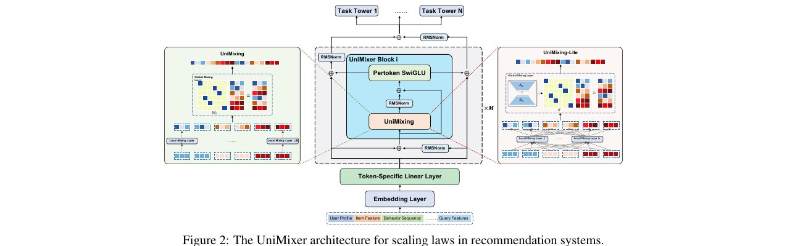
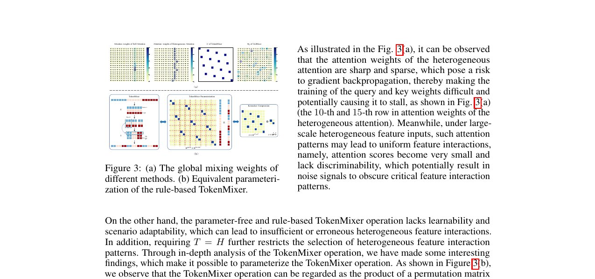
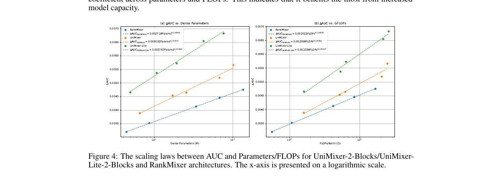
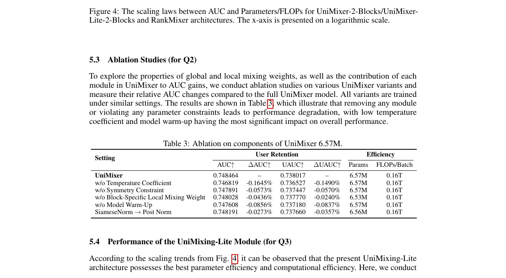

> 本文是关于快手技术团队论文《UniMixer: A Unified Architecture for Scaling Laws in Recommendation Systems》（[arXiv:2604.00590](https://arxiv.org/abs/2604.00590)）的深度精读笔记。这篇论文从理论上揭示了推荐系统中注意力机制、TokenMixer 和因式分解机三大架构范式的内在统一性，提出了参数化的 UniMixing 模块及其轻量化变体 UniMixer-Lite，并在快手广告系统上验证了清晰的缩放定律。

---

## 1. 引言：推荐系统特征交互架构的三条技术路线

### 1.1 从人工特征到深度模型的演进

推荐系统的核心挑战之一是**特征交互建模**——如何从用户画像、物品属性、上下文信息等异构特征中提取有效的交叉模式，以预测用户行为。

回顾推荐系统的发展历程，特征交互的建模方式经历了几个关键阶段：

1. **手工特征工程时代**（2010 年前）：依赖领域专家设计交叉特征，如"用户年龄 × 物品类别"。这种方式的问题在于人力成本高、覆盖度有限、无法捕获高阶交互。

2. **因式分解机时代**（2010-2016）：FM（Factorization Machine）及其变体（FFM、DeepFM）通过学习特征的隐向量表示来自动建模二阶交互 $\hat{y} = w_0 + \sum_i w_i x_i + \sum_{i\lt j} \langle v_i, v_j \rangle x_i x_j$。这开创了自动化特征交互的先河，但受限于交互阶数和表达能力。

3. **深度网络显式交叉时代**（2017-2022）：DCN、xDeepInt、AutoInt 等工作尝试通过显式的交叉网络结构捕获高阶交互。但这些方法往往带来复杂的网络设计和有限的扩展性。

4. **Token 化与大模型时代**（2023-至今）：受 Transformer 和大语言模型启发，推荐系统开始将特征视为 Token 序列，引入注意力机制和 TokenMixer 等操作进行特征交互。这一范式转变使得推荐模型具备了类似 LLM 的缩放潜力。

### 1.2 三条路线的分化与困境

进入 Token 化时代后，推荐系统的特征交互架构逐渐形成了三条主要的技术路线：

**路线一：基于注意力机制（Attention-based）**
- 代表工作：AutoInt、HiFormer、FAT、HHFT
- 核心思想：通过 Self-Attention 机制让每个 Token 动态地关注其他 Token，使用 Token-specific 的 Q/K/V 投影
- 优势：理论表达能力强，能捕获任意 Token 对之间的交互
- 问题：$O(L^2)$ 的计算复杂度，在特征数量 $L$ 较大时计算成本过高；更关键的是，**在异构特征场景下，注意力权重容易变得尖锐稀疏**，导致梯度回传受阻、训练停滞

**路线二：基于 TokenMixer**
- 代表工作：RankMixer（TokenMixer）、TokenMixer-Large
- 核心思想：通过固定规则的矩阵（如 Split & Concat）对 Token 进行混合操作
- 优势：计算效率高，参数无关（parameter-free），支持深层堆叠
- 问题：基于规则的混合模式缺乏可学习性和场景适应性；**强制要求 Token 数等于 Head 数（T=H）**，限制了交互模式的选择空间

**路线三：基于因式分解机（FM-based）**
- 代表工作：Wukong、FinalMLP、GDCN、FiBiNet
- 核心思想：通过特征向量的内积或双线性交互建模特征对交互
- 优势：参数效率高，可解释性较好
- 问题：显式低阶交互约束限制了 Scaling 性能提升，难以扩展到更高阶

这三条路线各有优劣，但在工业实践中往往是"选边站队"——一个团队通常只深耕其中一条路线。这种割裂带来了两个核心问题：

1. **缺乏统一的理论视角**：无法回答"这三种方法到底有什么本质区别和联系？"
2. **无法系统性地比较扩展效率**：各方法在各自的实验设置下报告结果，缺少公平的缩放定律对比

### 1.3 UniMixer 的破局思路

UniMixer 论文的核心贡献在于回答了一个根本性问题：**这三种看似不同的特征交互方式，是否存在统一的数学框架？**

答案是肯定的。论文揭示了一个优雅的统一结构：

$$\text{UniMixing}(X) = \text{reshape}\left(G(X, W_G) \cdot [\text{local patterns}],\ 1,\ L\right)$$

在这个框架下，注意力机制、TokenMixer 和因式分解机只是**全局权重 $G$ 和局部模式的不同实例化**。这一发现不仅具有理论美感，更带来了实际的工程价值——既然三者本质相同，我们就能设计出集三者优势于一体的新架构。

---

## 2. 来源元数据 (Metadata)

- **原文标题**: UniMixer: A Unified Architecture for Scaling Laws in Recommendation Systems
- **原文链接**: [https://arxiv.org/abs/2604.00590](https://arxiv.org/abs/2604.00590)
- **来源**: arXiv（快手技术团队）
- **作者**: Mingming Ha, Guanchen Wang, Linxun Chen, Xuan Rao, Yuexin Shi, Tianbao Ma, Zhaojie Liu, Yunqian Fan, Zilong Lu, Yanan Niu, Han Li, Kun Gai
- **发表日期**: 2026 年 4 月

---

## 3. 核心摘要 (Executive Summary)

UniMixer 提出了推荐系统特征交互的统一架构框架，其核心创新包括：
1. **理论统一**：将注意力机制、TokenMixer 和因式分解机归纳为同一数学框架的不同特例
2. **参数化 TokenMixer**：将基于规则的 Token 混合操作转化为等价的参数化矩阵乘法，使混合模式可在训练中端到端优化
3. **UniMixer-Lite**：通过基矩阵组合和低秩近似，在大幅压缩参数量和计算成本的同时提升模型性能
4. **SiameseNorm**：引入耦合双流归一化解决深层架构的训练稳定性问题
5. **缩放定律验证**：在快手广告系统上验证了清晰的幂律缩放关系，UniMixer-Lite 的缩放指数（0.142）显著优于 RankMixer（0.116）

---

## 4. 深度解读 (Deep Dive)

### 4.1 参数化 TokenMixer：从规则驱动到数据驱动

UniMixer 论文最精彩的理论贡献之一，是揭示了 TokenMixer 操作的矩阵本质。

#### 4.1.1 TokenMixer 的本质是什么？

以 RankMixer 为例，其核心操作是 Split & Concat——将 Token 序列按某种规则拆分后重新拼接。这看起来只是一种数据搬运操作，但论文指出：

> **任何 TokenMixer 的 Split & Concat 操作，都等价于将一个排列矩阵（Permutation Matrix）乘以展平的输入嵌入。**

具体来说，对于输入 $X \in \mathbb{R}^{T \times D}$（$T$ 个 Token，每个维度为 $D$），TokenMixer 操作可以表示为：

$$\text{TokenMixer}(X) = \text{reshape}\left(W^{\text{perm}} \cdot \text{flatten}(X),\ H,\ \frac{TD}{H}\right)$$

其中 $W^{\text{perm}}$ 是一个排列矩阵。这个发现至关重要，因为：

1. 排列矩阵具有**双随机性**（doubly stochastic）——每行每列恰好一个 1
2. 排列矩阵是**稀疏的**——大部分元素为 0
3. 当 $T = H$ 时，排列矩阵是**对称的**

#### 4.1.2 从排列矩阵到可学习权重

既然 TokenMixer 本质上是矩阵乘法，一个自然的问题是：**为什么要使用固定的排列矩阵，而不让模型自己学习最优的混合权重？**

这正是 UniMixer 的核心思路——将硬编码的排列矩阵替换为可学习的权重矩阵 $W$，同时通过正则化约束保持排列矩阵的良好性质。更重要的是，参数化使得 **T=H 的约束被彻底解除**——传统 TokenMixer 强制要求 Token 数等于 Head 数，而参数化权重矩阵可以自由选择任意维度。

具体的约束实施方式：

- **双随机性约束**：通过 Sinkhorn-Knopp 迭代实现

$$S_k(W) = D_r^{-1} W D_c^{-1}$$

其中 $D_r$ 和 $D_c$ 分别是行和列的归一化矩阵，交替迭代直至收敛。

- **稀疏性约束**：通过温度系数 $\tau$ 控制

$$W_{\tau} = \text{softmax}(W / \tau)$$

当 $\tau \to 0$ 时，权重趋向 one-hot 分布，恢复排列矩阵的稀疏性。

- **对称性约束**：通过显式对称化

$$W_{\text{sym}} = \frac{W + W^T}{2}$$

#### 4.1.3 温度退火训练策略

直接使用低温度训练可能导致梯度消失（softmax 输出接近 one-hot 时梯度极小）。论文提出了**温度退火**（Temperature Annealing）策略：

$$\tau_j = \max\left\{\tau_{\text{start}} - \frac{(\tau_{\text{start}} - \tau_{\text{end}}) \cdot j}{J},\ \tau_{\text{end}}\right\}$$

训练初期使用较高温度（$\tau_{\text{start}} = 1.0$），让模型在接近均匀分布的空间中自由探索；随着训练推进，逐步降低温度至 $\tau_{\text{end}} = 0.05$，使权重逐渐收敛到稀疏的最优混合模式。

这种"先探索、后收敛"的策略与模拟退火算法有异曲同工之妙，有效避免了过早陷入局部最优。

### 4.2 统一理论框架：三大范式的殊途同归

#### 4.2.1 统一公式

论文的核心理论贡献是将三种架构范式统一到同一个框架下：

$$\text{UniMixing}(X) = \text{reshape}\left(G(X, W_G) \cdot [\text{local patterns}],\ 1,\ L\right)$$

不同方法的差异仅在于**全局权重 $G$** 和**局部模式**的选择：

| 方法 | 全局权重 $G$ | 局部模式 |
|------|------------|---------|
| Self-Attention | $\text{softmax}\left(\frac{(XW_Q)(XW_K)^T}{\sqrt{d}}\right)$ | $XW_V$ |
| Heterogeneous Attention | $\text{softmax}\left(\frac{(X\tilde{W}_Q)(X\tilde{W}_K)^T}{\sqrt{d}}\right)$ | $X\tilde{W}_V$ |
| TokenMixer | $G$（固定置换矩阵） | $X$（恒等映射） |
| FM | $XI(XI)^\top$ | $Y$ |
| **UniMixer** | $W_G$（可学习全局混合） | $\{W_B^i\}$（可学习块权重） |

这个统一视角揭示了三个深刻的洞察：

1. **注意力机制是数据依赖的动态混合**：全局权重 $G$ 由输入 $X$ 通过 Query-Key 机制动态计算，因此不同输入有不同的混合模式。这赋予了注意力极强的表达能力，但也带来了 $O(L^2)$ 的计算成本。

2. **TokenMixer 是数据无关的静态混合**：全局权重 $G$ 是固定的可学习参数，与输入无关。这使得计算效率极高（权重可以预计算），但牺牲了对不同输入的适应性。

3. **因式分解机是特征相似度驱动的混合**：全局权重 $G = XI(XI)^\top$ 由特征向量的内积决定，本质上是基于特征相似度的混合。这在二阶交互上效率很高，但难以扩展到更高阶。

#### 4.2.2 Kronecker 积分解与计算优化

完整的 UniMixing 操作涉及 $L \times L$ 的权重矩阵（$L$ 为 Token 数量），在特征数量较大时计算成本不可接受。论文利用排列矩阵的 Kronecker 积结构进行分解：

$$W^{\text{perm}} = G \otimes I$$

这意味着全局混合矩阵可以分解为**全局模式** $W_G$ 和**局部模式** $W_B$ 的组合，将计算复杂度从 $O(L^2)$ 降低到：

$$O\left(\frac{L^2}{B} + LB\right)$$

其中 $B$ 是块大小。这种"全局-局部"的分层结构是 UniMixer 兼顾表达能力和计算效率的关键。

### 4.3 UniMixer-Lite：效率与性能的帕累托前沿

#### 4.3.1 设计动机

完整的 UniMixing 模块虽然理论上优雅，但在工业部署中仍面临参数效率的挑战——每个块都需要独立的全局和局部权重矩阵。UniMixer-Lite 通过两项关键技术将参数量大幅压缩：

#### 4.3.2 基矩阵组合（Basis Composition）

对于局部权重 $W_B^{(i)}$（第 $i$ 个块的局部混合矩阵），UniMixer-Lite 不再为每个块独立学习权重，而是通过一组**共享基矩阵**的线性组合动态生成：

$$W_B^{(i)} = \sum_{\ell=1}^{b} \omega_\ell^{(i)} Z_\ell$$

其中 $\{Z_\ell\}_{\ell=1}^{b}$ 是 $b$ 个共享基矩阵，$\omega_\ell^{(i)}$ 是第 $i$ 个块对各基矩阵的组合系数。

这种设计的精妙之处在于：
- 基矩阵在所有块间共享，参数量从 $O(L/B \cdot B^2)$ 降到 $O(b \cdot B^2)$
- 组合系数 $\omega_\ell^{(i)}$ 允许每个块有自己独特的混合模式
- 基矩阵数量 $b$ 远小于块数量 $L/B$，实现了参数的高效复用

#### 4.3.3 低秩近似（Low-Rank Approximation）

对于全局权重 $W_G$，UniMixer-Lite 采用低秩分解：

$$W_G \approx W_r = A_G B_G$$

其中 $A_G \in \mathbb{R}^{(L/B) \times r}$，$B_G \in \mathbb{R}^{r \times (L/B)}$，秩 $r \ll L/B$。

这将全局权重的参数量从 $O((L/B)^2)$ 降到 $O(r \cdot L/B)$，在实践中 $r$ 通常取 4-8 即可达到接近全秩的效果。

#### 4.3.4 Sinkhorn-Knopp 的保障作用

值得注意的是，即使使用了低秩近似和基矩阵组合来压缩参数，UniMixer-Lite 仍然通过 Sinkhorn-Knopp 操作确保权重矩阵保持接近满秩的双随机性质。这种"先压缩、后修正"的设计避免了参数压缩带来的表达能力损失。

#### 4.3.5 性能表现

实验数据来自快手广告投放场景，超过 **7 亿用户样本**、一年数据，包含数百个异构特征。任务为用户留存预测（次日回访）。结果令人印象深刻：

| 模型 | 参数量 | FLOPs | AUC | ΔAUC | UAUC | ΔUAUC |
|------|--------|-------|-----|------|------|-------|
| Heterogeneous Attention | 132.7M | 1.68T | 0.7446 | baseline | 0.7338 | baseline |
| RankMixer | 135.5M | 1.68T | 0.7493 | +0.475% | 0.7389 | +0.511% |
| **UniMixer-2B** | 101.5M | 2.50T | 0.7502 | +0.566% | 0.7400 | +0.615% |
| **UniMixer-Lite-2B** | 76.2M | 2.60T | 0.7514 | +0.682% | 0.7412 | +0.739% |
| **UniMixer-Lite-4B** | 84.5M | 4.24T | 0.7527 | +0.814% | 0.7425 | +0.870% |

几个关键发现：
- UniMixer-Lite-4B 仅用 **84.5M 参数**，AUC 提升 +0.814%，显著优于 135.5M 参数的 RankMixer
- 在推荐系统领域，AUC 提升 0.1% 即被视为显著改进，0.8% 是非常大的提升
- UniMixer 的 FLOPs 高于 RankMixer（2.50T vs 1.68T），这是参数化带来的计算开销——但考虑到参数量的大幅减少和性能的显著提升，这一权衡在工业场景中是值得的

### 4.4 Pertoken SwiGLU 与完整架构

在 UniMixing 完成特征交互后，模型通过 **Pertoken SwiGLU** 建模不同特征的异质性：

$$\text{pSwiGLU}(o_i) = W_{\text{down}}^i \left( (W_{\text{up}}^i o_i + b_{\text{up}}^i) \odot \text{Swish}(W_{\text{gate}}^i o_i + b_{\text{gate}}^i) \right) + b_{\text{down}}^i$$

每个 Token 拥有**独立的 FFN 参数**（$W_{\text{up}}^i$, $W_{\text{gate}}^i$, $W_{\text{down}}^i$），充分建模不同特征领域（用户画像、物品属性、行为序列等）的异质性。这与 NLP 中所有 Token 共享 FFN 参数形成了鲜明对比。

完整的 UniMixer 模型由以下部分组成：
1. **Feature Tokenization** → 异构特征按领域分组，投影为统一维度的 Token 表示
2. **M 层 UniMixer Block（含 SiameseNorm）** → 层叠的统一混合模块
3. **Sparse-Pertoken MoE** → 稀疏混合专家进一步增强表达能力
4. **预测头** → 输出最终预测

### 4.5 SiameseNorm：解锁深层架构的训练稳定性

#### 4.5.1 深层推荐模型的训练难题

随着推荐模型向更深的层数扩展，一个经典的矛盾浮出水面：

- **Pre-Norm**（归一化在子层之前）：有利于梯度流动和训练稳定性，但可能导致深层表示退化——所有层的输出趋于相似
- **Post-Norm**（归一化在子层之后）：理论上能产生更丰富的层间表示差异，但在深层网络中容易出现梯度消失或爆炸

这个问题在 NLP 领域已有大量研究，但推荐系统的特征异构性（数值型、类别型、序列型特征共存）使得问题更加复杂。

#### 4.5.2 SiameseNorm 的双流设计

UniMixer 引入了 SiameseNorm，其核心思想是维护两条**耦合的信息流**（$\bar{X}_\ell$ 和 $\bar{Y}_\ell$）。具体更新规则为：

$$\tilde{Y}_\ell = \text{RMSNorm}(\bar{Y}_\ell), \quad O_\ell = \text{UniMixer}(\bar{X}_\ell + \tilde{Y}_\ell)$$

$$\bar{X}_{\ell+1} = \text{RMSNorm}(\bar{X}_\ell + O_\ell), \quad \bar{Y}_{\ell+1} = \bar{Y}_\ell + O_\ell$$

其中 $\bar{X}_\ell$ 承担类似 Pre-Norm 路径的角色——每次更新都经过 RMSNorm，保证训练稳定性；$\bar{Y}_\ell$ 承担类似 Post-Norm 路径的角色——直接累加输出，保持层间表示的多样性。两条流在每一层通过 $\bar{X}_\ell + \tilde{Y}_\ell$ 的融合进行耦合交互，兼具两种归一化方案的优势。

这种设计使得 UniMixer 能够**同时在模型深度和宽度两个维度上进行有效扩展**，而不会遇到训练不稳定的瓶颈。

### 4.6 缩放定律：推荐系统的"Chinchilla 时刻"

#### 4.6.1 为什么推荐系统需要缩放定律？

在自然语言处理领域，Kaplan et al. (2020) 和 Hoffmann et al. (2022, Chinchilla) 发现了模型性能与参数量之间的幂律关系，这一发现深刻地改变了 LLM 的训练策略——从"盲目堆大"转向"计算最优"。

但推荐系统的缩放定律研究相对匮乏。其原因在于：
1. 推荐模型的架构多样性远高于 LLM（Transformer 一统天下），难以进行公平对比
2. 推荐系统的特征异构性（稀疏 ID 特征 + 稠密数值特征）使得"参数量"的定义不如 LLM 清晰
3. 工业界的保密性导致大规模缩放实验的结果难以公开

UniMixer 论文的重要贡献之一，就是**在统一框架下，为推荐系统建立了可对比的缩放定律基准**。

#### 4.6.2 幂律关系

论文验证了 AUC 增益与参数量之间的幂律关系：

$$\Delta \text{AUC} = a \cdot \text{Params}^{\alpha}$$

其中 $\alpha$ 是缩放指数，反映了架构的参数效率。实验结果：

| 架构 | Scaling Law 公式 | 缩放指数 $\alpha$ |
|------|-----------------|-----------------|
| RankMixer | $\Delta\text{AUC} = 0.002718 \cdot \text{Params}^{0.116}$ | 0.116 |
| UniMixer | $\Delta\text{AUC} = 0.003032 \cdot \text{Params}^{0.132}$ | 0.132 |
| **UniMixer-Lite** | $\Delta\text{AUC} = 0.003767 \cdot \text{Params}^{0.142}$ | **0.142** |

UniMixer-Lite 的缩放指数比 RankMixer 高出 **22.3%**，这意味着在相同的参数预算增长下，UniMixer-Lite 能获得更大的性能提升。更直观地说：

> 如果将参数量翻倍，RankMixer 的 AUC 增益提升约 8.4%，而 UniMixer-Lite 的提升约 10.3%。

随着模型规模的持续增长，这种差距会被不断放大。

#### 4.6.3 深层 Scaling 的关键差异

更引人注目的是深层 Scaling 的对比实验：

| 模型 | AUC | 趋势 |
|------|-----|------|
| RankMixer-2B | 0.7478 | — |
| RankMixer-4B | 0.7467 (-0.107%) | **性能退化** ↓ |
| UniMixer-Lite-2B | 0.7492 | — |
| UniMixer-Lite-4B | 0.7508 (+0.158%) | 持续提升 ↑ |
| UniMixer-Lite-8B | 0.7509 (+0.165%) | 持续提升 ↑ |

**这是一个极其重要的发现**：RankMixer 增加深度后性能反而下降（-0.107%），而 UniMixer-Lite 在 8B 规模仍然展现出清晰的提升趋势。这证明了参数化混合 + SiameseNorm 的组合确实解决了深层推荐模型的 Scaling 瓶颈。

---

### 4.7 消融实验：每个组件的贡献

论文提供了详尽的消融实验，量化了每个设计选择的贡献：

| 设置 | AUC | ΔAUC | 影响程度 |
|------|-----|------|---------|
| 完整 UniMixer | 0.7485 | — | — |
| 去除温度系数 | 0.7468 | -0.165% | **显著** |
| 去除模型预热 | 0.7476 | -0.086% | **显著** |
| 去除对称性约束 | 0.7479 | -0.057% | 中等 |
| 去除分块特异权重 | 0.7480 | -0.044% | 轻微 |

关键结论：
- **温度系数是最关键的组件**（-0.165%），这验证了"先探索后收敛"的退火策略对于找到最优混合模式至关重要
- **模型预热同样重要**（-0.086%），说明从高温初始化开始训练对避免局部最优有显著帮助
- 对称性约束和分块特异权重的影响相对较小，但仍然为正向贡献

---

## 5. 工程实践：从论文到生产的关键挑战

### 5.1 异构特征的 Token 化处理

工业推荐系统的输入特征高度异构——用户 ID（稀疏类别型）、用户年龄（数值型）、行为序列（变长序列型）、上下文时间（连续型）需要被统一为 Token 表示。UniMixer 的处理方式是将输入特征按领域组织（用户画像、物品特征、行为序列、Query 特征等），每个领域通过 Embedding 层转换为向量，再均匀划分为块并投影为 Token 嵌入：

$$x_i = W_i^{\text{proj}} E_{di:di+d} + b_i^{\text{proj}} \in \mathbb{R}^D$$

这种分组 Token 化方案使得不同类型的特征被映射为统一维度的 Token 向量，为后续的 UniMixing 操作提供了一致的输入格式。

### 5.2 Sinkhorn-Knopp 迭代的计算开销

双随机约束的 Sinkhorn-Knopp 迭代在理论上需要无穷步才能严格收敛，但实践中论文发现 **5-10 次迭代**即可达到足够的精度。这一开销在训练时是可接受的，而在推理时权重已经固定，无需额外迭代。

### 5.3 温度退火的超参数选择与冷启动策略

温度退火策略引入了三个超参数：起始温度 $\tau_{\text{start}}$、终止温度 $\tau_{\text{end}}$ 和退火步数 $J$。论文推荐的默认值为 $\tau_{\text{start}} = 1.0$、$\tau_{\text{end}} = 0.05$。一个实用的经验法则是将退火步数设置为总训练步数的 60-80%，让模型在训练的最后阶段以稳定的低温度进行精调。

对于**数据不足的场景**，论文还提出了"冷启动"策略：先用高温度完成一轮完整训练，然后用高温训练得到的权重作为初始化，再进行低温度的重训。这种两阶段方法可以在数据有限的情况下依然获得良好的稀疏权重。

### 5.4 快手广告系统的部署实践

UniMixer 和 UniMixer-Lite 已在快手的多个广告投放场景中完成部署。论文报告了在线 A/B 测试的结果，以 **30 天累计活跃天数（CAD, Cumulative Active Days）** 为核心评估指标：

> **D1-D30 的 CAD 平均提升超过 15%**

同时离线 AUC 提升 **+0.814%**（UniMixer-Lite-4B vs 基线）。在推荐系统领域，AUC 提升 0.1% 就已经是显著的改进，0.8% 的提升幅度在工业界是极为罕见的。这一结果有力地证明了统一架构的实际业务价值。

---

## 6. 与相关工作的对比分析

### 6.1 与 TokenMixer-Large（字节跳动）的对比

TokenMixer-Large 是字节跳动提出的推荐系统大模型架构，与 UniMixer 形成了有趣的技术路线对比：

| 维度 | TokenMixer-Large | UniMixer |
|------|-----------------|----------|
| **核心贡献** | 工程优化——通过纯净架构和 MoE 扩展至 15B | 理论统一——揭示三大范式的等价性 |
| **扩展策略** | 深度扩展（Mixing & Reverting + 跨层残差） | 参数效率扩展（基矩阵组合 + 低秩近似） |
| **混合方式** | 基于规则的 Split & Concat | 参数化的可学习混合矩阵 |
| **训练稳定性** | Rezero 初始化 + 辅助损失 | SiameseNorm 双流设计 |
| **稀疏化** | Per-token MoE | 温度退火的稀疏权重 |
| **验证规模** | 最大 15B 参数 | 聚焦于 100M 级别的缩放定律 |

两篇论文实际上代表了推荐系统大模型的两种互补思路：
- **TokenMixer-Large**：以"工程至上"为原则，通过极致的架构优化和 MoE 稀疏化，在既有的 TokenMixer 框架内推到了 15B 的参数规模
- **UniMixer**：以"理论先行"为原则，通过统一框架发现了更高效的参数化空间，用更少的参数实现了更好的缩放效率

### 6.2 与 Attention-based 方法的对比

UniMixer 的统一框架揭示了一个有趣的事实：注意力机制可以被视为"输入依赖的 UniMixing"，而 UniMixer 使用的是"输入无关的可学习权重"。这意味着：

- 注意力机制的表达能力理论上更强（动态权重 vs 静态权重）
- 但 UniMixer 的计算效率更高（权重可预计算，无需在线计算 QK）
- 在推荐系统的实际场景中，UniMixer 的缩放效率反而更好——这可能说明推荐系统中"最优的混合模式"并不需要随输入动态变化

### 6.3 与 FM-based 方法的对比

因式分解机方法在 UniMixer 的框架下被理解为"全局权重由特征相似度决定"的特例。UniMixer 的改进在于：

- FM 的全局权重 $G = XI(XI)^\top$ 完全由输入决定，没有可学习参数
- UniMixer 的全局权重 $W_G$ 是可学习的，能发现数据中不直接由相似度反映的交互模式
- UniMixer-Lite 的基矩阵组合可以看作是"参数化的 FM"——每个块的局部交互模式由共享基矩阵动态组合

---

## 7. 流程图 (Flowchart)


graph LR
    A["异构特征"] --> B["Token 化"]
    B --> C["UniMixing"]
    C --> D["Pertoken SwiGLU"]
    D --> E["SiameseNorm"]
    E --> F["Sparse MoE"]
    F --> G["深层堆叠"]
    G --> H["预测输出"]

    style C fill:#4ecdc4,color:#fff
    style E fill:#45b7d1,color:#fff
    style F fill:#f7dc6f,color:#333


**UniMixing 内部结构：**


graph LR
    X["输入 X"] --> WG["全局权重 W_G 低秩近似"]
    X --> WB["局部权重 W_B 基矩阵组合"]
    WG --> SK["Sinkhorn-Knopp 双随机约束"]
    WB --> SK2["Sinkhorn-Knopp 双随机约束"]
    SK --> MIX["UniMixing 交互"]
    SK2 --> MIX
    MIX --> OUT["输出"]

    style SK fill:#4ecdc4,color:#fff
    style SK2 fill:#4ecdc4,color:#fff
    style MIX fill:#45b7d1,color:#fff


---

## 8. 优缺点分析

### 8.1 优势

1. **理论贡献突出**：首次将推荐系统三大特征交互范式统一到同一数学框架下，为后续研究提供了清晰的理论基础和统一的对比基准。

2. **参数效率卓越**：UniMixer-Lite 以不到一半的参数量超越全参数基线，缩放指数提升 22.3%。这意味着在相同的计算预算下，UniMixer 能获得更大的性能收益。

3. **设计优雅**：温度退火 + Sinkhorn-Knopp 约束的组合，使得可学习权重能在保持排列矩阵良好性质的同时，找到最优的混合模式。这种"在约束空间中优化"的思路具有广泛的启发意义。

4. **工业验证充分**：在快手广告系统的多个场景中完成部署，离线 AUC +0.814%、在线 30 天 CAD +15% 的效果证明了方案的实际业务价值。

### 8.2 局限与待探索方向

1. **缩放实验规模有限**：与 TokenMixer-Large 的 15B 参数实验相比，UniMixer 的缩放验证主要集中在 100M 参数级别。UniMixer-Lite-8B 虽然仍有提升，但增量已经放缓（+0.165% vs +0.158%），更大规模下是否仍能保持优势有待验证。

2. **计算成本权衡**：UniMixer 的 FLOPs 显著高于 RankMixer（2.50T vs 1.68T），这意味着参数化带来的性能提升需要以额外的计算开销为代价。在延迟敏感的在线服务场景中，这一权衡需要仔细评估。

3. **动态权重的缺失**：UniMixer 使用的是输入无关的静态权重，而注意力机制的核心优势在于动态权重。能否在保持计算效率的前提下引入有限的动态性（如条件化的权重调制），可能是一个有价值的研究方向。

4. **公开数据集验证缺失**：论文仅在快手内部数据集上进行了验证，缺乏公开数据集上的对比实验，这限制了社区对结果的复现和验证。

5. **多任务场景的验证**：论文主要聚焦在用户留存预测任务上，在其他推荐任务（CTR、CVR、停留时长等）和多任务学习场景下的表现尚待验证。

6. **与序列建模的结合**：当前的 UniMixing 主要处理特征间的交互，如何与用户行为序列建模（如 DIN、SIM）有效结合，也是一个值得探索的方向。

---

## 9. 未来展望：推荐系统架构的"大一统"趋势

### 9.1 从架构统一到训练范式统一

UniMixer 完成了特征交互层面的架构统一。下一步自然是**训练范式的统一**——能否将 CTR 预估、召回、排序等不同阶段的模型统一到同一个框架下？Spotify 的 NEO 论文已经在搜索与推荐的统一上迈出了一步，而 UniMixer 的统一框架可能为推荐系统内部的多阶段统一提供理论基础。

### 9.2 缩放定律指导资源分配

UniMixer 建立的缩放定律对比框架，为工业界的模型选型和资源分配提供了量化依据。在实际决策中，团队可以根据缩放指数估算"投入 X 倍计算资源，预期获得 Y% 的性能提升"，从而做出更理性的投资决策。

### 9.3 参数化混合的更广泛应用

"将规则驱动的操作参数化，同时通过约束保持原始性质"这一思路，可以推广到推荐系统的其他组件——例如特征选择、样本加权、多目标融合等。这些传统上依赖人工规则或简单启发式的模块，都可能从参数化中获益。

### 9.4 深度与效率的帕累托前沿

SiameseNorm 解决了深层训练的稳定性问题，而 UniMixer-Lite 的基矩阵组合和低秩近似则压缩了参数量。未来的研究可以进一步探索：在给定的延迟预算下，如何在模型深度、宽度和稀疏度之间找到最优的帕累托前沿？

---

## 10. 总结

UniMixer 论文的价值不仅在于提出了一个新的推荐系统架构，更在于**建立了一个统一的理论视角**，让我们重新审视过去十年推荐系统特征交互技术的发展脉络。

回顾全文：

1. **三条技术路线的殊途同归**：注意力机制、TokenMixer 和因式分解机看似是三种截然不同的特征交互方式，但在 UniMixing 框架下只是全局权重和局部模式的不同选择
2. **参数化带来的红利**：将规则驱动的 TokenMixer 转化为可学习的参数化形式，配合温度退火和 Sinkhorn-Knopp 约束，实现了更高效的缩放
3. **从理论到实践的闭环**：统一框架不仅具有理论美感，更通过 UniMixer-Lite 和 SiameseNorm 的工程设计转化为实际的性能收益

在推荐系统向大模型时代迈进的过程中，UniMixer 提供了一个重要的启示：**真正的扩展效率提升，往往不是来自简单地堆叠更多参数，而是来自对架构本质的深刻理解**。当我们理解了"为什么这样做有效"，才能找到"如何做得更高效"的答案。
