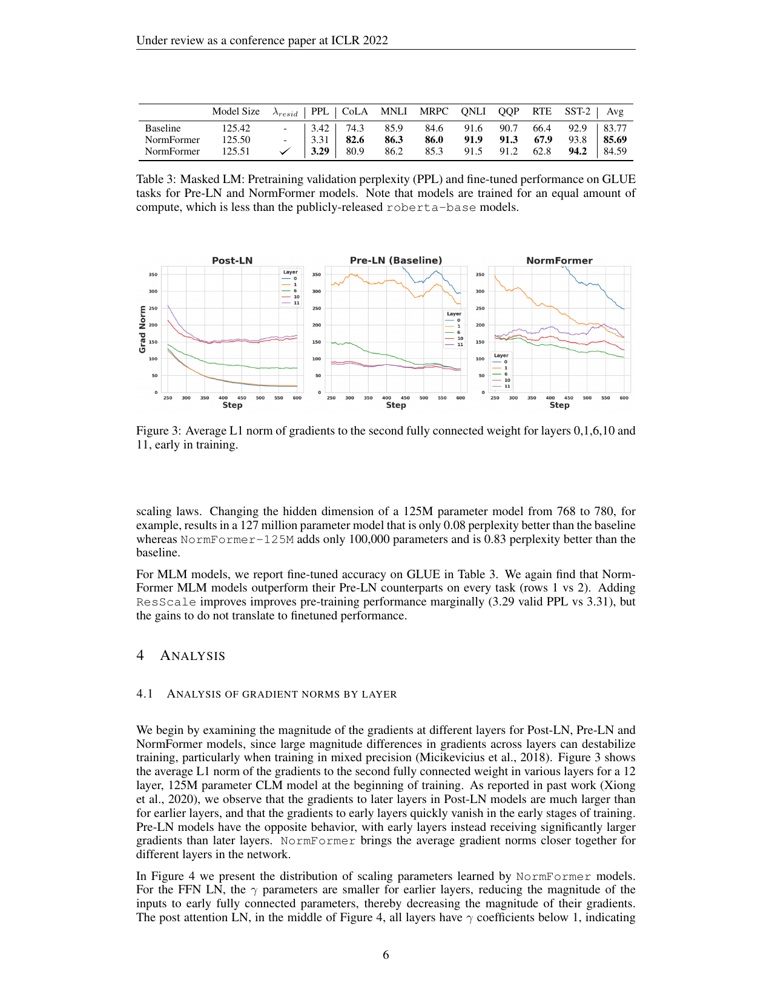
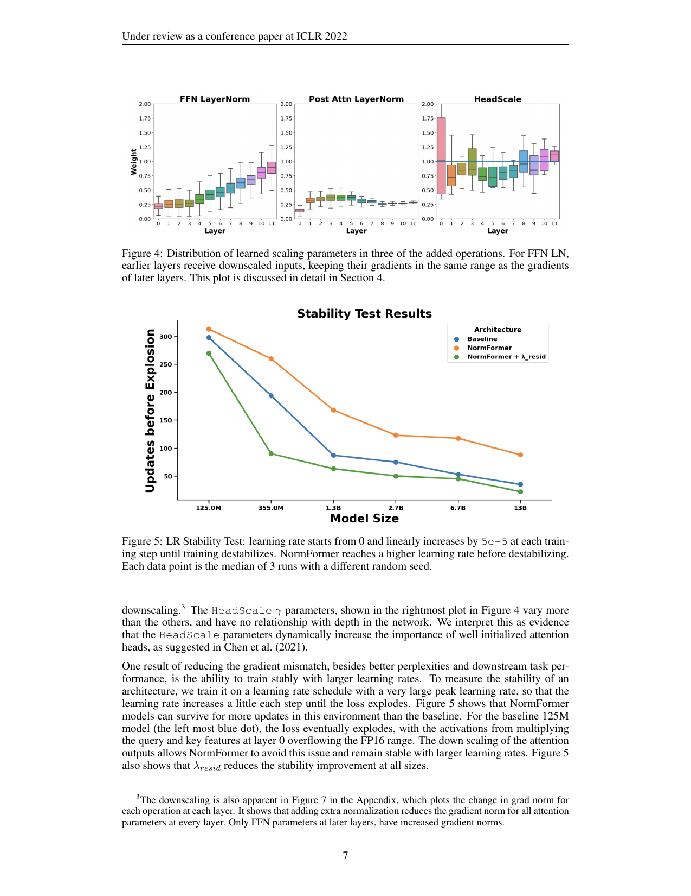

> 本文是关于 Meta AI 论文《NormFormer: Improved Transformer Pretraining with Extra Normalization》（[arXiv:2110.09456](https://arxiv.org/abs/2110.09456)）的深度精读笔记。这篇论文通过在 Transformer 架构中添加三处额外的归一化操作，有效缓解了 Pre-LN 架构中各层梯度分布不均的问题，在几乎不增加计算成本的前提下，显著提升了语言模型的预训练效率和下游任务表现。

---

## 1. 引言：Transformer 归一化问题的前世今生

### 1.1 从 Post-LN 到 Pre-LN 的演进

自 Vaswani 等人在 2017 年提出 Transformer 架构以来，**层归一化（Layer Normalization）** 就是其中不可或缺的核心组件。归一化层的放置位置虽然看似只是一个微小的工程决策，但实际上对模型的训练稳定性、收敛速度和最终性能有着深远的影响。

**原始 Transformer 采用 Post-LN 架构**，即将 LayerNorm 放在残差连接之后：

$$\text{PostLN}(x) = \text{LayerNorm}(x + \text{Sublayer}(x))$$

这一设计在 Transformer 的早期应用中被广泛使用，但随着模型规模的不断增大，研究者们逐渐发现了它的致命缺陷：**后层参数的梯度范数远大于早层**。这意味着在反向传播过程中，靠近输入端的层几乎无法获得有效的梯度信号，导致训练极度不稳定。为了缓解这个问题，Post-LN 架构需要精心设计学习率预热（warmup）策略，否则训练很容易发散。

为了解决这一问题，**Pre-LN 架构** 应运而生，即将 LayerNorm 移到子层的输入端：

$$\text{PreLN}(x) = x + \text{Sublayer}(\text{LayerNorm}(x))$$

Pre-LN 架构被 GPT-2、GPT-3 等里程碑模型所采用，成为大语言模型预训练的事实标准。它显著改善了训练稳定性，使得大规模模型的训练成为可能。然而，Pre-LN 是否就是完美的解决方案呢？答案是否定的。

### 1.2 Pre-LN 的隐患：反向梯度失配

Xiong 等人在 2020 年的研究中首次系统性地揭示了 Post-LN 的梯度问题。然而，NormFormer 的作者们进一步发现，Pre-LN 虽然解决了 Post-LN 的训练不稳定问题，但实际上引入了**方向相反的梯度失配**：

- **Post-LN**：后层梯度 >> 早层梯度（梯度消失）
- **Pre-LN**：早层梯度 >> 后层梯度（反向失配）

这是什么意思呢？在 Pre-LN 架构中，**靠近输入端的层获得了过大的梯度信号，而靠近输出端的层反而梯度不足**。这种不均衡导致了两个问题：

1. **早期层过度更新**：由于梯度过大，早期层的参数在训练初期可能剧烈波动，导致学到的特征不够稳定。
2. **后期层更新不足**：深层网络中最靠近输出的层本应承担最重要的任务特定表示学习，但它们接收到的梯度信号却相对不足。

论文通过可视化"第二全连接层权重在不同层的平均 L1 梯度范数"清楚地展示了这一现象（Figure 3）：



Pre-LN 的梯度分布呈现明显的递减趋势，与 Post-LN 的递增趋势恰好相反。

### 1.3 研究动机：能否让梯度在所有层间均衡分布？

面对这一发现，NormFormer 论文提出了一个自然而直接的研究问题：**能否通过在 Transformer 的关键位置添加额外的归一化操作，使得各层的梯度范数趋于均衡？**

这个问题的提出源于一个简单但深刻的直觉：归一化操作本质上是对激活值进行重新缩放（rescaling），它天然具备调节梯度流动幅度的能力。如果我们能在正确的位置插入归一化层，就有可能同时解决 Pre-LN 的早层梯度过大和后层梯度过小的问题。

值得一提的是，论文的三位作者（Sam Shleifer、Jason Weston、Myle Ott）均来自 Meta AI，其中 Myle Ott 是 fairseq 框架的核心贡献者。这种工程与理论结合的背景使得 NormFormer 具备极高的工程可行性。

---

## 2. 算法创新详解：NormFormer 的三大核心设计

NormFormer 的核心思想可以用一句话概括：**在 Pre-LN Transformer 的基础上，在三个关键位置添加额外的归一化操作**。这三个操作分别是：Post-Attention LayerNorm（注意力后归一化）、HeadScale（注意力头缩放）和 FFN Mid-LayerNorm（前馈网络中间归一化）。

整体架构可以表示为：

$$x_{l+1}^{\text{NormFormer}} = \text{NormFFN}(\text{NormScaledMHA}(x_l))$$

下面我们逐一分析每个创新点。

### 2.1 Post-Attention LayerNorm：注意力输出的幅度控制

**核心设计：** 在多头注意力的输出后、残差连接前，添加一个额外的 LayerNorm。

标准 Pre-LN 的注意力子层为：

$$\text{PreLN-MHA}(x) = x + \text{MHA}(\text{LN}(x))$$

NormFormer 将其修改为：

$$\text{NormScaledMHA}(x) = x + \text{LN}(\text{HeadScaleMHA}(\text{LN}(x)))$$

注意这里多了一个外层的 $\text{LN}(\cdot)$ 包裹注意力输出。这个额外的归一化层起到了**下缩放（downscaling）** 的作用：论文发现训练完成后，所有层的 Post-Attention LN 的缩放参数（gamma）都低于 1，这意味着它在系统性地降低注意力输出的幅度。

**为什么这很重要？** 在标准 Pre-LN 中，注意力层的输出直接通过残差连接加到主干上。如果注意力输出的幅度过大，会导致残差分支主导信号传播，破坏信息在不同层之间的平衡传递。通过添加这一归一化层，NormFormer 能够自适应地控制每一层注意力输出的贡献幅度。

### 2.2 HeadScale：注意力头的差异化加权

**核心设计：** 在多头注意力的拼接（concat）操作前，对每个注意力头的输出乘以一个独立的可学习标量参数。

传统的多头注意力将所有头的输出直接拼接后通过输出投影矩阵：

$$\text{MHA}(Q, K, V) = \text{Concat}(h_1, h_2, ..., h_n) W^O$$

NormFormer 引入了 HeadScale 机制：

$$\text{HeadScaleMHA}(Q, K, V) = \text{Concat}(\gamma_1 \cdot h_1, \gamma_2 \cdot h_2, ..., \gamma_n \cdot h_n) W^O$$

其中 $\gamma_i$ 为可学习的标量参数，**初始化为 1**，确保训练初期与标准多头注意力完全一致。

**关键发现：**

1. 训练后的 $\gamma_i$ 值变化较大，不同头获得了不同的缩放权重，这表明模型学会了**动态调整不同注意力头的重要性**。
2. $\gamma_i$ 与层深度之间没有明显的单调关系，说明 HeadScale 不是简单地对深层或浅层进行统一调节，而是在细粒度上优化每个头的贡献。
3. 在消融实验中，**HeadScale 是三个操作中贡献最大的**——移除它导致的性能退化最为严重。

**与注意力头剪枝的联系：** 值得注意的是，HeadScale 的思想与注意力头剪枝（Head Pruning）有一定的联系。Chen 等人在 2021 年的工作中使用类似的头级缩放进行模型压缩，而 NormFormer 将这一思想用于改进训练过程，目标完全不同但技术路线相似。

### 2.3 FFN Mid-LayerNorm：前馈网络的内部归一化

**核心设计：** 在前馈网络（FFN）的第一个线性变换之后、激活函数之后，添加一个 LayerNorm。

标准 FFN 的计算流程为：

$$\text{FFN}(x) = \sigma(x W_1 + b_1) W_2 + b_2$$

NormFormer 将其修改为：

$$\text{NormFFN}(x) = x + \underbrace{\text{LN}_{\text{mid}}}_{\text{新增}}(\sigma(\underbrace{\text{LN}_{\text{pre}}}_{\text{原有Pre-LN}}(x) \cdot W_1 + b_1)) \cdot W_2 + b_2$$

其中 $\text{LN}_{\text{pre}}$ 是 Pre-LN 架构原有的归一化，而 $\text{LN}_{\text{mid}}$ 是 NormFormer 新增的 FFN 中间归一化——它位于激活函数 $\sigma(\cdot)$ 之后、第二个线性变换 $W_2$ 之前。

**这是解决梯度失配的核心机制。** 论文的 Figure 4 展示了一个极为重要的发现：**早期层的 FFN LN gamma 参数系统性地小于后期层的**。这意味着 FFN Mid-LayerNorm 自适应地减小了早期层全连接层输入的幅度，从而有效降低了早期层的梯度，缓解了 Pre-LN 固有的"早层梯度过大"问题。



**数学直觉：** 归一化操作通过将激活值映射到零均值、单位方差的分布来工作。当早期层的 FFN 中间激活值幅度较大时，归一化层通过较小的 gamma 参数对其进行压缩，相当于在反向传播时减小了通过这些层的梯度流。这种自适应机制使得模型能够自动学习到最优的梯度分配方案。

### 2.4 ResScale（可选）：残差连接的缩放

除了上述三个核心操作外，NormFormer 还提出了一个**可选的** ResScale 操作：

$$\text{ResScale}(x) = \lambda_{\text{resid}} \odot x + \text{Sublayer}(\text{LayerNorm}(x))$$

其中 $\lambda_{\text{resid}}$ 是可学习的逐维度缩放参数，用于调节残差连接中主干信号和子层输出的相对权重。

**重要警告：** 论文实验表明，ResScale 仅在小模型（125M、355M 参数）上有效，**在 1.3B 及以上规模的模型上反而会导致性能下降**。因此，对于当前主流的大规模预训练场景，**不建议使用 ResScale**。这一发现也提醒我们，并非所有的归一化/缩放操作都是"越多越好"的——过度参数化在大模型上可能导致优化困难。

### 2.5 架构对比总结

| 特性 | Post-LN | Pre-LN | NormFormer |
|------|---------|--------|------------|
| 归一化位置 | 残差连接之后 | 子层之前 | 多点分布式 |
| 训练稳定性 | 差（需精细 warmup）| 好 | 更好（支持更高学习率）|
| 梯度分布 | 后层 >> 早层 | 早层 >> 后层 | **各层趋于均衡** |
| 头级控制 | 无 | 无 | **有（HeadScale）** |
| FFN 内部归一化 | 无 | 无 | **有** |
| 额外参数量 | - | 基准 | +0.4% |
| 额外训练开销 | - | 基准 | +2~6% |

可以看到，NormFormer 的设计理念并不复杂——它是在 Pre-LN 这个已被验证的基础架构上，通过在三个精心选择的位置添加归一化操作，以极小的代价实现了梯度分布的均衡化。这种"微创手术"式的改进策略使其具有极高的工程可行性。

---

## 3. 实验结果深度分析

NormFormer 论文的实验设计非常全面，涵盖了因果语言模型（CLM）、掩码语言模型（MLM）、零样本评估、消融实验等多个维度。下面我们逐一分析关键实验结果。

### 3.1 学习率搜索：挑战 GPT-3 的默认设置

在正式实验之前，论文做了一项非常有价值的预实验：系统性的学习率搜索。结果出人意料地发现，在他们的数据集上，**最优学习率比 GPT-3 论文建议的值高出 3-5 倍**：

| 模型规模 | GPT-3 建议学习率 | 实际最优学习率 | 倍数 |
|---------|----------------|-------------|------|
| 125M | 6e-4 | 3e-3 | 5x |
| 355M | 3e-4 | 1e-3 | 3.3x |
| 1.3B | 2e-4 | 6e-4 | 3x |

这一发现本身就具有独立的工程价值——它提醒我们不要盲目套用论文中的超参数，**针对自己的数据集进行学习率搜索可能带来显著的性能提升**。论文使用这些优化后的基线作为对比对象，确保了实验结果的公平性和说服力。

### 3.2 因果语言模型：稳定且一致的困惑度改进

在因果语言模型（Causal Language Model）预训练任务上，NormFormer 在所有模型规模上都取得了一致的困惑度（Perplexity）改进：

| 模型 | 参数量 | 基线 PPL | NormFormer PPL | 改进幅度 |
|------|--------|---------|---------------|---------|
| 125M | 124.5M | 21.09 | **20.11** | -0.98 |
| 1.3B | 1313.5M | 12.21 | **11.94** | -0.27 |
| 2.7B | 2649.5M | 10.92 | **10.55** | -0.37 |

几个值得注意的发现：

**1. 训练加速效果显著。** NormFormer-1.3B 达到基线相同困惑度的速度**快了 24%**。也就是说，使用 NormFormer，你只需要原来 76% 的训练时间就能获得相同质量的模型。对于动辄需要数千 GPU 小时的大规模预训练来说，24% 的训练时间节省意味着巨大的计算成本削减。

**2. 大模型训练稳定性提升。** 这可能是 NormFormer 最引人注目的工程价值：**基线 2.7B 模型在 6e-4 学习率下训练发散（完全失败），而 NormFormer-2.7B 在相同学习率下可以稳定训练并取得最佳性能**。这意味着 NormFormer 显著拓宽了大模型可用学习率的范围，降低了超参数调优的难度。

**3. 困惑度改进随模型规模变化。** 125M 模型上的绝对改进最大（-0.98），而大模型上的绝对改进较小。但考虑到大模型本身的困惑度已经很低（基数效应），相对改进幅度仍然有意义。更重要的是，训练加速和稳定性提升在大模型上同样甚至更加显著。

### 3.3 零样本任务评估：无需微调即见效果

NormFormer 在零样本（Zero-Shot）任务评估中也展现了明显的优势：

| 任务 | 基线-1.3B | NormFormer-1.3B | 基线-2.7B | NormFormer-2.7B |
|------|-----------|-----------------|-----------|-----------------|
| HellaSwag | 58.5 | **60.5** | - | - |
| WinoGrande | 76.8 | **77.5** | - | - |
| 平均（多任务）| 63.6 | **64.7** | 66.3 | **68.7** |

**突出亮点：**

- NormFormer-125M 的平均零样本准确率达到 52.3%（基线 50.9%），看似改进不大，但论文指出一个关键发现：NormFormer 达到 GPT-3 Large（1.3B 参数）零样本性能的速度**快了 60%**。
- 在 2.7B 规模上，NormFormer 将平均零样本准确率从 66.3% 提升到 68.7%，绝对提升 2.4 个百分点——在这个规模上，这是一个非常可观的改进。

零样本评估的改进尤为重要，因为它直接反映了预训练质量的提升。更好的预训练表示意味着模型在没有任务特定微调的情况下就能展现更强的通用能力。

### 3.4 掩码语言模型：GLUE 基准全面提升

为了验证 NormFormer 的通用性，论文还在掩码语言模型（Masked Language Model，类似 BERT）上进行了实验。结果表明，NormFormer 在 GLUE 基准的**所有 7 个任务上都取得了改进**：

| GLUE 任务 | 基线 | NormFormer | 提升 |
|-----------|------|-----------|------|
| CoLA | 74.3 | **82.6** | **+8.3** |
| MNLI | 85.9 | **86.3** | +0.4 |
| MRPC | 84.6 | **86.0** | +1.4 |
| QNLI | 91.6 | **91.9** | +0.3 |
| QQP | 90.7 | **91.3** | +0.6 |
| RTE | 66.4 | **67.9** | +1.5 |
| SST-2 | 92.9 | **93.8** | +0.9 |
| **平均** | **83.77** | **85.69** | **+1.92** |

**最令人印象深刻的是 CoLA 任务上 +8.3 的巨大提升。** CoLA（Corpus of Linguistic Acceptability）是一个判断句子语法可接受性的任务，对语言模型的语法理解能力要求较高。NormFormer 在这个任务上的大幅改进表明，更均衡的梯度分布有助于模型学到更好的语法特征表示。

GLUE 平均分从 83.77 提升到 85.69，绝对提升接近 2 个百分点。这一结果证明了 NormFormer 不仅适用于自回归语言模型（GPT 类），对编码器型模型（BERT 类）同样有效，展现了很强的通用性。

MLM 预训练本身的困惑度也从 3.42 降低到 3.31，进一步验证了预训练质量的提升。

### 3.5 消融实验：各组件贡献量化

消融实验是理解 NormFormer 各组件作用的关键。论文在 **125M 小模型**（470 V100 GPU 小时）上进行了系统性消融。注意：此规模下的"完整 NormFormer"包含 ResScale（因为 ResScale 仅在小模型上有正收益），而对于 1.3B 及以上的模型，推荐配置不包含 ResScale：

| 配置 | Perplexity | 相比完整模型的退化 |
|------|------------|------------------|
| 完整 NormFormer + ResScale | **15.88** | 基准 |
| 移除 Post-Attn LN | 15.92 | +0.04 |
| 移除 FFN LN | 16.14 | +0.26 |
| 移除 ResScale | 16.20 | +0.32 |
| 移除 HeadScale | 16.22 | **+0.34（影响最大）** |
| 增加 3 个额外 LN（QKV 上）| 15.88 | +0.00（无额外收益） |
| 基线 Pre-LN | 16.37 | +0.49 |

**关键结论：**

1. **HeadScale 贡献最大**（移除后退化 +0.34），说明注意力头的差异化加权是 NormFormer 最核心的创新。
2. **FFN LN 贡献第二**（+0.26），验证了前馈网络内部归一化对梯度均衡的重要性。
3. **Post-Attn LN 贡献最小**（+0.04），但仍有正面效果。
4. **更多归一化并不总是更好**：在 QKV 投影上额外添加 3 个 LN 没有带来任何性能提升，反而使训练速度降低 5%。这证明了 NormFormer 选择的三个位置是经过精心设计的，不是简单的"到处加 LN"。

### 3.6 超参数鲁棒性验证

NormFormer 的另一个重要优势是其对超参数设置的鲁棒性。论文在 125M 模型上测试了多种超参数组合：

| 学习率 | 配置 | 基线 PPL | NormFormer PPL | 差值 |
|--------|------|---------|---------------|------|
| 0.001 | 默认 | 16.80 | 16.33 | -0.47 |
| 0.003 | 默认 | 16.37 | 15.88 | -0.49 |
| 0.003 | 更长 warmup | 16.50 | 16.06 | -0.44 |
| 0.003 | GPT-3 设置 | 16.29 | 15.88 | -0.41 |

**NormFormer 在所有超参数配置下都一致优于基线**，改进幅度在 0.41-0.49 之间波动，方差极小。这意味着使用 NormFormer 不需要额外的超参数调优工作——只要基线能跑，NormFormer 就能带来稳定的改进。

### 3.7 Wikitext-103 验证

论文还在 Wikitext-103 数据集上进行了验证：

| 模型 | 最终 Perplexity | 达到基线 PPL 所需步数 |
|------|----------------|---------------------|
| 基线 | 18.70 | 100% |
| NormFormer | **18.65** | **70%**（节省 30% 训练时间）|

NormFormer 仅需 70% 的训练步数就达到了基线的最终性能。虽然后 30% 的训练中 NormFormer 的改进趋于饱和，但论文指出这可能通过进一步的训练策略调优来改善。

### 3.8 计算开销分析

NormFormer 的工程吸引力在于其极低的额外开销：

| 指标 | 数值 |
|------|------|
| 额外参数量 | **+0.4%**（不足 0.07% 实际额外参数）|
| 额外内存开销 | **+2~6%** |
| 单步训练时间增加 | **+2~6%** |
| 推理开销 | 接近零 |

这些数字意味着，NormFormer 实质上是一个"免费的改进"——用不到 6% 的额外计算成本，换取 24% 的训练加速和可量化的性能提升。从性价比角度看，这非常划算。

---

## 4. 工程应用与落地分析

### 4.1 实现极度简单

NormFormer 的工程实现可以说是所有 Transformer 改进方案中最简单的之一。只需要在现有 Pre-LN Transformer 代码中做三处修改：

**修改一：在 MultiHeadAttention 输出后添加 LayerNorm**

```python
# 原始 Pre-LN
attn_output = self.attention(self.layer_norm(x))
x = x + attn_output

# NormFormer
attn_output = self.attention(self.layer_norm(x))
attn_output = self.post_attn_layer_norm(attn_output)  # 新增
x = x + attn_output
```

**修改二：在 MHA concat 前对每个 head 乘以可学习标量**

```python
# 原始 MHA
attn_output = torch.cat(heads, dim=-1) @ W_o

# NormFormer
head_scales = nn.Parameter(torch.ones(num_heads))  # 初始化为1
scaled_heads = [head_scales[i] * heads[i] for i in range(num_heads)]
attn_output = torch.cat(scaled_heads, dim=-1) @ W_o
```

**修改三：在 FFN 第一个线性层后添加 LayerNorm**

```python
# 原始 FFN
h = activation(x @ W1 + b1)
output = h @ W2 + b2

# NormFormer
h = activation(x @ W1 + b1)
h = self.ffn_layer_norm(h)  # 新增
output = h @ W2 + b2
```

在 fairseq 框架中，这三个修改对应三个简单的命令行参数：

```bash
fairseq-train ... --scale-attn --scale-fc --scale-heads
```

### 4.2 与主流框架的兼容性

NormFormer 的设计具有极强的框架兼容性：

**与 PyTorch 原生 Transformer 兼容：** NormFormer 的三处修改都是在现有层之间插入标准的 LayerNorm 或可学习参数，不改变任何现有层的接口或行为。这意味着它可以无缝集成到任何基于 PyTorch 的 Transformer 实现中。

**与 HuggingFace Transformers 兼容：** 只需继承现有的注意力层和前馈网络层，在对应位置添加归一化操作即可。不需要修改分词器、数据加载器或训练循环。

**与分布式训练框架兼容：** NormFormer 添加的归一化层和可学习参数都是标准的 PyTorch 模块，完全兼容 DeepSpeed、Megatron-LM、FSDP 等主流分布式训练框架。归一化操作的计算和通信开销极小，不会成为分布式训练的瓶颈。

**与不同归一化方式兼容：** 虽然论文使用 LayerNorm 进行实验，但其设计思想对 RMSNorm（LLaMA 系列使用的归一化方式）同样适用。可以将 NormFormer 中的 LayerNorm 替换为 RMSNorm，在保持核心优势的同时获得 RMSNorm 的计算效率优势。

### 4.3 实际部署场景与建议

**场景一：从头预训练大语言模型**

这是 NormFormer 最适用的场景。如果你的团队正在从头训练一个数十亿参数的语言模型，添加 NormFormer 可以：
- 节省约 24% 的训练时间（以达到同等困惑度为标准）
- 支持使用更高的学习率而不发散，降低超参数调优成本
- 以不到 6% 的额外计算开销换取稳定的性能提升

**场景二：中等规模模型的快速迭代**

对于 125M-1B 参数规模的模型，NormFormer 的收益更加明显。在这个规模上，可以同时使用 ResScale 获得最大收益。特别适合需要快速迭代模型架构和训练策略的研究场景。

**场景三：训练稳定性要求高的场景**

如果你的训练任务容易出现发散（例如使用较大的学习率、较长的上下文、较大的 batch size），NormFormer 可以显著提升训练的鲁棒性。2.7B 模型在高学习率下的稳定训练就是一个很好的例证。

### 4.4 不适用场景

也需要诚实地指出 NormFormer 可能不太适用的场景：

1. **已有预训练好的模型进行微调：** NormFormer 的收益主要体现在预训练阶段。如果你只是微调一个现有模型，添加 NormFormer 需要重新预训练，成本远大于收益。
2. **极大规模模型（>10B）：** 论文最大的实验只到 2.7B，对于更大规模模型的效果尚未被验证。虽然理论上应该同样有效，但缺乏实证支持。
3. **推理优化敏感的场景：** 虽然 NormFormer 的额外推理开销极小，但在对推理延迟有极致要求的场景下（例如实时搜索排序），任何额外的计算都需要审慎评估。

### 4.5 成本收益分析

让我们做一个简单的成本收益计算。假设你正在训练一个 1.3B 参数的语言模型：

**成本（额外开销）：**
- 训练速度降低约 4%（1.3B 规模的典型值）
- 如果原始训练需要 10000 GPU 小时，NormFormer 版本需要约 10400 GPU 小时

**收益：**
- 达到相同困惑度仅需 7600 GPU 小时（节省 24%）
- 最终困惑度从 12.21 降低到 11.94
- 零样本平均准确率从 63.6% 提升到 64.7%
- 更强的训练稳定性，降低训练失败的风险

**净收益：** 即使考虑单步训练时间的增加，要达到基线相同性能仍然可以节省约 20% 的总训练时间。如果以固定的计算预算训练到收敛，则获得更好的最终性能。NormFormer 都是一个值得采纳的改进。

### 4.6 与后续工作的关系

NormFormer 发表于 2021 年底，此后 Transformer 归一化领域继续涌现了许多重要工作：

- **RMSNorm**（Root Mean Square Layer Normalization）：去掉了 LayerNorm 中的均值中心化步骤，计算效率更高。被 LLaMA 系列广泛采用。NormFormer 的设计理念可以与 RMSNorm 无缝结合。
- **QK-Norm**：对注意力中的 Query 和 Key 进行归一化，防止注意力得分过大。与 NormFormer 的 HeadScale 有互补作用。
- **HybridNorm（2025）**：探索了在同一模型中混合使用 Pre-LN 和 Post-LN 的可能性，进一步细化了归一化位置的选择。
- **nGPT（2024）**：提出了基于单位超球面上表示学习的归一化方案，代表了归一化研究的新方向。

这些后续工作并没有否定 NormFormer 的价值，反而证明了"在 Transformer 中优化归一化策略"这一研究方向的重要性。NormFormer 作为这一领域的先驱工作之一，为后续研究奠定了重要的理论和实验基础。

---

## 5. 总结与展望

### 5.1 核心贡献回顾

NormFormer 论文的核心贡献可以用三句话概括：

1. **发现了问题：** 系统性地揭示了 Pre-LN Transformer 中各层梯度分布不均的问题——早期层梯度过大、后期层梯度不足。
2. **提出了方案：** 通过在三个精心选择的位置（注意力输出后、注意力头拼接前、FFN 中间层）添加归一化操作，有效缓解了梯度失配。
3. **验证了效果：** 在多种任务（CLM、MLM、零样本）和多种规模（125M-2.7B）上，以不到 6% 的额外计算成本换取了 24% 的训练加速和一致的性能提升。

### 5.2 对工程实践的启示

NormFormer 给我们的最大启示不仅仅是"加几个 LayerNorm"这么简单，而是：

**启示一：小改进，大回报。** 在深度学习研究中，并非所有有价值的工作都需要颠覆性的架构创新。有时候，对现有架构的精细分析和微小调整就能带来显著的实际收益。NormFormer 的三处修改总共只增加了 0.4% 的参数量，却换来了 24% 的训练加速——这种高性价比的改进在工业界尤其受欢迎。

**启示二：梯度分析是优化训练的利器。** NormFormer 的整个工作建立在对梯度分布的细致观察之上。通过可视化和分析各层的梯度范数，研究者找到了问题所在，并据此设计了针对性的解决方案。这提醒我们，在训练大模型时，不要只盯着损失曲线，还应该关注梯度的层间分布。

**启示三：不是所有改进都能无限叠加。** 消融实验表明，在三个位置之外继续添加归一化层不仅没有收益，反而降低了训练速度。ResScale 在大模型上甚至有害。这告诉我们，模型改进需要有度，过度设计反而可能适得其反。

### 5.3 未来展望

尽管 NormFormer 已经展示了令人信服的实验结果，但仍有一些开放的研究方向值得探索：

1. **超大规模验证：** 论文最大的实验只到 2.7B 参数，NormFormer 在 10B、100B 甚至更大规模模型上的表现如何？是否存在新的问题或需要调整的地方？
2. **与新型归一化的结合：** 将 NormFormer 的设计理念与 RMSNorm、QK-Norm 等新技术结合，是否能获得更大的收益？
3. **多模态扩展：** NormFormer 目前主要在语言模型上验证，在视觉 Transformer（ViT）、多模态模型（如 Flamingo、GPT-4V）中是否同样有效？
4. **自适应归一化：** 能否设计一种机制，让模型在训练过程中自动决定在哪些位置需要额外的归一化，而不是人工预设固定位置？

总而言之，NormFormer 是一项兼具理论深度和工程价值的优秀工作。它用最简洁的方式解决了一个被忽视但重要的问题，为大规模 Transformer 预训练提供了一个即插即用的改进方案。对于正在从事大模型预训练的团队来说，NormFormer 值得认真评估和尝试。

---

> **参考文献：**
> - Shleifer, S., Weston, J., & Ott, M. (2021). NormFormer: Improved Transformer Pretraining with Extra Normalization. [arXiv:2110.09456](https://arxiv.org/abs/2110.09456)
> - Xiong, R., et al. (2020). On Layer Normalization in the Transformer Architecture. ICML 2020.
> - Vaswani, A., et al. (2017). Attention Is All You Need. NeurIPS 2017.
> - Zhang, B., & Sennrich, R. (2019). Root Mean Square Layer Normalization. NeurIPS 2019.
