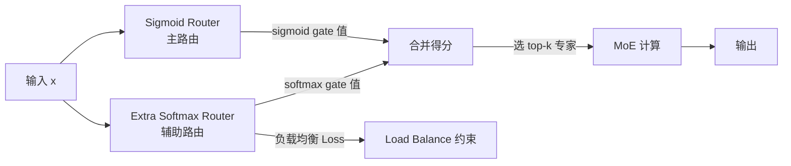

> 本文整理自字节跳动内部技术文档《Sparse-MoE for 序列建模设计文档》，记录了在搜广推序列建模组件中引入 Sparse MoE 的完整工程历程。核心方案 **「Share Expert + Renorm + Learnable_coef + Double Router」** 已在 TikTok Live 等多个业务场景落地，取得 Serving AUC +0.54%～+0.62%、看播时长 +5% 级别的线上收益。

---

## 0. 从一个资源瓶颈说起

近两年，搜广推业务一直在做一件事：**把序列建模组件做大**。

更长的序列（从 200 到 10k+）、更多的层数（从 1L 到 4L+）、更宽的隐层（dim 从 64 到 256）——大量实验证明，Perceiver/Transformer 类序列建模组件的性能遵循清晰的 Scaling Laws：参数量越大、序列越长，AUC 就越高，业务指标就越好。这条路线已经在多个业务场景被反复验证，成为了搜广推模型迭代的核心方向之一。

但问题随之而来：**显存墙**。

单层 Transformer Block 在 float16/bfloat16 下的显存占用有精确的计算公式：

$$\text{Memory}_\text{Attention} = 12 \times Len^2 \times Head + 20 \times Len \times Dim$$

$$\text{Memory}_\text{FFN} = 28 \times Len \times Dim$$

FFN 的显存随参数量线性增长，还算可以接受。但 Attention 对序列长度是**平方级**依赖——把序列从 1k 做到 10k，Attention 部分的显存就膨胀了 100 倍。即使算法侧做了各种 Perceiver 结构的压缩（把序列 token 压缩到少量 latent token），随着层数和宽度的增加，整体显存压力依然非常大。

训推机器不可能无限升配，这意味着"简单扩大扩宽"的路线迟早会碰壁。我们需要一种既能扩大模型表达能力、又不线性增加计算量的方法。

### 0.1 序列建模在推荐系统中的演进路线

要理解为什么这个瓶颈这么关键，先回顾一下推荐系统的序列建模是怎么走到今天这一步的。

早期的推荐模型（DIN、DIEN 等）把用户历史行为序列作为辅助特征，通过 Attention 机制提取用户对当前候选物料的偏好。这套方案有效，但序列长度一般在几十到几百的量级，主要是当时的序列建模组件还很简单——用的是基于加法 Attention 的权重加权，没有全序列的自注意力。

后来以 SASRec、BST 为代表的 Self-Attention 序列建模方案兴起，把整条行为序列都送入 Transformer，让序列内部每对 token 之间都能做 Attention。这一步大大提升了序列建模的表达能力，但 Self-Attention 的 $O(n^2)$ 复杂度让序列长度被牢牢限制在几百。

为了突破这个限制，Perceiver 架构被引入推荐系统。Perceiver 的思路是：用一组数量远少于输入序列的 latent token，通过 Cross-Attention 把整条输入序列"压缩"进来，然后在更小的 latent 空间内做 Self-Attention。这使得序列长度可以扩展到数千甚至上万，同时控制了计算量。

再往后是以 HSTU（Hierarchical Sequential Transduction Unit）为代表的工业规模实践，在腾讯、字节等广告系统上证明了超长序列（1k-10k）端到端建模的价值，这也是目前序列建模的主流方向。

回到我们的问题：现在主流的序列建模基础设施是 Decoder/Perceiver/Transformer，这些组件本身已经是"能做多大就做多大"的路线。但随着序列越来越长、层数越来越深、参数量越来越大，显存墙越来越近，不得不找新的突破口。

### 0.2 为什么是 Sparse MoE

同期，LLM 领域的 Sparse MoE 给了一个新思路。DeepSeek-V3、Doubao-1.5-pro、Qwen-3 等顶级 LLM 都采用了 Sparse MoE 架构——通过**只激活部分专家（Expert）**来实现"参数规模大但计算量不变"的效果。一个有 8 个专家、每次只激活 1 个的 MoE 层，参数量是 Dense FFN 的 8 倍，但每次的 FLOPS 与 Dense 相当。

一个自然的问题就出现了：**Sparse MoE 能直接迁移到推荐系统的序列建模组件上吗？**

答案是：可以，但不是直接搬过来就行——搜广推场景有自己独特的挑战，需要针对性的设计。本文就是这段工程探索的完整记录。

---

## 1. Sparse MoE 的基本原理

在正式进入推荐系统的问题之前，先简单回顾一下 Sparse MoE 的核心机制。

### 1.1 从 Dense 到 Sparse

传统的 Dense 网络中，每个输入 token 都会经过完整的 FFN（或 Attention）计算，所有参数都参与每次前向传播。如果我们把 FFN 替换成 $E$ 个并行的"专家"（Expert），每个 token 只选择其中 $k$ 个专家计算，就得到了 Sparse MoE：

$$\mathcal{G}(\mathbf{x}; \mathbf{\Theta})_i = \operatorname{softmax}(\operatorname{TopK}(g(\mathbf{x}; \mathbf{\Theta}), k))_i$$

其中 $\operatorname{TopK}$ 函数保留前 $k$ 个最高分，其余设为 $-\infty$：

$$\operatorname{TopK}(g, k)_i = \begin{cases} g_i, & \text{if } g_i \text{ in top-}k \\ -\infty, & \text{otherwise} \end{cases}$$

直觉上很简单：一个轻量的 Router 网络计算每个专家的"得分"，选出 top-k 个专家，对它们的输出做加权求和。没被选中的专家不参与计算，因此计算量是稀疏的。

在 LLM 场景，这种设计的收益非常显著：模型参数量可以做到很大（十几个专家、百亿级参数），但每次推理的激活参数只有全量的 $k/E$，训练和推理的计算成本与同激活参数量的 Dense 模型相当，而由于"记忆容量"更大，效果好得多。

### 1.2 搜广推序列建模的不同之处

LLM 中，MoE 替换的是主干 FFN，整个网络几乎全是 Transformer Block，梯度流动路径非常规整。而在搜广推序列建模中，序列模块（Perceiver/Transformer）只是整个推荐模型的**中间组件**——它的输入来自 Embedding 层处理后的序列特征，它的输出会被融合进主塔的精排打分流程。

这个"中间件"的地位带来了几个独特挑战，直接导致了 LLM 领域的经典 MoE 方案在搜广推场景失效：

**挑战一：梯度流动路径更复杂。** 序列模块前后都有复杂的梯度来源，MoE 的 Router 权重会影响从精排打分一路反传到序列模块再到 Embedding 层的整个梯度链路。任何对输出幅度的改变都会被放大传播。

**挑战二：词表极大，token 值域宽。** 推荐系统的 item 词表往往千亿级别，embedding 的分布远比 LLM 的 token 分布分散。这意味着序列 token 的数值范围更大，网络对梯度大小的变化更加敏感。

**挑战三：序列模块容易"偷懒"。** 序列模块不是模型唯一的打分路径，主塔还有很多其他特征（如 DNN 特征、精排 bias 等）可以提供预测信号。如果序列模块的训练出了问题，模型可以通过增大其他路径的权重来弥补，从外部指标上看损失下降正常，但序列模块实际上已经欠拟合了。这种"偷懒"行为在 LLM 中几乎不存在，因为 LLM 的模型输出完全依赖 Transformer 主干。

这三个特点，正是下面四个关键设计（Renorm、Share Expert、Learnable_coef、Double Router）的出发点。

---

## 2. Router 设计：Attention 和 FFN 需要不同的策略

序列建模组件分为 Attention 部分和 FFN 部分，两者都可以进行 MoE 化，但实验发现它们对 Router 架构有截然不同的偏好。

### 2.1 Attention MoE 的 Per-Head 分组

由于 Attention 存在 Multi-Head 结构，Attention MoE 有两种组织方式：

- **Per-head MoE（分组形式）**：对每个 head 独立做 MoE，每个 head 内的 QKV 矩阵进行专家路由
- **All-to-all MoE（全局形式）**：跨所有 head 做 MoE，整体方案类似 Dense 建模中的 Pertoken 形式

初步实验发现 per-head 分组方案效果更优，因此目前的方案均使用分组形式。但值得注意的是，分组形式本质上降低了 Router 的自由度——理论上 all-to-all 形式能学到"分组"概念的 router 分布，这是后续持续探索的方向。

### 2.2 Router 架构的选择

针对 Attention MoE 和 FFN MoE，分别验证了三种 Router 架构：

- **单层 MLP**：$\text{score} = xW_1^T$，最简单的线性打分
- **双层 MLP**：$\text{score} = \sigma(xW_1^T)W_2^T$，加一层非线性
- **Cosine Router**：$\text{score} = \text{cosine\_sim}(\sigma(xW_1^T)W_2^T, \text{router\_emb})$，用余弦相似度打分

实验结论非常清晰：

**Attention MoE 中，双层 MLP + Cosine 表现最优。**

Attention 建模本质上是在捕捉"哪个 token 和哪个 token 在语义上相关"，这依赖向量的**方向**而非绝对大小。Cosine Router 对向量长度做了归一化，专注于方向相似度，因此在 Attention MoE 中自然表现更好。双层 MLP 提供了更强的非线性变换能力，能学到更抽象的路由特征。

**FFN MoE 中，单层 MLP Router 效果最优。**

FFN 的作用更接近于"按激活强度分类处理"——高激活值的 token 应该被路由到擅长高激活模式的专家，低激活值的路由到另一套专家。这个决策依赖向量的**模长**而非方向。Cosine Router 归一化了模长，反而损失了重要信息。单层 MLP 直接用线性变换打分，完整保留了模长信息，因此效果最好。

这个差异给出了一个很好的直觉：**Attention 需要"我和谁方向一致"，FFN 需要"我有多强的激活"。**

### 2.3 Attention MoE 与 FFN MoE 的配合

在实际部署中，Attention MoE 和 FFN MoE 不是孤立工作的，它们通常组合在同一个 Transformer/Perceiver Block 内。两者的搭配会产生协同效应，但也引入了新的超参数：各自的专家数、topk 值、Router 类型，以及是否共享某些组件。

目前线上方案中，Attention MoE 和 FFN MoE 的专家数和 topk 采用相同的配置（如 1 in 7），是出于工程简化的考虑，而不是因为两者的最优设置相同。未来更精细的调优可能需要为它们分别设置不同的稀疏度——例如 Attention MoE 使用更高的稀疏度（更多专家、更少激活比例），FFN MoE 使用更低的稀疏度，以匹配它们各自的建模特点和收敛行为。

另一个实践中值得关注的问题是：**Attention MoE 和 FFN MoE 对训练步数的敏感性不同**。实验观察到，Attention MoE 的 AUC 提升在训练初期就能体现，而 FFN MoE 中 Learnable_coef 的充分学习需要更长时间，收益往往在训练后期才完全展现。这意味着判断 FFN MoE 有效性需要足够长的训练步数，过早停止训练会低估 FFN MoE 的实际价值。这是在线上 A/B 实验中需要特别注意的地方——如果实验时长设置不够，可能会误判 FFN MoE 无效而放弃一个实际有收益的方向。

---

## 3. Renorm：推荐序列建模的必需品

这是本文最核心也最反直觉的一个发现。在 LLM 领域，Renorm（对 Router 权重重新归一化）是可选的优化手段。但在推荐系统的序列建模中，它几乎是**必须的**——去掉 Renorm 会导致显著的 AUC 下降。

### 3.1 什么是 Router Gate Renorm

在 MoE 中，我们选出 top-k 个专家后，对它们的 gate 值进行 softmax 归一化，使得所有被选中专家的权重之和等于 1：

$$A + B = 1 \quad \text{（renorm 下）}$$

$$y = A \cdot E_1(x) + B \cdot E_2(x)$$

**不加 Renorm 的情况**：softmax 是在所有 $E$ 个专家上做的，然后才 top-k 截断。被截断后剩余 k 个专家的权重之和 $A + B < 1$，输出的幅度比 Dense 模型更小。

**加 Renorm 的情况**：在 top-k 截断之后，对剩余的 k 个专家权重重新做 softmax（或者直接除以它们的和），使得 $A + B = 1$，输出方差与 Dense 模型保持一致。

### 3.2 梯度视角的分析

为了理解为什么 Renorm 重要，需要看梯度流动。以 2 个专家为例，MoE 的输出：

$$y = A \cdot E_1(x) + B \cdot E_2(x)$$

对输入 $x$ 的梯度：

$$\frac{\partial \mathcal{L}}{\partial x} = \text{grad} \cdot A W_1^T + \text{grad} \cdot B W_2^T$$

对每个专家权重矩阵 $W_1, W_2$ 的梯度：

$$\frac{\partial \mathcal{L}}{\partial W_1} = \text{grad} \cdot A \cdot x, \quad \frac{\partial \mathcal{L}}{\partial W_2} = \text{grad} \cdot B \cdot x$$

加了 Renorm（$A + B = 1$）时，对 $x$ 的梯度是 Dense 模型梯度的一个"加权平均"，总量等价于 Dense 的"一份"梯度。不加 Renorm 时，$A + B < 1$，对 $x$ 的梯度总量小于 Dense 的一份，导致输入端的更新幅度偏小。

### 3.3 实验验证：梯度大小比梯度配比更重要

为了精确理解梯度的作用，设计了一组系统性消融实验：

| 版本 | 方案描述 | AUC 变化 | 结论 |
|------|---------|---------|------|
| v3.0 | 去掉 Router 对 $x$ 的梯度（$\text{grad\_x} = \text{grad}(W_1^T + W_2^T)$） | **-w13**（严重负向） | $x$ 梯度不能被移除 |
| v3.1 | 保留 $x$ 梯度，只对 $W$ 梯度去掉 router 因子 | +w5 | $x$ 梯度的配比比 $W$ 更关键 |
| v3.2 | 去掉 router 对 $x$ 梯度，但 $x$ 梯度整体乘 0.5 | +w3 | 梯度大小比梯度配比更重要 |
| v3.3 | $x$ 梯度乘 0.25 | **-w2** | 梯度过小导致欠拟合 |
| v3.4 | 基线 + $x$ 学习率调小 1/2 | ~ | 学习率不是关键变量 |

v3.0 的严重负向说明一件事：给 $x$ 的梯度不能超过"一份 Dense"的大小，否则多层残差网络的更新会产生不稳定的冲击。这排除了"增大梯度来加速收敛"的直觉。

v3.2 和 v3.3 的对比排除了"梯度配比"的假设——不论配比如何，梯度的绝对大小才是关键。梯度过小（v3.3）导致欠拟合，梯度过大（v3.0，相当于 dense 的两份）导致过度更新。

v3.4 排除了"调小学习率可以等价于减小梯度"的假设。

**核心结论**：Renorm 自动把 Sparse MoE 的输出值域和方差控制为与 Dense 等价，从而使得对 $x$ 的梯度量始终维持在"恰好一份 Dense"的水平，这对多层残差网络的梯度稳定性至关重要。

### 3.4 为什么推荐系统比 LLM 更敏感？

一个合理的猜测是：推荐系统的 item 词表极大（千亿级别），序列 Token 的嵌入分布远比 LLM 文本 token 分散，值域更宽。这使得模型对梯度的"份数"大小特别敏感——同样的梯度比例偏差，在推荐系统里会被词表规模放大，导致更显著的训练不稳定。LLM 的 token 空间相对集中（词表几万到几十万），这个问题没有那么严重，因此 Renorm 是可选项而非必需品。

### 3.5 多层 Residual 网络中 Renorm 的意义

从更宏观的视角看，推荐序列建模组件通常是多层堆叠的（2L、4L 的 Perceiver）。在多层 Residual 网络中，每一层的输出都会通过残差连接叠加到下一层的输入。

如果某一层的 MoE 输出幅度比 Dense 模型更小（不加 Renorm 的情况），这一层对应的残差更新就更弱，经过 LayerNorm 的归一化后，这一层的学习信号也相应更弱。在多层网络中，这种"信号衰减"会随层数累积，深层的参数更新越来越依赖残差连接的原始信号而不是本层的 MoE 计算——这正是上层 MoE 层比浅层更难收敛的根源。

加了 Renorm 后，每一层 MoE 的输出方差与 Dense 保持一致，残差连接的更新幅度稳定，多层网络的训练才真正稳定。这也解释了为什么在分析多层 Perceiver 的梯度时，发现越上层的 Attention MoE 欠拟合越严重——它是 Renorm 只能部分缓解而无法根本消除的层间梯度衰减问题的体现，需要结合 layer-aware 的 Router scale 来完整解决。

---

## 4. Share Expert + Learnable_coef：解决专家配比问题

### 4.1 引入 Share Expert 的动机

普通 Sparse MoE 的所有专家都是"竞争上岗"的——Router 每次只选 k 个，其余不参与计算。这有一个潜在问题：如果 Router 学得不好，某些专家可能长期被冷落，得不到足够的训练样本，最终形成"冷专家"——参数几乎没有被更新，不具备有效的建模能力。

Share Expert（共享专家）是一种在 LLM 领域（如 DeepSeek-MoE）已被验证的改进方案：引入若干个**始终激活**的专家，它们不参与 Router 竞争，每次前向传播都必定被计算。其作用是：

1. **提供稳定的基础输出**，防止 Router 专家在训练初期输出不稳定时整个模块崩溃
2. **承担通用知识**，让竞争性的 Router 专家专注于学习"差异化能力"，降低它们的学习难度
3. **天然平衡负载**，确保有部分参数始终被充分训练

在推荐系统场景，这些动机同样成立，我们自然地尝试了引入 Share Expert。

### 4.2 为什么直接引入 Share Expert 会失败

然而，实验结果令人意外——直接引入 Share Expert 在多个推荐系统场景出现了显著负向。我们测试了两种方案：

**Naive Share Expert**（直接加和，不做归一化）：

$$y = g(x) E_r(x) + E_s(x)$$

**加 Renorm 的版本**（将 Share Expert 的 gate 视为常数 1，与 Router Expert 一起归一化）：

$$g_1(x) = \frac{g(x)}{g(x) + 1}, \quad g_2(x) = \frac{1}{g(x) + 1}, \quad y = g_1(x) E_r(x) + g_2(x) E_s(x)$$

两种方案在实验中都出现了**严重负向**，且加了 Renorm 后负载分布极度不均衡（Share Expert 几乎承担了所有工作）。

问题的根源在于：**Share Expert 和 Router Expert 之间存在一个"配比"问题**，而这个配比在朴素方案中是固定死的，无法自适应。

以加 Renorm 的版本为分析：$g_1 = g/(g+1)$ 和 $g_2 = 1/(g+1)$ 是此消彼长的关系。如果 Router Expert 的 gate 值 $g$ 偏小（这在 Router 训练初期很常见），那么 $g_2 \approx 1$，Share Expert 几乎以满权重贡献输出，Router Expert 的贡献趋近于零。这反过来导致 Router 专家几乎得不到梯度（因为它们的输出对总输出影响极小），形成恶性循环。

### 4.3 Learnable_coef：一个标量解决配比问题

解决方案是引入一个**可学习的标量参数 coef**，让模型自己学习 Share Expert 和 Router Expert 应该以什么比例混合：

$$g_1(x) = \frac{\text{coef} \times g(x)}{g(x) + 1}, \quad g_2(x) = \frac{1}{g(x) + 1}$$

$$y = g_1(x) E_r(x) + g_2(x) E_s(x)$$

这个改动看起来只是加了一个标量，但本质上给了模型一个"调节 Router Expert 权重的旋钮"——coef 越大，Router Expert 的贡献越大；coef 越小，Share Expert 相对越重要。而且 coef 是通过梯度学习的，会自动收敛到对当前任务最有利的配比。

实验效果立竿见影：

| 方案 | AUC（vs 无 MoE 基线） |
|------|---------------------|
| 基线（Perceiver 2L, Dense） | — |
| Attention MoE + FFN MoE | +0.12% |
| + Share Expert + Renorm | +0.06%（**负向！比无 Share 更差**） |
| + Share Expert + Renorm + Learnable_coef | **+0.15%** |

有意思的是，观察训练过程中 coef 的变化轨迹：

- **Attention MoE 中**：coef 快速学到 1 附近，之后基本不变。这说明 Attention MoE 中 Share Expert 和 Router Expert 天然的配比（coef=1）就已经比较合适，不需要额外调整。
- **FFN MoE 中**：coef 从初始值持续增大，没有明显收敛的迹象。这说明 FFN MoE 中 Router Expert 需要更大的话语权——Share Expert 在 FFN 中的作用可能更多是"保底"而不是"主力"，应该把主要贡献留给专业化的 Router Expert。

这个差异再次印证了 Attention 和 FFN 在 MoE 化中的本质区别：Attention 的 Share Expert 贡献比较均匀，FFN 的 Share Expert 更像是辅助角色。

### 4.4 Learnable_coef 的工程直觉

从工程角度理解 Learnable_coef，它本质上是一个"把手工调参内化为梯度学习"的设计模式。

传统的调参方式是：工程师先凭经验设置一个固定的 coef 值（比如 0.5 或 2.0），然后做消融实验，找到最优值后固化下来。这种方式的核心问题是：最优 coef 值会随着任务类型（Attention vs FFN）、序列长度、专家数等条件的变化而变化。换一个场景就需要重新调参，维护成本很高，而且在多层网络中不同层的最优 coef 也可能不同，手工调参根本无法覆盖所有情况。

引入 Learnable_coef 后，这个调参过程被内化到模型训练中。不同的 Block（Attention Block vs FFN Block）可以学到不同的最优 coef 值，甚至不同层的同类型 Block 也可以学到各自的值。这种自适应性对于跨场景复用同一套架构非常重要——同一套代码部署到 TikTok Live、短视频、电商等不同场景，每个场景的 coef 会自动收敛到各自的最优值，无需为每个场景单独调参。

从训练动态上看，coef 的收敛行为本身也是诊断 MoE 训练健康度的一个有用信号：如果 coef 持续增大且长时间不收敛，可能意味着当前的 Router 专家数不够（需要更多专家承担更细分的职责），或者 Share Expert 的隐层维度太小（能力受限）。反之，如果 coef 收敛到接近 0，说明 Share Expert 主导了输出，Router 专家没有学到差异化能力——这是一种退化情况，通常意味着 Router 的训练信号太弱，可能需要检查 Renorm 是否正确配置，或者调整负载均衡 Loss 的强度。

---

## 5. Double Router：解决负载均衡中的 Entropy Collapse

负载均衡是 Sparse MoE 工程化的经典难题，但在推荐系统场景，我们遇到了 LLM 领域很少讨论的两种特殊失效模式，被统称为 **Entropy Collapse**。

### 5.1 Softmax Router 的 Entropy Collapse

扩大专家数量是提升 MoE 表达能力的直观手段，但实验发现：从 2 in 8 扩大到 2 in 16、2 in 32 后，softmax router 的效果没有提升，甚至持平。

通过观察 Router 的 entropy 值（衡量专家选择的均匀程度）发现：softmax 在 32 个专家上的 entropy 约为 3.2，而理论上限是 $\log_2 32 = 5$。这说明即使有负载均衡 Loss 的约束，softmax router 在专家数增多时仍然会倾向于让 gate 值趋于平均——**每个专家的激活权重都变小，区分度降低，专家失去了稀疏性和专业性**。

根本原因在于 softmax 的归一化机制：专家越多，每个专家分到的"概率总量"越少，softmax 对专家数的增加本质上是抑制的。

### 5.2 Sigmoid Router + Load Balance 的坏死专家

为了解决 softmax 的问题，一个自然的想法是用 sigmoid router——sigmoid 独立计算每个专家的激活概率，不受其他专家影响，理论上不存在"概率被摊薄"的问题。

但加上负载均衡 Loss 后，出现了另一种失效：负载均衡 Loss 对使用频率高的专家施加惩罚，训练过程中会把这些专家的 gate 值持续打压，直到 sigmoid 后的激活概率趋近于 0。最终结果是：几乎所有专家的激活值都被压到接近 0，出现大量**坏死专家**（dead experts）——它们的参数几乎没有梯度，无法被有效训练。

这正是推荐系统"序列模块容易偷懒"特性的体现：模型发现"让所有专家都不工作"是一种可行的低损失状态，因为序列模块的贡献可以被其他模块弥补。负载均衡 Loss 无意中给了模型一个制造坏死专家的激励。

### 5.3 Double Router：解耦负载均衡和 MoE 输出

分析两种失效的根源：问题都出在**负载均衡约束作用于 MoE 输出路径的 Router**上——softmax router 被其归一化特性限制，sigmoid router 被 Load Balance Loss 打压。

解决思路是：**把负载均衡和 MoE 输出解耦**，让两件事由两套不同的 Router 来负责：



- **Sigmoid Router（主路由）**：计算每个专家的独立激活概率，用于 MoE 最终输出的计算。Sigmoid 的独立性保证了专家间不相互竞争压制，稀疏性和专业性得以保留。负载均衡 Loss 不直接作用于这条路径。
- **Extra Softmax Router（辅助路由）**：仅用于计算负载均衡 Loss，不参与 MoE 输出的梯度路径。

最终专家得分为两个 Router 分数的叠加：

$$\text{score}_i = \text{score}^\text{sigmoid}_i + \text{score}^\text{softmax}_i$$

这样，负载均衡的约束只作用于 Extra Softmax Router，主路由的 Sigmoid Router 梯度不受干扰，专家激活值域得以维持。相比 DeepSeek 提出的无参数负载均衡方案，Double Router 通过引入可学习的 Extra Router，能在自适应调控的基础上引入语义信息，路由决策更加准确。

### 5.4 消融实验

| 方案 | AUC 变化 | 备注 |
|------|---------|------|
| 2 in 8, softmax（基线） | +0.03% | — |
| 2 in 8, sigmoid + load balance | +0.03% | 有坏死专家 |
| double router，单层（消融） | +0.02% | 验证：非"算两个分"带来收益 |
| **double router + load balance** | **+0.04%** | 负载均衡，gate 值域大 |

消融实验（单层 double router，两个 Router 线性相关）排除了"多算一个分就有收益"的假设。Double Router 的收益来自于**解耦**本身：主路由不受负载均衡 Loss 的干扰，梯度路径更清晰。

---

## 6. 专家初始化：容易踩坑的工程细节

MoE 的专家初始化是一个容易被忽视但实际上很重要的工程细节。

在千川商城 CTR Attention MoE 的实验中，仅仅因为初始化 stddev 从 0.02 改为 0.05，就出现了明显的 weight 2 差异，影响了训练的稳定性。这提醒我们：**Transformer 组件和 Sparse MoE 组件对初始化非常敏感**。

根据 [Mitchell et al. 2023](https://arxiv.org/pdf/2310.10837) 的理论分析，对于多层 Transformer/MoE 的最优初始化：

$$\text{GlorotNormal}(\text{mode}=\text{'fan\_in'}, \text{scale}=1/\text{layer})$$

其中 layer 是层数，随着层数增加适当减小初始化 scale，防止深层网络的激活值爆炸。

**加了 Renorm 的情况**：MoE 的输出方差被归一化到与 Dense 等价，中间层的初始化不需要额外调整。

**不加 Renorm 的情况**：因为稀疏激活导致输出方差减小，需要补偿性地调大中间层的初始化 scale：

$$\text{GlorotNormal}(\text{mode}=\text{'fan\_in'}, \text{scale}=1/(\text{layer} \times \text{topk}))$$

这个 $\times \text{topk}$ 的调整本质上是让每个专家的输出方差乘以 $\text{topk}$，使得 $\text{topk}$ 个专家加权求和后的总方差等价于 Dense 的单一 FFN。

---

## 7. 多层 MoE 的收敛性分析

除了上述核心设计，多层 Sparse MoE 的收敛行为也值得单独讨论。在扩展到 4 层 Perceiver 的实验中，我们通过分析各层参数的 weight norm（权重矩阵的 $\ell_2$ 范数，反映参数的学习幅度）发现了一个规律性现象。

### 7.1 Attention MoE 的层间欠拟合趋势

以 `v_dense`（Value 矩阵的 norm）为例，在 4L Perceiver 中，各层的 norm 从低层到高层呈递减趋势：

$$1.45 \to 1.34 \to 1.29 \to 1.08$$

斜率越来越低，说明越上层的 Attention MoE 参数更新越弱，**上层比下层更欠拟合**。进一步分析发现，QKVO 矩阵中 QO 比 KV 欠拟合更严重，这是因为 QO 矩阵没有跨序列的 Cross-Attention 部分提供额外的学习信号（KV 矩阵在 Perceiver 的 Cross-Attention 中额外被 source sequence 的梯度更新）。

### 7.2 FFN MoE 的欠拟合更为严重

FFN MoE 中，各层的 weight norm 在扩专家数时几乎不变（大部分情况下只有 1.2 倍左右），而 Attention MoE 的 norm 变化更明显。这说明 FFN MoE 处于比 Attention MoE 更严重的欠拟合状态。猜测原因是：两层 MLP 的 FFN 结构比单层 Attention 的矩阵乘更难被稀疏 Router 充分拟合，梯度在两层 MLP 中的传播路径更长，Router 专家的更新信号更弱。

### 7.3 对 Router 设计的影响：层感知的 Router Scale

上述分析给出了一个清晰的工程指导：**越上层的 MoE，应该给 Router 更大的权重倍数，以补偿层间梯度衰减带来的欠拟合**。具体来说，可以让 Router 的激活比例 $k/E$ 随层数增大——低层用更稀疏的路由（更强的专家化），高层用更密集的路由（更多激活，更强的梯度）。

但这个方向目前还没有稳定的设计方案。简单的 layer-wise $k$ scaling 在实验中没有得到置信的正向结论，更精细的 layer-aware Router 设计（比如根据层的 weight norm 动态调整 $k$ 值）是未来的探索方向。

---

## 8. 性能优化：SMoE-Lego 算子

方案设计完成后，还有一个重要的工程挑战：**让 Sparse MoE 的稀疏性在 GPU 上真正生效，而不是只是代码层面的稀疏。**

### 7.1 为什么需要专用算子

这是一个常见的误区：在代码层面写了 TopK + 专家选择，就认为计算量是稀疏的。实际上，如果底层实现是 dense 矩阵乘法（把不需要的专家 gate 设为 0，但仍然参与矩阵乘），在 GPU 上执行的仍然是**全量计算**，没有节省任何 FLOPS。

真正的稀疏计算需要：
1. **Gather（收集）**：把需要路由到同一专家的 token 收集在一起，形成一个更小的批量
2. **Expert 计算**：对这个小批量做矩阵乘法（尺寸是 $B' \times D$ 而非 $B \times D$）
3. **Scatter（散布）**：把各专家的计算结果散布回原来的 token 位置
4. **加权合并**：按 gate 值加权求和

这涉及非规则的 memory access pattern，需要专门设计的 CUDA 算子来实现高效执行。

### 7.2 SMoE-Lego 算子的设计

SMoE-Lego 算子包含 5 个核心算子，实现了真正的稀疏训练和推理：

```
Input tokens (B×L)
      ↓
[Gate 计算] → TopK 路由决策
      ↓
[Gather] → 按专家分组收集 token
      ↓
[Expert 计算] → 各专家独立批量计算（真正稀疏）
      ↓
[Scatter] → 结果散布回原位置
      ↓
[加权求和] → gate 加权合并
      ↓
Output tokens (B×L)
```

算子既可以用于 Dense MoE 场景，也可以用于序列建模场景，通用性强。

在 TikTok Live 直播场景的实测结果（Perceiver 2L, 4× Attention MoE + 4× FFN MoE，topk=2）：

| 版本 | 单步时间 | 训练吞吐 | 显存占用 |
|------|---------|---------|---------|
| 朴素实现（全算） | 350ms | 1.16m/s | 60G |
| s-pertoken + bmm（全算） | 330ms | 1.27m/s | 58G |
| TF 原生 Pertoken SMoE | 520ms | 857k/s | 56G |
| **SMoE-Lego Final** | **216ms (-39%)** | **1.77m/s (+50%)** | **42G (-30%)** |

相比朴素的全算实现：训练时间减少 39%，吞吐提升 50%，显存减少 30%。基本上实现了 1/topk 的理论稀疏化收益。

### 7.3 显存与吞吐的进一步优化

**共享 Attention MoE 的 Router 计算**：实验发现，所有 Attention MoE 层共享同一套 Router 计算（即所有层使用相同的路由决策）不会损失 AUC。这个发现有点反直觉，但可以理解为：不同层的 Attention 在 per-head 分组后，每组内的 token 分布差异不大，相同的路由策略足够覆盖各层的需求。共享 Router 的好处是可以大幅节省 scatter 结果的显存（scatter 结果的显存占用为 $B \times L \times D \times K$，对于 4 层分别存储就是 4 倍）。

**Gelu 进 XLA**：在 TikTok Live 实验中，通过排查训练 timeline 发现，Lego 算子中 FFN MoE 的 Gelu 激活函数因为默认 `min_cluster_size=12` 的配置没有被 XLA 编译进内核，导致它在 CPU 上执行，整体耗时是 XLA 版本的 10 倍。将 `min_cluster_size` 调小到 4 后，Gelu 成功被 XLA 编译，训练吞吐进一步提升 **+7%**。

这是一个典型的"配置细节决定性能"的案例：算法层面的工作再完美，一个工程配置项的疏漏就可能损失 7% 的吞吐。

---

## 9. 线上效果

方案在两个 TikTok Live 场景完成了完整的 A/B 实验：

### 8.1 2025.11：Perceiver 2L + Attention MoE + FFN MoE（1 in 7）

架构：2 层 Perceiver，Attention 和 FFN 均做 MoE 化，每 7 个专家激活 1 个。这是最初的落地版本。

| 指标 | 变化 | 说明 |
|------|-----|------|
| 训练 AUC（CTR0s） | **+0.24%** | 离线效果 |
| Serving AUC（CTR0s） | **+0.54%** | 在线效果，gap 明显大于离线 |
| Serving Logloss | **-0.47%** | 校准提升 |
| Valuable Watch Live Days/User | **+0.97%** | 核心看播渗透指标 |
| Active Send Gift Days/User | **+0.37%** | 送礼行为提升 |
| Public Diamond (cap100)/User | **+0.83%** | 礼物价值提升 |
| App LT7 | **+0.035%** | 7 日留存 |
| AWLD (w/ LT/HLT/SD) | **+5.36%** | 综合时长指标（修正后） |

训练 AUC 和 Serving AUC 之间存在明显的 gap（+0.24% vs +0.54%），这是 MoE 场景的特有现象：稀疏激活在在线服务时能够更精准地路由特定类型的 item，激活最匹配的专家，而离线训练时因为 batch 内的多样性，路由决策的精准度相对较低。这个现象说明 MoE 的真实收益在在线场景会被放大。

### 8.2 2026.03：Perceiver 2L + 10k Full Sequence（LRM v2）

这次实验在更长的序列（10k）下验证了方案：

| 指标 | 变化 |
|------|-----|
| 训练 AUC | **+0.02%** |
| Serving AUC | **+0.62%** |
| Serving Logloss | **-0.61%** |
| Watch Live Days | **+0.52%** |
| Valuable Watch Live Days | **+1.21%** |
| Watch Live Duration | **+0.69%** |
| Valuable Watch Live Duration | **+0.57%** |

一个有趣的附带收益：实验方案**显著缓解了高分段样本 calibration 高估的问题**。在 baseline 下，模型对高置信度样本的 CTR 预测值系统性偏高（高估），加入 Sparse MoE 后这一现象明显改善。合理的解释是：MoE 的稀疏激活鼓励专家之间的专业化，减少了不同类型 item 之间的特征干扰，高置信度 item 的预测因此更加精准。

---

## 10. 总结与反思

### 9.1 四个设计的核心逻辑一览

回顾整个方案，「Share Expert + Renorm + Learnable_coef + Double Router」这四个设计各自针对一个根本性问题，缺一不可：

| 设计 | 解决的问题 | 根本洞见 |
|------|----------|---------|
| **Renorm** | 多层梯度不稳定，训练坍塌 | 推荐 Token 值域大，梯度份数比 LLM 更敏感 |
| **Share Expert** | 纯竞争 Router 的专家负载不均 | 引入始终激活专家降低竞争压力，提供基础输出 |
| **Learnable_coef** | Share/Router Expert 配比固定，无法自适应 | FFN 中 Router Expert 需要更大话语权 |
| **Double Router** | 负载均衡约束与 MoE 输出互相干扰 | 将负载均衡和 MoE 输出解耦到两套 Router |

这四个设计不是独立的 trick，而是对一个共同问题（推荐序列建模中的 Sparse MoE 训练稳定性）的系统性解答。

### 9.2 与 LLM MoE 的本质差异

从这个工程实践中，我们可以总结出搜广推 Sparse MoE 与 LLM Sparse MoE 在工程约束上的三个本质差异：

**差异一：梯度稳定性要求更高。** LLM 是端到端的 Transformer，梯度流动路径简单规整。推荐系统的序列模块是中间件，梯度来自多个方向，且下游的 item 词表庞大，导致对梯度幅度的敏感性远超 LLM。Renorm 因此从可选项变成了必选项。

**差异二：负载均衡策略完全不同。** LLM 中标准的辅助 Loss 基本有效。推荐系统中因为序列模块有"偷懒"的退路，任何直接打压 gate 值的约束都可能触发 Entropy Collapse。Double Router 的本质是把约束目标（负载均衡）和计算目标（MoE 输出）分开处理。

**差异三：专家数扩展策略待探索。** LLM 中扩专家数是有稳定收益的。推荐系统中目前的稳定点在 2 in 8 附近，更大规模的专家数扩展（2 in 32+）目前没有置信且建设性的结论，是未来的重要探索方向。

### 9.3 还未解决的开放问题

文档中也坦诚记录了尚未有稳定结论的几个方向：

**层间 Router 的异质性**：多层 MoE 中越靠上的层越难收敛，欠拟合更严重。理想的做法是上层用更大的 Router 倍数，实现 layer-aware 的动态 Router，但这还没有稳定的设计方案。

**Attention MoE 的 all-to-all 形式**：目前使用 per-head 分组，降低了 Router 自由度。理论上 all-to-all 能学到更灵活的路由，但实际效果需要更大规模的验证。

**Renorm 与 Share Expert 的大规模扩展**：目前主要在 2 in 8 附近验证了方案有效性。更大专家数下，这套组合是否依然是最优解，需要系统性的扩展实验来回答。

推荐系统的 Sparse MoE 工程化，才刚刚开始。

### 9.4 工程化落地的隐性成本

除了算法设计本身，Sparse MoE 落地的工程复杂度也远高于 Dense 模型迭代。这里有一些值得记录的隐性成本：

**训练稳定性监控成本更高**。Dense 模型只需要监控 loss 曲线和 AUC，而 Sparse MoE 需要额外监控：每个专家的被选中频率分布（检测坏死专家）、Router gate 值的值域分布（检测 entropy collapse）、各层的 weight norm（检测欠拟合）。这些监控指标在 Dense 模型迭代中是完全不需要的，但在 MoE 调试中是排查问题的关键。

**超参数调试空间更大**。相比 Dense 模型，MoE 引入了多个新的超参数：Router 类型（softmax/sigmoid/cosine）、专家数 $E$、激活数 $k$、负载均衡 Loss 的系数 $\alpha$、Learnable_coef 的初始化值、Z-loss 的系数等。这些超参数之间还有交互效应（比如 sigmoid + load balance 的组合才会触发 entropy collapse），调试难度显著高于 Dense 模型。

**算子工程投入不可忽视**。SMoE-Lego 算子的开发是整个工程中投入最重的部分之一。真正稀疏的 GPU 算子需要处理非规则 memory access、gather/scatter 的 kernel fusion、XLA/TF 图的算子注册与 JIT 编译等问题，这些都是对算子工程师的专业要求。前期如果没有这套算子，Sparse MoE 反而会比 Dense 慢（TF 原生 Pertoken SMoE 比朴素全算还慢了约 26%）。

**在线推理的 serving 改造**。训练侧的 MoE 改造完成后，Serving 侧也需要对应的工程支持：在线 feature 计算需要正确传递 Router 所需的输入特征，模型导出需要支持稀疏算子的图优化，推理引擎需要支持 TopK 路由的动态 batch 分发。这些工作往往需要算法、系统、基础设施团队的协同。

这些隐性成本说明，Sparse MoE 不是一个"算法侧改改 config 就能上线"的优化，它需要算法、工程、基础设施各层面的同步投入。但从最终的线上收益来看（AUC +0.54%～+0.62%，看播时长 +5%+），这些投入是值得的。

### 9.5 一个更宏观的视角：MoE 化是序列建模的下一个 Scaling 阶段吗？

从历史上看，推荐系统的序列建模每隔 2-3 年就会迎来一次范式升级：从 Attention-weighted 到 Transformer Self-Attention，从 Self-Attention 到 Perceiver 压缩，从短序列到超长序列。每一次升级都以某种方式突破了前一阶段的资源瓶颈。

Sparse MoE 是不是下一个范式升级？目前的实验结果表明，它能在几乎不增加推理成本的前提下提升模型容量，这正是当前计算瓶颈下最需要的技术特性。同时，它与序列长度扩展、层数扩展、宽度扩展是正交的——可以在做了 MoE 化之后，继续做这些维度的扩展。

当然，目前的工作还有很多未解决的问题（专家数扩展收益不稳定、层间收敛性差异、负载均衡在大规模专家数下的表现等）。这些问题的解答，将决定 Sparse MoE 能走多远。

---

## 参考资料

- [DeepSeek-V3 Technical Report](https://www.deepseek.com/)
- [Qwen-3 Technical Blog](https://qwen.ai/)
- [Mitchell et al. 2023 - Scaling & initialization](https://arxiv.org/pdf/2310.10837)
- [Ha et al. 2025 - Layer-wise scaling](https://arxiv.org/pdf/2502.05795)
- [MoA: Mixture of Sparse Attention](https://arxiv.org/pdf/2406.14909)
- [Expert-Choice Routing for Attention MoE](https://arxiv.org/pdf/2505.00315)
