> 本文整理自某大型电商推荐系统内部技术文档，记录了在商城推荐召回阶段引入 LLM 训练范式（Foundation Model + Generative Recall）的完整工程实践。核心方案以 **Pretrain → Posttrain → SFT** 三阶段训练为框架，将召回链路从判别式改为生成式（Beam Search），并首次走通 Foundation Model 参数加载范式，最终在真实电商场景取得 **GMV +0.374%**、训练时间 **49.8 天 → 12.3 天** 的效果。

---

## 0. 背景：推荐系统的两个结构性局限

"算力 + 通用方法，长期总是胜过精心设计的领域先验"——这是 AI 过去数十年演进反复兑现的规律（Bitter Lesson, Rich Sutton）。

推荐系统是这一规律目前尚未被充分兑现的主要方向。过去推荐系统依赖先验的精细化设计在历史阶段带来了可观收益，但当算力与数据规模持续扩展时，整套链路逐渐显现出两个**结构性局限**：

**局限一：算力利用斜率受限**

在 Pointwise 预估框架下，单条样本仅提供 1 个监督信号，样本利用效率低。LLM 的序列样本自回归训练一条即可贡献 $L$ 个监督信号，样本效率提升 $L$ 倍。换句话说，同样的计算资源，LLM 范式能看更多"东西"。

**局限二：建模天花板受限**

强先验的网络结构和单一化的建模任务，在 GPU 强算力时代成为迭代瓶颈。统一 Transformer 结构的工作（如 OneTrans）已经把网络主干统一化，但其输入输出相对固化。通过导入 Action、Context 等输入和相关预测任务，打开了 Transformer 输入输出建模复杂化和通用化的迭代空间。

基于上述判断，这次工作做出了一个大胆的尝试：**把 LLM 的训练范式完整引入推荐召回阶段**，在全场景长周期序列样本上产出 Foundation Model，参数加载到下游召回任务继续 SFT，线上链路通过 Beam Search 的生成式链路替换了原本判别式召回的索引式链路（IVF/HNSW）。

---

## 1. 整体方案：三阶段 LLM 训练范式

整个方案以 LLM 的训练范式为基准，在电商商品推荐的召回场景上落地。样本组织形式、训练流程如下：

### 三个训练阶段

**阶段一：Foundation Model Pretrain**

在序列样本上进行无监督预训练，采用**多层 SID 自回归**的建模方式，引入 NTP (Next Token Prediction) Loss 进行预训练，充分学习用户行为模式与商品语义的通用表征。这一阶段覆盖全场景两年历史数据，在 SEA 地区可以做到 2~3 天训完。

**阶段二：Recall Posttrain**

从 Pretrain ckpt load 起训，前缀历史经 Prefill Merge 压成 5× 压缩的 Merged Token，只对末尾 last-k 位置做 Next Multi-Item Predict、按 set-based 样本组织，与召回按 top-K 取集合的使用方式对齐。

**阶段三：Recall Task SFT**

召回下游上线任务，延续 Merged 输入作为 prefill，切到 pointwise 样本并用 Single-Token Loss；引入 Reward 增强召回效率。

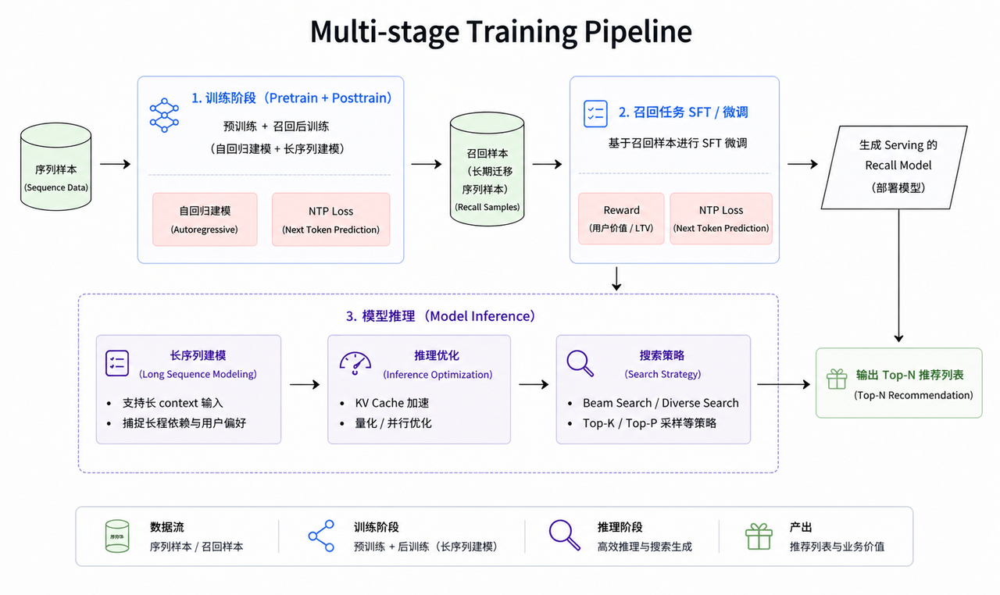

这一范式的核心价值是"**一次预训练，多场景复用**"：

$$\text{Foundation Model} \xrightarrow{\text{Recall SFT}} \text{召回模型} \xrightarrow{\text{Ranking SFT}} \text{粗排/精排模型}$$

同时也打开了清晰的 scaling 路径：模型规模、序列长度与训练数据量均可在可观测的收益曲线下持续扩展。

### 生成式召回 vs. 传统判别式召回

传统的双塔召回本质是判别式框架：用 User Embedding 和 Item Embedding 的点积估计相关性，用 HNSW/IVF 做近似最近邻检索。这套方案在大量部署下也暴露了若干局限：

| 维度 | 判别式召回（双塔） | 生成式召回（本方案） |
|------|-----------------|----------------|
| 建模目标 | 点积相似度 | 自回归序列生成 |
| 索引结构 | HNSW/IVF（耦合商品库） | Beam Search（解耦商品库规模） |
| 冷启动 | 弱（依赖 ID 特征） | 强（SID 语义泛化） |
| Scaling | 受限于双塔结构 | 随 LLM 参数量 Scaling |
| 多目标 | 需要多任务改造 | Condition Token 自然支持 |

生成式框架的推理复杂度**解耦商品库规模**，Scaling 空间更大；Semantic ID 的引入改善了模型泛化能力，冷启动商品的 PV 和点击显著提升。

---

## 2. 模型结构：工业化 LLM Backbone

### 2.1 整体架构

模型采用标准 Decoder-Only Transformer，本次上线版本选用 **170M** 参数档位，核心超参如下：

| 配置 | Value |
|------|-------|
| Layers | 6 |
| Hidden dim | 4096 |
| FFN dim | 1024 |
| Attention heads | 8 |
| KV heads (GQA) | 4 |
| Head dim | 128 |
| Max sequence length | 1024 |
| SID 码本 | 8192 × 3 |
| 总参数量 | 170M |

核心 Transblock 完全沿用 LLaMA / Qwen 等主流 LLM 的设计（RMSNorm + SwiGLU + RoPE + GQA），并叠加了三项针对深层 Transformer 稳定性的改动。

**One Transformer 理念的贯彻**：同一套 backbone 结构贯穿 Pretrain → Stage-1 Recall PostTrain → Recall SFT&RL 多个训练阶段保持不变，**阶段切换只调整数据组织、loss 形式与优化器配置**，模型权重可以无损迁移、拼接、复用。

与此前判别式召回的对比：

| 参数 | 旧版 DVF 召回 | 本方案（v1） |
|------|-------------|------------|
| 参数量 | 1.3M | 170M |
| FLOPs | 1.41T | 96.33T |
| 序列长度 | 200 | 512 |

### 2.2 Grouped Query Attention（GQA）

标准 MHA 下每个 query head 独立维护一套 KV，KV 显存随 head 数线性增长。本方案切换为 GQA（8 query head 共享 4 KV head），KV 显存降低约 2×。

实验效果（HR@50 仅 -0.3%，吞吐 +15%）：

| 改动 | HR@1 | HR@10 | HR@50 | instance/s |
|------|------|-------|-------|-----------|
| Q head 8 / KV head 8 | - | - | - | - |
| Q head 8 / KV head 4 | -0.05% | -0.1% | -0.3% | +15% |

效果损失极小，而推理吞吐提升明显——这种权衡在工业推荐场景下完全可以接受。

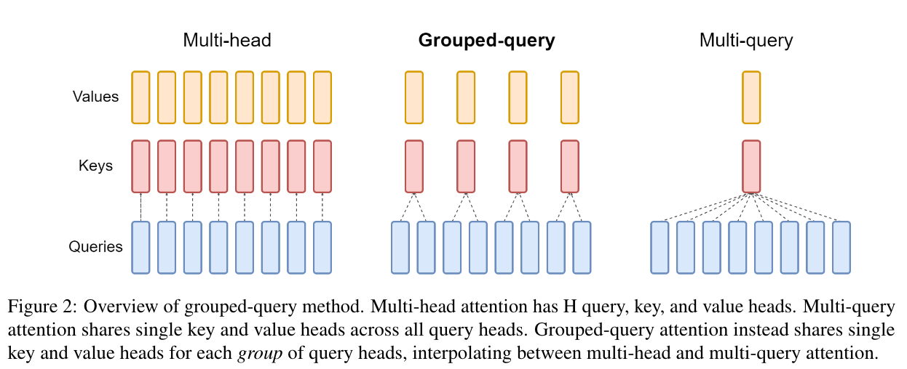

### 2.3 SwiGLU FFN

FFN 采用 SwiGLU，相比 ReLU/GELU 在同等参数规模下有稳定的 loss 改进，也是当前主流 LLM 的默认选择（Noam Shazeer 2020）：

$$\mathrm{FFN}(x) = \bigl(\mathrm{SiLU}(xW_{\text{gate}}) \odot xW_{\text{up}}\bigr)W_{\text{down}}$$

SwiGLU FFN 由 gate / up / down 三个矩阵组成，参数量为 $3dm$。标准做法是取 $m = 8d/3 \approx 2.67d$ 以对齐 vanilla FFN 参数预算。但考虑到 L40 + FP16 推理下 Tensor Core 的对齐限制（intermediate size 需为 16 的倍数），本方案将中间层放宽至 $m = 4d$，参数量约为 vanilla 配置的 $1.5\times$。

实验发现增加 FFN 参数量，主要提升了**模型对 SID 映射关系的记忆能力**（SID Level 2/3 的 hitrate）：

| Expand ratio | HR@1 | SID Level 0 HR@1 | SID Level 1 HR@1 | SID Level 2 HR@1 | instance/s |
|-------------|------|-----------------|-----------------|-----------------|-----------|
| 2.67d (标准) | - | - | - | - | - |
| 4d (本方案) | +5% | +1% | +8% | +15% | -2% |

### 2.4 RoPE 位置编码

位置编码使用 RoPE（Rotary Position Embedding），通过对 Q/K 直接做相位旋转引入相对位置信息。RoPE 的优势对生成式推荐尤其关键——序列长度在不同阶段差异明显（Pretrain 512 / SFT 切换到 prefill merge、beam search 推理时序列长度再拉高），RoPE 让结构在不同长度下都可以直接复用，无需额外训练。

Pretrain 阶段对比 APE 和 RoPE 的实验结果（RoPE 对异构 token 全炸开的形式提升最大）：

| 位置编码 | HR@1 | HR@10 | HR@50 |
|---------|------|-------|-------|
| NoPE | - | - | - |
| APE | +5% | +6.2% | +8.3% |
| **RoPE** | **+10%** | **+12%** | **+18%** |

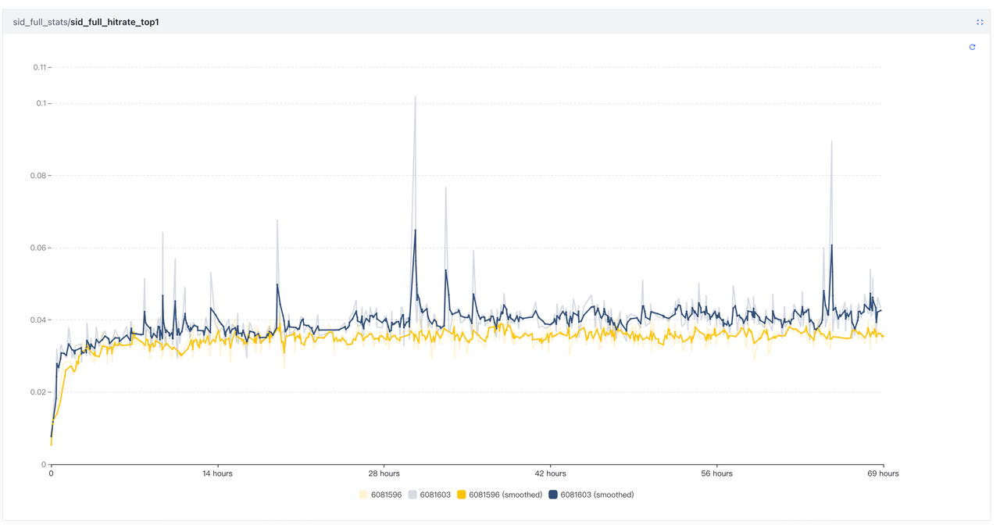

### 2.5 稳定性三件套

深层 Transformer 在 scaling up 过程中频繁出现**方差失配**问题：不同模块输出方差量级不对齐，导致激活爆炸、attention logit 过大、残差路径失效。以下三项措施协同控制稳定性：

#### QK Norm

序列长度和 `d_model` 同时上升后，attention logit $QK^T/\sqrt{d_\text{head}}$ 的量级波动显著加剧。在 Q、K 投影之后套一层 RMSNorm（QK Norm），归一化后 logit 的尺度收敛到固定范围，softmax 梯度分布更均匀。

同时去掉了之前大量使用的 Kernel Norm，加上 weight decay 配合 QK Norm 一起稳定训练。实验验证，这个替换还可以顺带去掉模型中所有的 bias，既节省计算量又提升性能。

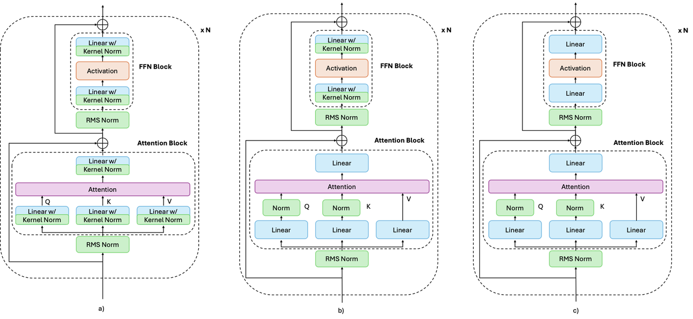

#### Residual Rescale

Pre-Norm 结构下每层的残差 $y = x + F(x)$ 会让 $\text{Var}[x]$ 单调上升，深层 attention/FFN 路径逐层失效。参考 DeepNorm/GPT-2 的做法，把残差分支按深度衰减，每层残差缩到原来的 $1/\sqrt{2L}$：

```python
self.residual_scale = 1 / math.sqrt(2. * self.layer)

attn_out = self.attn(norm(x))
x = x + self.residual_scale * attn_out

mlp_out = self.ffn(norm(x))
x = x + self.residual_scale * mlp_out
```

每层引入的增量方差为 $O(1/L)$，$L$ 层累计后整体方差保持常数量级。**实测没有 Residual Rescale 的话，模型层数大于 6 就很容易训崩。**

#### Softcap

个别 token pair 上极端偏大的输出会让下游激活饱和、梯度回传不稳，FP16/BF16 训推下尤其敏感。在 attention 子层和 FFN 子层输出加一层 tanh soft cap：

```python
def _soft_capping(self, x):
    return self.softcap * tf.math.tanh(x / self.softcap)
```

Softcap 在 $|x| \ll \text{softcap}$ 区域接近恒等，超出后平滑收敛到 $\pm\text{softcap}$，相比硬截断（clip）它可导。线上监控数据：

| | 无 softcap | 加 softcap |
|-|------------|-----------|
| Max 激活值 | 108,416（**溢出 FP16**） | 70 |

### 2.6 优化器：从 RMSPropV2 迁移到 AdamW

这是一个大胆但正确的决定。模型结构去掉了 bias、使用 RMSNorm + weight decay 稳定训练（即 0-齐次网络），此类网络下 AdamW 相比 RMSPropV2 更友好，能更好发挥模型潜力。

推荐系统的训练数据与 LLM 有两点显著差异：训练数据分布差异大、样本噪音高。因此不能直接用 LLM 的标准参数（`lr=1e-5, β₂=0.99`），而是需要从 RMSPropV2 的配置出发，通过公式推导找到适合推荐场景的超参配置：

| Stage | lr | β₁ | β₂ | ε | weight_decay |
|-------|-----|-----|-----|-----|-------------|
| Pretrain | 8e-4 | 0.9 | 0.99 | 1e-7 | 1e-5 |
| Posttrain | 8e-4 | 0.9 | 0.99 | 1e-7 | 1e-5 |
| Recall SFT | 6e-4 | 0.9 | 0.99999 | 1e-7 | 5e-6 |

切换到 AdamW 后，HR@1 提升 **+8%**，且权重范数（WeightNorm）从 500+ 收敛到 70 左右，训练过程更稳定。

---

## 3. 预训练（Pretrain）

### 3.1 Tokenizer 设计：三类 Token 的统一序列

预训练的核心挑战是如何把用户的异构行为序列转换为模型可以理解的 token 流。方案设计了三段式 Tokenizer：

**Context Info Token**

承载场景、时间等推理时已知信息，包括请求场景（source_page_type）、进入来源（enter_from/enter_method）、行为时间差（ts_delta）等。此外还把部分条件信号（如 action_type）编码进 Context Token，作为建模 item 行为类型的 condition 一并输入序列。**通过调节 Condition Token 可以让召回满足多种多样的算法和业务需求**（如点击目标构造 action_type=click、成单目标构造 action_type=order）。

**Semantic ID Tokens**

三位 8192 词表 ID，承载核心行为 item 的 SID（Semantic ID）。每个 item 展开为 3 个 SID token，构成粗到细的语义描述，兼顾词表可控与生成步数可控。SID 之间天然带有泛化性：**语义相近的 item 共享前缀 code，为模型学习跨 item 的可迁移模式提供了归纳偏置**。

**Item Info Token**

承载 item 侧的细粒度特征，包括商品 ID（pfid）、叶子类目（leaf_ctg）、卖家（seller_id）等精细标识信号。与 Semantic ID Token 互补：SID 反映内容层语义（多模态特征 + 协同信号经 RQ-KMeans 量化的离散 code），Item Info 则保留传统推荐中被证明有效的精细 ID 特征，粒度更细。

消融实验验证了各类 Token 的贡献：

| 配置 | HR@1 | SID L0 HR@1 | SID L1 HR@1 | SID L2 HR@1 |
|-----|------|------------|------------|------------|
| Item info + context info | - | - | - | - |
| w/o item info | -9% | -4.0% | -3.2% | -1.8% |
| w/o item info & context info | -42.8% | -12.2% | -14.1% | -3% |

Context info 对 HR@1 的贡献高达 -42.8%，是最关键的 token 类型。

### 3.2 数据组织：序列去重与 All-Flat

**用户行为去重**

原始用户行为会被埋点重复上报多次（曝光到成交的多级行为、场景切换造成的重复上报），直接喂进模型既冗余又会稀释监督信号。方案做了两步去重：

1. **ListwiseDeduplicateBySession**：按固定时间阈值 T（线上取 2h）切分 session，在当前 session 内维护 key `(pid, action_type)` 的集合，首次出现的事件追加到输出列表，已出现的直接丢弃。
2. **SeqConsecPIDDedup**：在 Step 1 的输出上再做相邻位置去重，连续落在同一 pid 上的 token，只保留行为漏斗最深、时间最后的一个（按 view < click < cart < order 排序）。消除同一 item 短时间内的连续多级上报，让每个 token 对应一次"有意义的最终行为"。

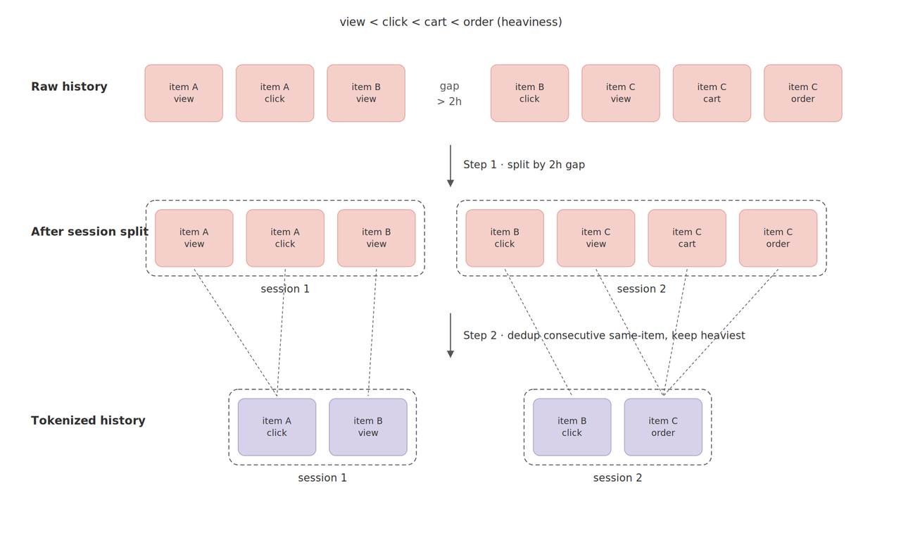

**All-Flat 数据组织**

预训练阶段采用 All-Flat 组织：用户的历史行为（Context/SID/辅助 token）按时间顺序展平成一条长序列，所有 token 独立入图、独立参与 attention。这样做的目的是让模型看到最完整的交互序列，充分学习长程依赖和多域泛化能力。

**序列组织加速技巧**：将上一个 item fine info 和当前 item context token 做 sumpooling，在不损失任何信息的前提下，让序列长度减少 1/5。

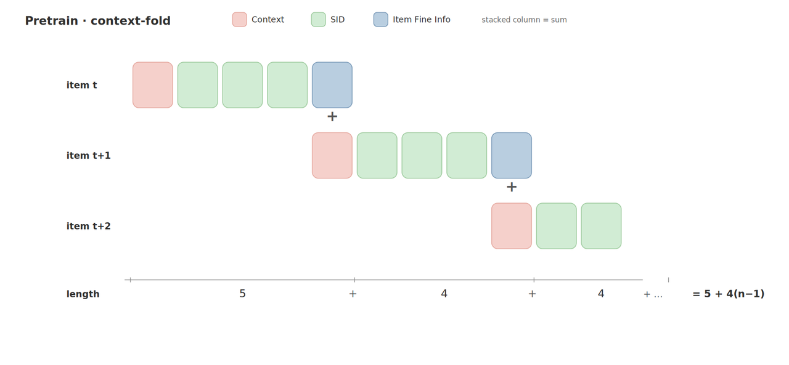

### 3.3 训练任务：SID-only Next Item Predict

训练目标是标准的自回归 Next Item Predict：给定前缀序列预测下一个 item 的 SID token，采用 teacher forcing 训练。Loss **只在 SID token 位置计算**（SID-only Loss），Context info 与 item fine info token 不参与 next token loss，避免模型把算力浪费在回归静态特征上：

$$\mathcal{L}_{\text{NTP}} = -\sum_{t=1}^{n} \sum_{k=1}^{3} \log p_\theta\!\left(s_t^{(k)} \mid x_{<t,k}\right)$$

### 3.4 推荐预训练 Scaling Law

这里有一个非常有意思的发现：**推荐系统预训练的 Scaling 不是单变量问题**。把 pretrain loss 按熵性质拆解，对应三条相互独立的优化方向：

$$\mathcal{L}_{\text{pretrain}} = \underbrace{\mathcal{L}_{\text{high-entropy}}}_{\text{用户兴趣建模}} + \underbrace{\mathcal{L}_{\text{low-entropy}}}_{\text{condition 映射 + SID 层级}} + \underbrace{\mathcal{L}_{\text{irreducible}}}_{\text{当前可观测的随机性下界}}$$

**参数量**：主要影响低熵任务（SID 映射、condition 建模）。以 500M SID codebook 为例，$\log_2(5 \times 10^8) \approx 28.9$ bits/SID，裸记忆下界约 7.2B 参数。参数不足是线上 SID 不合法率的主因。实验表明 14M → 32M → 114M 参数量，hitrate@1 从 4.0% → 4.8% → 6.0%，提升大部分来自 **SID Level 1/2**。

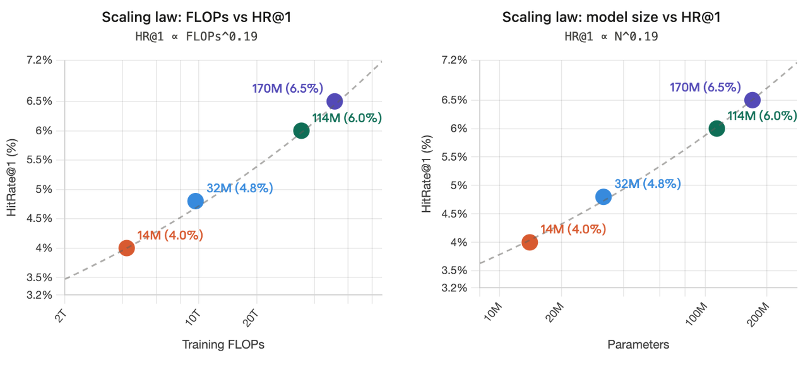

**Context 信息量**：用户兴趣的不可约熵（Bayes Risk）很高，只建模 SID 的话效果很快到平台期。增加 context token，模型能随着数据量增加持续学到更多，最终效果提升约 **66%**。这一点深刻揭示：**用户兴趣建模的重点要素是 context，其价值由条件互信息** $I(Y; X_{\text{new}} \mid X_{\text{old}})$ **决定，冗余特征只增成本不降熵**。

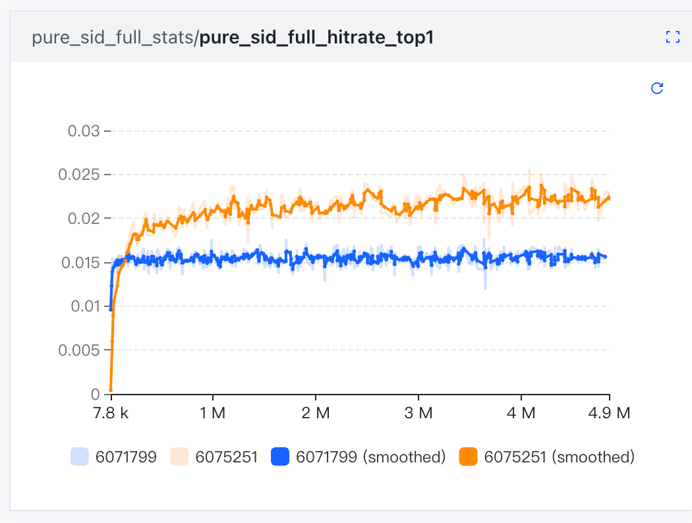

**多任务**：在 SID head 后叠加 action 预估 Loss（click/cart/order），SID 的 hitrate 也能涨。LLM 本质是超大型多任务系统，共享底层结构的任务联合训练存在隐式正向迁移。

**Scaling 的三个杠杆总结**：多任务让现有参数学到更多；context 降低 Bayes ceiling 让参数有继续工作的空间；最后参数量给前两者提供承载容量。三个杠杆同时提高，才是生成式推荐预训练真正的 Scaling Law。

---

## 4. Recall Posttrain：对齐召回任务

### 4.1 Prefill Merge：压缩历史前缀

Recall Posttrain 阶段切换到 **Prefill Merge** 数据组织：只保留序列末尾的 last-k 个 token 炸开参与 loss 计算，前面的长历史先过 Transformer 再经 sumpooling 压到 MergedToken 上作为上下文占位（5× 压缩）。

两个动机：

1. 训练样本组织与线上召回 serving 对齐——前缀历史只需 prefill 一次即可复用到所有 last-k 位置，压缩了输入，线上可以处理更长的序列。
2. 控制 SFT 阶段的 loss 位点分布，把预测信号集中在最近的 last-k 上，更贴近召回任务"预测未来即将交互的 item"的目标。

### 4.2 Multi-Item Predict：对齐 top-K 召回

训练目标从单步 Next Item Predict 扩展到 Next Multi-Items Predict：模型在 last-k 位置上同时预测未来多个 item 的 SID 分布：

$$\mathcal{L}_{\text{MTP}} = -\sum_{t=1}^{n} \sum_{i=1}^{K}  \sum_{k=1}^{3} \log p_\theta\!\left(s_{t,i}^{(k)} \mid x_{<t,k}\right)$$

这一变化让召回 SFT 不再只学"下一个 item"，而是直接学"未来一段时间的 item 集合"，与召回下游取集合的使用方式对齐。

**Pretrain 越强，SFT 终态越高且收敛越快**——400B base 在 step 1000 就达到峰值，100B base 在 step 4000 才达到峰值。因此 **pretrain scaling 的收益与 SFT 收益是叠加的**，pretrain 并未"吃掉"SFT 的优化空间。

### 4.3 Zero-shot 部署评估

一个值得关注的实验：将未见过下游样本的 Foundation Model 直接部署为召回，通过真实用户反馈直接测评模型效果。

**Condition Token 的 Prompt 效果**：通过 mock 不同的 action type 特征，可以作为 Prompt 让模型产生不同的偏好模式——这意味着一个预训练好的 Foundation Model 天然具备多目标可控的能力。

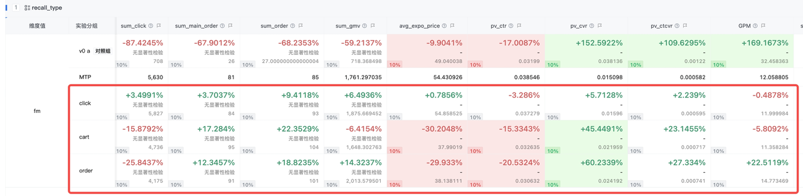

**Zero-shot FM 的本域对齐问题**：Zero-shot 部署发现该路召回的成单指标远高于基线，但曝光占比和点击率相比基线都低。排查发现从 merge 到粗排到精排通过率都比较高，但混排直接筛掉了 30% 的曝光——混排目前建模本域曝光的模式暂时无法感知全域兴趣分布。解决方案：一是增加场域特征 prompt，二是使用本域的 Pointwise 样本流新增一个训练阶段对齐本域分布。


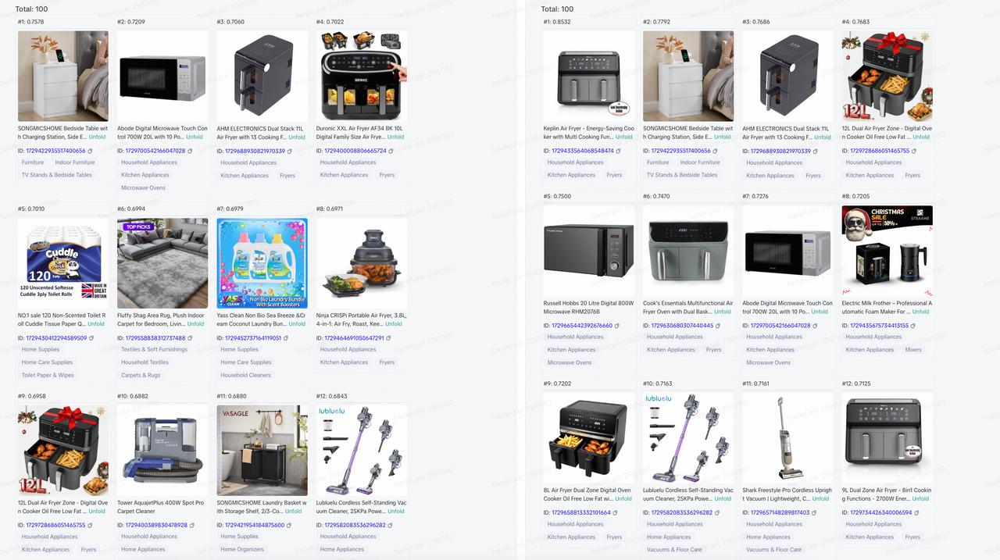

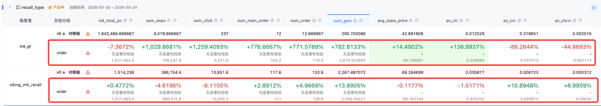

---

## 5. Recall SFT 与 Reward

当前 SFT 基于预训练模型 load 后，在 pointwise 样本下做特征对齐，引入长序列，增加召回 NTP loss 和相应的 reward。

**数据输入组织**：采用"多行为前缀 + Pointwise 解码"输入组织形式：每个样本同时包含用户的点击、加购、成单三条历史序列，分别以"一个历史行为位置"为基本单元，将商品侧特征、上下文特征和对应的 SID 输入映射到同一表示空间后，在每个位置内融合成一个行为 token（per-position fusion）。三条序列按 order → cart → click 的顺序拼接，中间插入可学习的 SEP token，形成统一的历史前缀，加入绝对位置编码让模型感知序列内的时序关系以及序列间的差异。

**Token 化与序列拼装的关键细节**：

- **Projection to d_model and per-position fusion**：将每个位置的 `item_info`、`context_info`、`sid_input` 分别通过 Projection 映射到统一维度 `d_model`，再相加融合为单个 `fused token`。
- padding 提取到左侧以减少 Pyramid 机制的损失。
- 训练范式对齐 LLM：Tokenizer → Decoder-only Transformer → NTP Loss 与主流 LLM 完全一致，为 Scaling Up 提供了天然基础。

---

## 6. Semantic ID：用 RQ-KMeans 替代 Product ID

### 6.1 为什么需要 Semantic ID

传统推荐系统直接用 Product ID（pid）作为 item 的唯一标识，在判别式框架下没有问题。但在生成式框架下，模型需要逐 token 预测 item，Product ID 的词表规模（亿级商品）直接导致参数爆炸，而且相近的 pid 之间没有任何语义关系，模型无法迁移知识。

SID 解决了三个痛点：
- **参数爆炸**：三位 8192 词表（共 $8192^3 \approx 5.5 \times 10^{11}$ 种组合）远比直接用 pid 的百亿词表参数更可控
- **语义缺失**：基于多模态特征的 RQ-KMeans 量化，语义相近的商品共享前缀 code
- **冷启动**：新商品只要有多模态特征就能分配 SID，不依赖历史交互数据

### 6.2 RQ-KMeans vs. RQ-VAE

为什么选 RQ-KMeans 而不是 RQ-VAE？

- **RQ-VAE** 训练易码本坍塌，利用率崩塌后 <10%；在 gumbel-softmax、LR、encoder 结构等一系列调优后仍无法追上 RQ-KMeans，精排 CTR AUC 相对随机 baseline 为 -0.07%
- **RQ-KMeans** 聚类过程稳定，100% 利用率，item 分布相对均匀，并行计算快；精排 CTR AUC +0.03%，下游召回/预训练指标均优

串行残差码本路线（粗→细逐层量化），与生成式推荐的逐级自回归解码天然对齐，重建误差可控、语义层次清晰。

### 6.3 生产配置

- **商品表征**：多模态大模型（dim=128），输入商品主图 + 标题 + 类目信息
- **码本规格**：三层均匀 8191×3（对比金字塔、倒金字塔和 4095×3，均匀 8191×3 的下游指标、簇纯度、I2I 召回率综合最优）
- **接入通道**：Hive Table + Universal Embedding，每日更新

### 6.4 关键优化：同款簇去重

电商爆款会让大量码字浪费在表达同款商品的噪声变化。按 SPU 同款簇 ID 对重复商品去重，ROW 样本从 2.6B 压缩到 50M–550M 高质量去重样本，孤点簇相比全量版本提升 +14%，下游精排/预训练指标同步改善。

---

## 7. 在线链路：生成式召回 Serving

生成式召回的在线链路与传统双塔召回有本质区别，主要包含四个步骤：

### 7.1 离线 SID 生产与倒排构建

- **SID 生产**：离线通过 RQ-KMeans 生产 SID，完成全量商品的 pid → SID 映射，产出到 Hive 表以及 UE 服务中
- **倒排索引构建**：基于 Hive 的 pid → SID 映射，结合推荐精品池候选以 GMV/Order 等业务指标进行加权，构建倒排索引服务

### 7.2 在线 GR 召回 Serving 流程

1. **原始特征获取**：抽取用户 profile、seq 以及 context 相关特征，以及根据 UE 服务获取 SID 相关特征
2. **基于 GPU Pilot 的用户子图 SID 生成**：不同于以往的 Viking 召回调用，生成式召回直接改用 Marine GPU Pilot 跑子图生成 SID 结果
   - 通过 Viking 请求 Marine GPU Pilot 执行 U 侧子图推理
   - U 侧子图采用**图内 Beam Search** 的方式，在 GPU 上一次性完成模型跑图与 Beam Search 解码，直接生成 Top-K SID 及 Logits
3. **SID → PID 倒排查询与结果合并**：基于生成的 SID、Logits，查询 sid → pid 倒排索引，通过 SnakeMerge 对多个 SID 命中的 PID 进行合并
4. **多路召回融合**：生成式召回（Foundation GR Recall）作为一路新增召回，与现有的 DVF、PDN 等多路召回并行执行，通过多路 SnakeMerge 进行结果融合

---

## 8. 训推优化：让 170M 模型跑得快

将 170M 的 LLM 部署到在线推荐召回是一项重大工程挑战，涉及到训练和推理的全链路优化。

### 8.1 Flash Attention

长序列场景下传统 Attention 的问题：显存占用大（直接算 QK^T 产生 length² 量级 Attention Map，batch 2048 × head 4 × length 1024 时单层约需 69GB）、访存开销大、算子调用分散。

引入 Triton 版本的 Flash Attention，把 Attention 的空间复杂度压到 $O(\text{length})$，显存不再随序列长度平方爆炸：

- 显存占用下降 **1/6 以上**
- 吞吐提升 **60% 以上**
- 支持最高 200M 参数 × 2K 上下文的训练规模

### 8.2 梯度累积

梯度累积通过将连续 N 个 step 的反向梯度在本地缓冲区累加、仅在第 N 步触发一次 AllReduce 与 optimizer step。AllReduce 触发频率降至 1/N，通信流可与后续 micro-batch 的计算流 overlap，进一步压缩 step time。本质上是在显存与卡数受限的条件下，逼近大 batch 训练的收敛特性。

### 8.3 梯度重计算（Grad Recompute）

训练时丢弃部分中间激活，反向传播需要时再前向重算一次，以额外计算换取显存：

- 空闲显存 2.7G → 29G
- 显存占用 -43%

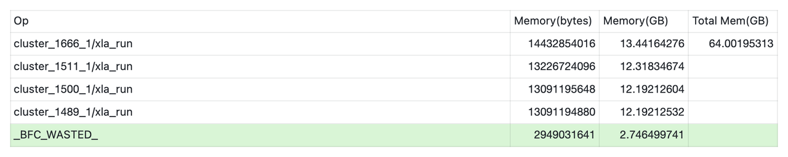

### 8.4 BF16 训练 + FP16 推理

训练基于 BF16，推理采用 FP16（部分组件暂未完全支持 BF16）。半精度推理在 A10/L40s 线上压测中 QPS 相比 FP32 + Emb Layer 基线 **+85%~+90%**。

FP16 的动态范围（最大 6.55e4）需要针对性处理：
- Dense 特征（GMV、停留时长等）可能超过 1M，统一截断到 [-1e4, 1e4]
- Attention mask 位置原本使用 -1e9，会直接溢出为 -inf，改为 -1e4 避免溢出
- Softcap 为各 block 输出提供数值安全带

### 8.5 Split KVCache 与动态 Beam Size

- **Split KVCache**：prefill 部分的 KVCache 不做 tiling，通过广播机制在图内展开，Beam Size 可以从 32 开到 512
- **动态 Beam Size**：Beam Search 三层采用不同的 beam size，平衡精度与效率

### 8.6 两阶段 TopK

先在每个 beam 内做一次 topk 截断，充分利用并行，防止原生 topk 退化为 Radix Sort。效果显著：

**latency 下的压测 QPS 从 59.8 涨到 1180**（约 20× 提升）

### 8.7 攒 batch 推理

攒 batch 进行推理，提高 SMA（显存利用率）：吞吐单机 300 → 850。

---

## 9. 实验结果

### 9.1 线上 A/B 实验

实验时长：8 个完整天；流量：16% 每组，共 32%；地区：SEA；模块覆盖 Mall | OC | CART | Trade Path | Diversion | Category Tab。

**核心业务指标**：

- 电商 GMV：人均 GMV **+0.157%**（p=0.06）
- General Mall：GMV/user **+0.3742%**，product_click_per_user **+0.3133%**，main_order_per_user **+0.4417%**，PV_CTR **+0.2403%**，UV_CTR **+0.1298%**
- Mall Feeds：人均点击卡片次数 **+0.6258%**，PV_CTR **+0.6120%**，uv 立购率 **+0.2772%**
- **Diversity 提升**：点击一级类目数 +0.5466%，支付一级类目数 **+0.7175%**
- **Cold Start 改善**：0 单商品 PV +0.2877%，0 单商品点击 **+1.2629%**
- **广告兼容**：Shop Ads Overall Advertiser Value +0.2681%，Overall Cost +0.1509%

### 9.2 ROI 与效率收益

- ROI +0.04%，增量 ROI 237
- **训练时间**：通过参数加载加速迭代，从 **49.8 天 → 12.3 天**（节省 75%）
- 通过引入 FLA、FP16 等训推优化：ROI +0.11%，增量 ROI 277

### 9.3 模型参数演进

本次上线为 0.17B 的初步版本，预期进一步 Scaling 到 0.6B → 6B 阶段，能够进一步释放更多收益。这个预期来自 Scaling Law 实验的清晰外推曲线。

---

## 10. 工程思考与总结

### 10.1 三个关键 Milestone

1. **首次走通 Foundation Model 参数加载范式**：算力最重的 Pretrain 阶段使用序列样本训练，样本利用效率较传统 pointwise 样本提升 L 倍。多阶段、多形态的输入组织充分利用 Transformer 对输入的灵活性，在不动 backbone 的前提下通过输入侧迭代持续压榨参数性能，为后续多阶段共享 FM 与 KV Cache 奠定基础。

2. **召回阶段切换为生成式范式**：端到端逐 Token 建模，有利于捕捉细粒度兴趣与语义关联；Semantic ID 显著改善模型泛化能力，同时生成式的计算框架推理复杂度解耦商品库规模，Scaling 空间更大。

3. **One Transformer 理念的完整落地**：同一套 backbone 结构在 Pretrain → Posttrain → SFT 的多个阶段中保持不变，阶段间切换仅需调整样本组织形式、loss 与优化器配置等，打通了从 Foundation Model 到各下游任务的参数迁移链路。

### 10.2 Scaling 的正确姿势

这次工作揭示了推荐系统预训练 Scaling 的三个独立杠杆：

- **多任务**：让现有参数学到更多（提高样本效率）
- **Context 信息量**：降低 Bayes ceiling，让参数有继续工作的空间
- **参数量**：给前两者提供承载容量

三个杠杆缺一不可。简单堆参数而不降低不可约熵，最终会被 Bayes ceiling 卡住；只降低熵而参数量不足，则无法承载足够的表示能力。**这是一个需要系统工程与算法协同的 Scaling 路线，而不是简单的"把参数量堆上去"**。

### 10.3 值得关注的工程细节

几个在实施过程中发现的非显而易见的要点：

1. **AdamW 超参不能直接套用 LLM 的配置**：推荐系统数据分布差异大、样本噪音高，需要从原有优化器的配置出发推导适合的超参，而不是直接用 `lr=1e-5, β₂=0.99`。

2. **Residual Rescale 是 scaling 的保险**：层数大于 6 就很容易训崩，Residual Rescale 是关键。单独做 QK Norm 不够，还需要控制残差路径的方差累积。

3. **SID 码本规格的选择有门道**：均匀 8191×3 优于金字塔结构，且码本利用率需要保持 100%——RQ-VAE 的码本坍塌问题是一个真实存在的工程陷阱。

4. **Zero-shot FM 的本域对齐问题**：Foundation Model 预训练学到的是全域兴趣分布，直接部署到特定场景时可能因场域分布偏差被混排拦截。需要增加场域 Condition Token 或额外 SFT 阶段对齐。

5. **两阶段 TopK 是生成式召回推理的关键优化**：20× 的 QPS 提升来自一个看似简单的工程改进，说明在 Beam Search 这类迭代式解码中，数据结构的选择对推理延迟有决定性影响。

### 10.4 未来展望

- **Scale-up**：从 0.17B → 0.6B → 6B，根据 Scaling Law 曲线预计能持续释放收益
- **KV Cache 共享**：Foundation Model 作为多任务的共享底座，粗排/精排加载同一套 FM 参数后，历史的 KV Cache 可以在不同阶段复用，进一步降低推理成本
- **Condition Token 扩展**：价格带、冷启动偏好、ROI 要求等都可以作为 Condition Token，实现更细粒度的可控召回
- **多模态输入**：将 PDP 主商品、店橱 SellerID 等语义更丰富的 Context 纳入序列，进一步降低用户兴趣建模的不可约熵

---

## 参考文献

1. Bitter Lesson — Rich Sutton, 2019. http://www.incompleteideas.net/IncIdeas/BitterLesson.html
2. Shazeer, N. (2020). GLU Variants Improve Transformer. arXiv:2002.05202
3. Su, J., et al. (2021). RoFormer: Enhanced Transformer with Rotary Position Embedding.
4. Ainslie, J., et al. (2023). GQA: Training Generalized Multi-Query Transformer Models from Multi-Head Checkpoints. arXiv:2305.13245
5. Dao, T., et al. (2022). FlashAttention: Fast and Memory-Efficient Exact Attention with IO-Awareness. NeurIPS 2022.
6. Loshchilov, I., & Hutter, F. (2019). Decoupled Weight Decay Regularization. ICLR 2019.
7. Zhang, B., & Sennrich, R. (2019). Root Mean Square Layer Normalization.
8. Wang, H., et al. (2022). DeepNorm: Scaling Vision Transformers to 1,000 Layers.
9. Lee, J., et al. (2019). Set Transformer: A Framework for Attention-based Permutation-Invariant Neural Networks. ICML 2019.
10. Rajput, S., et al. (2023). Recommender Systems with Generative Retrieval. NeurIPS 2023.
