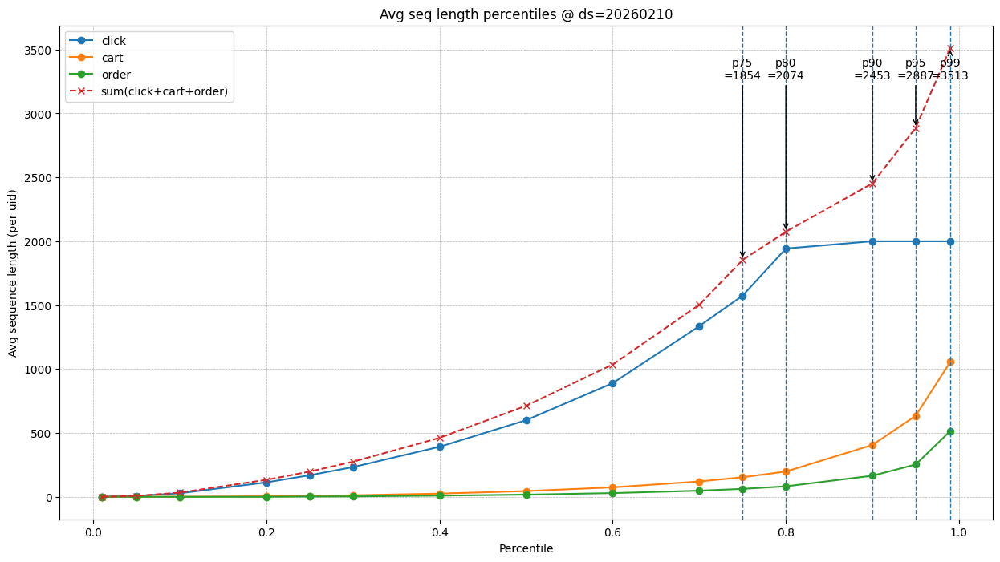
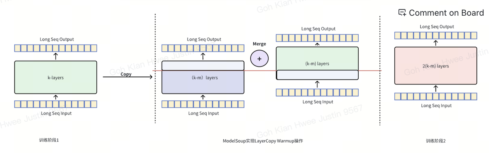
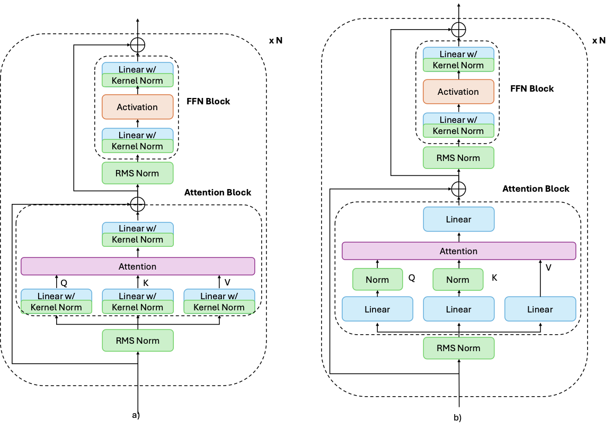
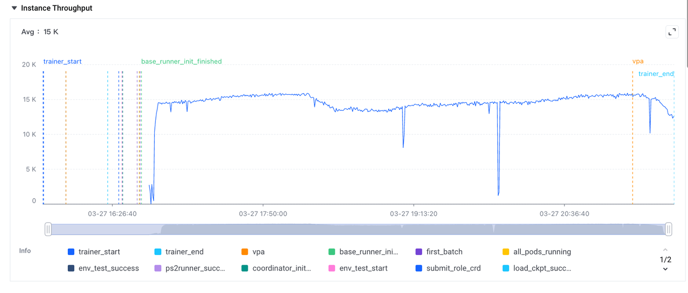
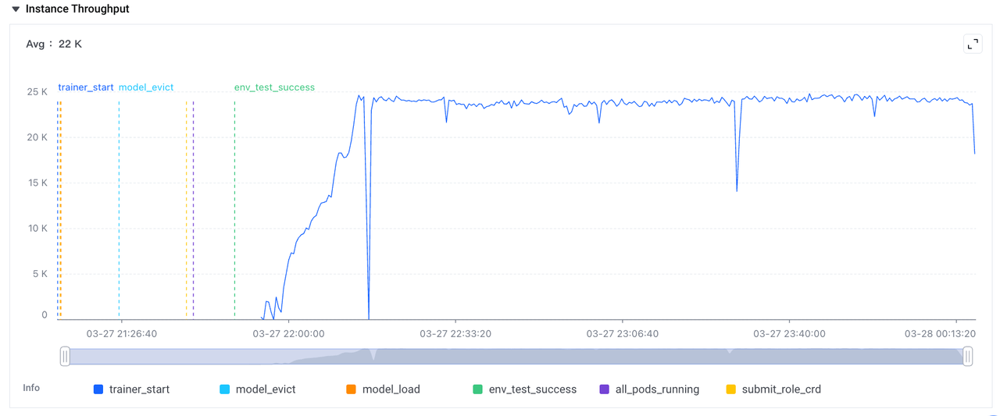
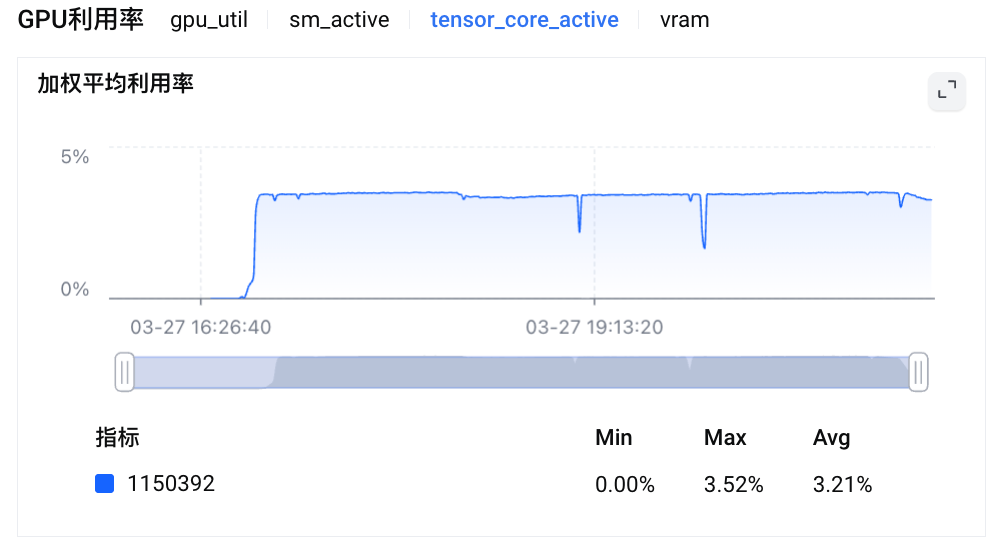
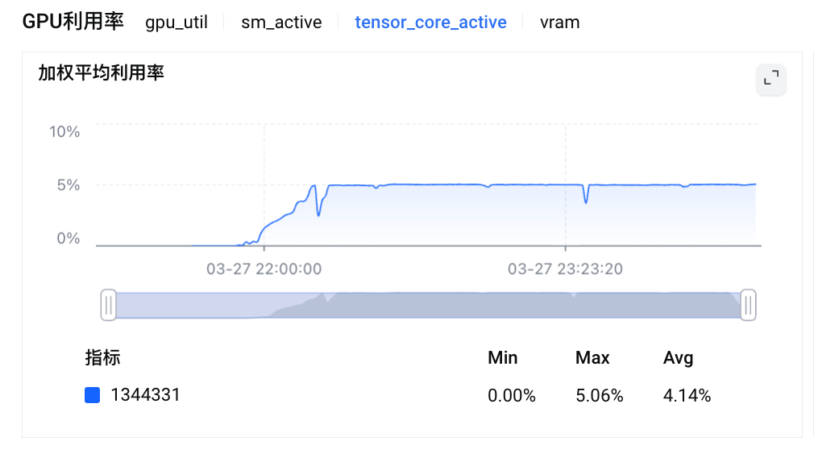
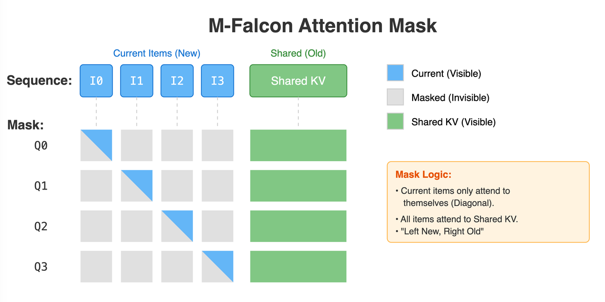

> 本文整理自某大型电商推荐系统内部技术文档，记录了精排模型从 1K 序列扩展至 2K、同时完成模型结构 Scaling Up 与训推效率双重优化的完整工程实践。核心改动四线并进：**数据与特征**（2K GR 超长序列 + Action Quota + ts_delta/price 分桶）、**训练效率**（RM Padding + Listwise Squeeze + GQA + QK Norm）、**Serving 效率**（xmatmul → M-Falcon）、**模型容量**（d_model 384→512，SeqFormer 5→7 层），最终实现线上 GMV/user **+1.02%**、main_order/user **+1.36%**，训练吞吐 **+60%**，Serving QPS **+97%**。

---

## 0. 背景：v3.0 的四条制约线

上一代模型（v3.0）将用户行为序列扩展至 1K，并在国际站完成了推全。但运行一段时间后，工程师们发现四条清晰的制约线横亘在继续迭代的路上：

**制约一：序列质量参差，信号覆盖受限**

v3.0 的序列混杂了快照序列与 GR 超长序列两个来源，均匀采样导致高频的 click/impression 行为挤占配额，长尾的 order 转化信号被稀释；1K 长度对活跃用户来说远不够，大量历史兴趣被截断；此外缺乏时间差、价格等上下文的显式建模。

**制约二：显存瓶颈，2K OOM**

训练实现层面存在两处叠加的显存浪费：padding token 参与 stage-1 self-attention 产生无效 FLOPs；同一请求的 listwise 内所有 item 序列完全相同，却被独立计算 KV，造成大量重复。叠加效果是：一旦尝试将序列从 1K 扩展至 2K，直接 OOM。

**制约三：xmatmul Serving 效率天花板**

stage-2 的 cross-attention 使用 xmatmul 实现，每个 candidate item 独立调度一次 kernel，launch overhead 高，且 kernel 粒度过小，未对齐现代 GPU 的 Tensor Core 优化窗口，成为推理 latency 的性能瓶颈。

**制约四：模型容量不足**

参数量与模型宽深度均受到前三条制约的间接限制：显存水位太高无法扩参数；Serving latency 没有余量；训练吞吐低导致迭代周期过长。只有先把效率问题解决，才有预算做结构 Scaling Up。

v3.1 的整个迭代逻辑，就是系统性地打通这四条制约线。

---

## 1. 2K 序列扩展与特征丰富

### 1.1 数据源统一：全面切换 GR 超长序列

v3.0 的序列由快照序列和 GR 超长序列拼接而成，来源不统一导致时间戳对齐与去重逻辑复杂。v3.1 统一切换为 GR 超长序列，序列长度从 1K 扩展至 **2K**，完全下线快照短序列。

**离线序列覆盖率对比（v3.0 vs v3.1）：**

| 指标 | v3.0（1K） | v3.1（2K） | 变化 |
|------|-----------|-----------|------|
| 平均有效序列长度（去 padding） | 555 | 1186 | **+113.7%** |
| order 行为平均覆盖数 | 22 | 48 | **+118.2%** |
| cart 行为平均覆盖数 | 153 | 193 | **+26.1%** |
| click 行为平均覆盖数 | 281 | 847 | **+201.4%** |
| impression 行为平均覆盖数 | 99 | 99 | — |

### 1.2 Action Quota 过滤：让 order 信号不再被淹没

均匀采样的最大问题是：高频行为（click、impression）轻松占满配额，低频但高价值的 order 被稀释。v3.1 引入按 `action_type` 的**优先级配额机制**：

序列仍按时间排序，配额机制只控制每类行为的保留上限，不改变序列内部的时序结构。具体规则：

| 行为类型 | 优先级 | Quota 上限 | 说明 |
|---------|--------|-----------|------|
| Order | 1 | 300（p95 长度） | 转化信号，最高优先 |
| Cart | 2 | 600（p95 长度） | 深度兴趣 |
| Click | 3 | 1000（p70 长度） | 主要正反馈 |
| Impression | 4 | 100（硬上限） | 负反馈/上下文，不参与回填 |
| **合计** | — | **2000** | — |

**回填机制**：若高优先级类型实际行为数不足配额，空出的位顺延给下一优先级类型（impression 除外，始终受 100 条硬上限约束，不参与扩容）。Impression 之所以严格限制，是因为离线实验发现：行为稀疏用户的 GR 序列中 impression 占比极高，若不加限制，序列几乎被无点击曝光填满，序列信噪比显著下降，模型对深度转化信号的建模能力退化。



### 1.3 上下文特征注入：ts_delta 与 price 分桶

v3.0 的序列特征缺乏对**行为时间衰减**和**价格区间偏好**的显式建模。v3.1 新增三个上下文特征（对数分桶，以离散 FID 形式注入序列）：

- `ts_delta`：相邻行为时间间隔（用户节奏感知）
- `ts_delta_to_reqtime`：行为距 request 时间的间隔（时序衰减建模）
- `price`：商品价格对数分桶（价格区间偏好）

### 1.4 Index-only 序列构建加速

序列构建流程中的去重、防穿越、配额截断三个步骤原本每步都产出完整的新序列张量（`n_features × seq_len`），三步串联意味着三次全量拷贝。

v3.1 将三步统一为 **Index-only 模式**：只维护一个有效位置的 index 数组，最终用一次 `gather` 对所有特征列统一执行。收益：减少 Rosetta 中间算子数、降低内存峰值，对 Rosetta 图的内存调度更友好。

---

## 2. 结构 Scaling Up

效率优化释放显存与算力预算后，v3.1 同步推进了模型结构的 Scaling Up，从多个维度扩充模型容量。

### 2.1 加宽：d_model 384 → 512，TruncatedNormal 初始化

**为什么直接加宽容易崩？**

在不调整初始化的前提下加宽，输出方差会近似按比例放大（384→512 约 1.33×，384→768 接近 2×），导致中间激活、残差分支整体鼓胀，把激活推入非线性饱和区，线上预估分布和校准瞬间漂移。

**解决方案：TruncatedNormal std=0.02**

实验发现，使用 TruncatedNormal 且 std=0.02 相比随机初始化方式效果更明显且训练更稳定。同时对 QKV 矩阵也采用 TruncatedNormal std=0.02 初始化：

| 改动 | CTR AUC | CTR UAUC | instance/s |
|------|---------|---------|-----------|
| 基线（384） | — | — | 52 |
| A: 512 + RandomNorm std=0.05 | +0.05% | +0.16% | 37 |
| B: 512 + TruncatedNorm std=0.02 | +0.09% | +0.21% | 37 |
| C: B + QKV TruncNorm std=0.02（**LR**） | **+0.16%** | **+0.28%** | 38 |
| D: C + dim=768 + SwiGLU clip | +0.26% | +0.37% | 24 |

最终选用方案 C（d_model=512, QKV TruncNorm），在效果与吞吐之间取得最优平衡。

### 2.2 叠层：SeqFormer 5 → 7 层，Solar Copy-and-Stack

**Solar 两阶段训练 + Copy-and-Stack**：

- **第一阶段**：用较浅较短的序列结构学习主干模式（高吞吐），以 5 层 384 dim 为基础学好主干特征
- **第二阶段**：从第一阶段 checkpoint 出发，通过 copy-and-stack 把已有层复制堆叠到 7 层（层映射如 `0→1→2→3→2→3→4`），恢复长序列与深层结构继续训练

这一策略同时获得两类增益：参数量增加带来的容量增益 + 嵌套深度增加带来的推理/组合能力增益。



**Looped Layer 对照实验**：为了分解"参数量"与"嵌套深度"两个因素的贡献，同时做了 Looped Layer 实验——复用同一 block 的参数（`0 1 2 3 4` → `0 1 2 2 3 3 4`，权重完全共享，只涨嵌套深度）。与 Solar 对比，可以探索精排模型叠层收益的本质来源。

### 2.3 GQA：8Q/2KV，KV 显存降低 4×

MHA 下每个 query head 独立维护一套 KV，KV 显存随 head 数线性增长，在 d_model=512 这种宽模型上带宽压力进一步放大。切换为 GQA（8 query head 共享 2 KV head），KV 显存降低约 4×。

关键实验发现：**早期训练窗口 GQA 有负向波动，充分收敛后反而超过基线**。

| 配置 | 早期 AUC（0601-0630） | 充分收敛 AUC（1001-1031） | 吞吐提升 |
|------|---------------------|------------------------|---------|
| 512, 8Q/8KV | 基线 | 基线 | 35k/s |
| 512, 8Q/4KV | -0.10 | -0.05 | **+8.57%** (39k/s) |
| 512, 8Q/2KV | -0.09 | **+0.04** | **+20%** (43k/s) |

这一现象说明：GQA 的负向是训练不充分的假象，在收敛充分的前提下，2 KV-Head 配置能在质量不跌甚至小幅提升的情况下提供显著的吞吐和带宽收益。


### 2.4 QK Norm：替换 Kernel Norm，稳定深层 Attention

v3.0 使用 Kernel Norm 稳定训练，但实验发现 Kernel Norm 对模型权重约束过强，影响训练效果，且增加了不必要的计算量。v3.1 参考主流 LLM 的做法，引入 **QK Norm** 替换 Attention 模块中的 Kernel Norm：

在计算完 $Q = XW_Q$、$K = XW_K$ 后，对 Q 和 K 分别做一次 RMSNorm 归一化，归一化后的 Q、K 再参与 Attention 计算。同时去掉了 QKVO 矩阵对应的 Kernel Norm 及其 bias。

**离线效果：CTR UAUC +0.08%**



### 2.5 Fid 统一 Slice：消除特征与序列的 Embedding 割裂

历史上因为模型是热启的，总是通过加 slice 的方式扩维度，造成同一 slot 上往往有多段 slices，特征和序列对同一特征值分别训练两段不同的 embedding。

这一设计的问题是：Transformer Attention 需要费力学习这两段 embedding 之间的联系，严重阻碍模型对 Target & Seq 之间关系的捕获。

v3.1 对代码进行重构，让**特征和序列复用同一段 slice**，多段 slice 合并为一段（维度向下取整到 32 的倍数保证计算效率）。

**离线收益：CTR AUC +0.1%，CTR UAUC +0.2%**

---

## 3. 训练效率优化

### 3.1 RM Padding：Ragged Sequence 消除 Padding FLOPs

**问题根因**：训练时所有序列被 padding 至固定长度（2K），padding token 全程参与 stage-1 的 attention 及 FFN 计算。以最长的 Click 序列为例，均值约 1200，意味着约 **40% 的计算资源消耗在 padding 上**。

**方案**：启用 RM Padding（`use_rmpadding=True`），将 padded 序列转为 **ragged 表示**，attention 与 FFN 计算仅在有效 token 上进行，实际开销随 avg_len 线性缩放，输出与 padded 路径数值等价。

**主要技术工作**：

**① Ragged 算子开发**

模型包含 pertoken 处理逻辑，需要在 ragged 状态下对变长序列进行切割与合并。为此开发了一套基于 Ragged Tensor 的 CUDA 算子：
- `ragged_split`：按 split pos 对变长序列进行头部/尾部切割
- `ragged_merge`：将处理后的变长序列重新拼接
- `ragged_truncate`：按样本动态截断

**② 模型 Transformer 逻辑重构**

引入 RM Padding 后，XLA 因 Tensor 变长而失效，原有融合 Kernel 被打散。重新设计了 Ragged Tensor 状态管理流程，在进入 Transformer 之前即执行 RM Padding，后续所有层不再执行 padding 操作，实现全链路 RM Padding。

**③ NaN 梯度修复**

集成 Triton 融合算子（`fused_swiglu`、`fused_matmul`）后，训练中出现 NaN。排查定位到边界场景：当 batch 中某些样本的 ragged 序列长度为 0 时，融合算子的 bias 梯度计算会将未初始化显存值赋给梯度。通过在 CUDA Kernel 中对空输入场景增加 `cudaMemset` 显式初始化为 0 解决。

### 3.2 RMSNorm 融合算子：补齐反向算子缺失

RM Padding 后 XLA 自动融合失效，原本被融合的 RMSNorm、FFN element-wise 算子被展开为多个独立 Kernel，出现性能回退。此外公司内部此前仅有 RMSNorm 的前向算子，缺少反向算子，无法支持训练场景。

v3.1 使用 CUDA 开发了 RMSNorm 融合算子（含前向与反向），采用以下优化技术：

- **向量化访存**：利用 Pack 技术（`float4`、`half2`），每线程一次读取多元素，提升显存带宽利用率
- **编译时多态**：通过 `DISPATCH_BOOL` 宏将 `HasResidual`、`HasGamma` 等运行时判断转化为编译时模板参数，消除 Kernel 内的分支指令
- **寄存器缓存 + One-Pass**：前向计算将输入暂存至寄存器，在计算完 Variance 后直接从寄存器读取进行归一化，IO 访问量减少 50%
- **两阶段梯度归约**：针对 `grad_gamma`，采用 Block 局部归约 → Workspace → Global 归约的两阶段策略，避免 Batch Size 较大时 `atomicAdd` 的性能衰退

### 3.3 RM Padding + RMSNorm 融合的训练收益

| 指标 | 优化前 | 优化后 | 变化 |
|------|--------|--------|------|
| Instance Throughput | 15K/s | 24K/s | **+60%** |
| SM Activity | 79% | 75% | -5%（减少无效 FLOPs，SM 使用更精准） |
| Tensor Core Active | 3.52% | 5.06% | **+43.8%** |









### 3.4 Listwise Squeeze：消除 per-item KV 重复

v3.0 的 stage-1 对 listwise 内每个 item 独立构建 KV，而同一请求内所有 item 共享相同的用户序列，造成大量重复计算与显存占用。

v3.1 引入 **Listwise Squeeze**：在 stage-1 先将序列在 user 维度折叠（去除 item 维重复），计算完成后在 stage-2 通过 `kv_cache_repeats` 展开还原给每个 item，显存占用与 batch 内 item 数解耦。

### 3.5 GQA Triton FlashAttention 反向改造

已有的 lego 版本在 GQA 的反向逻辑上存在不适配的 bug（特判 MLU 逻辑误生效）。修复方式是在图内重写正确的梯度反传逻辑，核心是处理多头 GQA 的 dk/dv 归约：

```python
def _flash_attention_fwd_varlen_grad(self, op, *grad):
    dq, dk, dv = lego_ops.flash_attention_bwd_varlen(...)
    head_group = q_head // kv_head

    def reduce_fn():
        new_dk = tf.reduce_sum(
            tf.reshape(dk, [k_len, kv_head, head_group, qk_dim]), axis=2)
        new_dv = tf.reduce_sum(
            tf.reshape(dv, [k_len, kv_head, head_group, v_dim]), axis=2)
        return new_dk, new_dv

    dk, dv = tf.cond(head_group > 1, reduce_fn, no_reduce_fn)
    return (dq, dk, dv) + (None,) * 6
```

当 `head_group > 1`（即 Q-head > KV-head）时，对 dk/dv 在 head_group 维度做 reduce_sum，将梯度正确归约到 KV head 数量。

---

## 4. Serving 效率优化：M-Falcon

### 4.1 原始方案的瓶颈：xmatmul 的碎片化调度

stage-2 cross-attention 原先使用 xmatmul 实现：每个 candidate item 独立调度一次 kernel，中间结果写回 GPU global memory，无法使用 FlashAttention 的 IO 融合优化。在序列较长时，这种碎片化调度模式成为推理 latency 的主要瓶颈。

问题的症结在于：每个 item 的 attention 计算规模太小（单个 item query × 2K user sequence），无法充分填满 GPU 的 Tensor Core；而 kernel launch overhead 在高并发的推荐场景下显著累积。

### 4.2 M-Falcon：拍平合并，单次 FlashAttention

**核心思路**：将所有 item 的 query token 拍平成一个序列，与用户序列 KV Cache 拼接，batchsize 变为 1（per user）。加上特殊的 Mask 控制可见性，整体送入 FlashAttention 做一次 kernel 计算。中间结果不再落回 global memory，降低 IO 开销。



**三个关键设计**：

**① 上三角 Attention Mask 保证等价性**

将多个 item 拍平到同一序列后，通过上三角矩阵 Mask（`q_offset <= k_offset`）确保：
- 每个 item query 能 attend 到完整用户历史序列
- item 之间不互相 attend，避免信息泄露

计算结果与原始逐 item 独立计算完全数值等价。

**② Unpad Merge 拼接**

将拍平后的 item query KV 与用户历史 KV 通过 `unpad_merge` 操作拼接，构造统一的 `cu_seqlens`，交给 FlashAttention（`mask_fn=3`）单次 kernel 完成计算。

**③ 等价替换，无需重训**

M-Falcon 前向结果与原始实现数值一致，可在不修改模型权重的前提下直接替换，零迁移成本。

### 4.3 Serving 综合收益

RM Padding + M-Falcon 双优化上线后：

| 指标 | 优化前 | 优化后 | 提升 |
|------|--------|--------|------|
| Service QPS | ~271 req/s | ~534 req/s | **+97%** |
| SM Active | 55.5% | 62.0% | +6.5pp |
| SM Tensor Active | ~6.1% | ~7.3% | **+~20%** |

**QPS 近乎翻倍**，是本次效率优化最直观的线上收益。

---

## 5. Torch Rebase：跨框架迁移的工程实践

v3.1 同步完成了从 TensorFlow 到 PyTorch 的框架迁移（Torch Rebase），并完成**离在线打平**，作为后续迭代的 Torch 基线。

**离在线打平的挑战**：框架切换不仅是代码翻译，还涉及数值精度、算子实现差异、分布式训练行为等多个层面的对齐。团队整理了 step-by-step 的迁移操作手册，并开发了自动迁移对比工具，系统性地验证离线指标（AUC、UAUC）和在线指标的打平。

**Serving 打平**：针对 Serving 框架差异，完成了 Marine GPU Pilot 的 Torch 模型接入，确保推理路径与 TensorFlow 版本数值一致。

---

## 6. 模型工程参数演进

| 参数 | v3.0 | v3.1 | 变化 |
|------|------|------|------|
| NN Params | 165M | 396M | **+140%** |
| d_model | 384 | 512 | +33% |
| SeqFormer 层数 | 5 | 7 | +40% |
| 序列长度 | 1K | 2K | +100% |
| KV Heads | 8 | 2 | -75%（GQA 节省显存） |
| Training instance/s | 48K | 25K | -47%（更大模型 + 更长序列） |
| GPU SMA | 82 | 80 | -2pp |
| Tensor Core Active | 9.9% | 5.1% | -4.8pp（序列扩展后 kernel 变小） |

注：训练吞吐下降是序列 2× + 模型 2.4× 参数量带来的必然代价，通过 RM Padding 和 Listwise Squeeze 部分对冲（原始方案会更低）。

---

## 7. 线上 A/B 实验结果

**实验配置**：12 完整天，每组 40% 流量，共 80%；核心模块覆盖 Mall | OC | CART | Trade Path | Diversion | Category Tab。

### 7.1 核心业务指标

**泛商城（General Mall）：**

| 指标 | 变化 |
|------|------|
| GMV/user | **+1.0175%** |
| uv_ctcvr | **+0.4986%** |
| main_order/user | **+1.3642%** |
| sub_order/user | **+1.9207%** |
| click/user | **+1.277%** |
| uv_ctr | +0.2817% |

**Mall Feeds：**

| 指标 | 变化 |
|------|------|
| GMV/user | +0.5894% |
| click/user | **+1.4431%** |
| uv_ctr | +0.2607% |

**大盘：** 人均支付成功 sku 单数（剔除异常单）**+0.4715%**

### 7.2 多维度收益

- **多样性**：曝光四级类目数 **+1.094%**，点击四级类目数 **+1.423%**
- **发现性**：发现性流量 PV 占比 **+0.641%**，人均发现性点击四级类目宽度 **+1.878%**
- **冷启动**：0 单商品点击 PV 人均 **+1.337%**
- **首购**：当日首购类目 **+1.126%**

### 7.3 ROI

- ROI **+0.24%**
- 综合（引入 FP16 等训推优化后）ROI **+0.11%**，增量 ROI 277

---

## 8. 工程思考与经验总结

### 8.1 效率优化是 Scaling 的先决条件

v3.1 的四条主线并非独立并行，而是有明确的因果依赖：**先解决训练/Serving 效率问题，才有预算做结构 Scaling Up**。RM Padding 和 Listwise Squeeze 释放的显存与算力预算，直接使能了 d_model=512、SeqFormer 7 层的扩展；M-Falcon 的 QPS 翻倍则为更大模型的 Serving 成本提供了缓冲。

这说明在工业推荐场景下，模型 Scaling 不是单纯的参数堆叠，而是**效率-容量的协同优化**：每一轮效率提升都打开了新的容量空间，而容量提升带来的效果增益反过来验证了效率投入的价值。

### 8.2 GQA 的收益需要充分收敛才能显现

GQA 早期训练窗口的负向波动是一个值得注意的现象：在训练 0601-0630 阶段，8Q/2KV 配置 AUC 下降 -0.09，而到 1001-1031 阶段反转为 +0.04。**贸然用早期 checkpoint 评判 GQA 的效果，会得出错误结论。**

这一现象的底层逻辑：GQA 通过参数共享降低了 KV 的表达冗余，模型需要更多步数才能在降低的 KV 容量下学到足够的用户序列模式。早期表现弱不是模型的极限，而是还没充分收敛。

### 8.3 TruncatedNormal 初始化是加宽的稳定器

直接从 384 加宽到 512/768 而不调整初始化，会导致输出方差随宽度比例放大，激活饱和，训练不稳。TruncatedNormal std=0.02 的选择并不神秘——它的本质是让每层输出的方差尺度与宽度无关（通过更小的 std 对抗 fan-in 增大带来的方差膨胀）。实践中 std=0.02 是一个经验上相对保守、稳定性好的选择。

### 8.4 Fid 统一 Slice 的收益来自信息流通

同一个 slot 的特征和序列用不同 slice 的问题，本质是人为制造了 embedding 空间的割裂。Transformer 的 self-attention 本来可以直接捕获 Target item 和序列 item 在同一特征维度上的相似性，但两段独立 embedding 使得"同一个特征值"在特征侧和序列侧有两套不同的表示，Attention 需要额外的参数容量来学习这两套表示之间的对应关系。统一 Slice 相当于给模型做了"对齐初始化"，消除了这层多余的学习负担。

### 8.5 未来方向

- **序列进一步扩展**：2K → 4K 甚至更长，需要更激进的效率优化（稀疏 Attention、进一步压缩 KV）
- **M-Falcon 泛化**：将拍平合并策略推广到更多 cross-attention 场景
- **模型 Scaling 继续**：d_model=512 → 768/1024，SeqFormer 7 → 9/12 层
- **Foundation Model 范式迁移**：将 Pretrain → Posttrain → SFT 的多阶段训练范式引入精排，复用召回层的 Foundation Model 权重

---

## 参考文献

1. Ainslie, J., et al. (2023). GQA: Training Generalized Multi-Query Transformer Models from Multi-Head Checkpoints. arXiv:2305.13245
2. Dao, T., et al. (2022). FlashAttention: Fast and Memory-Efficient Exact Attention with IO-Awareness. NeurIPS 2022.
3. Dao, T., et al. (2023). FlashAttention-2: Faster Attention with Better Parallelism and Work Partitioning. ICLR 2024.
4. Zhang, B., & Sennrich, R. (2019). Root Mean Square Layer Normalization. NeurIPS 2019.
5. Press, O., et al. (2024). SOLAR 10.7B: Scaling Large Language Models with Simple yet Effective Depth Up-Scaling. arXiv:2312.15166
6. Shazeer, N. (2020). GLU Variants Improve Transformer. arXiv:2002.05202
7. Zhai, S., et al. (2023). Scaling Vision Transformers to 22 Billion Parameters. ICML 2023.
