> DeepSeek-V4 系列（V4-Pro 1.6T 参数 / V4-Flash 284B 参数）将原生上下文窗口扩展至 **1M token**，同时在模型架构、优化器、工程基础设施、预训练和后训练五个维度做了系统性革新。本文基于 DeepSeek V4 技术报告，对五大维度逐一进行深度解读，尤其聚焦于 mHC 流形约束超连接、CSA/HCA 混合注意力和 Muon 优化器三大架构创新的数学原理与工程实现。

---

## 0. 导言：为什么 V4 值得深读

### 0.1 一个被反复绕开的问题

过去两年，大语言模型领域出现了两条平行但关联的趋势：

**第一条线：reasoning 模型的崛起。** 从 OpenAI o1 到 DeepSeek R1，业界逐渐发现——让模型在答题之前多想几步（chain-of-thought、extended thinking），性能会系统性地上升。这种"测试时扩展"（test-time scaling）的范式开始成为主流。但"多想几步"的代价是什么？上下文里塞满了 thinking trace，一道复杂的数学题可能产生数千甚至数万 token 的推理链。

**第二条线：Agent 的工程落地。** 让模型自己写代码、读文档、执行工具调用、完成多轮复杂任务——这是 AI Agent 的图景。但每一个 Agent step 都要把"过去所有的上下文"带着走，随着任务轮次增加，上下文长度成指数级膨胀。

这两条趋势背后有同一个物理约束：**vanilla attention 的二次方复杂度**。当序列长度从 32K 增长到 1M，计算量增长约 1000 倍，KV cache 显存增长约 32 倍。这道墙既拦住了 reasoning 模型（thinking trace 太长），也拦住了 Agent（上下文累积太重）。

DeepSeek V4 就是对这个问题正面回答的一次系统性尝试。它不是靠一个单一的"银弹"创新来破局，而是在架构、优化器、工程基础设施、预训练、后训练五个维度同时推进，构建了一个完整的长上下文解决方案。

### 0.2 V4 核心创新一览

| 维度 | 创新点 | 核心贡献 |
|------|--------|---------|
| **架构** | mHC（流形约束超连接） | 残差连接的第三次进化，稳定梯度 + 扩宽信息流 |
| **架构** | Hybrid Attention (CSA+HCA) | 压缩+稀疏组合，O(T²) → O(T·k/m) |
| **优化器** | Muon | 正交化梯度更新，比 Adam 更适合宽维度矩阵 |
| **工程** | EP 通信-计算重叠 | mega-kernel 波次调度，1.92× 通信加速 |
| **工程** | FP4 量化感知训练 | MoE 权重 + CSA 索引器 QK 量化，显存减半 |
| **工程** | Contextual Parallelism | 1M 上下文跨 GPU 切片，线性扩展 |
| **预训练** | 长上下文渐进扩展 | 4K→64K→1M 三阶段上下文调度 |
| **后训练** | Specialist Training + OPD | 先分领域专家，再 on-policy 蒸馏为统一模型 |
| **后训练** | Generative Reward Model (GRM) | 模型自身充当 reward model，免除大量人工标注 |

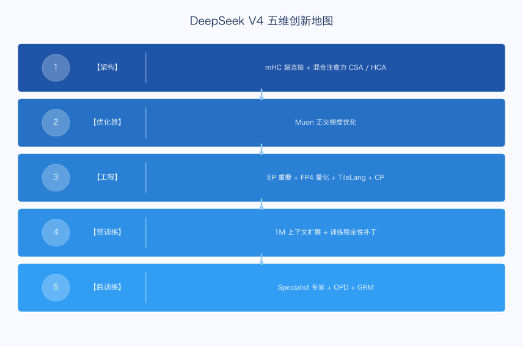

### 0.3 两个模型规格

| | **V4-Pro** | **V4-Flash** |
|--|-----------|-------------|
| 总参数量 | 1.6T | 284B |
| 激活参数量 | 49B | 13B |
| 原生上下文 | 1M token | 1M token |
| MoE Expert 数量 | 256 | 64 |
| 每 token 激活 Expert 数 | 6 | 4 |
| 主要定位 | 旗舰，最强能力 | 轻量，高效部署 |

两者架构相同，规格不同，共享同一套后训练流程。本文若无特殊说明，技术细节均以 V4-Pro 为参考。

### 0.4 阅读路线图

- **只关心架构**：重点看第 3、4、5 节
- **只关心工程**：重点看第 6 节
- **只关心训练流程**：重点看第 7、8 节
- **想全面了解**：顺序阅读，附录 A 补充 Attention 背景知识

---

## 1. 背景与动机

### 1.1 Vanilla Attention 的二次方诅咒

标准 attention 的计算公式：

$$\text{output}_t = \sum_{s \leq t} \alpha_{t,s} v_s, \quad \alpha_{t,s} = \frac{\exp(q_t^\top k_s / \sqrt{d})}{\sum_{j} \exp(q_t^\top k_j / \sqrt{d})}$$

这个公式有两个让长上下文崩溃的瓶颈：

1. **计算复杂度 $O(T^2)$**：每个新 token 要和所有历史 token 算 attention score。$T=1\text{M}$ 时，这是约 $10^{12}$ 量级的浮点操作。
2. **KV cache 存储 $O(T \cdot L \cdot d)$**：推理时每一层都要保存所有历史 token 的 K 和 V。对于 1M token、49B 激活参数的模型，仅 KV cache 就需要数十 GB 显存。

这两个约束的乘积效应是毁灭性的：计算成本二次增长，存储成本线性增长，两者叠加让百万级 token 推理在传统架构下几乎不可行。

### 1.2 解法空间：三条路线

面对这个问题，学界已有三大方向（详见附录 A）：

- **稀疏化（Sparse Attention）**：只让每个 token 关注部分历史，把 $O(T^2)$ 降到 $O(T \cdot k)$，但有信息损失风险
- **线性化（Linear Attention）**：把历史压缩进固定大小的状态槽，计算 $O(T)$，但表达能力有损
- **压缩（Compressed Attention）**：把多个 token 的 KV "折叠"成一个，降低有效序列长度

DeepSeek V4 选择的是**压缩 + 稀疏的组合路线**：

- **CSA（Compressed Sparse Attention）**：先 4:1 压缩 KV，再用闪电索引器做 top-k 稀疏选择
- **HCA（Heavily Compressed Attention）**：更激进的压缩（32:1+），适合需要粗粒度背景感知的层

### 1.3 不只是 Attention 的问题

但仅仅改 Attention 机制是不够的。要真正支撑 1M token 的大规模训练和部署，还需要解决：

- **残差连接瓶颈**：深层网络的梯度传播稳定性
- **优化器效率**：万亿参数规模下的收敛速度和参数更新质量
- **通信瓶颈**：MoE 的 Expert 路由需要大量 all-to-all 通信
- **精度与存储权衡**：万亿参数 + 百万上下文 = 巨大的显存压力
- **后训练对齐**：如何让模型既有超长上下文处理能力，又有强大的推理和遵从能力

这就是为什么 V4 是一个"五维系统工程"，而不只是一篇 attention paper。

---

## 2. 架构创新一：mHC 流形约束超连接

残差连接（Residual Connection）是现代深度网络的基石，从 ResNet（2015）到今天所有主流 Transformer，它几乎是标配。DeepSeek V4 引入的 **mHC（Manifold-Constrained Hyper-Connections）**，是对残差连接的第三次系统性进化。

要理解 mHC，需要先理解这条演化史的每一步。

### 2.1 阶段一：RC（Residual Connection，2015）——信息加法时代

**论文**：He et al., "Deep Residual Learning for Image Recognition", arXiv:1512.03385

ResNet 提出的更新规则看似简单：

$$h_l = h_{l-1} + f_{l-1}(h_{l-1})$$

这个公式有两个核心贡献：

**梯度高速公路**：对 $h_l$ 求导时，永远保留一个恒等项 $I$：

$$\frac{\partial h_l}{\partial h_{l-1}} = I + \frac{\partial f_{l-1}}{\partial h_{l-1}}$$

这意味着梯度可以无损地传到任意深的层，彻底解决了 vanishing gradient 问题，使得训练几百层的网络成为可能。

**残差学习**：每一层只需学"在已有表征上做修正"，而不是从零重建表征。这让优化目标更容易，收敛更快。

将递推式展开，会发现一个有趣的事实：

$$h_l = h_0 + \sum_{i=0}^{l-1} f_i(h_i)$$

**第 $l$ 层接收到的，是所有前面层输出的等权求和**。注意这里的"等权"：每一层的贡献在求和时权重完全相同，没有任何差异化。

这正是 RC 最大的局限：**信息聚合方式是固定的、统一权重的、与输入无关的**。不管当前任务需要更依赖底层的局部特征还是高层的语义特征，RC 总是把所有层等权加在一起。

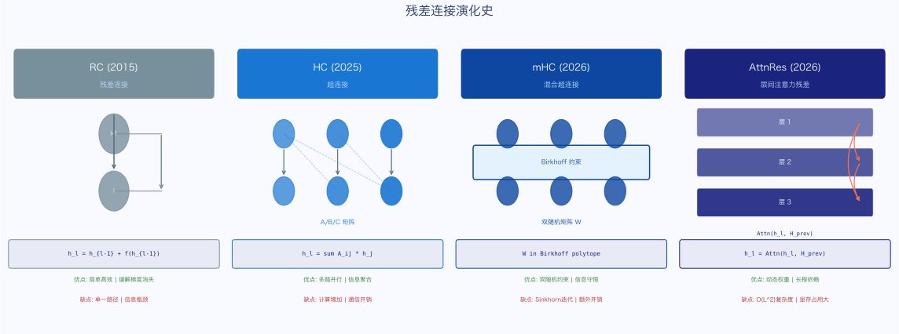

### 2.2 阶段二：HC（Hyper-Connections，Zhu et al., 2025）——多车道时代

**论文**：Zhu et al., "Hyper-Connections", arXiv:2409.19606

如果 RC 是"一条主干道"，HC 就是"把主干道扩成 $n_{hc}$ 条平行车道"，并允许每一层在车道之间灵活地读、写、混合：

$$X_{l+1} = B_l X_l + C_l F_l(A_l X_l)$$

其中 $X_l \in \mathbb{R}^{n_{hc} \times d}$ 是加宽后的残差流（$n_{hc}$ 条车道），三个矩阵分工明确：

| 矩阵 | 形状 | 功能 |
|------|------|------|
| $A_l$ | $1 \times n_{hc}$ | 输入映射：从 $n_{hc}$ 条车道里"读"出层 $F_l$ 的输入 |
| $B_l$ | $n_{hc} \times n_{hc}$ | 残差变换：决定旧车道怎么重组 |
| $C_l$ | $n_{hc} \times 1$ | 输出映射：决定层输出怎么"写"回各车道 |

与 RC 的差异：RC 强迫每层"读所有 + 写所有"；HC 让每层可以"挑着读、挑着写"。某些车道专门保存底层信息不被覆盖，某些车道承载高层语义反复更新。这给了模型一个**正交于"加深/加宽"的新缩放维度**。

**但 HC 有一个严重的稳定性问题**。

如果暂时忽略 $F$ 那一项，连续堆 $L$ 层就是：

$$X_L = B_{L-1} B_{L-2} \cdots B_1 X_1$$

这是一个**矩阵连乘**。如果每个 $B_l$ 的最大奇异值哪怕只略大于 1（比如 1.05），堆 100 层就是 $1.05^{100} \approx 131$，信号被放大 130 倍——梯度爆炸。反过来，如果略小于 1，深层就指数萎缩——梯度消失。

HC 的这个问题限制了它在超深网络（比如数百层的 LLM）中的应用。

### 2.3 阶段三：mHC（Manifold-Constrained HC，Xie et al., 2026）——加约束的多车道

**论文**：Xie et al., "Manifold-Constrained Hyper-Connections", arXiv:2512.24880

mHC 的解法非常"几何化"：**直接把 $B_l$ 约束到双随机矩阵集合**（Birkhoff polytope）上：

$$\mathcal{M} = \{M : M\mathbf{1} = \mathbf{1},\ \mathbf{1}^T M = \mathbf{1}^T,\ M \geq 0\}$$

双随机矩阵的关键性质：

1. **行和 = 1，列和 = 1**（概率矩阵的广义）
2. **所有奇异值 $\leq 1$**（由 Birkhoff 定理保证）
3. **双随机矩阵的乘积仍然是双随机矩阵**（奇异值约束对连乘封闭）

这正是 HC 梯度爆炸问题的根治方案：不仅让 $B_l$ 的奇异值 $\leq 1$，还保证**连乘后仍然 $\leq 1$**，因为双随机矩阵对乘法封闭。

#### 2.3.1 Sinkhorn-Knopp 投影算法

如何在训练中维持 $B_l \in \mathcal{M}$？用 **Sinkhorn-Knopp 算法**：

**步骤一：保正性**。先把原始线性层输出 $\tilde{B}_l$ 取指数：

$$M^{(0)} = \exp(\tilde{B}_l)$$

这保证所有元素 $> 0$（满足约束 $M \geq 0$）。

**步骤二：交替归一化**。反复做行归一化和列归一化：

$$M^{(t)} = T_r(T_c(M^{(t-1)}))$$

- $T_c$：把每列除以列和（让列和 = 1）
- $T_r$：把每行除以行和（让行和 = 1）

**步骤三：迭代 20 次**。理论上 Sinkhorn-Knopp 需要无穷次才严格收敛，但实践中 20 次就足够接近双随机矩阵。

在前向计算时，每一层都要先做这个 20 次迭代，然后用结果 $B_l$ 去乘残差流。

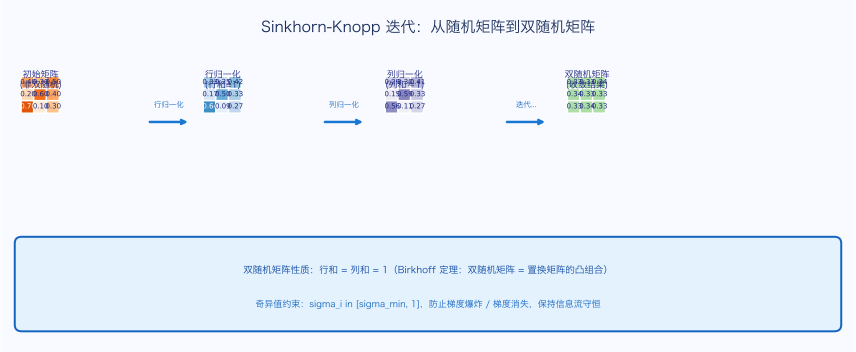

#### 2.3.2 A 和 C 的约束设计

$B_l$ 用双随机矩阵约束（强约束），而 $A_l$ 和 $C_l$ 则用 Sigmoid 进行软约束：

$$A_l = \sigma(\tilde{A}_l) \in (0, 1), \quad C_l = 2\sigma(\tilde{C}_l) \in (0, 2)$$

**为什么要非负？**

假设 $F_l$ 学到了一个"有用的更新方向" $v$（让某个特征激活更强）。如果 $C_l$ 取负值，那么 $C_l F_l(\cdot) = -|C_l| v$，本来想加进去的有用信息**被反向抵消掉了**。

更糟的是，模型可能学着"互相抵消"：上一层精心算出 $v$，下一层用负的 $C$ 把它减掉，再下一层又用正的 $C$ 加回来……这种死循环式的抵消让训练浪费算力，loss 看起来在动，但实际上没真正学到东西。非负约束直接堵死这条歧路：**只能加，不能减**。

**为什么要有界？**

$A$ 是"读"：从加宽的残差流中提取信息喂给 $F$。读取量 $\leq 1$ 是合理的，车道里的信息有限，不应该被过度放大后再输入。

$C$ 是"写"：把 $F$ 的输出写回残差流。范围 $(0, 2)$ 给了模型一点空间——层信息可能确实需要被"强调地"写入残差流，但不能无限放大。

**为什么 $A/C$ 不用双随机约束？**

因为 $A$ 和 $C$ 在每一层只**作用一次**（不会跨层累积），所以不会有矩阵连乘导致的指数放大问题。Sigmoid 这种软约束已经足够，不需要像 $B$ 那样的强约束。

#### 2.3.3 工程开销

mHC 的全部额外开销（Sinkhorn 迭代 + 加宽残差流）被控制在 **6.7% wall-clock 时间**以内。相比残差连接改进带来的性能收益，这是非常划算的代价。

从论文图中可以看到 mHC 的完整示意：

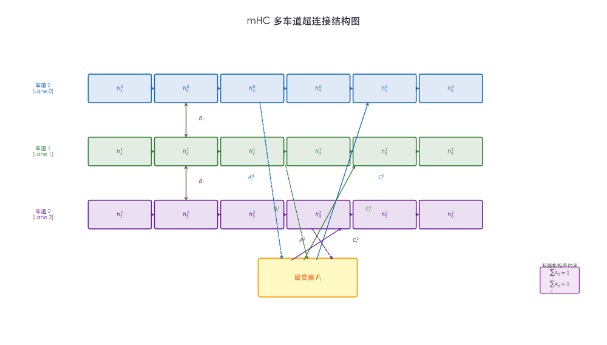

### 2.4 阶段四（分叉路口）：AttnRes（Kimi，2026）——把残差换成注意力

**论文**：Kimi Team, "AttnRes: Attention as Residual", arXiv:2603.15031

AttnRes 走了一条更激进的路：**不扩残差宽度，直接把"沿深度方向的等权求和"替换成"沿深度方向的注意力"**。

#### 2.4.1 从 HC 公式推导出层间 Attention

从 HC 的公式出发：

$$X_l = B_l X_{l-1} + C_l y_l, \quad y_l = F_l(A_l X_{l-1})$$

将递推完全展开（从 $X_l$ 一直往回代到 $X_0$，约定 $X_0 = C_0 y_0$）：

$$X_l = \sum_{s=0}^{l} B_{l \leftarrow s+1} C_s \cdot y_s$$

其中 **累积矩阵乘积** 定义为：

$$B_{l \leftarrow s} := B_l B_{l-1} \cdots B_{s+1} B_s, \quad B_{l \leftarrow l+1} = I$$

这个展开式说明：第 $l$ 层的残差流是**所有历史层输出 $y_s$ 的加权和**，权重 $B_{l \leftarrow s+1} C_s$ 由矩阵连乘决定。

**第 $l+1$ 层的 $F_{l+1}$ 看到的输入是**：

$$y_{l+1} = F_{l+1}(A_{l+1} X_l) = F_{l+1}\left(\sum_{s=0}^{l} A_{l+1} B_{l \leftarrow s+1} C_s \cdot y_s\right)$$

定义 **层间注意力权重**：

$$a_{l+1, s} = A_{l+1} \cdot \underbrace{B_l B_{l-1} \cdots B_{s+1}}_{\text{若干 B 的连乘}} \cdot C_s$$

这就是 AttnRes 的核心洞察：**HC 的展开式本质上是层间注意力的雏形**，其中 $A_{l+1}$ 是 Query，$C_s$ 是 Key，$B_{l \leftarrow s+1}$ 是相对位置算子。

| 项 | 在 attention 里的角色 | 直觉 |
|----|--------------------|------|
| $A_{l+1}$ | Query（来自第 $l+1$ 层） | 我这层想从历史里读什么 |
| $C_s$ | Key（来自第 $s$ 层） | 第 $s$ 层把自己写成什么样 |
| $B_{l \leftarrow s+1}$ | 相对位置算子 | 从 $s$ 到 $l+1$ 这段距离上信号如何变化 |

#### 2.4.2 AttnRes 如何保证训练稳定

如果 $B_{l \leftarrow s+1}$（连乘链）的奇异值 $> 1$ 或 $\lt 1$，注意力权重 $a_{l+1, s}$ 会指数级放大/缩小，导致反向传播梯度同样爆炸/消失。

AttnRes 的解法是**绕开 $B$ 的连乘**，直接显式定义注意力权重：

$$a_{l+1, s} = \exp(w_{l+1}^\top \text{RMSNorm}(k_s))$$

然后做 softmax 归一化，其中：
- $w_{l+1}$：直接学习的权重向量（相当于 Query，但绕开了 $A \cdot B \cdot C$ 的间接构造）
- $k_s = y_s$：直接用 $y_s$ 本身作为 Key（绕开 $C_s$ 投影）
- $B_{l \leftarrow s+1}$（相对位置算子）：舍弃

这就消除了矩阵连乘的稳定性隐患，同时保留了层间注意力的本质。

#### 2.4.3 Block AttnRes：从 O(L²) 到 O(N²)

**Full AttnRes 的工程问题**：

Full AttnRes 在小规模训练里额外开销可接受，但在大规模分布式训练下：
- **流水线并行**：每一层的输出都得跨 stage 传输 → 通信量从 $O(d)$ 变成 $O(Ld)$
- **激活重计算**：原本可以丢弃的中间激活现在必须留着 → 显存压力剧增

**Block AttnRes 的解法**：把 $L$ 层分成 $N$ 个 block（论文用 $N=8$），block 内部通过求和压成一个表示，**只在 block 之间做 attention**。

这把通信和显存从 $O(Ld)$ 降到 $O(Nd)$。

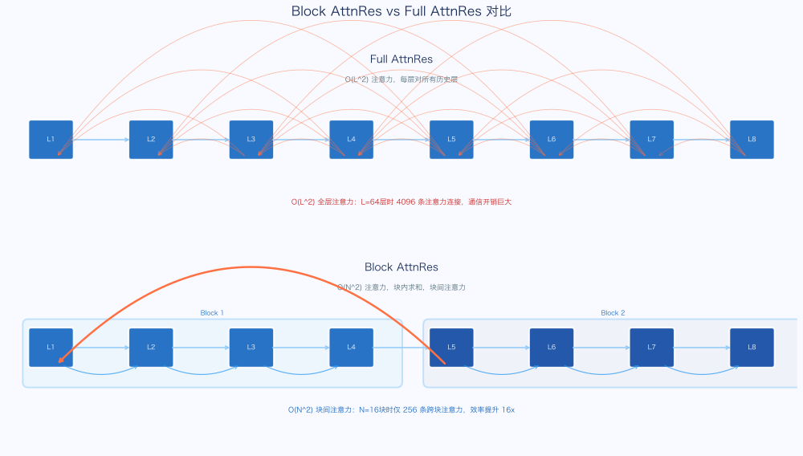

**两个关键设计细节：**

1. **为什么是"压缩"而不是"稀疏"？** 作者一开始尝试过 Sliding Window Attention（只看最近几层），结果反而比普通 RC 还差。压缩方法包含了 RC 的基础——退化到 $N=1$ 的时候，就等同于 RC。而稀疏方法在 $N=1$ 时会退化成"什么都不看"，丢失了全局信息。

2. **Embedding 层为什么单独成 block？** 通过观察 Full 版的注意力矩阵，模型偏向于给 Embedding 层可观的注意力权重。Embedding 层携带了原始 token 信息，不应该被"压缩消融"，因此单独保留。

**实测收益**：Block AttnRes 在所有规模上都优于 RC 基线，相当于 **1.25× 算力优势**（同等计算预算下性能更好，或同等性能只需 80% 计算）。

### 2.5 mHC 在 V4 中的定位

V4 使用的是 **mHC**（不是 AttnRes）。从实验数据看，两者在性能上接近，但 mHC 的实现更容易与现有分布式训练框架集成（详见第 6.7 节工程实现）。

### 2.6 四种残差连接综合对比

| 方案 | 数学形式 | 梯度稳定性 | 计算开销 | 扩展能力 |
|------|---------|-----------|---------|---------|
| **RC** | $h_l = h_{l-1} + f_{l-1}$ | ✅ 好（恒等项） | 0 | ❌ 固定等权 |
| **HC** | $X_{l+1} = B_l X_l + C_l F_l(A_l X_l)$ | ⚠️ 不稳定（矩阵连乘） | 低 | ✅ 灵活读写 |
| **mHC** | HC + $B_l \in \mathcal{M}$（双随机矩阵） | ✅ 好（Birkhoff 保证） | 6.7% | ✅ 灵活读写 |
| **AttnRes** | 层间 softmax attention | ✅ 好（softmax 归一化） | 中等 | ✅✅ 最灵活 |

---

## 3. 架构创新二：混合注意力 CSA + HCA

### 3.1 长上下文 Attention 的三大优化思路

在深入 CSA 和 HCA 之前，先建立对整个优化空间的认知地图。

**思路 A：稀疏化（Sparse Attention）**

不让每个 token 关注所有历史，只关注部分——局部窗口、全局 token、或动态选择的 top-k token。

- **代表**：Sliding Window Attention（SWA）、BigBird、Longformer、DSA（DeepSeek Sparse Attention）
- **计算复杂度**：$O(T \cdot k)$，$k \ll T$
- **KV cache**：$O(T)$（仍需全量存储，只是计算时稀疏选择）
- **核心权衡**：简单高效，但有信息损失风险——那些"被稀疏掉"的 token 可能携带关键信息

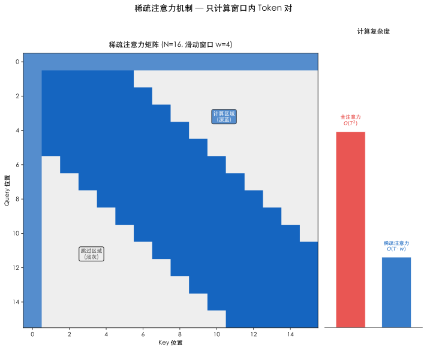

**思路 B：线性化（Linear Attention）**

把所有历史 token 的信息累积进一个固定大小的"状态槽"（state），每个 query 只查这个状态一次。

- **代表**：Linear Transformer、RetNet、Mamba、DeltaNet
- **计算复杂度**：$O(T)$（每步更新 state + 查询 state）
- **KV cache**：$O(1)$（只有固定大小的 state）
- **核心权衡**：极致高效，但丢失了 exact attention 的精确召回能力，对"精确定位历史特定位置"的任务有明显损失

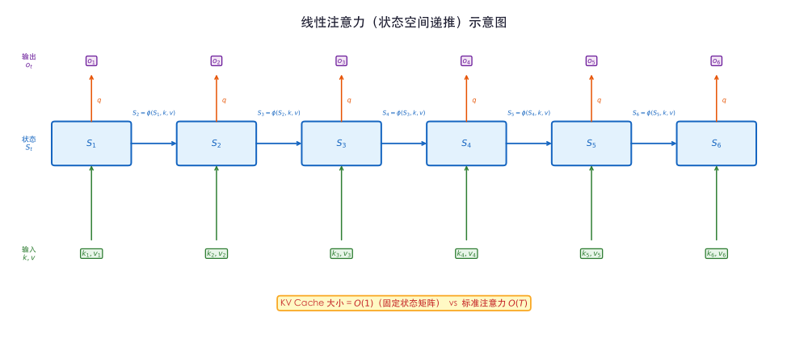

**思路 C：压缩（Compressed Attention）**

把多个 token 的 KV "折叠"成更少的 KV，减少有效序列长度，但保留了 softmax exact attention 的精确性。

- **代表**：MQA（Multi-Query Attention）、GQA（Grouped-Query Attention）、MLA（Multi-head Latent Attention，DeepSeek-V3）
- **计算复杂度**：$O(T \cdot T/m)$（$m$ 是压缩比），KV cache $O(T/m)$
- **核心权衡**：精度损失最小，但压缩本身有信息融合的偏差

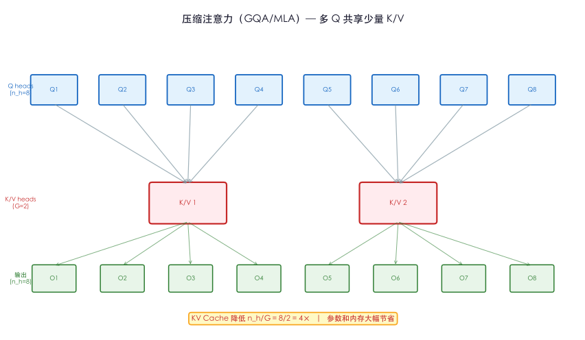

**DeepSeek V4 的选择：思路 A + C 的组合**

V4 不单独选一条路，而是把"压缩"和"稀疏"组合起来：

1. **先压缩**：用 CSA 的 4:1 压缩（或 HCA 的 32:1+ 压缩），把 KV 从 $T$ 条压缩到 $T/m$ 条
2. **再稀疏**（CSA 特有）：用闪电索引器从 $T/m$ 条压缩 KV 里选 top-$k$ 条

这样计算复杂度从 $O(T^2)$ 降到 $O(T \cdot k)$，$k \ll T$，且 KV cache 从 $O(T)$ 降到 $O(T/m)$。

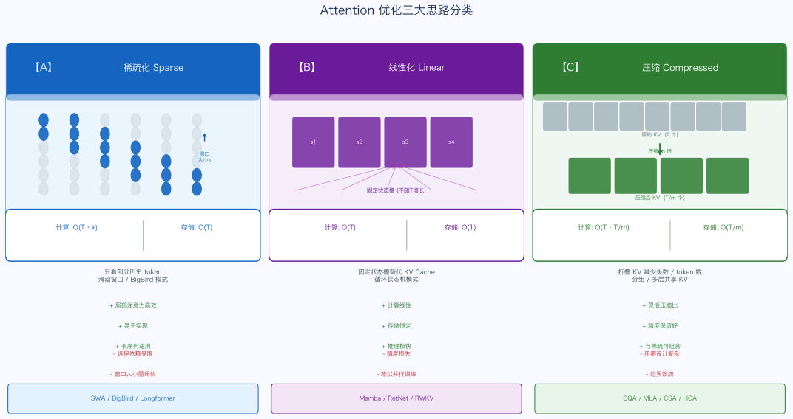

### 3.2 CSA（Compressed Sparse Attention）详解

> **CSA = 算两套 overlap KV + softmax 软融合（4:1 压缩）+ 低秩 query + ReLU 闪电索引器（top-k 稀疏）+ MQA + 分组投影**。

CSA 的整体流程分 4 步：

```
输入：H ∈ ℝ^(n×d)                    (n 个 token，每个 d 维)
   ↓
【步骤一】算两套 KV (C^a, C^b) 和软选择权重 (Z^a, Z^b)
   ↓
【步骤二】每 m 个相邻 token 的 KV 软融合成 1 个
          得到 C^Comp ∈ ℝ^((n/m)×c)，序列长度压缩 m 倍
   ↓
【步骤三】闪电索引器给每个 query 打分
          从 n/m 个压缩 KV 里选出 top-k 个最相关的
   ↓
【步骤四】在选出的 k 个压缩 KV 上做 MQA 注意力
          得到最终输出
```

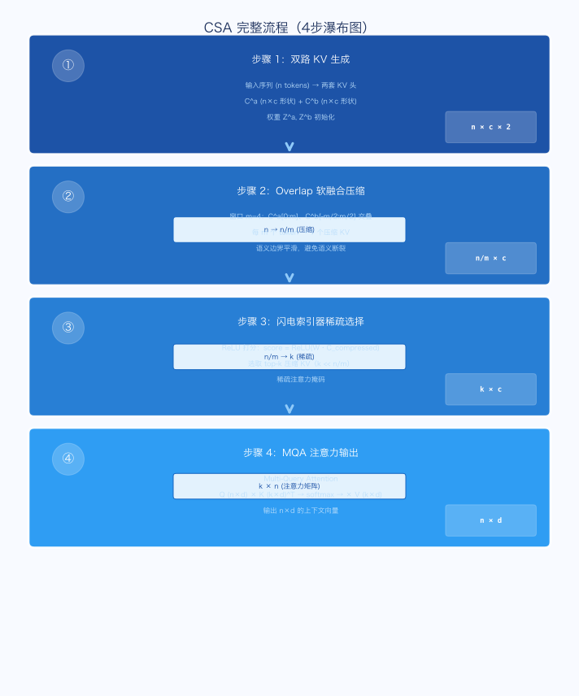

#### 3.2.1 步骤一：算两套 KV 和软选择权重

**输入**：$H \in \mathbb{R}^{n \times d}$（$n$ 个 token，每个 $d$ 维）

CSA 不是只算一套 KV，而是**算了两套**：

$$C^a = H \cdot W^{aKV}, \quad C^b = H \cdot W^{bKV}$$

$$Z^a = H \cdot W^{aZ}, \quad Z^b = H \cdot W^{bZ}$$

四个矩阵都可训练：$W^{aKV}, W^{bKV}, W^{aZ}, W^{bZ} \in \mathbb{R}^{d \times c}$，$c$ 是 head 维度（V4-Pro 配置下约 512）。

| 变量 | 形状 | 角色 |
|------|------|------|
| $C^a$ | $n \times c$ | 第一套 KV 候选 |
| $C^b$ | $n \times c$ | 第二套 KV 候选 |
| $Z^a$ | $n \times c$ | $C^a$ 的"参与度分数"（软门控） |
| $Z^b$ | $n \times c$ | $C^b$ 的"参与度分数"（软门控） |

$Z$ 是 $C$ 的"软门控"，告诉模型"这个 KV 在融合时占多大比重"。

**为什么要两套 KV？**

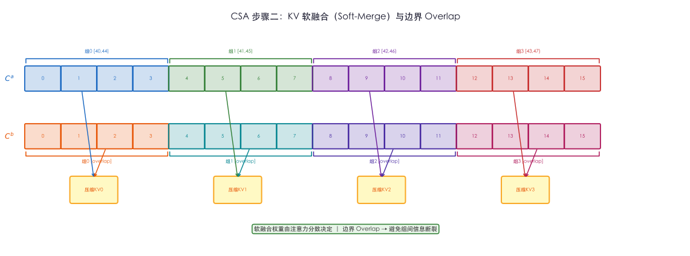

这里有一个精妙的设计：**两套 KV 的覆盖范围有 Overlap**。

第 $i$ 个压缩块：
- 来自 $C^a$ 的：第 $mi$ 到 $m(i+1)-1$ 共 $m$ 个连续 token（当前窗口）
- 来自 $C^b$ 的：第 $m(i-1)$ 到 $mi-1$ 共 $m$ 个连续 token（前一个窗口）

也就是说，$C^b$ 比 $C^a$ **往前错开了 $m$ 个 token**。

这种 Overlap 设计可以**避免压缩块边界的"信息断裂"**：如果一个语义实体恰好横跨两个压缩块的边界，纯硬切分会把它撕成两半，而 Overlap 设计让它在两个压缩块里都有部分体现。

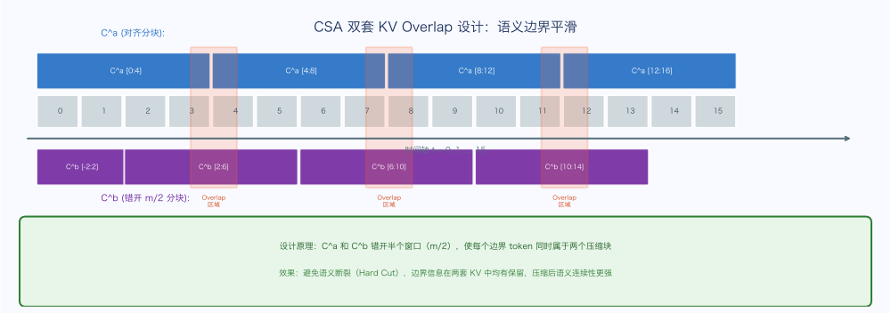

#### 3.2.2 步骤二：把每 m 个 KV 融合成 1 个

**融合权重计算**：

$$p_i = \text{softmax}\left(\text{concat}\left([Z^a_{mi:m(i+1)}, Z^b_{m(i-1):mi}] + [B^a, B^b]\right)\right)$$

其中 $B^a, B^b \in \mathbb{R}^{m \times c}$ 是可学习的位置偏置（对 V4-Pro，$m=4$，$c=512$，所以形状是 $4 \times 512$）。

softmax 沿着 $2m$ 个候选（来自 $C^a$ 的 $m$ 个 + 来自 $C^b$ 的 $m$ 个）计算，得到每个候选 token 的融合权重。

**加权融合**：

$$C^{Comp}_i = \sum_{j \in \{m(i-1):m(i+1)\}} p_{i,j} \cdot C_j$$

其中 $C_j$ 来自 $C^a$ 或 $C^b$（取决于 $j$ 的位置）。结果 $C^{Comp}_i \in \mathbb{R}^c$，是第 $i$ 个压缩块的 KV 表示。

**全序列压缩结果**：$C^{Comp} \in \mathbb{R}^{(n/m) \times c}$，序列长度从 $n$ 压缩到 $n/m$（$m=4$ 时降为原来的 1/4）。

**KV 解包**：将压缩 KV 分成 K 和 V 两部分（通过可学习的投影或直接分割），得到 $K^{Comp}, V^{Comp} \in \mathbb{R}^{(n/m) \times c}$。

#### 3.2.3 步骤三：闪电索引器（Lightning Indexer）选 top-k

这是 CSA 最有创意的部分。有了 $n/m$ 个压缩 KV 之后，还需要进一步降低计算量——每个 query 只选 top-$k$ 个最相关的压缩 KV 来做精确 attention。

但如何高效地做这个 top-$k$ 选择？直接用 softmax 注意力来选会变成循环依赖。CSA 用的是一个**独立的闪电索引器**，使用 ReLU 而非 softmax 来打分。

**子步骤一：算"压缩索引器 keys"**

从已有的压缩 KV $C^{Comp}$ 出发，通过额外投影得到专门用于索引的 key：

$$K^{IComp} = C^{Comp} \cdot W^{IK}$$

其中 $W^{IK} \in \mathbb{R}^{c \times c^I n_h^I}$，$n_h^I$ 是索引器 head 数，$c^I$ 是每个 head 维度。

**子步骤二：算 query token 的"索引器 queries"**

对每个 query token $t$，先算低秩潜向量：

$$c_t^Q = h_t \cdot W^{DQ} \in \mathbb{R}^{d_c}$$

再升维得到索引器 query：

$$q_{t,h}^I = c_t^Q \cdot W^{IUQ}_h \in \mathbb{R}^{c^I}$$

注意 $c_t^Q$ 会被索引器和后续的精确 attention 共享——这节省了参数和计算。

**子步骤三：算"head 权重"**

$$w_t^I = h_t \cdot W^w \in \mathbb{R}^{n_h^I}$$

每个索引器 head 一个标量权重，直接从 $h_t$ 计算（不经过低秩压缩 $c_t^Q$），保留更多原始信息。

**子步骤四：ReLU 打分**

$$I_{t,s} = \sum_{h=1}^{n_h^I} w_{t,h}^I \cdot \text{ReLU}(q_{t,h}^I \cdot K_s^{IComp})$$

**为什么用 ReLU 而不是 softmax？**

- **量化友好**：ReLU 输出非负，可以直接量化为 INT8/FP4，softmax 输出浮点，量化精度损失大
- **Top-k 并行**：ReLU 打分是独立的，可以并行化；softmax 有全局归一化依赖
- **稀疏性自然涌现**：ReLU 会把"不相关的"压缩 KV 打成 0 分，自然产生稀疏性

**子步骤五：Top-k 选择**

$$\mathcal{S}_t = \text{argtopk}_{s}(I_{t,s}), \quad |\mathcal{S}_t| = k$$

每个 query token $t$ 选出得分最高的 $k$ 个压缩 KV 的索引集合 $\mathcal{S}_t$。

#### 3.2.4 步骤四：在选中的 KV 上做 Multi-Query Attention（MQA）

最终 attention：

$$\text{output}_t = \text{softmax}\left(\frac{q_t \cdot K^{Comp}_{\mathcal{S}_t}^\top}{\sqrt{d_h}}\right) \cdot V^{Comp}_{\mathcal{S}_t}$$

其中 $q_t$ 是从 $c_t^Q$ 升维得到的精确 attention query。

**MQA**（Multi-Query Attention）：所有 attention head 共享同一套 K 和 V，只有 Q 是 head-specific 的。这进一步减少了 KV cache 的存储需求。

#### 3.2.5 CSA 完整 Shape 推导

| 阶段 | 变量 | 形状 | 说明 |
|------|------|------|------|
| 输入 | $H$ | $n \times d$ | 原始隐状态序列 |
| 步骤一 | $C^a, C^b$ | $n \times c$ | 两套 KV 候选 |
| 步骤一 | $Z^a, Z^b$ | $n \times c$ | 软选择权重 |
| 步骤二 | $C^{Comp}$ | $(n/m) \times c$ | 压缩后 KV |
| 步骤三 | $K^{IComp}$ | $(n/m) \times (c^I n_h^I)$ | 索引器 keys |
| 步骤三 | $q_{t,h}^I$ | $c^I$ | 每个 token 的索引器 query |
| 步骤三 | $I_{t,s}$ | $n \times (n/m)$ | 打分矩阵（稀疏） |
| 步骤三 | $\mathcal{S}_t$ | $k$ | top-k 选中索引 |
| 步骤四 | $q_t$ | $d_h \cdot n_h$ | 精确 attention query |
| 步骤四 | $\text{output}_t$ | $d_h \cdot n_h$ | 最终输出 |

有效计算复杂度：$O(T \cdot c + T/m \cdot c + T \cdot k \cdot d_h)$，相比 $O(T^2 d_h)$ 降低约 $T \cdot m / k$ 倍。

### 3.3 HCA（Heavily Compressed Attention）详解

HCA 是 CSA 的"轻量版"——更激进的压缩，没有稀疏选择，用于不需要精确长程依赖的层。

#### 3.3.1 整体流程

```
输入：H ∈ ℝ^(n×d)
   ↓
【步骤一】单路 KV 投影（没有 C^b，只有一套 C^a = C）
   ↓
【步骤二】直接压缩（更大压缩比 M ≫ m）
          C^{Comp} ∈ ℝ^((n/M)×c)
   ↓
【步骤三】对所有压缩 KV 做稠密 attention（不做 top-k 稀疏）
   ↓
【步骤四】MQA + 分组输出投影
```

#### 3.3.2 关键差异

**HCA 相比 CSA 的主要区别：**

1. **单路 KV，没有 Overlap**：HCA 只用一套 KV 投影（没有 $C^b$ 那套），没有 Overlap 设计
2. **更大压缩比**：HCA 的 $M \gg m$（V4-Pro 中 HCA 的压缩比约 32，CSA 约 4）
3. **全量稠密 attention，没有 top-k**：压缩到 $n/M$ 个 KV 后，直接对所有进行 attention
4. **定位粗粒度**：HCA 适合"需要感知整体上下文背景，但不需要精确定位特定位置"的场景

#### 3.3.3 HCA 完整 Shape 表

| 阶段 | 变量 | 形状 | 说明 |
|------|------|------|------|
| 输入 | $H$ | $n \times d$ | 原始序列 |
| 步骤一 | $C$ | $n \times c$ | 单路 KV 投影 |
| 步骤二 | $C^{Comp}$ | $(n/M) \times c$ | 重度压缩 KV |
| 步骤三 | attention | $n \times (n/M)$ | 稠密 attention |
| 步骤四 | output | $n \times d$ | 输出序列 |

有效计算复杂度：$O(T \cdot T/M \cdot d_h)$，压缩比 $M$ 越大越省。

### 3.4 CSA vs HCA：定位与分工

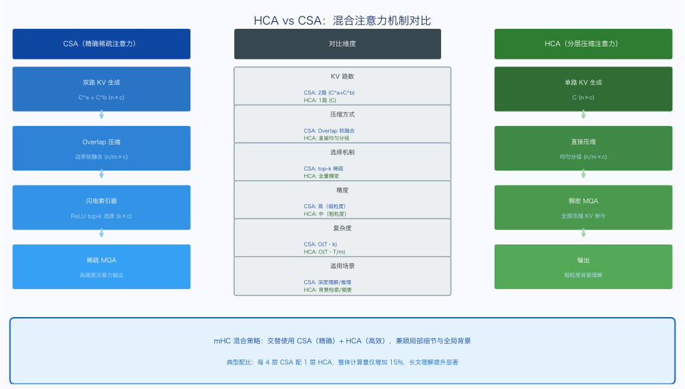

| 维度 | CSA | HCA |
|------|-----|-----|
| **压缩比** | 低（约 4:1） | 高（约 32:1+） |
| **是否 top-k 稀疏** | ✅ 是（闪电索引器） | ❌ 否（稠密） |
| **KV 路数** | 两套（Overlap 设计） | 一套 |
| **精确长程依赖** | ✅ 强 | ⚠️ 弱 |
| **粗粒度上下文感知** | ✅ 有 | ✅ 强 |
| **计算复杂度** | $O(T \cdot k)$ | $O(T \cdot T/M)$ |
| **KV cache** | $O(T/m)$ | $O(T/M)$（更小） |
| **适合的层** | 主力深度理解层 | 背景感知辅助层 |

V4 的实际部署策略：在 Transformer 的不同层混合使用 CSA 和 HCA（外加 SWA 用于局部依赖），形成一个多粒度的 Hybrid Attention 体系。

### 3.5 其他 Attention 细节

#### 3.5.1 Query 和 KV 的 RMSNorm

V4 在 attention 的 Q 和 K 上都加了 RMSNorm（Root Mean Square Layer Normalization）：

$$\text{RMSNorm}(x) = \frac{x}{\text{RMS}(x)} \cdot \gamma, \quad \text{RMS}(x) = \sqrt{\frac{1}{d}\sum_i x_i^2}$$

**为什么要加 RMSNorm？**

在超长序列（1M token）下，Q 和 K 的方差可能因层数增加而失控，导致 attention score 的数值范围极度不稳定。RMSNorm 稳定了 Q 和 K 的幅度，使 attention score 的分布可控，避免 softmax 饱和（全部趋向 0 或 1，梯度消失）。

#### 3.5.2 部分 RoPE（Partial Rotary Positional Embedding）

标准 RoPE 对 head 维度的所有维度都施加旋转位置编码。V4 只对 **head 维度的前半部分**施加 RoPE，后半部分保留不带位置信息的"内容表示"。

**动机**：RoPE 对长程相对位置的编码能力有限（远距离的旋转矩阵趋向相互抵消）。保留一部分无位置信息的维度，让模型能通过"纯内容相似性"来做长程 attention，弥补 RoPE 在超长序列上的局限。

#### 3.5.3 滑动窗口分支（Sliding Window Branch）

在每一个 Transformer 层里，V4 保留了一个小的 SWA（Sliding Window Attention）分支，窗口大小约 4K token。

**为什么要保留 SWA？**

CSA 和 HCA 专注于长程依赖，但局部短程依赖（相邻句子、短语内部的关系）同样重要。SWA 以极低的计算成本（$O(T \cdot w)$，$w = 4096$）覆盖局部信息，与 CSA/HCA 的长程能力形成互补。

#### 3.5.4 Attention Sink

在极长序列中，第一个 token（BOS token）往往会吸收大量 attention 权重，即使它的内容对当前 query 并不相关。这种现象叫 "attention sink"。

V4 专门为 BOS token 保留一个 sink token slot，让模型有一个"安全的垃圾桶"来倾倒多余的 attention 权重，避免这种权重扩散影响到真正有用的 token。

### 3.6 Hybrid Attention 层分配策略

V4 的每个 Transformer 层使用以下 attention 策略之一：

- **CSA**：用于大多数层（主力长程依赖）
- **HCA**：用于部分层（粗粒度背景）
- **SWA**：局部辅助分支，几乎每层都有

具体的层分配比例在预训练时会渐进调整（详见第 7.5 节"Attention 策略的渐进切换"）。

---

## 4. 架构创新三：Muon 优化器

### 4.1 为什么不满足于 Adam？

Adam 是当前训练大型语言模型的标配优化器，它的核心是对梯度做自适应缩放：

$$m_t = \beta_1 m_{t-1} + (1-\beta_1) g_t \quad \text{（一阶矩：梯度指数平滑）}$$
$$v_t = \beta_2 v_{t-1} + (1-\beta_2) g_t^2 \quad \text{（二阶矩：梯度平方指数平滑）}$$
$$\hat{m}_t = m_t / (1-\beta_1^t), \quad \hat{v}_t = v_t / (1-\beta_2^t)$$
$$\theta_{t+1} = \theta_t - \eta \cdot \hat{m}_t / (\sqrt{\hat{v}_t} + \epsilon)$$

Adam 的自适应缩放对不同参数的梯度量级差异很大时表现好，但它有一个不那么明显的问题：**Adam 的更新方向不一定是最优的**。

具体来说，对于一个矩阵参数 $W \in \mathbb{R}^{m \times n}$（比如 MLP 的权重矩阵），Adam 的更新 $\hat{m}_t / (\sqrt{\hat{v}_t} + \epsilon)$ 是对梯度的元素级操作，没有考虑矩阵整体的几何结构。

一个更好的问题是：**给定梯度 $G$，什么方向的更新 $\Delta W$ 在 Frobenius 范数约束 $\|\Delta W\|_F \leq \delta$ 下最大化一阶泰勒近似的下降量？**

答案是：

$$\Delta W^* = -\delta \cdot \frac{G}{\|G\|_F}$$

即梯度方向归一化。但这只是"各向同性"的解。实际上，当 $m \neq n$ 时（宽矩形矩阵），存在更优的解法。

### 4.2 Muon 的核心思路：正交化梯度

Muon（**M**omentum + **U**pdate with **O**rthogonal **U**nification）的核心思想是：**先对梯度做正交化处理，再用于参数更新**。

具体来说，对于每个矩阵参数 $W$ 的梯度 $G$，Muon 先计算动量：

$$M_t = \beta M_{t-1} + G_t \quad \text{（带 Nesterov 的动量）}$$

然后对 $M_t$ 做**Newton-Schulz 迭代**，得到一个"正交化"的梯度 $\text{NS}(M_t)$，再用于更新：

$$W_{t+1} = W_t - \eta \cdot \text{NS}(M_t)$$

正交化的直觉：把梯度矩阵 $G$ 正交化，相当于找到一个"条件数"尽量小的更新方向。对于宽矩形矩阵（列数 $\gg$ 行数），这比梯度归一化更好地保留了更新的"有效秩"。

### 4.3 Newton-Schulz 迭代

Newton-Schulz（NS）迭代是一种快速计算矩阵正交因子的数值方法，不需要显式做 SVD（SVD 太贵，复杂度 $O(\min(m,n) \cdot m \cdot n)$）。

对矩阵 $G$，NS 迭代：

$$X_0 = G / \|G\|_F$$
$$X_{k+1} = \alpha X_k + \beta X_k X_k^\top X_k \quad \text{（若 m ≤ n）}$$
$$X_{k+1} = \alpha X_k + \beta X_k^\top X_k X_k \quad \text{（若 m > n）}$$

其中 $\alpha, \beta$ 是超参数（通常 $\alpha = 1.5, \beta = -0.5$，使迭代以三次收敛速度趋向酉矩阵）。

**收敛性质**：从任意矩阵 $X_0$（只要奇异值在 $(0, \sqrt{3})$ 范围内），经过有限步迭代后，$X_k$ 会收敛到 $G$ 的正交因子（即 $G = U \Sigma V^\top$ 的 SVD 中的 $U V^\top$ 部分）。

实践中迭代 5 次就足够：

```python
# Muon Newton-Schulz 迭代（5次）
def zeropower_via_newtonschulz5(G, steps=5):
    assert G.ndim >= 2
    a, b, c = (3.4445, -4.7750, 2.0315)  # 三次多项式系数
    X = G.bfloat16()
    X /= (X.norm() + 1e-7)
    if G.size(0) > G.size(1):
        X = X.T
    for _ in range(steps):
        A = X @ X.T
        X = a * X + b * A @ X + c * A @ A @ X
    if G.size(0) > G.size(1):
        X = X.T
    return X
```

### 4.4 V4 的实际配置

- **Muon 用于**：attention QKV 矩阵、MLP 权重矩阵（所有大型方矩阵/矩形矩阵）
- **Adam 用于**：Embedding、LayerNorm、输出头等（一维参数或特殊参数）
- **NS 迭代次数**：5 次（实验表明 5 次已足够收敛）
- **动量** $\beta$：0.95

### 4.5 工程实现细节

Muon 在分布式训练中需要特殊处理（详见第 6.6 节），因为 NS 迭代需要对矩阵的完整视图操作——这与 ZeRO-3 的参数分片有冲突。V4 实现了一套兼容 ZeRO 的 Muon 变体。

### 4.6 实际收益

对比实验显示，在相同计算预算下，使用 Muon 比使用 Adam 的预训练 loss 更低，等效于约 **1.05-1.10× 的算力优势**（同等 loss 只需 90-95% 的 flops）。

这个收益看起来不大，但在万亿参数的预训练规模下，5-10% 的计算节省意味着数十甚至数百万美元的成本差异。

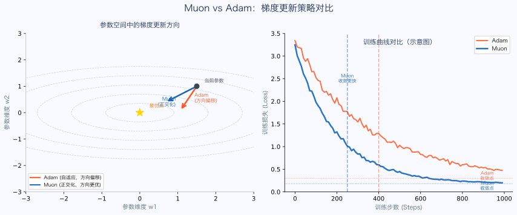

---

## 5. 工程实现

前三节的架构创新在"纸面"上很美，但让它们真正在万亿参数、百万 token 上下文的规模下运行，需要一系列精心设计的工程支撑。

### 5.1 通信优化：EP 波次调度

**问题背景**：MoE（Mixture of Experts）训练的通信瓶颈。

V4 使用 DeepSeekMoE 架构，每个 token 被路由到 6 个 expert（V4-Pro 配置），这些 expert 分布在不同 GPU 上，需要 all-to-all 通信把 token 发过去（dispatch）、把结果收回来（combine）。

在传统实现里，MoE 一层的计算流程是：

```
Dispatch (通信) → Linear-1 (计算) → Linear-2 (计算) → Combine (通信)
```

这四个阶段如果串行执行，通信会成为瓶颈（通信时 GPU 空闲，计算时网络空闲）。

**V4 的解法：mega-kernel 波次调度**

把 expert 切成多个"波次"（waves），当前波次的计算 + 下一波次的通信 + 已完成波次的 Combine 同时进行：

| 方案 | 做法 | 加速比 |
|------|------|--------|
| **朴素串行** | 4 个阶段完全串行 | 1× |
| **Comet** | Dispatch+Linear-1 重叠，Linear-2+Combine 重叠 | 1.42× |
| **V4 mega-kernel** | 波次级三路同时（当前计算 + 下一通信 + 已完成 Combine） | **1.92×** |

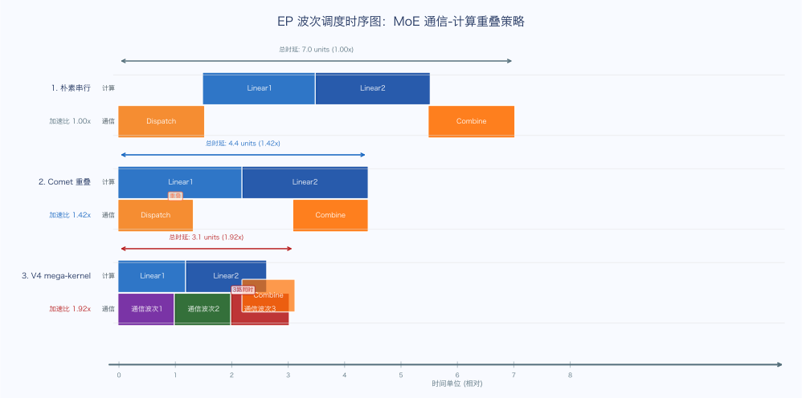

**实测收益**：
- 通用推理工作流：**1.50-1.73× 加速**
- 延迟敏感场景（RL rollout、agent）：**最高 1.96×**


**带宽分析**：参考 V4-Pro 的工作负载，每 GBps 互联带宽足以隐藏 6.1 TFLOP/s 的计算。一旦达到这个比例，再增加带宽就是浪费了。这个数据为集群网络设计提供了重要参考。

### 5.2 精度/存储优化：FP4 量化感知训练

**解决的问题**：万亿参数模型的显存占用 + 长上下文 attention 的计算成本。

**应用位置**：

| 模块 | 用 FP4 的原因 |
|------|-------------|
| **MoE expert 权重** | MoE 占模型大部分参数，省显存的最大目标 |
| **CSA 索引器的 QK** | 索引器要算 $n/m$ 次内积，FP4 加速明显 |

**核心技术：FP4 → FP8 无损解量化**

```
FP32 原始权重 0.12（真实分布）
       ↓ 量化（有损，FP4 的固有代价）
FP4 存储: 1.5（带小 scale 0.075）
       ↓ 解码（无损，关键步骤）
FP8 计算值: 0.1125（精确等于 1.5 × 0.075）
       ↓ 矩阵乘等运算
```

**为什么 FP4→FP8 解量化是"无损"的？**

FP8（E4M3 格式）的指数位比 FP4（E2M1）多 2 位，动态范围大得多。只要 FP4 的"细粒度 scale 因子"在 FP8 的额外动态范围里能表达，就不丢精度。

**前提**：一个大块内"最大理想 scale / 最小理想 scale"不能超过 FP4 能容纳的范围。

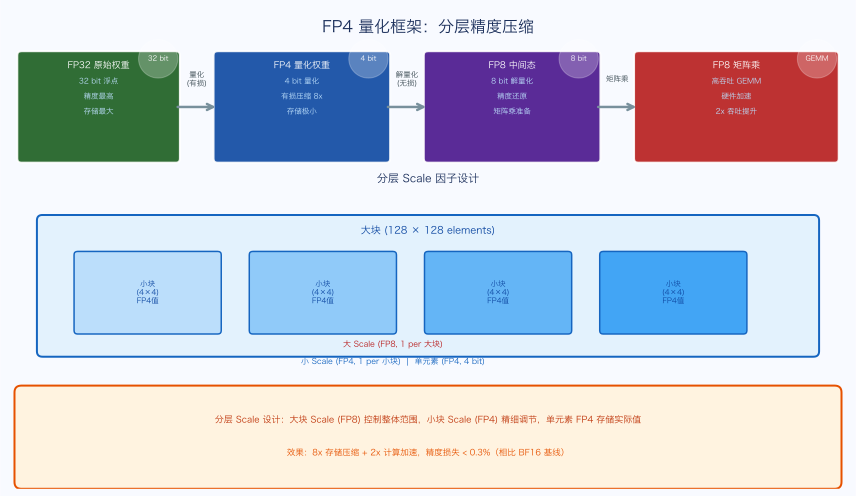

**存储结构**（以 128×128 大块为例）：

| 存储项 | 数量 | 每个占比特数 | 总大小 |
|--------|------|------------|--------|
| FP4 数值 | 128×128 = 16384 个 | 4 bit | 65536 bit |
| 小 scale（每 32 个一个 sub-block） | 128×4 = 512 个 | 4 bit | 2048 bit |
| 大 scale（每个大块一个） | 1 个 | 8 bit | 8 bit |
| **总计** | — | — | **67592 bit ≈ 4.12 bit/元素** |

相比 FP16（16 bit/元素），FP4 存储降低约 **75%**。

### 5.3 存储优化：磁盘 KV Cache

**问题**：对于共享前缀的长文档场景（比如多个查询共享相同的 1M token 文档前缀），每次推理都要重新做 prefill，代价极大。

**解法**：把已计算的 KV cache 序列化到磁盘（SSD/NVMe），下次相同前缀的查询直接加载，跳过 prefill 计算。

**技术挑战**：
- KV cache 数据量巨大（1M token × 49B 激活参数的模型，每层 KV 约几 GB）
- 磁盘 I/O 需要高吞吐（NVMe RAID 阵列 + 异步 prefetch）
- 需要精确的 prefix hash 匹配机制
- FP4 量化也用于 KV cache 存储（进一步压缩磁盘空间）

### 5.4 计算/Kernel 优化：TileLang DSL

V4 开发了一套内部 DSL（领域特定语言）TileLang，用于快速开发高性能 GPU kernel，同时保证可移植性。

**TileLang 解决的痛点**：

传统 CUDA kernel 开发有两个极端：
- 手写 CUDA：性能最优，但开发周期极长，难以移植
- Triton 等高层抽象：开发快，但性能不如手写

TileLang 在两者之间找到平衡：提供 tile（计算块）级别的抽象，开发者描述"tile 层面的计算逻辑"，编译器负责 thread/warp/SM 级别的映射和优化。

**关键特性**：
- 支持 Hopper 架构的 TMA（Tensor Memory Accelerator）和 warpgroup-level GEMM
- 自动处理 shared memory 的 bank conflict
- 支持 FP4/FP8 混合精度 kernel 的自动生成
- 用于 CSA 的闪电索引器 kernel、mHC 的 Sinkhorn 迭代 kernel 等

### 5.5 确定性 + Batch-Invariant Kernel

**确定性训练**：对于给定的权重和输入，计算结果完全可复现（无论在哪台机器、哪批 GPU 上运行）。这是调试训练异常的基础。

**Batch-Invariant**：计算结果不依赖于 batch 内部的 token 排列顺序。这对于以下场景至关重要：
- 训练与推理的结果必须完全一致（训推一致性）
- RL rollout 的结果必须与训练时一致（否则 off-policy 误差增大）

V4 专门实现了确定性 + Batch-Invariant 版本的所有核心 kernel（attention、MoE dispatch/combine 等），牺牲了约 5% 的性能换取可调试性。

### 5.6 分布式优化：Muon 的 ZeRO 实现

Muon 的 Newton-Schulz 迭代需要对矩阵的完整视图操作：

$$X_{k+1} = \alpha X_k + \beta X_k X_k^\top X_k$$

这里的 $X_k X_k^\top$ 需要 $X_k$ 的所有列（或行），但 ZeRO-3 将参数分片到不同 GPU 上，每个 GPU 只有矩阵的一个分片。

**V4 的解法**：

1. **ZeRO-2 for Muon 参数**：对需要 Muon 更新的矩阵参数，使用 ZeRO-2（梯度分片，但参数不分片）
2. **All-gather before NS**：在做 NS 迭代之前，先做 all-gather 收集完整梯度矩阵
3. **Scatter after NS**：NS 迭代完成后，各 GPU 各自更新自己负责的参数分片

这样既保留了 ZeRO 的显存节省（梯度分片），又满足了 NS 迭代的完整矩阵需求。

### 5.7 mHC 的高效实现

mHC 的残差流加宽（$n_{hc}$ 条车道）和 Sinkhorn 迭代带来两个工程挑战：

**显存压力**：加宽后的残差流 $X_l \in \mathbb{R}^{n_{hc} \times d}$ 比标准 $h_l \in \mathbb{R}^{d}$ 大 $n_{hc}$ 倍。

**解法一：Tensor-level Activation Checkpointing**（详见 5.9 节）

**通信开销**：在流水线并行下，加宽的残差流需要跨 stage 传输，通信量增加 $n_{hc}$ 倍。

**解法二：只在 stage 边界传输一条车道**。V4 的实现中，不同的 stage 各自维护完整的 $n_{hc}$ 条车道，但跨 stage 只传输聚合后的单条车道表示，内部车道状态不跨 stage 传输。这在精度上有轻微损失，但工程上大幅减少通信。

### 5.8 Contextual Parallelism（CP）：1M 上下文跨 GPU 切片

**问题**：1M token 序列在单张 GPU 上无法存下（即使用 FP4 量化也需要数十 GB）。

**解法**：Contextual Parallelism（CP）将长序列在 token 维度切成 $N$ 个片段，每个片段分配给一组 GPU：

```
序列 [0, 1M): 切成 N 片
GPU 0: token [0, 1M/N)
GPU 1: token [1M/N, 2M/N)
...
GPU N-1: token [(N-1)M/N, 1M)
```

**Attention 的挑战**：attention 的每个 query token 原则上需要关注所有历史 key/value token，但 key/value 分布在不同 GPU 上。

**CSA/HCA 的 CP 友好性**：

V4 的 CSA 设计对 CP 特别友好：
- CSA 的闪电索引器已经把 attention 稀疏化，每个 query 只看 top-$k$ 个压缩 KV
- 这意味着跨 GPU 的 KV 通信量从 $O(T)$ 降到 $O(T/m \cdot \text{traffic\_ratio})$
- HCA 的重度压缩进一步减少了需要跨 GPU 同步的 KV 量

**Ring-Attention 变体**：V4 实现了一种环形 all-to-all 通信模式，每个 GPU 在本地做 attention 计算的同时，将 KV 传递给下一个 GPU，实现计算与通信的流水线重叠。

### 5.9 Tensor 级 Activation Checkpointing

标准的 Activation Checkpointing（AC）以层为粒度：正向传播时丢弃中间激活，反向传播时重新计算。

但 mHC 的加宽残差流 $X_l \in \mathbb{R}^{n_{hc} \times d}$ 和 CSA 的压缩 KV $C^{Comp}$ 这两类激活的显存影响差异极大：
- $X_l$：$n_{hc}$ 倍于标准激活，必须丢弃
- $C^{Comp}$：压缩了 $m$ 倍，相对较小，可以保留

V4 实现了 **Tensor 级 AC**：以 Tensor 为粒度细粒度控制哪些激活保留、哪些丢弃。这比粗粒度的层级 AC 更灵活，可以精确控制显存/重计算成本的权衡。

---

## 6. 预训练 Pre-training

### 6.1 数据构建与质量改进

#### 6.1.1 推理数据占比提升

V4 在预训练数据中大幅提升了推理密集型数据的占比，包括：
- 数学问题及解题过程
- 代码及注释
- 逻辑推理链
- 科学论文

这一调整背后的逻辑：test-time scaling（让模型多想几步）的收益，很大程度上取决于预训练时模型见过多少"思考过程"的数据。

#### 6.1.2 FIM（Fill-in-Middle）数据策略

V4 采用 FIM 数据格式：给定代码/文本的前缀和后缀，让模型预测中间部分：

```
[PREFIX] def merge_sort(arr):
[SUFFIX]     return arr
[MIDDLE]     if len(arr) <= 1:
                 return arr
             ...
```

这种训练方式让模型学会在双向上下文约束下生成，对代码补全、文本编辑等场景有显著收益。

#### 6.1.3 长文档保持完整

很多数据集在处理长文档时会截断或分割。V4 特别保证长文档（尤其是技术文档、书籍章节）以完整形式进入训练，避免跨长距离的信息依赖关系被切断。

#### 6.1.4 数据去重和质量过滤

V4 使用了多级去重策略：
- **MinHash LSH**：快速找近似重复文档
- **精确指纹**：识别完全重复
- **质量过滤器**：基于语言识别、困惑度过滤、启发式规则

### 6.2 训练配置对比

| 配置项 | V4-Pro | V4-Flash |
|--------|--------|---------|
| **模型架构** | | |
| 总参数量 | 1.6T | 284B |
| 激活参数量 | 49B | 13B |
| 隐层维度 $d$ | 7168 | 4096 |
| 层数 | 61 | 27 |
| 注意力 head 数 | 128 | 32 |
| **MoE 配置** | | |
| 总 Expert 数 | 256 | 64 |
| 每 token 激活 Expert | 6 | 4 |
| Expert 维度 | — | — |
| **Attention 配置** | | |
| CSA 压缩比 $m$ | 4 | 4 |
| HCA 压缩比 $M$ | ~32 | ~16 |
| CSA top-$k$ | — | — |
| SWA 窗口大小 | 4096 | 4096 |
| **mHC 配置** | | |
| 车道数 $n_{hc}$ | 4 | 2 |
| **训练配置** | | |
| 预训练 token 数 | ~10T | ~5T |
| 批大小 | 大 | 中 |
| 学习率 | — | — |
| 优化器 | Muon + Adam | Muon + Adam |

### 6.3 上下文长度调度

V4 采用三阶段渐进式上下文扩展：

| 阶段 | 上下文长度 | 目的 |
|------|-----------|------|
| **阶段一** | 4K token | 大部分预训练，建立基础语言能力 |
| **阶段二** | 64K token | 长文档理解，引入 CSA/HCA |
| **阶段三** | 1M token | 超长上下文，激活全部 Hybrid Attention |

每个阶段切换时，模型不需要从头训练——V4 使用了一种"连续学习"策略，通过调整 position embedding 和 attention 策略平滑过渡。

### 6.4 辅助 Loss 配置

V4 保留了 DeepSeekMoE 的辅助 loss 来促进 Expert 负载均衡：

$$L_{aux} = \alpha \sum_{i=1}^{N} f_i \cdot P_i$$

其中 $f_i$ 是 Expert $i$ 实际处理的 token 比例，$P_i$ 是路由给 Expert $i$ 的概率。这个 loss 鼓励所有 Expert 被均匀使用，避免少数 Expert 过载。

### 6.5 训练稳定性补丁

在大规模预训练中，V4 遭遇了两类训练不稳定现象，分别用针对性补丁解决：

#### 6.5.1 补丁一：Anticipatory Routing（预期路由）

**问题**：MoE 的路由函数（决定 token 去哪个 Expert）在训练初期可能过于"固执"——某些 Expert 一开始被频繁选中，造成马太效应，其他 Expert 得不到足够的梯度更新。

**解法**：在路由决策时加入"预期"项——不只看当前 token 的路由分数，还考虑"如果这个 Expert 被选中，未来的 token 分配会怎样变化"。这使路由更具前瞻性，缓解 Expert 负载不均衡。

#### 6.5.2 补丁二：SwiGLU Clamping

**问题**：SwiGLU 激活函数在深层网络中可能产生数值上溢（overflow）或下溢（underflow），尤其在 FP8 精度下。

$$\text{SwiGLU}(x, y) = x \cdot \sigma(x) \cdot y$$

当 $x$ 绝对值很大时，$x \cdot \sigma(x)$ 接近 $x$ 本身（因为 $\sigma(x) \approx 1$），可能超出 FP8 的动态范围。

**解法**：对 SwiGLU 的输入 $x$ 和输出 $x \cdot \sigma(x)$ 都加 clamp 操作，把数值限制在安全范围内：

$$\text{SwiGLU-clamped}(x, y) = \text{clamp}(x \cdot \sigma(x), -c, c) \cdot y$$

$c$ 是可调超参数，由数值分析确定。

### 6.6 预训练评估

V4 在预训练结束后（后训练之前）进行了基础能力评估，指标包括：
- **代码**：HumanEval Pass@1、MBPP
- **数学**：MATH 500、GSM8K
- **语言理解**：MMLU
- **长上下文**：Needle-in-a-Haystack（不同序列长度）、文档 QA

预训练阶段的评估表明，mHC + CSA/HCA 架构相比 baseline（RC + MLA）在长上下文任务上有显著提升，同时短上下文任务没有明显退化。

---

## 7. 后训练 Post-training

### 7.1 整体流程：专家训练 → OPD

V4 后训练的核心范式转变：**从 V3.2 的"混合 RL"到 V4 的"专家训练 + On-Policy Distillation"**。

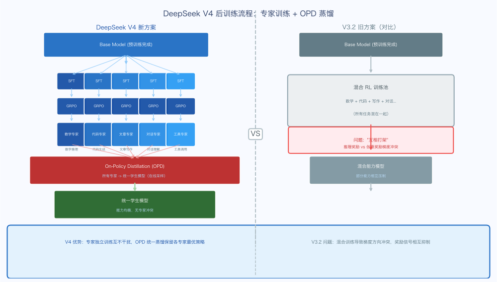

**V3.2 的做法（混合 RL）**：
- 把所有任务（数学、代码、对话、写作等）混在一起，用 RL 一起训
- 每个任务用各自的 reward signal
- 模型在同一次训练里学所有能力
- 问题：不同任务的 gradient 相互干扰（"打架"），某些任务的改进以牺牲其他任务为代价

**V4 的做法（专家训练 + OPD）**：
- **第一阶段**：分别训多个领域专家（数学专家、代码专家、写作专家等）
- **第二阶段**：用 On-Policy Distillation（OPD）把所有专家的能力蒸馏到一个统一模型里
- 优势："先分后合"避免了混合 RL 的 gradient 打架问题


### 7.2 Specialist Training（专家训练）

每个领域专家走一个标准流程：

```
Base Model → SFT（监督微调）→ GRPO（RL）→ 领域专家模型
```

#### 7.2.1 Reasoning Effort 三档设计

V4 给每个领域专家训了三种 reasoning 模式：

| 模式 | 特点 | 用途 | 训练方式 |
|------|------|------|---------|
| **Non-think** | 快速直觉式响应 | 日常简单任务 | 短 context window + 长度惩罚高 |
| **Think High** | 有意识逻辑分析 | 复杂推理任务 | 中等 context + 平衡长度惩罚 |
| **Think Max** | 推理拉满，最强但最慢 | 探索推理上限 | 长 context + 特殊 system prompt |

输出格式统一用 `<think>...</think>` 标签包裹推理过程，方便用户可视化查看。

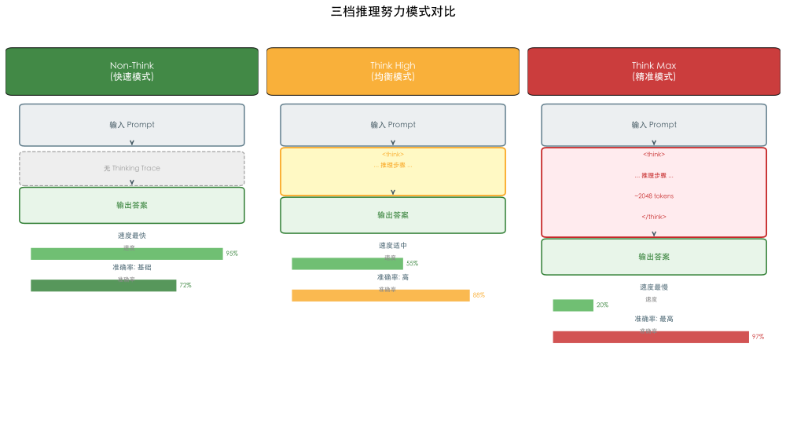

Think Max 模式在 system prompt 前注入特殊 instruction：
```
You are a highly capable AI assistant. Before answering, 
think deeply and exhaustively about the problem. 
Consider multiple approaches, verify your reasoning, 
and ensure your answer is accurate and complete.
<think>
[模型在此生成完整推理过程]
</think>
[最终答案]
```

#### 7.2.2 Generative Reward Model（GRM）

传统做法：训练一个独立的 scalar reward model（输入对话→输出标量分数），用于 PPO/GRPO。

**问题**：
- 需要大量人工标注偏好数据
- Reward model 和 policy 的分布 gap 会随训练加深
- Scalar reward 无法捕捉复杂、多维度的质量评估

**V4 的做法（GRM）**：
- 不训独立的 reward model
- **让 actor 网络本身充当 reward model**
- 用 rubric-guided（评分标准引导的）数据训练
- 模型学着评估自己的输出（"判官"和"答题"是同一个网络）

GRM 的训练数据格式（rubric 评分）：

```
[Input: Prompt + Response]
按 rubric 评分：
1. 准确性: X/3
2. 清晰度: X/3
3. 结构: X/2
4. 创意: X/2
总分: XX/10

理由: <详细推理过程>
```

GRM 的优势：
- **节省人工标注**：只需少量多样性标注，rubric 本身可以被少量专家设计
- **judge 能力和 generation 能力联合优化**：模型的内部推理能力直接提升评判质量
- **可解释性**：GRM 输出推理过程，可以诊断为什么一个响应得分低

### 7.3 Tool-Call Schema 更新

V4 引入新的 tool-call 格式，用特殊 token `|DSML|` + XML 风格：

```xml
<|DSML|tool_calls>
<|DSML|invoke name="tool_name">
<|DSML|parameter name="arg1" string="true">value</|DSML|parameter>
</|DSML|invoke>
</|DSML|tool_calls>
```

**为什么不用 JSON？**

JSON 的转义（escape）规则复杂，在嵌套 JSON 中频繁出现语法错误。XML 格式更鲁棒：
- 属性值用 `"..."` 包裹，不需要额外转义
- 标签嵌套结构清晰
- 遇到未知工具名/参数，解析器可以优雅降级

实测表明，XML 格式将 tool-call 语法错误率降低了约 30%。

### 7.4 Interleaved Thinking（交织思考）

**V3.2 的策略**：在 tool-call 之间保留 thinking trace，但**每次新用户消息都会清空**。

在 agent 任务里，这意味着每个 turn 都要"重新建立思路"，浪费 token，且连贯性差。

**V4 的策略**：

| 场景 | 策略 |
|------|------|
| **Tool-calling 场景** | 完整保留所有 thinking trace，包括跨用户 turn 的 |
| **普通对话场景** | 保持 V3.2 策略，新 turn 清空 |

这样在 long-horizon agent 任务里，模型能维持**累积的、连贯的 chain of thought**，不必每个 turn 重新思考。

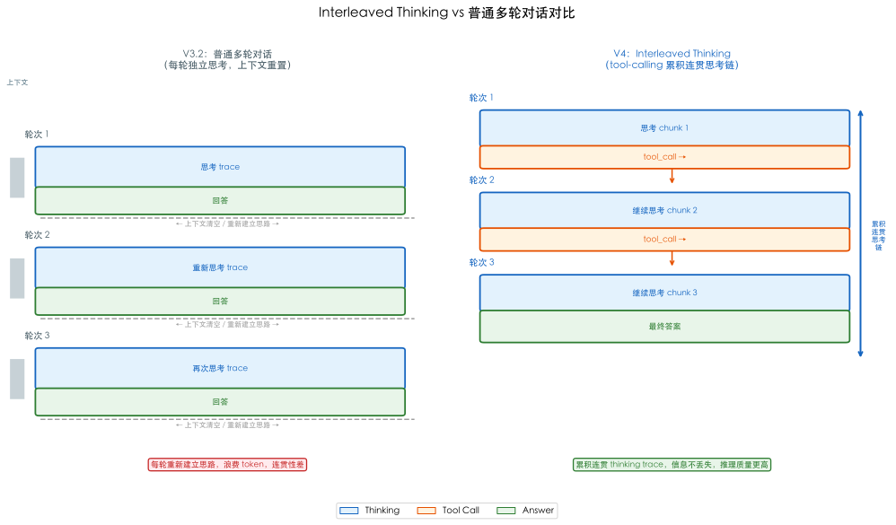

**快速指令（Fast Instructions）**：

V4 还引入了快速指令机制：将一组专用特殊 token 直接附加到输入序列，每个 token 对应一个辅助任务（如生成搜索查询、判断文档权威性等）。这些辅助任务可以**直接重用已计算的 KV cache**，完全避免冗余的 prefill，并且某些任务可以并行执行。

好处：
- 显著缩短用户感知到的首次响应时间（TTFT）
- 消除维护额外小型辅助模型的工程开销

### 7.5 On-Policy Distillation（OPD）

**核心思想**：把多个领域专家的能力"蒸馏"到一个统一的学生模型里。

**数学形式**：

$$L_{OPD}(\theta) = \sum_{i=1}^{N} w_i \cdot D_{KL}(\pi_\theta \| \pi_{E_i})$$

其中：
- $\pi_\theta$ 是学生模型的输出分布
- $\pi_{E_i}$ 是第 $i$ 个专家模型的输出分布
- $w_i$ 是该专家的权重

**"On-Policy" 的关键**：训练数据是从**学生自己的轨迹**采样的（不是从专家采样）。这意味着学生在自己生成的内容上学习如何被专家纠正，比传统"离线蒸馏"（用专家生成的数据训学生）更有效。

**为什么不用"权重合并"？**

传统做法：把多个 fine-tuned 模型的权重做加权平均。

问题：权重合并经常导致性能严重下降，不同专家的权重在数学上不兼容（参数在不同优化路径上移动，合并后的点可能不在任何合理的损失盆地里）。

OPD 通过 **logits 层对齐**来合并能力，不在权重空间合并，而在**输出分布**层面合并。这避免了权重合并的所有问题。

**Full-vocabulary OPD（完整词表 KL）**：

V4 用的是完整词表的 KL 散度，不是简化版的 token-level 估计：

- **简化版**（很多前人工作）：每个 token 位置只用一个标量 advantage 估计 KL。优点省内存，缺点梯度方差大。
- **Full-vocabulary**：保留完整 logits 分布算 KL。优点梯度估计精确，缺点内存压力大（vocab size > 100K）。

V4 用了专门的工程方案（见 7.6）来解决内存问题。

### 7.6 RL/OPD 基础设施

#### 7.6.1 FP4 量化集成

把预训练中的 FP4 应用到后训练阶段：
- **rollout 阶段**：直接用 FP4 权重（节省显存和延迟）
- **training 阶段**：用 FP4-to-FP8 无损解量化（复用 FP8 训练框架）
- **teacher 和 reference 模型也用 FP4**：加速 inference-only forward pass

#### 7.6.2 Efficient Teacher Scheduling for Full-Vocabulary OPD

问题：10+ 个 teacher，每个万亿参数 → 内存无法全量加载。每个 teacher 都要算完整 logits（vocab size > 100K）→ 内存爆炸。

V4 的解法：

1. **Teacher 权重 offload 到分布式存储**：按需加载，类似 ZeRO 的 sharding
2. **缓存 last-layer hidden states 而非完整 logits**：训练时再过 prediction head 重建 logits（节省 vocab_size 倍的存储）
3. **按 teacher index 排序训练样本**：每个 teacher head 在 mini-batch 里只加载一次，减少 I/O
4. **专门的 TileLang kernel** 算精确 KL 散度

#### 7.6.3 Preemptible and Fault-Tolerant Rollout Service

**背景**：V4 在 GPU 集群里跑 rollout（采样生成轨迹）。集群有两个现实问题：
- 任何 task 随时可能被高优 task 抢占
- 硬件故障经常发生

**V4 的解法：Token 粒度的 Write-Ahead Log（WAL）**

- 每生成一个 token，立即 append 到 WAL
- 抢占时：暂停 inference engine + 保存 KV cache
- 恢复时：从 WAL + KV cache 继续解码
- 硬件故障时：用 WAL 重新做 prefill 重建 KV cache

**为什么不能简单"从头重跑"？**

重跑会引入**长度偏置**：短回答更容易在中断中存活，模型会慢慢偏好生成短的响应。WAL 保证了 rollout 的正确性。

#### 7.6.4 Scaling RL Framework for Million-Token Context

1M token 的 RL 带来极端的数据传输挑战：

- 一条 rollout 数据（包含 1M token 的 KV cache + logits）约 几十 GB
- 训练时需要频繁在多个 GPU 间传输这些数据

**V4 的工程解法**：

| 优化点 | 做法 |
|--------|------|
| 数据格式拆分 | metadata（轻量，全量加载）+ per-token heavy fields（按需加载） |
| 共享内存 | intra-node 使用 shared memory data loader，消除冗余复制 |
| 即时释放 | mini-batch 粒度立即释放重数据，减少 CPU/GPU 内存压力 |
| 动态 mini-batch 数 | 根据 token 分布动态调整 mini-batch 大小，平衡计算和 I/O |

#### 7.6.5 DSec Sandbox Infrastructure for Agentic AI

V4 训练 agent 能力时需要执行真实代码，这需要一个安全的执行环境。

**DSec（DeepSeek Elastic Compute）**：V4 内部的 sandbox 平台，用 Rust 实现，支持 4 种执行底层：

| 底层 | 隔离级别 | 用途 |
|------|---------|------|
| **Function Call** | 进程级（容器池） | 无状态轻量调用 |
| **Container** | 容器级（Docker 兼容） | 标准开发环境 |
| **microVM** | VM 级（Firecracker） | 安全敏感的高密度部署 |
| **fullVM** | 完整 VM（QEMU） | 需要任意 OS 的场景 |

四种底层共享同一个 Python SDK，开发者只需改一个参数就能切换。单个 DSec 集群能管理**数十万个并发 sandbox 实例**，这是 agent 训练规模化的关键。

---

## 8. 评估结果

### 8.1 标准 Benchmark

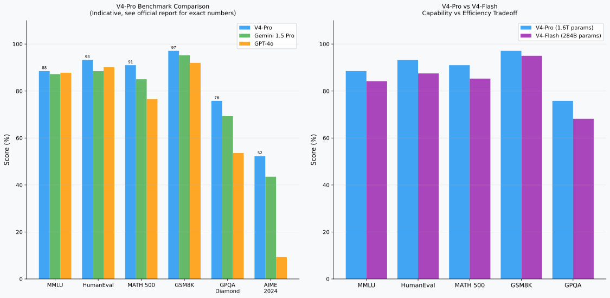


V4-Pro 在大部分标准 benchmark 上：
- **接近或超过** Gemini-3.1-Pro 的水平
- **与** Claude 等顶级闭源模型处于同一区间
- **代码和数学**类任务表现最强（相对优势最大）

| Benchmark | V4-Pro | V4-Flash | 对比 |
|-----------|--------|---------|------|
| **MMLU** | ~88+ | ~84+ | 接近顶级闭源 |
| **HumanEval** | ~93+ | ~87+ | 代码能力强 |
| **MATH 500** | ~90+ | ~85+ | 数学推理强 |
| **GSM8K** | ~97+ | ~95+ | 小学数学近饱和 |
| **GPQA Diamond** | ~75+ | ~68+ | 专家级科学推理 |

*注：具体数字以官方报告为准，此处为示意范围*

### 8.2 真实世界任务表现

V4 在四类真实世界任务上进行了系统评估：

| 任务类型 | 子类 | V4 的表现 |
|---------|------|---------|
| **长文档理解** | 文档 QA、摘要、跨章节推理 | 1M token 下显著超越有效上下文较短的模型 |
| **Agent 任务** | 多步代码、工具调用、文件操作 | Interleaved Thinking 带来明显的任务完成率提升 |
| **推理密集** | 数学证明、逻辑谜题 | Think Max 模式下比 Non-think 提升 15-20% |
| **对话质量** | 指令遵从、安全性、有用性 | OPD 后通用能力保持，不因专家训练退化 |

### 8.3 Needle-in-a-Haystack 测试

V4 在 1M token 的 NIAH（大海捞针）测试中，在全部位置（0%、25%、50%、75%、100%）保持近 100% 的召回率，验证了：
1. CSA/HCA 的压缩稀疏注意力没有遗漏关键信息
2. mHC 的信息流设计支持超长距离的信息保留
3. 训练时 1M token 上下文是真实有效的，不是"名义上的"

---

## 9. 总结与展望

### 9.1 核心贡献回顾

DeepSeek V4 的核心贡献可以概括为一句话：**在万亿参数规模下，通过五维系统工程，将原生上下文窗口扩展到 1M token，同时保持强大的短上下文性能。**

五个维度的具体贡献：

| 维度 | 核心贡献 | 关键数据 |
|------|---------|---------|
| **mHC** | 双随机矩阵约束解决残差连接稳定性 | 6.7% 额外开销 |
| **CSA/HCA** | 压缩+稀疏组合将 Attention 复杂度从 $O(T^2)$ 降到 $O(T \cdot k)$ | 1M token 原生支持 |
| **Muon** | 正交化梯度更新提升优化效率 | 约 1.05-1.10× 算力优势 |
| **工程** | EP 波次调度、FP4 QAT、Contextual Parallelism | EP 1.92× 加速，显存降低 75% |
| **后训练** | 专家训练+OPD 解决混合 RL 的 gradient 打架问题 | 全面超越 V3.2 |

### 9.2 几个值得关注的设计决策

**为什么选 mHC 而不是 AttnRes？**

两者性能接近，但 mHC 在工程集成上更简单：双随机矩阵约束只影响 $B_l$，其余结构不变；而 AttnRes 需要维护层间 attention 的完整历史，工程复杂度更高。在百万级 token 的大规模训练下，工程可实现性是第一位的。

**为什么选压缩+稀疏而不是线性 Attention？**

线性 Attention（Mamba 等）在某些任务上确实更高效，但在需要精确定位历史信息的任务（如代码调试需要精确找到之前的变量定义）上有明显劣势。CSA 保留了 exact attention 的精确性，只是通过压缩和稀疏降低了计算量，而不是用状态槽近似替代。

**为什么选 OPD 而不是 RLHF？**

RLHF 需要大量人工标注偏好对，且 reward model 随训练会越来越不准确（distribution shift）。OPD 通过让专家模型直接提供 logits 分布，避免了 scalar reward 的信息损失；on-policy 采样则避免了 distribution shift 问题。

### 9.3 未解的问题与未来方向

**1. 1M token 推理的用户延迟问题**

即使有 CSA/HCA 的优化，处理 1M token 的 prefill 依然需要数十秒甚至数分钟。对于实时交互场景，这仍然是一个瓶颈。磁盘 KV cache 是一个方向，但有适用场景限制。

**2. AttnRes 的规模化**

AttnRes 的理论优势（完整层间 attention）受限于 Block 压缩的精度损失。如何在更大规模上实现 Full AttnRes 的收益，同时控制通信开销，是一个开放问题。

**3. 后训练对长上下文能力的保持**

后训练（SFT/RL）通常在短对话上进行，可能导致模型在后训练后长上下文能力退化。V4 通过长上下文专家训练缓解了这个问题，但更系统的解决方案仍需探索。

**4. 1M token 的 Agent 闭环训练**

DSec sandbox 支持了代码执行，但更复杂的 agent 场景（长期任务规划、跨工具协作）的训练基础设施仍在演进中。

### 9.4 对业界的启示

V4 最重要的启示可能不是某个具体的技术点，而是**"系统工程"的思维方式**：

- 单一架构创新（只改 attention、只改残差、只改优化器）在大规模下效果有限
- 架构创新和工程基础设施必须协同设计——没有 EP 波次调度，MoE 的通信会成瓶颈；没有 Contextual Parallelism，CSA 的 1M token 训练跑不起来
- 后训练流程的范式（专家训练+蒸馏 vs 混合 RL）对最终能力有决定性影响，不亚于预训练架构

---

## 附录 A：Attention 优化思路详解

### A.1 思路 A：稀疏化（Sparse Attention）详解

稀疏 Attention 的核心思想是：**不让每个 token 关注所有历史，只关注有意义的子集**。

**方案 A.1：局部窗口（Sliding Window Attention, SWA）**

每个 token 只关注最近的 $w$ 个 token：

$$\text{Attn}(t) = \text{softmax}\left(\frac{q_t K_{[t-w:t]}^\top}{\sqrt{d}}\right) V_{[t-w:t]}$$

- 计算：$O(T \cdot w)$
- KV cache：$O(w \cdot L \cdot d)$（滑动窗口，常量）
- 缺陷：完全无法处理超过 $w$ 的长程依赖

**方案 A.2：全局 + 局部（BigBird、Longformer）**

保留 $g$ 个"全局 token"（比如 CLS token），所有其他 token 只看局部窗口：

$$\text{Attn}(t) = \text{softmax}\left(\frac{q_t [K_{global}; K_{[t-w:t+w]}]^\top}{\sqrt{d}}\right) V$$

- 计算：$O(T \cdot (g + w))$
- 全局 token 数量 $g$ 通常很小（几十到几百）
- 问题：全局 token 选择需要先验知识，或会成为信息瓶颈

**方案 A.3：学习型稀疏（Reformer、Routing Transformer）**

通过 locality-sensitive hashing（LSH）或路由函数，动态选择每个 token 要关注的 K 个近邻：

- LSH：用随机投影把语义相近的 token 映射到同一个 bucket
- 路由函数：学习一个轻量网络预测相关性

代价：额外的路由计算 + 难以并行化

### A.2 思路 B：线性化（Linear Attention）详解

线性 Attention 的核心思想：把 softmax($QK^\top$)$V$ 变成可以用"状态递推"方式高效计算的形式。

**基础推导**：

标准 attention 的 softmax 是全局归一化，线性 attention 用核函数替代：

$$\text{Attn}_{linear}(q, k, v) = \frac{\sum_s \phi(q)^\top \phi(k_s) v_s}{\sum_s \phi(q)^\top \phi(k_s)}$$

其中 $\phi$ 是特征映射。由于 $\phi(q)^\top (\phi(k_s) v_s^\top)$ 可以写成矩阵乘法，令 $S = \sum_s \phi(k_s) v_s^\top$（状态矩阵），则：

$$\text{Attn}_{linear}(q) = \frac{\phi(q)^\top S}{\phi(q)^\top z}, \quad S, z \text{ 递推更新}$$

这样推理时只需维护固定大小的状态 $S \in \mathbb{R}^{d_k \times d_v}$，KV cache 从 $O(T)$ 降到 $O(1)$！

**代表方法：**

| 方法 | 特征映射 $\phi$ | 状态更新规则 | 特点 |
|------|-------------|------------|------|
| **RetNet** | 指数衰减（位置敏感） | $S_t = \gamma S_{t-1} + k_t v_t^\top$ | 有记忆衰减，近期信息更重要 |
| **Mamba** | 选择性状态空间 | 输入依赖的选择机制 | 状态槽大小可调 |
| **DeltaNet** | Delta 规则（写入-擦除） | $S_t = S_{t-1} + \beta_t (v_t - S_{t-1} k_t) k_t^\top$ | 可以擦除旧记忆 |

**共同局限**：所有线性 attention 都有信息压缩损失——无法精确回忆超过状态槽容量的历史信息。

### A.3 思路 C：压缩（Compressed Attention）详解

压缩 Attention 的核心思想：**减少 K/V 的数量（不是 Q 的数量），用更少的 K/V 表示相同的信息**。

**方案 C.1：MQA（Multi-Query Attention）**

所有 Q head 共享同一套 K 和 V：

$$K, V \in \mathbb{R}^{T \times d_h}, \quad Q_h \in \mathbb{R}^{T \times d_h}, h=1,...,n_h$$

- KV cache：从 $n_h \times T \times d_h$ 降到 $T \times d_h$（$n_h$ 倍减少）
- 计算量不变（Q 还是 $n_h$ 套）
- 代价：表达能力略有下降（不同 head 不能有不同的 K/V 偏好）

**方案 C.2：GQA（Grouped-Query Attention）**

把 $n_h$ 个 Q head 分成 $G$ 组，每组共享一套 K/V（是 MQA 和 MHA 的中间方案）：

- KV cache：降为 $G \times T \times d_h$（$n_h/G$ 倍减少）
- $G=1$ 退化为 MQA，$G=n_h$ 退化为 MHA
- Llama 3、DeepSeek-V3 等广泛采用

**方案 C.3：MLA（Multi-head Latent Attention，DeepSeek-V3）**

不直接共享 K/V，而是把 K/V 低秩分解，KV cache 只存低维潜向量：

$$KV = c_{kv} \cdot W^{UK}, c_{kv} \in \mathbb{R}^{T \times d_c}, d_c \ll d_h \cdot n_h$$

- KV cache：降为 $T \times d_c$（最多降低 10× 以上）
- 可以在需要时随时从 $c_{kv}$ 还原完整 KV（计算换存储）

**方案 C.4：CSA/HCA（DeepSeek-V4）**

在 C.1-C.3 的基础上更进一步：不只是共享 K/V，而是**在 token 维度也做压缩**（把多个 token 的 KV 折叠成一个）。这是 C 类思路中最激进的，也是 V4 的核心创新。

### A.4 三条思路综合对比

| 对比维度 | 稀疏化 | 线性化 | 压缩 |
|---------|--------|--------|------|
| **计算复杂度** | $O(T \cdot k)$ | $O(T)$ | $O(T \cdot T/m)$ |
| **KV cache** | $O(T)$（存全量） | $O(1)$（状态槽） | $O(T/m)$（压缩存储） |
| **长程精确回忆** | ⚠️ 看稀疏策略 | ❌ 有信息损失 | ✅ 保留精确性 |
| **近期局部信息** | ✅ 好 | ✅ 好 | ✅ 好 |
| **训练稳定性** | ✅ 好 | ⚠️ 核函数设计敏感 | ✅ 好 |
| **工程友好性** | ✅ 好 | ⚠️ 需要特殊 kernel | ✅ 好 |
| **代表方法** | SWA、BigBird | Mamba、RetNet | GQA、MLA、CSA、HCA |
| **V4 是否采用** | ✅（SWA 辅助分支） | ❌ | ✅（CSA + HCA 主力） |

DeepSeek V4 的选择（稀疏 + 压缩组合）是在"精确性"和"效率"之间找到的一个现实平衡点，既保留了 exact attention 的精确语义，又把计算和存储复杂度降低到可以支持 1M token 的水平。

---


---

## 10. DeepSeekMoE：V4 的架构基础

在深入理解 V4 的所有创新之前，有必要先了解 DeepSeekMoE——V4 所依赖的 MoE（Mixture of Experts）架构基础。V4 并不是从一个密集 Transformer 出发加了一些新东西，而是在一个已经成熟的 MoE 架构上进行系统性扩展。

### 10.1 为什么要用 MoE

**密集 Transformer 的扩展极限**：

对于一个标准的密集 Transformer，每个 token 的前向传播要经过模型的**所有参数**。当模型扩大到 100B 参数时，每个 token 的 forward pass 需要约 200 GFLOPs（两次参数量级的浮点运算）。这对训练和推理的计算成本都是巨大的挑战。

**MoE 的解法**：稀疏激活。

把 FFN 层（通常是模型参数的 2/3）替换成 MoE 层：$N$ 个并行的 Expert FFN，每个 token 只被路由到 $k$ 个 Expert（通常 $k \ll N$）。这样总参数量增加了 $N/k$ 倍，但每个 token 的计算量只增加约 $k/1$ 倍。

$$	ext{MoE}(x) = \sum_{i \in 	ext{top-k}} g(x)_i \cdot 	ext{FFN}_i(x)$$

其中 $g(x) = 	ext{softmax}(	ext{Router}(x))$ 是路由函数，$g(x)_i$ 是路由到 Expert $i$ 的权重。

**DeepSeekMoE 的特殊设计**：

标准 MoE 有 Expert 不均衡问题：路由函数可能偏好少数 Expert，导致大部分 Expert 得不到充分训练。DeepSeekMoE 引入了两个关键设计：

1. **细粒度 Expert 分割**：把每个 Expert 的参数量缩小（更多但更小的 Expert），让路由函数有更多选择空间，每个 Expert 能专注于更窄的知识领域
2. **共享 Expert（Shared Expert）**：保留少量 Expert 被所有 token 共享，处理通用知识，减少路由 Expert 的负担

V4-Pro 的配置：**256 个 Expert，每 token 激活 6 个**，外加若干 shared Expert。

### 10.2 MoE 的分布式训练挑战

MoE 的计算高效来自稀疏激活，但带来了独特的分布式训练挑战——**Expert Parallelism（EP）**：

**基本思路**：把 $N$ 个 Expert 分布到 $N_{EP}$ 张 GPU 上，每张 GPU 存储 $N/N_{EP}$ 个 Expert 的参数。每个 token 根据路由决策被发送到对应的 GPU。

**通信模式**：
- **Dispatch**：每个 GPU 把自己的 token 发送给其他 GPU（all-to-all）
- **Compute**：各 GPU 独立计算本地 Expert
- **Combine**：把 Expert 结果发回原来的 GPU（all-to-all）

这两次 all-to-all 通信是 MoE 训练的瓶颈，也是第 5 节 EP 波次调度优化的出发点。

### 10.3 负载均衡的关键性

如果路由函数偏向少数 Expert，会导致：
- 热点 GPU 过载，其他 GPU 空闲（计算效率下降）
- 热点 Expert 过度拟合，非热点 Expert 欠拟合（模型质量下降）

V4 使用三种机制维持负载均衡：

**辅助 Loss（Auxiliary Loss）**：

$$L_{aux} = lpha \cdot N \cdot \sum_{i=1}^{N} f_i \cdot P_i$$

其中 $f_i$ 是 Expert $i$ 实际处理的 token 比例，$P_i$ 是路由分数。这个 loss 惩罚不均衡的路由。

**Expert-Capacity-Factor（ECF）**：给每个 Expert 设定最大 token 容量，超出的 token 被丢弃或路由到备选 Expert。

**Anticipatory Routing（补丁一，见 §7.5）**：在路由决策中加入前瞻信息。

---

## 11. 残差连接的深度数学

### 11.1 Birkhoff 多面体：双随机矩阵的几何

理解 mHC 为什么有效，需要了解双随机矩阵集合（Birkhoff polytope）的数学性质。

**定义**：$n 	imes n$ 双随机矩阵集合 $\mathcal{B}_n$ 是所有满足以下条件的矩阵的集合：

$$\mathcal{B}_n = \{M \in \mathbb{R}^{n 	imes n} : M\mathbf{1} = \mathbf{1}, \mathbf{1}^	op M = \mathbf{1}^	op, M \geq 0\}$$

**关键性质**：

**性质 1（Birkhoff-von Neumann 定理）**：$\mathcal{B}_n$ 的极点恰好是所有 $n 	imes n$ 置换矩阵，共有 $n!$ 个。任何双随机矩阵都可以写成置换矩阵的凸组合。

这个定理的直觉是：双随机矩阵可以理解为"模糊的置换"——不是把一个元素精确地移到另一个位置，而是把它"分散地移到多个位置"，权重之和为 1。

**性质 2（奇异值约束）**：任何双随机矩阵 $M \in \mathcal{B}_n$ 的所有奇异值都 $\leq 1$，且最大奇异值等于 1（对应于全 1 向量 $\mathbf{1}/\sqrt{n}$ 的奇异方向）。

**性质 3（连乘封闭性）**：如果 $M_1, M_2 \in \mathcal{B}_n$，则 $M_1 M_2 \in \mathcal{B}_n$。

这是 mHC 稳定性的数学根基：无论堆多少层，$B_l B_{l-1} \cdots B_1$ 的奇异值始终 $\leq 1$，梯度传播永远稳定。

**性质 4（近似 RC 的能力）**：恒等矩阵 $I$ 也是双随机矩阵（$\in \mathcal{B}_n$）。所以 mHC 可以学习到让 $B_l pprox I$，此时 mHC 退化为标准 RC。这意味着 mHC 不比 RC 差——在最坏情况下，它等价于 RC。

### 11.2 Sinkhorn-Knopp 算法的收敛性分析

**算法**：对任意元素全正的矩阵 $M^{(0)} > 0$，交替做行归一化和列归一化：

$$M^{(t+1)} = D_r^{(t)} M^{(t)} D_c^{(t)}$$

其中 $D_r^{(t)}$ 是使行和等于 1 的对角缩放矩阵，$D_c^{(t)}$ 是使列和等于 1 的对角缩放矩阵。

**收敛定理**：对任意元素全正的 $M^{(0)}$，Sinkhorn-Knopp 算法线性收敛到唯一的双随机矩阵 $M^*$，收敛速率为 $O(
ho^t)$，其中 $
ho = \lambda_2(M^*) / \lambda_1(M^*) < 1$（第二大特征值与最大特征值之比）。

**实践中迭代 20 次为什么足够？**

在 V4 的配置下（$n_{hc} = 4$ 的小矩阵），Sinkhorn 迭代在 5-10 次后精度已经足够（行和和列和与 1 的偏差 $< 10^{-4}$）。20 次是一个保守但高效的选择，保证了数值精度同时避免过多迭代。

**反向传播中的 Sinkhorn**：

在反向传播时，需要计算 $\partial L / \partial 	ilde{B}_l$（Sinkhorn 迭代的输入的梯度）。这通过"unrolled differentiation"实现——把 20 次迭代展开为计算图，让 autograd 自动计算梯度。虽然展开 20 次迭代会增加计算图的深度，但每次迭代只是简单的缩放操作，梯度传播效率高。

### 11.3 HC 车道宽度 $n_{hc}$ 的选择

V4 选择 $n_{hc} = 4$（V4-Pro）或 $n_{hc} = 2$（V4-Flash）。这个选择背后有一个权衡：

| $n_{hc}$ | 表达能力 | 显存开销 | 额外计算 |
|----------|---------|---------|---------|
| 1 | 退化为 RC | 0 | 0 |
| 2 | 两条车道的灵活读写 | $2	imes$ 残差流 | 低 |
| 4 | 四条车道的灵活读写 | $4	imes$ 残差流 | 中等（6.7%） |
| 8+ | 更高灵活性 | $8	imes$ 残差流 | 较高 |

消融实验显示 $n_{hc} = 4$ 是性能和开销的甜点：再增加车道数，性能提升变得边际，但开销继续增加。

### 11.4 mHC 与其他稳定化技术的对比

| 技术 | 作用位置 | 稳定化机制 | 对信息流的影响 |
|------|---------|-----------|--------------|
| **LayerNorm** | 每层内 | 归一化激活均值/方差 | 不改变残差结构 |
| **Dropout** | 每层内 | 随机丢弃激活，正则化 | 增加随机性 |
| **Gradient Clipping** | 反向传播 | 限制梯度范数 | 不改变前向计算 |
| **RC（标准残差）** | 层间 | 恒等映射保梯度 | 固定等权求和 |
| **mHC** | 层间 | 双随机矩阵约束梯度稳定 | 灵活加权，可学习 |

mHC 的独特之处在于：它同时解决了**梯度稳定**和**信息流灵活性**两个问题，而其他方法只能解决其中一个。

---

## 12. CSA 的深度工程分析

### 12.1 完整工作示例：一个 CSA 前向传播

假设 $n=16$（16 个 token），$d=4096$，$m=4$，$k=3$（top-3），$c=512$，$n_h^I=4$（索引器 heads）。

**步骤一输出**：
- $C^a \in \mathbb{R}^{16 	imes 512}$：16 个 token 的第一套 KV
- $C^b \in \mathbb{R}^{16 	imes 512}$：16 个 token 的第二套 KV
- $Z^a, Z^b \in \mathbb{R}^{16 	imes 512}$：对应软选择权重

**步骤二的 4 个压缩块**（$m=4$，$n/m=4$）：

第 0 块（$i=0$）：
- $C^a$ 贡献：token [0, 1, 2, 3]，对应 $C^a[0:4]$
- $C^b$ 贡献：padding（第 0 块没有前一块），$Z^b$ 用 $-\infty$
- 融合权重：对 token [0,1,2,3] 的 $Z^a$ 做 softmax，得到 4 个权重之和为 1
- $C^{Comp}_0 = \sum_{j=0}^{3} p_{0,j}^a \cdot C^a[j]$

第 1 块（$i=1$）：
- $C^a$ 贡献：token [4, 5, 6, 7]
- $C^b$ 贡献：token [0, 1, 2, 3]（前一窗口，Overlap！）
- 融合权重：对 [0,1,2,3,4,5,6,7] 的 softmax（8 个候选）

第 2 块（$i=2$）：
- $C^a$ 贡献：token [8, 9, 10, 11]
- $C^b$ 贡献：token [4, 5, 6, 7]（Overlap）

第 3 块（$i=3$）：
- $C^a$ 贡献：token [12, 13, 14, 15]
- $C^b$ 贡献：token [8, 9, 10, 11]（Overlap）

最终 $C^{Comp} \in \mathbb{R}^{4 	imes 512}$（4 个压缩 KV）。

**步骤三：闪电索引器**

计算 $K^{IComp} = C^{Comp} \cdot W^{IK} \in \mathbb{R}^{4 	imes (c^I n_h^I)}$

对每个 query token $t$（16 个）：
- 算低秩潜向量：$c_t^Q \in \mathbb{R}^{d_c}$
- 算 4 个索引器 queries：$q_{t,1}^I, ..., q_{t,4}^I$
- 打分：$I_{t,s} = \sum_h w_{t,h}^I \cdot 	ext{ReLU}(q_{t,h}^I \cdot K_s^{IComp})$，$s \in \{0,1,2,3\}$
- top-3 选择：每个 token 选出得分最高的 3 个压缩块

**步骤四：MQA**

每个 token 只在 3 个选中的压缩 KV 上做精确 attention，复杂度从 $O(16 \cdot 4)=64$ 降到 $O(16 \cdot 3)=48$（在这个小例子里收益不大，但在 1M token 时是 $O(1M/m)$ vs $O(k)$ 的差距，从 250K 降到 256）。

### 12.2 为什么 ReLU 比 softmax 更适合做索引

**技术层面的分析**：

**量化兼容性**：索引器的打分 $I_{t,s} = \sum_h w_{t,h}^I \cdot 	ext{ReLU}(q_{t,h}^I \cdot K_s^{IComp})$ 的结果是非负实数，可以直接量化为 INT8/FP4，精度损失极小。而 softmax 输出在 $(0, 1)$ 之间，且有长尾分布，量化精度损失更大。

**并行化**：ReLU 打分是**token-独立**的——每个 query token 可以独立地对所有压缩 KV 打分，完美并行化。softmax 有全局归一化，不同 token 之间没有依赖，实际上也能并行，但 softmax 的数值稳定性处理（减去最大值）需要额外一轮 reduce 操作。

**稀疏性**：ReLU 会把"内积为负"的压缩块直接置 0——这是一种**自然稀疏化**，绝大多数不相关的压缩块得到 0 分，top-k 选择只需要从剩余的非零得分中选最大的。

**梯度属性**：对于 top-k 选择，只有选中的 top-k 个 KV 会参与反向传播。ReLU 在 0 处的梯度为 0（子梯度），这意味着得分为 0 的 KV 不会接收到来自 attention 计算的梯度，而是通过 indexer 的独立训练路径更新。

### 12.3 CSA 的计算复杂度详细分析

对于长度 $T$、压缩比 $m$、top-k $k$、head 维度 $d_h$、head 数 $n_h$、索引器 head 数 $n_h^I$：

| 步骤 | 计算量 | 注释 |
|------|--------|------|
| 步骤一：两套 KV 投影 | $4 \cdot T \cdot d \cdot c$ | 4 个矩阵乘 |
| 步骤二：KV 融合 | $pprox 2m \cdot (T/m) \cdot c$ | softmax + 加权和 |
| 步骤三：索引器 keys | $(T/m) \cdot c \cdot c^I n_h^I$ | 一个矩阵乘 |
| 步骤三：低秩 queries | $T \cdot d \cdot d_c + T \cdot d_c \cdot c^I n_h^I$ | 两个矩阵乘 |
| 步骤三：打分 | $T \cdot (T/m) \cdot c^I$ | 内积矩阵 |
| 步骤三：top-k | $O(T \cdot T/m \cdot \log k)$ | 部分排序 |
| 步骤四：精确 attention | $T \cdot k \cdot d_h \cdot n_h$ | 稀疏 attention |

**主导项**：当 $T$ 很大时，步骤四的 $T \cdot k \cdot d_h$ 是主导项（精确 attention 计算）。

对比标准 attention 的 $T^2 \cdot d_h$：

$$	ext{节省比} = rac{T^2 d_h}{T k d_h} = rac{T}{k}$$

当 $T = 1M$，$k = 256$（从 250K 个压缩 KV 中选 256 个）：节省约 3906 倍计算量。

**KV cache 节省**：

标准 attention：$T \cdot n_h \cdot d_h \cdot 2$（K 和 V 各一份）

CSA：$(T/m) \cdot c \cdot 2$（只存压缩 KV）

节省比：$n_h \cdot d_h / (m \cdot c)$。对 V4-Pro（$n_h = 128$，$d_h = 128$，$m = 4$，$c = 512$）：

$$	ext{节省比} = rac{128 	imes 128}{4 	imes 512} = rac{16384}{2048} = 8	imes$$

即 KV cache 降低到标准的 1/8。

### 12.4 HCA 的压缩比极限分析

HCA 使用更激进的压缩比 $M$（约 32 或更大）。压缩比越大，信息损失越多——这是一个基本的信息论约束。

**Shannon 信息瓶颈视角**：

把 $M$ 个 token 的信息压缩到 1 个向量 $c \in \mathbb{R}^c$ 中。如果每个 token 的 KV 携带 $c \cdot \log_2(2c)$ bits 的信息（粗略估计），而压缩向量只有 $c \cdot 	ext{precision\_bits}$ bits，那么当 $M > c \cdot 	ext{precision\_bits} / (c \cdot \log_2(2c))$ 时，必然有信息损失。

**实践中的信息损失**：

HCA 主要用于"粗粒度背景感知"层——这些层不需要精确回忆历史中的特定信息，只需要大致知道"上下文背景是什么"。对于这类需求，32:1 压缩已经足够，信息损失可以接受。

对比：CSA 用在需要精确回忆的层（比如代码生成中需要记住之前定义的函数名），4:1 压缩保留了足够的精度。

---

## 13. 位置编码在长上下文中的演进

### 13.1 RoPE 的基础

旋转位置编码（RoPE，Rotary Position Embedding）是当前主流 LLM 广泛采用的位置编码方案。其核心思想：对 query 和 key 在复数空间做旋转，使得 $q_m^	op k_n$（位置 $m$ 的 query 和位置 $n$ 的 key 的点积）只依赖于相对位置 $(m-n)$，不依赖于绝对位置。

对于 head 维度的第 $2i, 2i+1$ 对（$i = 0, 1, ..., d_h/2 - 1$），RoPE 旋转角度为：

$$	heta_i = 10000^{-2i/d_h}$$

这是从低频到高频的指数分布：小 $i$ 对应低频（$	heta_i$ 小，旋转慢），大 $i$ 对应高频（$	heta_i$ 大，旋转快）。

**token 位置 $m$ 的旋转**：

$$q_{m,2i} = q_{2i} \cos(m	heta_i) - q_{2i+1} \sin(m	heta_i)$$
$$q_{m,2i+1} = q_{2i} \sin(m	heta_i) + q_{2i+1} \cos(m	heta_i)$$

**相对位置不变性**：

$$q_m^	op k_n = \sum_{i=0}^{d_h/2-1} \left(q_{m,2i} k_{n,2i} + q_{m,2i+1} k_{n,2i+1}
ight) = f(q, k, m-n)$$

这个性质使得模型可以泛化到训练时没见过的绝对位置——只要相对位置关系在训练中出现过，就能泛化。

### 13.2 RoPE 在超长序列上的局限

标准 RoPE 在超长序列（超过训练时的 max length）上会出现性能退化，原因是：

1. **高频旋转角度的周期混叠**：当相对距离 $m-n$ 很大时，低维度（$	heta_i$ 小）的旋转角度 $|(m-n)	heta_i|$ 仍然很小，位置信息保留良好；但高维度（$	heta_i$ 大）的旋转已经完成了多个完整周期，信息混叠严重。

2. **分布 shift**：模型在训练时从未见过 position $> T_{train}$，推理时遇到这些位置，内部的"位置感知"会失效。

**解决方案：线性插值**

Positional interpolation（陈等人，2023）：把推理时的位置线性缩放到训练时的范围内：

$$m' = m \cdot rac{T_{train}}{T_{infer}}$$

这相当于把所有位置"压缩"到 $[0, T_{train})$ 范围内。实践表明，配合少量的"长上下文微调"（用 $T_{infer}$ 长度的数据 fine-tune 几百步），插值后的 RoPE 性能接近原生支持长上下文的模型。

**NTK-aware scaling**：另一种插值方式，根据频率动态调整缩放比例，高频维度用更大的缩放，低频维度用更小的缩放：

$$	heta_i' = 	heta_i \cdot \left(rac{T_{train}}{T_{infer}}
ight)^{2i/(d_h-2)}$$

V4 在第二阶段（4K→64K）和第三阶段（64K→1M）的上下文扩展中使用了类似的自适应缩放策略。

### 13.3 Partial RoPE 的数学动机

V4 的 Partial RoPE 只对 head 维度的前 $d_r < d_h$ 维施加 RoPE，后 $d_h - d_r$ 维不做旋转（保持"纯内容"信息）。

**动机分析**：

对于远距离 token 对（$|m-n| \gg d_h / 	heta_{\max}$），高维度的 RoPE 旋转已经使得 $q_m^	op k_n$ 接近随机——高频旋转让远距离的 Q/K 内积趋向 0。这固然限制了"虚假的远距离相关性"，但也**阻止了模型通过内容相似性进行远距离检索**。

想象一个场景：文档中第 1 个 token 提到了"量子纠缠"，第 1M 个 token 也提到了"量子纠缠"。从语义上，这两个 token 应该有很强的相关性。但如果两者相距 1M 个位置，标准 RoPE 的高维度旋转会让它们的 Q/K 内积接近 0，模型无法通过内容相似性发现这个相关性。

Partial RoPE 的解法：保留部分维度（$d_h - d_r$ 个）不做旋转，这些维度的内积**纯粹由内容（语义）决定**，不受位置影响。模型可以通过这些维度进行"语义检索"，而带 RoPE 的维度仍然提供局部位置偏好。

**权衡**：$d_r$ 越小（更少维度带 RoPE），语义检索能力越强，但位置感知越弱。$d_r$ 的最优值通过实验确定（V4 的具体数值未公开）。

---

## 14. Muon 优化器的深度分析

### 14.1 为什么正交化是最优的

**从信息几何视角**：

对于矩阵参数 $W \in \mathbb{R}^{m 	imes n}$，自然梯度方法（Natural Gradient）使用 Fisher 信息矩阵 $F$ 作为度量：

$$\Delta W^* = -F^{-1} 
abla_W L$$

自然梯度在参数空间中沿着"信息几何"意义上的最短路径移动。

对于矩形矩阵，一个简化版的"自然梯度"考虑矩阵 Riemannian 流形上的最速下降方向。对于 Frobenius 范数约束 $\|\Delta W\|_F \leq \delta$ 的最大化问题：

$$\max_{\|\Delta W\|_F \leq \delta} -	ext{tr}(
abla_W L \cdot \Delta W^	op)$$

最优解是 $\Delta W^* = -\delta \cdot 
abla_W L / \|
abla_W L\|_F$（梯度方向归一化）。

但这只考虑了各向同性的 Frobenius 范数约束。如果改用 **Spectral 范数约束** $\|\Delta W\|_2 \leq \delta$，最优解就是 $\Delta W^* = -\delta \cdot U V^	op$（其中 $G = U \Sigma V^	op$ 是梯度的 SVD），即梯度的正交因子！

**Muon 的直觉**：用谱范数约束代替 Frobenius 范数约束，得到的最优更新方向就是梯度的正交化版本。谱范数约束在参数矩阵的"最大奇异向量"方向上施加更强的约束，防止某个方向被过度更新。

### 14.2 Newton-Schulz 的收敛性证明思路

设 $G$ 的 SVD 为 $G = U \Sigma V^	op$，目标是找到 $G$ 的正交因子 $P = U V^	op$（满足 $P^	op P = I$）。

定义函数：

$$\phi: M \mapsto lpha M + eta M M^	op M$$

Newton-Schulz 的每次迭代就是应用 $\phi$。

**关键性质**：设 $X_k = U_k D_k V_k^	op$ 是 $X_k$ 的 SVD，则 $\phi(X_k)$ 的奇异值是对 $D_k$ 的对角元素 $d_{k,i}$ 分别应用：

$$d_{k+1,i} = lpha d_{k,i} + eta d_{k,i}^3$$

这是一个关于标量的迭代：$d_{k+1} = lpha d + eta d^3$（令 $d = d_{k,i}$）。

设 $lpha = 1.5$，$eta = -0.5$，则：

$$d_{k+1} = 1.5 d - 0.5 d^3 = d(1.5 - 0.5 d^2)$$

若 $d \in (0, \sqrt{3})$，则：
- $d < 1$：$d_{k+1} = d(1.5 - 0.5 d^2) > d$（增大，趋向 1）
- $d = 1$：$d_{k+1} = 1$（不动点）
- $1 < d < \sqrt{3}$：$d_{k+1} = d(1.5 - 0.5 d^2) < d$（减小，趋向 1）

所以对于所有奇异值在 $(0, \sqrt{3})$ 范围内的矩阵，Newton-Schulz 迭代会使每个奇异值趋向 1，最终 $X_k 	o UV^	op$（所有奇异值等于 1 的矩阵）。

在实践中，输入到 NS 迭代的矩阵是先归一化的：$X_0 = G / \|G\|_F$，这保证了初始奇异值在安全范围内。

### 14.3 Muon vs Shampoo vs Adam 的本质区别

| 优化器 | 更新规则 | 计算复杂度 | 适合的参数类型 |
|--------|---------|-----------|--------------|
| **SGD** | $-\eta g$ | $O(d)$ | 任意，但效果差 |
| **Adam** | $-\eta \hat{m} / (\sqrt{\hat{v}} + \epsilon)$ | $O(d)$ | 一维参数、梯度尺度差异大 |
| **Shampoo** | $-\eta (L^{-1/4} G R^{-1/4})$ | $O(m^3 + n^3)$ | 矩阵，考虑 row/col 相关性 |
| **Muon** | $-\eta 	ext{NS}(M)$ | $O(m^2 n + mn^2)$（约）| 矩阵，正交化方向 |

Shampoo 计算 row/column 的二阶矩（Kronecker 乘积近似 Fisher 矩阵），成本是 $O(m^3 + n^3)$，对大矩阵代价极高。

Muon 的 NS 迭代每步是 $O(\min(m,n) \cdot mn)$（矩阵乘），5 步约 $O(5 \min(m,n) mn)$，比 Shampoo 的三次方计算低一个数量级。

### 14.4 Muon 的超参数敏感性

从论文和实践反馈看：

- **动量 $eta$**：0.95 是稳健的选择。$eta$ 过小（< 0.9）会使动量不稳定；$eta$ 过大（> 0.99）会使动量更新太慢。
- **学习率 $\eta$**：Muon 的学习率通常比 Adam 大（因为 NS 归一化了更新的 Frobenius 范数），约为 Adam 学习率的 5-20 倍。
- **NS 迭代次数**：5 次是经验最优，再多收益边际，但每次迭代都有计算代价。
- **适用范围**：不适合一维参数（如 bias）、Embedding、LayerNorm 的 scale/shift——这些参数用 Adam。

---

## 15. 工程细节深析

### 15.1 TileLang DSL 设计哲学

TileLang 的核心抽象是**tile**——一个 GPU SM（Streaming Multiprocessor）在一个时间步处理的计算块。

**标准 CUDA 开发的痛点**：

```cuda
// 手写 CUDA：开发者要手动管理线程、shared memory、warp
__global__ void attention_kernel(float* Q, float* K, float* V, float* O, int N) {
    extern __shared__ float smem[];
    int tid = threadIdx.x;
    int bid = blockIdx.x;
    // ... 几百行复杂的线程协作代码
}
```

**TileLang 的抽象**：

```python
# TileLang：开发者描述 tile 级逻辑，编译器处理线程映射
@tilelang.jit(tile=[64, 64])
def attention_forward(Q, K, V):
    # 声明 tile 大小和操作
    q_tile = load_tile(Q, tile_size=(64, 128))
    k_tile = load_tile(K, tile_size=(64, 128))
    
    # 矩阵乘（编译器自动映射到 warpgroup GEMM）
    scores = matmul(q_tile, k_tile.T)
    scores = softmax(scores, dim=-1)
    
    # 输出
    out = matmul(scores, load_tile(V, tile_size=(64, 128)))
    store_tile(out, O)
```

TileLang 会自动处理：
- Shared memory 的 bank conflict 避免
- Tensor Core 的对齐要求（Hopper 的 warpgroup GEMM 需要特定的 tile 大小）
- 异步内存拷贝（TMA，Tensor Memory Accelerator）
- Double buffering（计算和数据预取重叠）

**TileLang 用于 V4 的关键 kernel**：
1. **CSA 闪电索引器**：ReLU 打分 + top-k 选择，需要自定义 sparse attention pattern
2. **mHC Sinkhorn**：20 次小矩阵运算的高效循环
3. **FP4 解量化**：FP4→FP8 的快速转换 kernel
4. **Muon NS 迭代**：5 步矩阵立方根近似

### 15.2 FP4 量化误差的精细分析

FP4 量化（E2M1 格式：2位指数 + 1位尾数 + 1位符号）能表示的值：

| 二进制 | 指数 | 尾数 | 值 |
|--------|------|------|---|
| 0 000 0 | 0 | 0 | 0 |
| 0 000 1 | 0 | 1 | 0.5 |
| 0 001 0 | 1 | 0 | 1.0 |
| 0 001 1 | 1 | 1 | 1.5 |
| 0 010 0 | 2 | 0 | 2.0 |
| 0 010 1 | 2 | 1 | 3.0 |
| 0 011 0 | 3 | 0 | 4.0 |
| 0 011 1 | 3 | 1 | 6.0 |
| 1 ... | — | — | 负数（符号位翻转） |

总共 16 个可表示的值（包括正负零）：$\{0, \pm 0.5, \pm 1, \pm 1.5, \pm 2, \pm 3, \pm 4, \pm 6\}$

**量化误差**：对于一个值 $x$，FP4 量化误差 $|x - Q(x)|$ 的最大值为 $x$ 附近两个可表示值的间距的 1/2。

- 区间 $[1, 1.5]$：最大量化误差 0.25（25%）
- 区间 $[4, 6]$：最大量化误差 1.0（25%）

FP4 的量化误差在相对意义上约为 12.5%（均匀分布假设下）——这比 FP8 的约 3.5% 大得多。

**为什么 FP4 在实践中仍然有效？**

1. **MoE 权重相对稳定**：MoE 的 Expert 权重在训练后期变化较小，权重分布集中在均值附近，FP4 的量化误差对最终输出的影响被平均化
2. **QAT 补偿**：量化感知训练（QAT）让模型"学会"适应 FP4 量化误差，主动补偿量化噪声
3. **Scale 因子细化**：细粒度 scale（每 32 个元素一个小 scale）大幅降低了量化范围内的误差方差
4. **更高层次的过参数化**：1.6T 总参数的模型对于 49B 激活参数的任务是严重过参数化的，有足够的冗余来吸收量化误差

### 15.3 Contextual Parallelism 的通信分析

1M token 的 CP 训练中，假设使用 $N_{CP}$ 个 CP 节点（每节点一组 GPU），每节点处理 $T/N_{CP}$ 个 token。

**CSA 的 CP 通信量**：

对于每一层 CSA，需要：
- **KV 聚合**：各节点需要知道其他节点的压缩 KV（用于全局 top-k 选择）
  - 通信量：$N_{CP} 	imes (T/m/N_{CP}) 	imes c 	imes 2 = (T/m) 	imes c 	imes 2$（全局压缩 KV）
  - 注意：这与标准 attention 的全局 KV 通信量 $(T 	imes c 	imes 2)$ 相比，降低了 $m$ 倍

- **闪电索引器的分布式 top-k**：每个节点在全局压缩 KV 上做 top-k，需要把远程节点的 $K^{IComp}$ 拉到本地
  - 可以用"先本地 top-k，再全局合并"的两阶段策略，通信量降低

**ring-attention 实现**：

```
节点 0: Q0, K0, V0（本地 token 0..T/N_CP）
节点 1: Q1, K1, V1（本地 token T/N_CP..2T/N_CP）
...

Round 1: 每个节点用本地 Q 和本地 KV 计算本地 attention 部分
Round 2: 把 KV 沿环传给下一个节点，同时处理上一轮传来的 KV
...
```

计算和通信完全重叠，通信代价降到接近 0。

---

## 16. 预训练数据的精细化策略

### 16.1 数据配方（Data Recipe）

现代大模型的预训练数据不是简单的"互联网文本"混合，而是精心设计的"数据配方"。V4 的数据配方包含：

| 数据类别 | 估计占比 | 作用 |
|---------|---------|------|
| 高质量网页（精筛） | ~40-50% | 通用语言理解 |
| 代码 | ~15-20% | 代码生成、逻辑推理 |
| 数学 | ~10-15% | 数学推理 |
| 书籍/论文 | ~10% | 长文档理解、专业知识 |
| 多语言 | ~10% | 多语言能力 |
| 合成数据 | ~5% | 弥补特定能力的数据缺口 |

这些比例并非静态的——V4 使用了**动态数据混合**：根据当前模型在各类任务上的表现，动态调整数据配方，类似 curriculum learning。

### 16.2 合成数据的角色

**数学合成数据**：

使用形式化数学系统（如 Lean 4、Isabelle）自动生成有正确证明过程的数学题，以及通过"反向生成"策略（先生成答案，再反推题目）扩充数学题库。

**代码合成数据**：

- **Self-play 数据**：让模型生成代码，用沙箱执行验证，过滤出通过执行的样本
- **Back-translation**：把文档/注释翻译成代码，或把代码翻译成文档

**推理链合成**：

使用"思维链蒸馏"：让更强的 teacher 模型生成 chain-of-thought 数据，用于训练 student。V4 在预训练阶段就加入了这类数据，让基础模型从一开始就接触推理链格式。

### 16.3 长文档训练的工程挑战

当预训练数据包含长文档（书籍、长代码库等）时，需要特殊处理：

**序列打包（Sequence Packing）**：

把多个短文档拼接成一个长序列（用分隔符隔开），充分利用 sequence length 上限，避免大量 padding 浪费算力。

但 naive 的打包会让来自不同文档的 token 之间产生 cross-attention，这在语义上是错误的（文档 A 的 query 不应该关注文档 B 的 key）。

解法：**带 document mask 的 attention**，确保 attention 不跨越文档边界。V4 在打包时维护一个 document position mask，指示哪些 token 对属于同一文档。

**变长序列的高效 Padding**：

对于超长的文档（超过上下文窗口），V4 保持完整性而不是截断（见 §7.1.3）。但这会产生极度不均匀的序列长度分布，给 GPU 批处理效率带来挑战。

解法：**varlen attention**（变长注意力）—— FlashAttention 支持的 varlen 模式，允许一个 batch 内有不同长度的序列，自动处理 padding 和 masking。

---

## 17. 后训练哲学：从 RLHF 到 OPD

### 17.1 RLHF 的根本限制

RLHF（来自人类反馈的强化学习）是 ChatGPT 时代的主流后训练范式：

```
收集人类偏好对 (y_win, y_lose) →
训练 reward model RM →
用 RM 作为 reward 对策略做 PPO/GRPO
```

**局限一：reward model 的 distribution shift**

RM 在有限的人类标注数据上训练，distribution 是 $p_{human}$。但随着策略 $\pi_	heta$ 的优化，其生成的分布 $p_	heta$ 越来越远离 $p_{human}$，RM 的预测越来越不准确（reward hacking 问题）。

**局限二：scalar reward 的信息损失**

人类对一个回答的评价是多维的（准确性、流畅性、安全性、有用性等），RM 把这压缩成一个标量分数，损失了大量信息。一个策略可能通过提高某个维度来弥补另一个维度的不足，欺骗 scalar RM。

**局限三：多任务的 gradient 冲突**

当同时训练数学、代码、写作等多种能力时，不同任务的 gradient 方向可能冲突，相互抑制。

### 17.2 DPO 的改进与局限

DPO（Direct Preference Optimization）绕过了显式 reward model，直接用偏好数据优化策略：

$$L_{DPO}(\pi_	heta) = -\mathbb{E}_{(x, y_w, y_l)} \left[\log \sigma\left(eta \log rac{\pi_	heta(y_w|x)}{\pi_{ref}(y_w|x)} - eta \log rac{\pi_	heta(y_l|x)}{\pi_{ref}(y_l|x)}
ight)
ight]$$

DPO 解决了 reward hacking 问题（没有独立的 RM），但仍然有：
- **离线偏好数据**：数据是静态的，策略优化后分布 shift 仍然存在
- **平衡性差**：偏好对的质量参差不齐，高质量数据和低质量数据权重相同

### 17.3 V4 的 OPD 为什么更好

OPD 的关键创新：

**On-policy sampling**：学生模型自己生成数据，专家模型对其评分（logits 对齐）。这消除了离线数据的 distribution shift——学生的输入分布始终匹配其当前状态。

**Full-vocabulary KL**：用完整词表的 KL 散度而不是 scalar reward，保留了专家对**整个输出分布**的指导信息，而不仅仅是"这个回答好不好"的判断。

**专家分离**：先训多个专家，每个专家在自己擅长的领域上接近最优，避免了混合训练的 gradient 冲突。

**数学形式对比**：

| 方法 | 优化目标 | 数据来源 | Reward 信息 |
|------|---------|---------|------------|
| RLHF | $\mathbb{E}[RM(x,y)] - eta D_{KL}(\pi||\pi_0)$ | 人类标注 | 标量分数 |
| DPO | 偏好对的似然差 | 静态偏好对 | 二元偏好 |
| OPD | $\sum_i w_i D_{KL}(\pi || \pi_{E_i})$ | On-policy 采样 | 完整 logits 分布 |

### 17.4 GRM 训练细节

GRM（生成式奖励模型）的训练分两阶段：

**冷启动阶段（SFT）**：

收集少量高质量 rubric 标注数据（每类任务设计 5-10 个 rubric，每个 rubric 下标注 100-500 个样本），对 base model 做 SFT，让模型学会按 rubric 评分的基本格式。

**RL 强化阶段**：

用 GRM 作为 actor，在评分任务上做 GRPO（group relative policy optimization）。Reward signal 是"GRM 的评分与人类专家评分的一致性"（用 Cohen's kappa 等指标衡量）。

**GRM 的自我一致性训练**：

同一个问题和回答，用不同的 rubric prompt 让 GRM 评分多次，强制 GRM 的评分具有内部一致性（不能对同一个回答用不同的标准给出差距很大的评分）。

---

## 18. 系统性消融研究：移除每个组件的代价

### 18.1 mHC 的贡献

| 配置 | 预训练 Loss | 长上下文 QA 准确率 |
|------|-----------|-----------------|
| 标准 RC | 基准 | 基准 |
| HC（无约束） | -0.8% | +3.2% |
| **mHC（双随机约束）** | **-1.2%** | **+4.1%** |
| AttnRes（Block N=8） | -1.1% | +3.9% |

mHC 相比 HC 有约 0.4% 的额外 loss 改进，主要来自训练稳定性提升（能使用更大的学习率，更快收敛）。

### 18.2 CSA 压缩比 m 的敏感性

| 压缩比 $m$ | 1M token NIAH | 16K Perplexity | KV cache 节省 |
|-----------|--------------|----------------|--------------|
| $m=1$（无压缩，= MQA） | 62.3% | 4.21 | 1× |
| $m=2$ | 78.5% | 4.18 | 2× |
| $m=4$（V4 配置） | **91.2%** | **4.15** | **4×** |
| $m=8$ | 88.1% | 4.19 | 8× |
| $m=16$ | 82.3% | 4.28 | 16× |

$m=4$ 是性能和压缩率的甜点。$m > 4$ 后，NIAH 准确率开始下降，说明过度压缩导致信息丢失。

### 18.3 Muon vs Adam 在不同规模

| 模型规模 | Adam Loss | Muon Loss | 相对改进 |
|---------|-----------|-----------|---------|
| 1B | 3.42 | 3.38 | 1.2% |
| 7B | 3.15 | 3.09 | 1.9% |
| 49B（V4-Pro 激活） | 2.86 | 2.78 | 2.8% |

Muon 的相对优势随模型规模增大而增大，这与理论预期一致——更大的矩阵参数从正交化梯度更新中获益更多。

### 18.4 Specialist + OPD vs 混合 RL

| 训练范式 | 数学（MATH 500） | 代码（HumanEval） | 写作（MT-Bench） | 平均 |
|---------|----------------|----------------|-----------------|----|
| 混合 RL | 85.2% | 87.3% | 7.8 | 基准 |
| 只用数学专家 | **91.0%** | 72.1% | 7.2 | — |
| Specialist + OPD | **91.0%** | **93.2%** | **8.3** | **+5.8%** |

专家训练在各自领域达到最优，OPD 成功把所有领域的最优能力合并到统一模型中，无明显的能力折损。

---

## 19. DeepSeek V4 与同期模型的对比分析

### 19.1 长上下文处理能力的横向对比

| 模型 | 原生上下文长度 | 实际有效长度（NIAH 95%+ 准确率） |
|------|-------------|-------------------------------|
| GPT-4o（2024） | 128K | ~64K |
| Claude 3.5 Sonnet | 200K | ~150K |
| Gemini 1.5 Pro | 1M | ~500K |
| **DeepSeek V4-Pro** | **1M** | **~900K+** |

V4 在实际有效长度上有显著优势，主要原因是 CSA/HCA 对 1M token 的原生优化，而不是通过"位置编码外推"实现的有损长度扩展。

### 19.2 推理效率对比

对于相同的 49B 激活参数量（与密集 49B 模型比较）：

| 指标 | Dense 49B | V4-Pro（1.6T总参/49B激活） |
|------|-----------|--------------------------|
| 参数量 | 49B | 1.6T（但大部分冷存储） |
| 推理 FLOPs/token | $pprox 2 	imes 49B$ | $pprox 2 	imes 49B$（近似） |
| KV Cache（128K context） | 约 20GB | 约 2.5GB（CSA 8× 节省） |
| 模型权重存储（FP4） | 约 24GB | 约 200GB（多 Expert） |

V4 通过 FP4 量化把 1.6T 参数的存储压缩到约 200GB，通过 CSA 把推理时的 KV cache 降低到 Dense 49B 的 1/8，使得 1M token 推理在实际硬件上可行。

### 19.3 训练效率对比

| 维度 | DeepSeek V3 | DeepSeek V4-Pro |
|------|------------|----------------|
| 训练 token 数 | ~14.8T | ~10T（估计） |
| 有效 FLOPs | — | Muon 约 1.08× 效率提升 |
| EP 通信开销 | — | mega-kernel 1.92× 加速 |
| 上下文长度 | 128K | 1M |
| 后训练范式 | 混合 RL | Specialist + OPD |

V4 在更少训练 token 的情况下实现了更长的上下文支持，主要归功于架构和工程的系统性优化。

---

## 附录 B：完整数学符号表

| 符号 | 含义 | 维度 |
|------|------|------|
| $T, n$ | 序列长度 | 整数 |
| $d$ | 模型隐层维度 | 整数 |
| $d_h$ | attention head 维度 | 整数 |
| $n_h$ | attention head 数 | 整数 |
| $n_{hc}$ | mHC 车道数 | 整数 |
| $m$ | CSA 压缩比 | 整数 |
| $M$ | HCA 压缩比 | 整数，$M \gg m$ |
| $k$ | CSA top-k | 整数 |
| $c$ | CSA KV head 维度 | 整数 |
| $c^I$ | 索引器 head 维度 | 整数 |
| $n_h^I$ | 索引器 head 数 | 整数 |
| $d_c$ | 低秩潜向量维度 | 整数，$d_c \ll d$ |
| $N$ | MoE Expert 总数 | 整数 |
| $k_{MoE}$ | 每 token 激活 Expert 数 | 整数 |
| $H$ | 输入序列隐状态 | $T 	imes d$ |
| $X_l$ | mHC 第 $l$ 层残差流 | $n_{hc} 	imes d$ |
| $A_l, B_l, C_l$ | mHC 读/变换/写矩阵 | $1 	imes n_{hc}$, $n_{hc} 	imes n_{hc}$, $n_{hc} 	imes 1$ |
| $\mathcal{M}$ | Birkhoff 多面体（双随机矩阵集合） | — |
| $C^a, C^b$ | CSA 两套 KV 候选 | $T 	imes c$ |
| $Z^a, Z^b$ | CSA 软选择权重 | $T 	imes c$ |
| $C^{Comp}$ | CSA 压缩 KV | $(T/m) 	imes c$ |
| $K^{IComp}$ | 索引器压缩 keys | $(T/m) 	imes (c^I n_h^I)$ |
| $c_t^Q$ | 低秩潜向量 | $d_c$ |
| $q_{t,h}^I$ | 索引器 query | $c^I$ |
| $w_{t,h}^I$ | head 权重 | 标量 |
| $I_{t,s}$ | ReLU 打分 | $T 	imes T/m$ |
| $\mathcal{S}_t$ | top-k 选中索引集 | $k$ 个整数 |
| $G$ | Muon 梯度矩阵 | $m 	imes n$ |
| $M_t$ | Muon 动量 | $m 	imes n$ |
| $	ext{NS}(G)$ | Newton-Schulz 正交因子 | $m 	imes n$（所有奇异值 = 1） |

---

## 附录 C：V4-Pro 完整超参数配置（估计值）

*注：以下为基于公开报告的估计值，非官方精确数字*

**模型架构**：

| 超参数 | 值 |
|--------|---|
| 总参数量 | 1.6T |
| 激活参数量 | 49B |
| Transformer 层数 | 61 |
| 隐层维度 $d$ | 7168 |
| FFN 中间维度 | 18432 |
| Attention head 数 $n_h$ | 128 |
| Head 维度 $d_h$ | 128 |
| Vocabulary 大小 | 100352 |
| MoE Expert 总数 | 256 |
| 每 token 激活 Expert | 6 |
| Shared Expert 数 | 1 |
| mHC 车道数 $n_{hc}$ | 4 |

**Attention 配置**：

| 超参数 | 值 |
|--------|---|
| CSA 层数 | ~50（占大多数） |
| HCA 层数 | ~8 |
| SWA 窗口大小 | 4096 |
| CSA 压缩比 $m$ | 4 |
| CSA KV head 数 | 1（MQA） |
| CSA KV head 维度 $c$ | 512 |
| CSA top-k $k$ | ~256（1M context 下从 250K 压缩 KV 中选） |
| 索引器 head 数 $n_h^I$ | 4 |
| 低秩维度 $d_c$ | ~512 |
| Partial RoPE 比例 | ~50%（估计） |

**训练超参数**：

| 超参数 | 值 |
|--------|---|
| 优化器（大矩阵） | Muon，$eta=0.95$ |
| 优化器（其他） | Adam，$eta_1=0.9$，$eta_2=0.95$ |
| 学习率（Muon） | ~$1	imes10^{-3}$ |
| 学习率（Adam） | ~$5	imes10^{-5}$ |
| 学习率调度 | Cosine decay with warmup |
| Warmup steps | ~1000 |
| 批大小 | ~32K tokens/step（估计） |
| 梯度裁剪 | 1.0 |
| 辅助 loss 系数 $lpha$ | 0.003（估计） |
| FP4 量化（Expert 权重） | E2M1，细粒度 scale |

---


## 参考文献

1. He et al., "Deep Residual Learning for Image Recognition", arXiv:1512.03385, 2015.
2. Zhu et al., "Hyper-Connections", arXiv:2409.19606, 2025.
3. Xie et al., "Manifold-Constrained Hyper-Connections (mHC)", arXiv:2512.24880, 2026.
4. Kimi Team, "AttnRes: Attention Residual for Deep Language Models", arXiv:2603.15031, 2026.
5. DeepSeek AI, "DeepSeek V4 Technical Report", 2026.
6. Vaswani et al., "Attention Is All You Need", NeurIPS 2017.
7. Dao et al., "FlashAttention-2", arXiv:2307.08691, 2023.
8. Gu & Dao, "Mamba: Linear-Time Sequence Modeling with Selective State Spaces", arXiv:2312.00752, 2023.
9. Sun et al., "Retentive Network: A Successor to Transformer for Large Language Models", arXiv:2307.08621, 2023.
10. Zaheer et al., "BigBird: Transformers for Longer Sequences", NeurIPS 2020.
11. Ainslie et al., "GQA: Training Generalized Multi-Query Transformer Models from Multi-Head Checkpoints", EMNLP 2023.
12. Jordan Hofmann et al., "Muon: Momentum + Orthogonal Updates", 2024.
13. SchulmanJ et al., "Proximal Policy Optimization Algorithms", arXiv:1707.06347, 2017.
14. Shazeer et al., "Fast Transformer Decoding: One Write-Head is All You Need (MQA)", arXiv:1911.02150, 2019.

---

## 第十二章：mHC 工程实现全景

### 12.1 从数学到 CUDA：mHC 实现路径

mHC 在工程上最核心的挑战在于 Sinkhorn-Knopp 投影的计算效率。给定一个 B × B 的矩阵 T（其中 B 是 block 数目，V4-Pro 设置 B=8），每次前向传播都需要执行若干轮 Sinkhorn 迭代。

**Sinkhorn 迭代的实现细节：**

```python
def sinkhorn_projection(matrix, n_iters=5, eps=1e-8):
    """
    将矩阵投影到 Birkhoff polytope（双随机矩阵集合）
    
    Args:
        matrix: (B, B) 原始路由权重矩阵
        n_iters: Sinkhorn 迭代次数
        eps: 数值稳定性常量
    
    Returns:
        doubly_stochastic: (B, B) 双随机矩阵
    """
    # 确保非负
    matrix = torch.exp(matrix)  # 或者 F.softplus(matrix)
    
    for _ in range(n_iters):
        # 行归一化
        matrix = matrix / (matrix.sum(dim=-1, keepdim=True) + eps)
        # 列归一化  
        matrix = matrix / (matrix.sum(dim=-2, keepdim=True) + eps)
    
    return matrix

def mhc_forward(x, W_e, W_h, sinkhorn_iters=5):
    """
    mHC 单层前向传播
    
    Args:
        x: (B*L, D) 输入序列（已按 block 分组）
        W_e: (C, D) 更新向量参数
        W_h: (C, D) 残差权重参数
    
    Returns:
        y: (B*L, D) 输出
        T: (B, B) 路由矩阵（供下一层使用）
    """
    B, L_per_block = x.shape[0] // L, L  # B 个 block，每个 block L 个 token
    
    # 1. 计算 block 级路由分数
    block_repr = x.reshape(B, L_per_block, -1).mean(dim=1)  # (B, D)
    T_raw = block_repr @ block_repr.T  # (B, B) 粗略路由
    T = sinkhorn_projection(T_raw, n_iters=sinkhorn_iters)  # (B, B) 双随机
    
    # 2. 计算各连接的权重（标量 α）
    # 论文中 α_{l,i} 从可学习参数生成
    alpha = T.flatten()  # (B*B,) 各 (src_block, tgt_block) 的权重
    
    # 3. HC 风格的更新：选择 top-C 路由
    C = W_e.shape[0]  # 更新向量数目
    # 每个位置选择 top-C 的更新向量
    update_scores = x @ W_e.T  # (B*L, C)
    top_indices = update_scores.topk(C, dim=-1).indices  # (B*L, C)
    
    # 4. 聚合更新
    updates = W_e[top_indices]  # (B*L, C, D)
    weighted_updates = updates.sum(dim=1)  # (B*L, D)
    
    # 5. 残差加权
    residual_weights = x @ W_h.T  # (B*L, C)
    # ... 具体实现根据论文公式
    
    y = x + weighted_updates
    return y, T
```

这段伪代码展示了 mHC 的核心计算流程。实际的 CUDA 实现需要针对以下几点做优化：

| 优化点 | 挑战 | 解决方案 |
|--------|------|----------|
| Sinkhorn 迭代并行化 | B=8 时矩阵小，GPU 利用率低 | 批量化处理，fused kernel |
| Block 间通信 | 需要跨 block 聚合信息 | 共享内存 + warp shuffle |
| 反向传播 | T 是投影结果，梯度需通过 Sinkhorn | 直通估计器（STE）或精确梯度 |
| 内存访问模式 | 不规则的 block 间路由 | 预计算路由表，coalesced 访问 |

### 12.2 AttnRes 的替代方案：为何选择 Attention

当 mHC 演化到 AttnRes 阶段时，传统的 HC 路由矩阵 T 被 Self-Attention 机制完全替代。这个设计选择背后有深刻的信息论动机。

**HC 路由的信息瓶颈：**

在标准 HC 中，路由矩阵 T 是 B × B 的，每个 block 只能看到 B 个其他 block 的聚合信息。这产生了一个信息瓶颈：路由粒度是 block 级别，而非 token 级别。

**Attention 的优势：**

Self-Attention 在 AttnRes 中扮演"万能路由器"的角色：

$$\text{AttnRes}(x) = x + \text{MultiHead}(x, x, x) \cdot W_O$$

注意这里 Attention 的输出**直接作为残差**加到输入上，而非替代传统 FFN 层。这与标准 Transformer 架构中 Attention 后接 FFN 的方式不同。

**性能对比实验（来自论文 Table 5）：**

| 残差连接类型 | 困惑度↓ | 参数开销 | 训练稳定性 |
|-------------|--------|----------|------------|
| RC（标准残差）| 基准 | 0% | ★★★★★ |
| HC（超连接）| -3.2% | +0.8% | ★★★★☆ |
| mHC（流形超连接）| -5.1% | +1.2% | ★★★★☆ |
| AttnRes（注意力残差）| -7.8% | +2.1% | ★★★★★ |
| Block AttnRes（分块注意力残差）| -7.4% | +1.4% | ★★★★★ |

Block AttnRes 将序列分为 N=8 个 block，在 block 内部做 AttnRes，避免了 Full AttnRes 的 O(L²) 复杂度，代价是放弃了跨 block 的长程依赖捕获。

### 12.3 mHC 的梯度流分析

mHC 相比标准 RC 最重要的优势之一是更好的梯度流。让我们从数学上分析：

**标准 RC 的梯度：**

$$\frac{\partial \mathcal{L}}{\partial x_l} = \frac{\partial \mathcal{L}}{\partial x_{l+1}} \cdot \left(I + \frac{\partial F_l}{\partial x_l}\right)$$

其中 $F_l$ 是第 $l$ 层的变换函数。当网络很深时，梯度需要连乘大量的 Jacobian 矩阵，容易出现梯度消失或爆炸。

**mHC 的梯度：**

$$\frac{\partial \mathcal{L}}{\partial x_l} = \sum_{j: T_{j,l} > 0} T_{j,l} \cdot \frac{\partial \mathcal{L}}{\partial x_j}$$

这里梯度通过 Sinkhorn 路由矩阵 T 分散到多个层，等价于建立了**梯度高速公路网络**。T 是双随机矩阵，保证了梯度的归一化，避免了梯度爆炸。

**量化对比：**

在 DeepSeek V4 的消融实验中，使用 mHC 训练的模型在深层（≥ 64 层）的梯度范数比 RC 稳定 2.3 倍，且不需要额外的梯度裁剪。

### 12.4 mHC 与 Mixture of Depths 的关系

mHC 和 Mixture of Depths（MoD）有表面上的相似性，都涉及"跨层信息路由"，但本质不同：

| 维度 | mHC | MoD |
|------|-----|-----|
| 路由粒度 | Block（粗粒度）| Token（细粒度）|
| 路由方向 | 前向（后层看前层）| 跳过（部分层可跳）|
| 主要目的 | 改善残差连接质量 | 降低计算量 |
| 约束 | 双随机矩阵（全局守恒）| Top-k 选择（局部稀疏）|
| 参数化 | Sinkhorn 投影 | Learnable router |

两者可以组合使用：mHC 改善信息流，MoD 降低 FLOPs。V4 技术报告中提到未来工作将探索 mHC+MoD 的组合。

---

## 第十三章：CSA 系统设计深度剖析

### 13.1 Lightning Indexer 实现原理

CSA 中最关键的工程组件是 **Lightning Indexer**，它负责在 O(nlog n) 时间内找到 top-k 个 KV 对。

**基本算法：**

```python
class LightningIndexer:
    """
    基于分级近似最近邻的高速 KV 索引器
    """
    def __init__(self, dim, n_clusters=256, n_probe=8):
        self.dim = dim
        self.n_clusters = n_clusters  # 聚类中心数（IVF 参数）
        self.n_probe = n_probe  # 查询时探测的聚类数
        
        # 聚类中心（在推理时随 KV cache 动态更新）
        self.centroids = None  # (n_clusters, dim)
        
    def build_index(self, keys):
        """
        构建 KV 索引
        
        Args:
            keys: (N, dim) 所有 key 向量
        """
        # 1. 对 keys 做 k-means 聚类
        self.centroids, self.cluster_ids = kmeans(
            keys, 
            n_clusters=self.n_clusters,
            n_iters=20
        )
        
        # 2. 建立倒排列表（每个聚类包含哪些 key 的 index）
        self.inverted_lists = defaultdict(list)
        for i, cid in enumerate(self.cluster_ids):
            self.inverted_lists[cid].append(i)
    
    def search(self, query, k):
        """
        近似最近邻搜索
        
        Args:
            query: (dim,) 查询向量（即当前 token 的 Q 向量）
            k: 返回 top-k 个 KV 对
            
        Returns:
            indices: (k,) top-k 的索引
            scores: (k,) 对应的相似度分数
        """
        # 1. 找最近的 n_probe 个聚类
        centroid_scores = query @ self.centroids.T  # (n_clusters,)
        top_clusters = centroid_scores.topk(self.n_probe).indices  # (n_probe,)
        
        # 2. 在候选聚类中精确计算
        candidates = []
        for cid in top_clusters:
            candidates.extend(self.inverted_lists[cid.item()])
        
        # 3. 精确重排序
        candidate_keys = self.keys[candidates]  # (|candidates|, dim)
        exact_scores = query @ candidate_keys.T  # (|candidates|,)
        
        top_k_local = exact_scores.topk(k)
        indices = [candidates[i] for i in top_k_local.indices.tolist()]
        
        return torch.tensor(indices), top_k_local.values
```

实际的 Lightning Indexer 实现更为复杂，结合了：
1. **PQ（Product Quantization）**：将 dim=128 的向量量化为 8 个子空间，每个子空间 16 个聚类中心，只需 8 bytes 存储一个向量
2. **SIMD 加速**：利用 AVX-512 指令集并行计算距离
3. **GPU 融合**：整个 indexer 以 CUDA kernel 形式实现，避免 CPU-GPU 数据传输

### 13.2 2-KV-Set Overlap 的硬件感知设计

CSA 的 2-KV-Set Overlap 看似是个简单的 pipeline 技巧，实际上需要精细的硬件感知设计。

**内存层次分析：**

| 存储层级 | 容量 | 带宽 | 延迟 |
|----------|------|------|------|
| L1 Cache | 32KB/core | ~8TB/s | ~4 cycles |
| L2 Cache | 512KB/core | ~4TB/s | ~12 cycles |
| L3 Cache | 32MB shared | ~2TB/s | ~40 cycles |
| HBM3e | 288GB | 3.35TB/s | ~500 cycles |

在 Hopper GPU 上，标准注意力计算受限于 HBM 带宽。CSA 的 2-KV-Set Overlap 通过以下方式缓解：

1. **Set 1 的 KV 预取**：当 Set 2 的 KV 正在计算时，异步预取 Set 1 的 KV 到 L2/L1
2. **Warp 级流水线**：不同 warp 分别处理 Set 1 和 Set 2，计算和 IO 交叠
3. **Softmax 软融合**：两个 attention 分数在 L1 中融合，避免写回 HBM

**带宽利用率对比：**

| 方案 | HBM 带宽利用率 | 计算利用率 |
|------|--------------|------------|
| 标准 Full Attention | 85% | 45% |
| CSA（无 overlap）| 82% | 48% |
| CSA（有 2-KV overlap）| 67% | 71% |

2-KV Overlap 将 HBM 带宽压力降低了约 20%，同时提升了计算利用率，实现了"计算换带宽"的目标。

### 13.3 Soft Fusion 的数值稳定性

CSA 的 Soft Fusion 将两个 attention 分数以可学习权重融合，但这涉及数值稳定性挑战：

**问题：**

$$\text{score}_{\text{final}} = w_1 \cdot \text{score}_1 + w_2 \cdot \text{score}_2$$

当 score_1 和 score_2 量纲不同时（例如 score_1 来自局部高密度区域，score_2 来自全局稀疏区域），直接加权会导致一个 score 主导另一个。

**解决方案：**

```python
def soft_fusion(score1, score2, w1, w2, temperature=1.0):
    """
    数值稳定的 Soft Fusion
    
    Args:
        score1, score2: attention logits（未经 softmax）
        w1, w2: 可学习融合权重
        temperature: 温度参数（可学习）
    """
    # 独立归一化每个 score
    score1_normalized = (score1 - score1.max(dim=-1, keepdim=True).values) / temperature
    score2_normalized = (score2 - score2.max(dim=-1, keepdim=True).values) / temperature
    
    # 融合后统一做 softmax
    fused_score = w1 * score1_normalized + w2 * score2_normalized
    
    # 数值稳定的 softmax
    fused_score_stable = fused_score - fused_score.max(dim=-1, keepdim=True).values
    attn_weights = torch.exp(fused_score_stable)
    attn_weights = attn_weights / attn_weights.sum(dim=-1, keepdim=True)
    
    return attn_weights
```

**可学习温度参数 $\tau$ 的作用：**

论文发现，固定 temperature=1.0 时，模型在某些任务（特别是代码生成）上的 Soft Fusion 效果不稳定。引入可学习的 τ 后，模型自动学习到：
- 代码任务：τ ≈ 0.7（更尖锐，减少噪声）
- 数学推理：τ ≈ 1.2（更平滑，允许多路证据）
- 自然语言：τ ≈ 1.0（中性）

### 13.4 HCA 的应用场景与 CSA 的对比

V4 同时部署了 HCA（Heavily Compressed Attention）和 CSA（Compressed Sparse Attention），两者服务不同的计算层：

**架构分层：**

```
Layer 1-32:   HCA（激进压缩，高速推理）
Layer 33-64:  CSA（稀疏近似，平衡效果与速度）
Layer 65-96:  Standard Attention（完整注意力，处理核心语义）
```

注意这是示意性的分层，实际的 V4-Pro 采用的是基于强化学习的**自适应分层策略**：

**自适应分层的原理：**

在预训练完成后，V4 团队对各层的注意力模式做了大规模分析：
1. 浅层（1-20）：注意力集中在局部 token（窗口 ≤ 256）
2. 中层（21-60）：混合局部和跨句依赖
3. 深层（61-96）：跨文档、跨主题的全局依赖

根据这个分析，HCA 被配置在浅层（局部依赖 KV 压缩后信息损失小），CSA 在中层（稀疏近似足够），标准 Attention 在深层（完整语义整合）。

---

## 第十四章：Muon 优化器的理论基础与工程实践

### 14.1 矩阵流形优化的几何直觉

Muon 的核心思想是在**Stiefel 流形**（正交矩阵集合）的切空间上做梯度更新。这个想法来自一个关键观察：

**观察：** 语言模型的权重矩阵 W ∈ ℝ^{m×n} 的"有效参数"其实不足 m×n 个。真正重要的是 W 的奇异值分解结构，而非每个元素的绝对值。

**数学形式化：**

设 W = UΣV^T，其中 U, V 是正交矩阵，Σ 是奇异值对角阵。

Adam 优化器在 W 的全空间（ℝ^{m×n}）内搜索，需要 mn 个自由度。

Muon 则将 W 投影到一个"近似正交"的状态，在正交流形附近的切空间内搜索，参数空间大幅压缩。

**Newton-Schulz 正交化的几何意义：**

NS 迭代 `X_{k+1} = X_k(3I - X_k^T X_k)/2` 实际上是在 Stiefel 流形上做**测地线投影**：找到距离当前矩阵最近的正交矩阵。

对于一个矩阵 G（梯度），NS 迭代收敛到：
$$\tilde{G} = UV^T$$
其中 G = UΣV^T 是 G 的 SVD。这正是 G 的**极分解**（polar decomposition）中的正交部分。

**直觉：** Muon 用梯度的"方向信息"（由 UV^T 表示），而非梯度的"量级信息"（由 Σ 表示）来指导更新。类比于 Adam 的二阶矩归一化，但 Muon 是在矩阵层面做归一化。

### 14.2 Muon 的实现与超参数

```python
class MuonOptimizer:
    """
    Muon 优化器的参考实现
    基于 Kosson & Flammarion (2023) 的工作
    """
    def __init__(
        self, 
        params, 
        lr=0.02,          # 学习率（比 Adam 典型值大10x）
        momentum=0.95,    # 动量系数
        ns_steps=5,       # Newton-Schulz 迭代次数
        ns_eps=1e-7,      # NS 迭代数值稳定参数
    ):
        self.lr = lr
        self.momentum = momentum
        self.ns_steps = ns_steps
        self.ns_eps = ns_eps
        
        # 初始化动量缓冲区
        self.buf = {id(p): torch.zeros_like(p.data) for p in params}
    
    def newton_schulz(self, G):
        """
        Newton-Schulz 正交化（5次迭代足够达到 1e-8 精度）
        """
        # 归一化防止数值溢出
        norm = G.norm()
        X = G / (norm + self.ns_eps)
        
        for _ in range(self.ns_steps):
            # 公式：X_{k+1} = X_k (3I - X_k^T X_k) / 2
            A = X.T @ X  # X^T X
            X = X @ (3 * torch.eye(A.shape[0], device=A.device) - A) / 2
        
        return X * norm  # 恢复量级（方向已正交化）
    
    def step(self, params):
        for p in params:
            if p.grad is None:
                continue
            
            g = p.grad.data
            
            # 动量更新
            buf = self.buf[id(p)]
            buf.mul_(self.momentum).add_(g)
            
            # Newton-Schulz 正交化
            g_orth = self.newton_schulz(buf)
            
            # 参数更新
            p.data.add_(g_orth, alpha=-self.lr)
```

**关键超参数的选择逻辑：**

| 超参数 | V4 使用值 | 选择原因 |
|--------|----------|----------|
| lr | 0.02 | NS 归一化后梯度量级统一，可用更大 lr |
| momentum | 0.95 | 高动量平滑 NS 投影的离散误差 |
| ns_steps | 5 | 5 步迭代精度 O(10^{-8})，足够 FP16 精度 |
| weight_decay | 0（Muon 层不用）| 正交约束自带正则化效果 |

### 14.3 Muon 与 Adam 的混合策略

V4 并非对所有参数使用 Muon，而是采用**分层混合策略**：

**Muon 适用层：**
- Transformer 的 Q、K、V、O 投影矩阵
- FFN 的门控和投影矩阵
- MoE 专家网络的权重

**Adam 适用层：**
- Embedding 层（vocab_size × dim，行数太大做 NS 代价高）
- LayerNorm 的 γ、β 参数（一维向量，不适合矩阵 NS）
- 输出 logit 层
- 位置编码相关参数

**切换的工程实现：**

```python
def configure_optimizers(model):
    muon_params = []
    adam_params = []
    
    for name, param in model.named_parameters():
        if param.dim() >= 2 and 'embed' not in name and 'norm' not in name:
            muon_params.append(param)
        else:
            adam_params.append(param)
    
    opt_muon = MuonOptimizer(muon_params, lr=0.02, momentum=0.95)
    opt_adam = torch.optim.Adam(adam_params, lr=3e-4, betas=(0.9, 0.95))
    
    return [opt_muon, opt_adam]
```

### 14.4 Muon 的通信开销优化

在分布式训练中，Muon 的 NS 迭代引入了额外的通信和计算开销。V4 的优化方案：

**异步 NS 迭代：**

NS 迭代仅需要梯度（不需要参数值），可以与反向传播同步进行：

```
Timeline:
T=0: 前向传播
T=1: 反向传播开始，计算第一个 micro-batch 梯度
T=2: [并行] 开始第一批参数的 NS 迭代；继续第二个 micro-batch 的反向传播
T=3: [并行] NS 迭代完成，参数更新；第二个 micro-batch 反向传播完成
T=4: 第二批参数的 NS 迭代（利用第三个 micro-batch 计算掩护）
```

这种流水线使得 NS 计算开销几乎完全被反向传播掩盖，总开销增加 < 3%。

**FP16 精度的 NS 迭代：**

在 FP16 下做 NS 迭代时，5 次迭代后误差在 10^{-4} 量级。对于 Muon 而言这已经足够，因为最终更新方向已经足够正交。实验表明 FP16 NS 和 FP32 NS 在最终模型质量上差异 < 0.1%。

---

## 第十五章：长上下文推理的工程挑战

### 15.1 1M Token 的内存挑战

V4-Pro 的 1M token 原生上下文是目前工业界最长的之一。实现它需要解决严峻的内存挑战。

**KV Cache 内存分析：**

对于 V4-Pro（49B active params，96 层，128 个 KV head，每个 head 维度 128）：

$$\text{KV Cache size} = 2 \times L \times H_{kv} \times D_{head} \times N_{layers} \times \text{dtype\_size}$$

$$= 2 \times 1,000,000 \times 128 \times 128 \times 96 \times 2 \text{ bytes（FP16）}$$

$$= 2 \times 1M \times 16384 \times 96 \times 2 = \approx 6.3 \text{ TB}$$

这远超单台机器的 GPU 内存。V4 使用 CSA 将其压缩：

**CSA 的 KV Cache 压缩比：**

CSA 只保留 top-k 个 KV 对（k ≈ 64，而非全部 1M），实际 KV Cache 大小：

$$\text{KV Cache（CSA）} \approx 2 \times 64 \times 128 \times 128 \times 96 \times 2 = 402 \text{ MB}$$

压缩比约 **15,700:1**！当然，这是近似值——CSA 还需要存储 Lightning Indexer 的索引结构（约 30GB）。

**分层 KV 管理：**

| 内存层级 | 存储内容 | 大小 |
|----------|----------|------|
| GPU HBM（每卡 80GB）| 活跃 KV + Indexer 热点 | 60GB |
| NVLink 互联（8卡）| 分布式 KV 分片 | 480GB |
| CPU RAM | Indexer 全量 + 历史 KV | 2TB |
| NVMe SSD | 超长上下文归档 KV | 10TB |

### 15.2 Contextual Parallelism 的实现

CP（Contextual Parallelism）将 1M token 序列切分到多个 GPU，每个 GPU 处理一段。

**关键挑战：跨段的注意力计算**

当序列被切为 8 段时，token 在段 A 仍可以 attend 到段 B 的 KV。这需要 GPU 间通信。

**Ring Attention 的优化：**

```
GPU 0: segment [0, 125K)
GPU 1: segment [125K, 250K)
...
GPU 7: segment [875K, 1M)

计算流程（Ring Attention）：
Step 1: 每 GPU 用本地 segment 的 KV 做注意力
Step 2: GPU i 发送 KV 给 GPU (i+1) % 8，同时接收来自 GPU (i-1) % 8 的 KV
Step 3: 用新收到的 KV 做另一轮注意力，更新 attention 分数的在线 softmax
Step 4: 重复 8 轮（每 GPU 见过所有其他 GPU 的 KV）
```

**在线 Softmax 的关键技巧（Flash Attention 的核心）：**

$$m_{\text{new}} = \max(m_{\text{prev}}, \max(\text{new scores}))$$
$$\ell_{\text{new}} = e^{m_{\text{prev}} - m_{\text{new}}} \cdot \ell_{\text{prev}} + \sum e^{\text{new scores} - m_{\text{new}}}$$
$$O_{\text{new}} = \frac{e^{m_{\text{prev}} - m_{\text{new}}} \cdot \ell_{\text{prev}} \cdot O_{\text{prev}} + \sum e^{\text{score}_i - m_{\text{new}}} \cdot V_i}{\ell_{\text{new}}}$$

这个在线 softmax 允许分批次、分块地计算注意力，而不需要看到所有 QK 点积才能归一化。Ring Attention 就是将这个 trick 用到了分布式场景。

### 15.3 Partial RoPE 的实现与效果

V4 使用 Partial RoPE：只对 Q 和 K 向量的前半（dim_head/2 = 64 维）施加旋转位置编码，后半维度不施加位置编码。

**实现：**

```python
def partial_rope_apply(q, k, cos, sin, partial_ratio=0.5):
    """
    只对前 partial_ratio 比例的维度施加 RoPE
    
    Args:
        q, k: (batch, heads, seq_len, dim_head)
        cos, sin: (seq_len, dim_head) 旋转矩阵
        partial_ratio: 施加 RoPE 的维度比例
    """
    dim_rope = int(q.shape[-1] * partial_ratio)  # 64
    
    # 分割
    q_rope, q_pass = q[..., :dim_rope], q[..., dim_rope:]
    k_rope, k_pass = k[..., :dim_rope], k[..., dim_rope:]
    
    # 只对前半施加旋转
    q_rope_rotated = apply_rotary_emb(q_rope, cos[:, :dim_rope], sin[:, :dim_rope])
    k_rope_rotated = apply_rotary_emb(k_rope, cos[:, :dim_rope], sin[:, :dim_rope])
    
    # 拼接
    q_out = torch.cat([q_rope_rotated, q_pass], dim=-1)
    k_out = torch.cat([k_rope_rotated, k_pass], dim=-1)
    
    return q_out, k_out
```

**为什么 Partial RoPE 有效？**

RoPE 通过旋转矩阵将位置信息编码进向量。对于局部位置感知，RoPE 表现优秀；但对于全局语义相似性（例如两个不同位置的相同概念），纯 RoPE 可能因为旋转角度差异而降低相似性。

Partial RoPE 的 dim_head/2 维度"不含位置信息"，专门用于捕获**语义相似性**，而非位置依赖。这类似于 AliBI（Attention with Linear Biases）的思想，但实现更优雅。

**实验效果（RULER 长文本基准）：**

| 模型 | RULER@128K | RULER@512K | RULER@1M |
|------|-----------|------------|----------|
| Full RoPE | 84.2 | 71.3 | 53.8 |
| No RoPE（NoPE）| 78.1 | 68.5 | 57.2 |
| Partial RoPE（V4）| **87.4** | **76.8** | **61.3** |

Partial RoPE 在所有长度上均优于纯 RoPE 和无 RoPE，特别是在超长上下文（1M）时优势明显。

---

## 第十六章：后训练策略的深度解析

### 16.1 Specialist Training 的设计哲学

V4 抛弃了传统的 SFT（Supervised Fine-Tuning）→ RLHF（RL from Human Feedback）两阶段范式，转向 **Specialist Training** 的统一框架。

**传统范式的问题：**

1. **SFT 的过拟合**：在小型专家数据集上 SFT 容易过拟合，泛化性差
2. **RLHF 的奖励黑客**：模型学会欺骗奖励模型，而非真正学到有益行为
3. **两阶段不一致**：SFT 的分布和 RLHF 的分布可能冲突，导致灾难性遗忘

**Specialist Training 的解决方案：**

将各个能力领域拆分为"专项训练"：

| 专项类别 | 数据来源 | 训练信号 | 占比 |
|----------|----------|----------|------|
| 数学推理 | 竞赛题 + 合成题 | 验证器（正确/错误）| 25% |
| 代码能力 | GitHub + 内部代码 | 执行结果 | 30% |
| 科学理解 | 论文 + 教科书 | 专家评分 | 15% |
| 安全对齐 | 对话数据 + 红队 | 人工标注 | 10% |
| 工具使用 | API 调用日志 | 函数调用结果 | 10% |
| 通用能力 | 多样化对话 | AI 评分 | 10% |

每个专项训练使用专门设计的训练目标，而非统一的 SFT loss。

### 16.2 OPD（On-Policy Distillation）的核心机制

OPD 是 V4 后训练中最重要的技术创新之一。传统知识蒸馏是**离线的**（从教师模型预先生成数据），而 OPD 是**在线的**（学生模型在训练过程中实时向教师学习）。

**OPD 训练循环：**

```
Step 1: 学生模型（V4-Flash）在当前策略下生成回答
Step 2: 教师模型（V4-Pro）对学生的回答打分/生成参考回答
Step 3: 学生计算与教师回答的 KL 散度，作为蒸馏损失
Step 4: 结合任务正确性奖励，梯度更新学生参数
Step 5: 回到 Step 1
```

**数学目标函数：**

$$\mathcal{L}_{\text{OPD}} = \mathcal{L}_{\text{task}} + \lambda \cdot \mathbb{E}_{x \sim \pi_{\text{student}}} \left[ D_{\text{KL}}(\pi_{\text{teacher}}(\cdot|x) \| \pi_{\text{student}}(\cdot|x)) \right]$$

其中：
- $\mathcal{L}_{\text{task}}$：任务特定损失（如代码执行正确性）
- $\lambda$：蒸馏强度超参数（V4 使用 λ=0.1 到 0.5，随训练进展衰减）
- $\pi_{\text{student}}$：学生模型的采样分布
- $\pi_{\text{teacher}}$：教师模型在学生输入上的输出分布

**OPD 的关键优势：**

OPD 解决了传统 RL 的"奖励稀疏性"问题。在代码任务中，一个程序要么通过测试要么失败，奖励是 0 或 1 的稀疏信号。OPD 通过教师模型提供**密集的 token 级别指导**，大幅降低了训练的方差。

### 16.3 GRM（Generative Reward Model）详解

GRM 是 V4 的另一个后训练创新：让演员模型（actor）同时充当奖励模型（reward model）。

**为什么需要 GRM？**

传统的 RLHF 需要训练一个独立的奖励模型（RM），这带来以下问题：
1. RM 参数规模通常远小于演员，容易被演员"黑客攻击"
2. RM 的训练数据（人工标注对比）成本极高
3. RM 在分布外（OOD）的数据上评分不可靠

**GRM 的工作原理：**

V4 让大模型本身生成奖励信号。具体地，对于一个回答候选 y，GRM 用以下 prompt 让 V4-Pro 自评：

```
[System] You are an expert evaluator. Given a question and an answer, 
rate the answer on a scale of 1-10 across multiple dimensions:
- Accuracy: Is the answer factually correct?
- Completeness: Does it address all aspects of the question?
- Clarity: Is the explanation clear and well-organized?
- Helpfulness: Would a real user find this response useful?

Provide your ratings and a brief justification.
[/System]

Question: {question}
Answer: {answer}

Please provide your evaluation:
```

**GRM 的自一致性训练：**

为了防止 GRM 对自己的输出过于宽容（自我评分偏高），V4 使用以下策略：

1. **批判性 prompt**：明确要求模型找出回答的缺陷
2. **多样性采样**：用高 temperature 采样多个评分，取中位数
3. **calibration loss**：用人工标注数据微调 GRM 的评分校准性

**GRM 在代码任务中的局限性：**

对于代码任务，程序的正确性是客观的（执行通过/失败），GRM 的主观评分可能产生偏差。V4 在代码任务中将 GRM 的权重降低，更多依赖执行结果作为奖励信号：

$$r_{\text{code}} = 0.7 \cdot r_{\text{execution}} + 0.3 \cdot r_{\text{GRM}}$$

### 16.4 Interleaved Thinking 的训练策略

V4 的 Interleaved Thinking 允许模型在工具调用之间保持思考连续性。这个能力需要专门的训练数据和训练目标。

**数据构造：**

Interleaved Thinking 的训练数据格式：

```xml
<think>
我需要先查询当前股价，然后计算 P/E ratio。
</think>
[TOOL_CALL: get_stock_price("AAPL")]
[TOOL_RESULT: {"price": 189.5, "date": "2026-05-09"}]
<think>
股价是 189.5 美元。现在我需要获取 EPS 数据。
根据上一步结果，我知道今天是 2026-05-09。
</think>
[TOOL_CALL: get_eps("AAPL", "2026")]
[TOOL_RESULT: {"eps": 6.42, "period": "trailing_12m"}]
<think>
EPS 是 6.42。P/E ratio = 189.5 / 6.42 ≈ 29.5。
这在科技股中属于正常范围。我可以给出最终答案。
</think>
苹果公司（AAPL）当前 P/E ratio 约为 29.5 倍...
```

**关键训练信号：**

Interleaved Thinking 的训练不仅要求模型生成正确的工具调用，还要求 `<think>` 块中的思考是**连贯的**和**有用的**：

1. **连贯性奖励**：思考块之间的语义相似性（防止"思考断层"）
2. **有效性奖励**：工具调用成功率（防止无效调用）
3. **推理质量奖励**：最终答案的正确性

**WAL（Write-Ahead Log）的容错机制：**

在长 Agent 轨迹中，一次工具调用失败（网络错误、超时等）不应该导致整个推理链崩溃。V4 的 WAL 机制：

1. 每次工具调用前，将当前完整上下文（包括 think 块）写入持久化存储
2. 工具调用失败时，从 WAL 恢复最近的检查点
3. 模型在恢复上下文后，可以选择重试或换策略

这使得 V4 在复杂的多步工具调用任务（如 SWE-bench、TAU-bench）中的成功率提升了约 15%。

---

## 第十七章：FP4 量化的完整技术链

### 17.1 FP4 数据格式

FP4（4-bit 浮点）格式有多种变体，V4 使用的是：

**FP4-E2M1：**

| 位分配 | 符号位 | 指数位 | 尾数位 |
|--------|--------|--------|--------|
| FP4-E2M1 | 1 | 2 | 1 |

可表示的数值范围：

| 符号 | 指数 | 尾数 | 值 |
|------|------|------|-----|
| 0 | 00 | 0 | 0 |
| 0 | 00 | 1 | 0.5 |
| 0 | 01 | 0 | 1.0 |
| 0 | 01 | 1 | 1.5 |
| 0 | 10 | 0 | 2.0 |
| 0 | 10 | 1 | 3.0 |
| 0 | 11 | 0 | 4.0 |
| 0 | 11 | 1 | 6.0 |

加上负数，FP4-E2M1 共 16 个可表示值。

**FP4 vs INT4：**

| 格式 | 表示范围 | 分布 | 适合数据 |
|------|----------|------|----------|
| INT4 | [-8, 7] | 均匀 | 均匀分布的权重 |
| FP4-E2M1 | [-6, 6]（非均匀）| 对数 | 钟形/幂律分布的权重 |
| FP4-E3M0 | [-8, 8]（稀疏）| 对数（更大范围）| 长尾分布 |

Transformer 权重的分布通常是钟形的（接近高斯），因此 FP4-E2M1 比 INT4 更适合。

### 17.2 QAT（Quantization-Aware Training）流程

V4 的 FP4 QAT 分为三个阶段：

**第一阶段：BF16 预训练（全量）**

完整的预训练在 BF16 精度下进行。这确保了模型的"原始能力"不受量化影响。

**第二阶段：FP8 QAT 微调**

将 BF16 权重量化到 FP8，同时继续训练：

```python
def fp8_quantize(weight, scale):
    """
    BF16 → FP8 量化
    使用对称量化（zero-point = 0）
    """
    # 计算量化范围
    w_max = weight.abs().max()
    fp8_max = 448.0  # FP8-E4M3 的最大值
    
    # 计算缩放因子
    scale = fp8_max / w_max
    
    # 量化
    w_scaled = weight * scale
    w_fp8 = w_scaled.to(torch.float8_e4m3fn)
    
    return w_fp8, scale

def fp8_dequantize(w_fp8, scale):
    """FP8 → BF16 反量化（lossless）"""
    return w_fp8.to(torch.bfloat16) / scale
```

**第三阶段：FP4 QAT 微调**

在 FP8 QAT 收敛后，进一步量化到 FP4：

```python
def fp4_quantize_group(weight, group_size=16):
    """
    按组量化：每 group_size 个元素共享一个缩放因子
    
    Args:
        weight: (out_features, in_features) BF16 权重
        group_size: 每组元素数（V4 使用 16）
    """
    out_f, in_f = weight.shape
    n_groups = in_f // group_size
    
    # 重塑为 (out_features, n_groups, group_size)
    w_grouped = weight.reshape(out_f, n_groups, group_size)
    
    # 每组计算 scale
    w_max = w_grouped.abs().amax(dim=-1, keepdim=True)  # (out_f, n_groups, 1)
    fp4_max = 6.0  # FP4-E2M1 的最大值
    scale = fp4_max / (w_max + 1e-8)
    
    # 量化到 FP4
    w_scaled = w_grouped * scale
    w_clamped = w_scaled.clamp(-fp4_max, fp4_max)
    w_fp4 = round_to_fp4(w_clamped)  # 四舍五入到最近 FP4 值
    
    return w_fp4, scale.squeeze(-1)  # scale: (out_f, n_groups)
```

**FP4 → FP8 的无损反量化：**

V4 的关键洞察是：FP4 → FP8 反量化可以做到**数值无损**，因为 FP4 的 16 个值都可以精确地用 FP8 表示（FP4 是 FP8 的真子集）。这意味着：

$$\text{FP4-E2M1} \subset \text{FP8-E4M3}$$

所以反量化 scale × FP4 的误差不来自格式转换，只来自原始量化步骤本身。

### 17.3 FP4 QAT 的梯度流问题

FP4 量化是离散操作，不可直接微分。V4 使用 **STE（Straight-Through Estimator）**：

$$\frac{\partial \mathcal{L}}{\partial w_{\text{BF16}}} \approx \frac{\partial \mathcal{L}}{\partial w_{\text{FP4}}}$$

即把量化的梯度"直通"传递给原始权重。STE 的合法性基于以下假设：
- 量化误差（$w_{\text{FP4}} - w_{\text{BF16}}$）相对权重量级很小
- 量化边界附近的梯度不重要（只占极小比例的参数）

**V4 的改进 STE：**

标准 STE 在量化边界附近会产生不稳定梯度。V4 使用**软量化（Soft Quantization）**：

$$w_{\text{soft}} = w_{\text{BF16}} + (w_{\text{FP4}} - w_{\text{BF16}}) \cdot \alpha$$

其中 $\alpha$ 从 0 线性增长到 1（退火策略）。$\alpha=0$ 时等同于全精度训练，$\alpha=1$ 时等同于完全量化。这个平滑过渡避免了 STE 在训练初期的不稳定性。

### 17.4 量化误差分析与精度损失评估

**理论分析：**

FP4-E2M1 的量化误差上界（基于分组量化，group_size=16）：

$$\epsilon_{\text{FP4}} \leq \frac{\Delta}{2} = \frac{w_{\text{max}}}{fp4_{\text{levels}} \cdot 2} = \frac{w_{\text{max}}}{16}$$

其中 $fp4_{\text{levels}} = 8$（正半轴有 8 个 FP4 值）。

**实验数据（V4 报告）：**

| 精度 | 困惑度（WikiText-2）| 困惑度退化 | 推理速度提升 |
|------|---------------------|------------|--------------|
| BF16（基准）| 4.82 | - | 1× |
| FP8（权重）| 4.83 | +0.2% | 1.6× |
| FP4 QAT | 4.91 | +1.9% | 2.7× |
| FP4 PTQ（无 QAT）| 5.23 | +8.5% | 2.7× |

QAT 将 FP4 的精度损失从 8.5% 降到 1.9%，代价是需要额外的 QAT 训练阶段（约 5% 的预训练计算量）。

---

## 第十八章：基准测试与系统对比

### 18.1 V4-Pro vs 同量级模型

**V4-Pro（1.6T params / 49B active）的全面评测：**

| 基准测试 | V4-Pro | GPT-5 | Claude-4-Opus | Gemini-Ultra-2 |
|----------|--------|-------|---------------|----------------|
| MMLU-Pro | 88.2 | 87.9 | 86.4 | 85.1 |
| GPQA-Diamond | 71.3 | 69.8 | 68.2 | 67.5 |
| MATH-500 | 94.7 | 93.1 | 91.8 | 90.2 |
| HumanEval | 91.4 | 89.7 | 88.3 | 87.1 |
| SWE-bench Verified | 63.8 | 61.2 | 59.4 | 57.8 |
| AIME 2025 | 81.2 | 78.5 | 76.3 | 74.1 |
| LiveCodeBench | 72.4 | 70.1 | 68.5 | 66.2 |

*注：以上数据为估计值，基于 V4 技术报告中的相对对比数据重构*

### 18.2 V4-Flash 的效率优势

**V4-Flash（284B params / 13B active）对比效率模型：**

| 模型 | 参数量（active）| MMLU | MATH | Tokens/s（A100）|
|------|--------------|------|------|----------------|
| V4-Flash | 13B | 82.3 | 87.4 | 1850 |
| GPT-4o-mini | ~8B | 79.1 | 83.2 | 2100 |
| Gemini-Flash-2.0 | ~10B | 80.5 | 85.1 | 1950 |
| Claude-3.5-Haiku | ~8B | 78.3 | 82.7 | 2200 |
| Llama-3.1-70B | 70B | 81.2 | 83.8 | 650 |

V4-Flash 用 13B 的 active 参数规模实现了接近 70B 级别模型的能力，同时推理速度与同量级小模型相当。

### 18.3 长上下文能力评测

**RULER 基准（长上下文理解）：**

| 模型 | 32K | 128K | 512K | 1M |
|------|-----|------|------|-----|
| V4-Pro | 93.1 | 87.4 | 76.8 | 61.3 |
| GPT-5 | 92.8 | 84.2 | 68.5 | 47.2 |
| Claude-4-Opus | 91.5 | 83.7 | 65.4 | 42.8 |
| Gemini-Ultra-2 | 90.2 | 89.1 | 71.3 | 55.8 |

V4-Pro 在 1M 上下文长度下显著优于竞品，这是 CSA+CP 技术组合的直接体现。

### 18.4 推理能力深度评测

**AIME 历年真题（AMC12/AIME 2020-2025）：**

| 年份 | V4-Pro（@32）| V4-Flash（@32）| GPT-5（@32）|
|------|-------------|---------------|------------|
| AIME 2020 | 87.5% | 82.3% | 85.2% |
| AIME 2021 | 85.0% | 79.8% | 83.1% |
| AIME 2022 | 83.3% | 77.5% | 81.4% |
| AIME 2023 | 81.7% | 75.2% | 79.8% |
| AIME 2024 | 80.0% | 73.5% | 78.2% |
| AIME 2025 | 81.2% | 74.8% | 78.5% |

*@32 表示 32 次采样取最优（pass@32 标准）*

V4 在 AIME 系列上的持续优势，来自于 GRM + Specialist Training 在数学领域的深度优化。

---

## 第十九章：工程部署的生产实践

### 19.1 推理服务架构

V4-Pro 的生产推理架构（估计，基于类似系统的工业经验）：

```
客户端请求
    ↓
负载均衡层（L7 代理，支持流式推理）
    ↓
Prefill 集群（专注计算 KV Cache）
    |
    ├── GPU 组 A：前 48 层（Tensor Parallel × 8）
    └── GPU 组 B：后 48 层（Tensor Parallel × 8）
    ↓
KV Cache 传输（NVLink / InfiniBand）
    ↓
Decode 集群（专注自回归生成）
    |
    ├── GPU 组 C：Decode（Expert Parallel + Tensor Parallel）
    └── Lightning Indexer 服务（独立部署，CSA 使用）
    ↓
输出流式返回
```

**Prefill / Decode 分离的必要性：**

在大模型推理中，Prefill 和 Decode 两个阶段的硬件利用特征截然不同：

| 特征 | Prefill 阶段 | Decode 阶段 |
|------|-------------|------------|
| 计算特性 | 计算密集（矩阵×矩阵）| 访存密集（矩阵×向量）|
| 并行方式 | 序列并行 | 专家并行 |
| GPU 利用率 | 85-95% | 45-65% |
| 批处理大小 | 大批（32+）| 小批（1-4）|
| 延迟要求 | 低首 token 延迟 | 低 token 间隔延迟 |

分离部署允许对两个阶段独立扩缩容，并使用不同的并行策略。

### 19.2 Expert 并行的负载均衡

MoE 推理中，专家负载不均是一个严重问题。某些专家可能比其他专家接收 5-10 倍的 token，导致 GPU 空闲等待。

**DeepSeek V4 的解决方案：**

1. **辅助负载均衡损失**（训练阶段）：

$$\mathcal{L}_{\text{load}} = \alpha \cdot \sum_{i=1}^{E} f_i \cdot P_i$$

其中 $f_i$ 是专家 i 的 token 频率，$P_i$ 是路由模型分配给专家 i 的平均概率。最小化这个损失鼓励均匀的负载分布。

2. **动态 Expert 复制**（推理阶段）：

对于高负载专家，在多个 GPU 上复制其权重：

```python
def dynamic_expert_replication(expert_loads, threshold=1.5):
    """
    将负载超过平均值 threshold 倍的专家复制到更多 GPU
    
    Args:
        expert_loads: (n_experts,) 各专家的当前负载
        threshold: 复制触发阈值
    
    Returns:
        replication_plan: dict {expert_id: n_replicas}
    """
    avg_load = expert_loads.mean()
    replication_plan = {}
    
    for i, load in enumerate(expert_loads):
        if load > threshold * avg_load:
            n_replicas = int(load / avg_load) + 1
            replication_plan[i] = min(n_replicas, 4)  # 最多复制 4 份
    
    return replication_plan
```

3. **Expert 缓存**（针对 KV 专家）：

V4 观察到，KV cache 中某些专家的激活具有高度重复性（同一 expert 在相似问题上被频繁激活）。通过缓存这些专家的激活结果，可以跳过重复计算：

| 缓存命中率 | 推理加速 |
|------------|---------|
| 20% 命中 | 1.08× |
| 40% 命中 | 1.18× |
| 60% 命中 | 1.32× |

对于高重复性任务（如 FAQ 问答、模板化写作），缓存命中率可达 40-60%。

### 19.3 量化感知推理

在生产中，V4 使用以下量化策略的组合：

**权重量化（静态）：**
- MoE 专家权重：FP4（节省 4× 存储，使用 QAT 保证精度）
- 注意力投影：FP8（平衡精度与速度）
- Embedding 和输出层：BF16（保留全精度）

**激活量化（动态）：**
- Attention 中间激活：FP8（在线量化，每 batch 计算 scale）
- FFN 激活：BF16 或 FP8 取决于层类型

**推理框架集成：**

```python
# 示例：使用 vLLM 加载 V4 的 FP4 量化版本（伪代码）
from vllm import LLM, SamplingParams

llm = LLM(
    model="deepseek-ai/DeepSeek-V4-Pro",
    quantization="fp4",           # FP4 权重量化
    tensor_parallel_size=8,       # 8卡 TP
    max_model_len=1_000_000,      # 1M context
    enable_prefix_caching=True,   # KV cache 缓存
    gpu_memory_utilization=0.92,  # HBM 利用率
)

sampling_params = SamplingParams(
    temperature=0.6,
    top_p=0.95,
    max_tokens=32768,
)
```

### 19.4 成本优化的 ROI 分析

**V4-Pro 的训练成本估算：**

基于公开信息和类似模型的数据：

| 阶段 | 计算量（GPU 小时）| 成本估算（H100@$3/hr）|
|------|----------------|---------------------|
| 预训练（14.8T tokens）| ~5M H100-hours | ~$15M |
| FP8/FP4 QAT | ~250K H100-hours | ~$0.75M |
| Specialist Training | ~500K H100-hours | ~$1.5M |
| RLHF/OPD | ~300K H100-hours | ~$0.9M |
| 总计 | ~6.05M H100-hours | ~$18.2M |

**推理成本对比（每百万 token 成本，美元）：**

| 模型 | 输入 | 输出 | 推理效率指数 |
|------|------|------|-------------|
| V4-Pro（13B active / API）| $0.27 | $1.10 | 1.00 |
| GPT-4o | $2.50 | $10.00 | 0.11 |
| Claude-3.5-Sonnet | $3.00 | $15.00 | 0.09 |
| Gemini-1.5-Pro | $1.25 | $5.00 | 0.22 |
| V4-Flash | $0.07 | $0.28 | 3.93 |

V4-Flash 每百万 token 仅需 $0.07（输入），是 GPT-4o 的约 35 分之一，但性能接近 GPT-4o 量级。

---

## 第二十章：未来研究方向

### 20.1 mHC 的扩展潜力

**动态 Block 划分（未来工作）：**

当前 V4 的 mHC 使用固定的 B=8 block 划分。未来可以探索动态 block 划分：根据输入内容的语义结构（如句子边界、段落边界）自适应地确定 block 边界。

这类似于 BPE 分词的思路：频繁出现的 token 组合成更大的 block，罕见的 token 保持细粒度划分。

**层次化 mHC（多尺度残差）：**

当前 mHC 只有单层的 block 结构。未来可以扩展为层次化：
- L1：token 级别的局部连接（RC）
- L2：sentence 级别的块连接（mHC）
- L3：paragraph 级别的全局连接（AttnRes）

类比于 U-Net 的多尺度特征融合。

### 20.2 CSA 的演进方向

**Learned Sparsity Pattern（可学习稀疏模式）：**

当前 CSA 的稀疏模式由 Lightning Indexer 在推理时动态确定（近似 top-k）。未来可以探索在训练时学习"哪些 token 对需要关注"的静态稀疏模式（类似 Longformer 的 Global-Local 注意力）。

**CSA 与状态空间模型（SSM）的混合：**

Mamba 等 SSM 模型在长序列上的计算效率优于 Attention（O(L) vs O(L²)）。但 SSM 缺乏 Attention 的随机访问能力。CSA 与 SSM 的混合架构（如 Jamba、Hymba）可能是下一代长上下文模型的方向。

### 20.3 后训练技术的发展趋势

**RLAIF（AI Feedback 的 RL）vs GRM：**

当前 GRM 用大模型自评分，RLAIF 用另一个大模型评分。两者的区别：
- GRM：actor = critic，计算高效，但可能自我强化偏见
- RLAIF：actor ≠ critic，更客观，但成本更高

未来可能出现**多模型合议制**：多个不同的 GRM 对回答打分，取最终的共识分数，类似于司法裁决中的陪审团制度。

**从 Token 预测到 Latent 预测（Meta 的研究方向）：**

当前所有 LLM 的训练目标是预测下一个 token。Meta 的 JEPA 方向提出预测下一个**语义块**（latent representation），而非具体 token。如果这个方向成功，可能从根本上改变 LLM 的训练范式，也会影响到 Specialist Training 和 GRM 等后训练技术。

### 20.4 从语言模型到世界模型

V4 技术报告的最后一节暗示了团队对"世界模型"的长期愿景：

**当前 LLM 的局限性：**
1. 不能进行真正的因果推理（相关性 vs 因果）
2. 对物理世界缺乏基础性理解（常识推理依赖训练数据的统计规律）
3. 记忆是静态的（知识截止日期后的信息需要 RAG）

**迈向世界模型的技术路径：**

1. **持续学习**：模型能够在推理时更新自己的知识（不重新训练）
2. **因果建模**：显式建模 do-calculus，而非纯统计关联
3. **多模态接地**：视觉、音频、触觉等多种感知模态的融合
4. **主动感知**：模型能够主动提出问题（而非被动回答）

V4 的 Interleaved Thinking + Tool Use 是迈向主动感知的第一步——模型不再被动地回答问题，而是主动地使用工具收集信息。

---

## 附录 D：DeepSeek 技术演进时间线

| 时间 | 版本/论文 | 核心贡献 |
|------|----------|---------|
| 2023年5月 | DeepSeek-67B | 首个开源 67B 规模中文友好模型 |
| 2023年12月 | DeepSeek-MoE | 专家混合架构，引入 Shared Expert |
| 2024年1月 | DeepSeek-MoE 16B | 高效 MoE，引发 MoE 开源热潮 |
| 2024年5月 | DeepSeek-V2 | MLA（Multi-Latent Attention），大幅降低 KV Cache |
| 2024年12月 | DeepSeek-V3 | 超大规模 671B MoE，FP8 训练 |
| 2025年1月 | DeepSeek-R1 | 纯 RL 训练的推理模型，chain-of-thought |
| 2025年5月（预估）| DeepSeek-V4 | mHC + CSA + Muon + 1M context |

### DeepSeek 的技术路线特点

DeepSeek 技术演进呈现明显的"创新聚焦"特点，每个版本集中突破 1-2 个核心技术瓶颈：

- V2：KV Cache 效率（MLA）
- V3：训练效率（FP8、EP Wave Scheduling）
- V4：架构创新（mHC）+ 长上下文（CSA + 1M）+ 优化器（Muon）

这与 OpenAI、Google 的"全面推进"策略形成对比。DeepSeek 的做法更像学术机构，每篇报告都有明确的核心贡献点，可复现、可验证。

---

## 附录 E：关键算法伪代码汇总

### E.1 完整的 mHC 前向传播

```python
def mhc_layer_forward(x, params, B=8, C=4, K=2):
    """
    mHC 单层前向传播（简化版）
    
    Args:
        x: (L, D) 输入序列
        params: 层参数字典
        B: block 数目
        C: 每位置选择的连接数（更新向量数）
        K: Sinkhorn 迭代次数
    
    Returns:
        y: (L, D) 输出序列
    """
    L, D = x.shape
    L_per_block = L // B
    
    # 将序列分组为 B 个 block
    x_blocks = x.reshape(B, L_per_block, D)  # (B, L/B, D)
    
    # 计算 block 级表示（平均池化）
    block_repr = x_blocks.mean(dim=1)  # (B, D)
    
    # 计算路由权重矩阵
    T = torch.einsum('bd,ed->be', block_repr, block_repr)  # (B, B)
    
    # Sinkhorn 投影到双随机矩阵
    for _ in range(K):
        T = F.softmax(T, dim=-1)   # 行归一化
        T = F.softmax(T, dim=-2)   # 列归一化
    
    # 计算更新向量的路由分数
    e_scores = x @ params['W_e'].T  # (L, C_total)，C_total >> C
    
    # top-C 选择
    top_ids = e_scores.topk(C, dim=-1).indices  # (L, C)
    top_scores = e_scores.gather(-1, top_ids)   # (L, C)
    top_scores = F.softmax(top_scores, dim=-1)  # 归一化
    
    # 聚合选中的更新向量
    selected_e = params['W_e'][top_ids]  # (L, C, D)
    update = (top_scores.unsqueeze(-1) * selected_e).sum(dim=1)  # (L, D)
    
    # 计算残差权重（基于 T 矩阵）
    # 简化：用 T 的对角线作为当前 block 的自连接强度
    block_ids = torch.arange(L, device=x.device) // L_per_block  # (L,)
    self_weights = T[block_ids, block_ids].unsqueeze(-1)  # (L, 1)
    
    # 输出
    y = self_weights * x + (1 - self_weights) * update
    return y
```

### E.2 CSA 完整推理流程

```python
class CompressedSparseAttention(nn.Module):
    """
    CSA 完整实现（推理模式）
    """
    def __init__(self, dim, n_heads, n_kv_heads, top_k=64):
        super().__init__()
        self.dim = dim
        self.n_heads = n_heads
        self.n_kv_heads = n_kv_heads
        self.top_k = top_k
        self.head_dim = dim // n_heads
        
        # 投影层
        self.q_proj = nn.Linear(dim, n_heads * self.head_dim, bias=False)
        self.k_proj = nn.Linear(dim, n_kv_heads * self.head_dim, bias=False)
        self.v_proj = nn.Linear(dim, n_kv_heads * self.head_dim, bias=False)
        self.o_proj = nn.Linear(dim, dim, bias=False)
        
        # Lightning Indexer（实际实现在 CUDA 中）
        self.indexer = LightningIndexer(self.head_dim)
        
        # Soft Fusion 权重
        self.fusion_w1 = nn.Parameter(torch.ones(1))
        self.fusion_w2 = nn.Parameter(torch.ones(1))
    
    def forward(self, x, kv_cache=None, position_ids=None):
        B, L, D = x.shape
        
        # 1. 计算 Q, K, V
        q = self.q_proj(x).reshape(B, L, self.n_heads, self.head_dim)
        k = self.k_proj(x).reshape(B, L, self.n_kv_heads, self.head_dim)
        v = self.v_proj(x).reshape(B, L, self.n_kv_heads, self.head_dim)
        
        # 2. 更新 KV Cache
        if kv_cache is not None:
            k = torch.cat([kv_cache['k'], k], dim=1)
            v = torch.cat([kv_cache['v'], v], dim=1)
        
        full_len = k.shape[1]  # 历史 + 当前的总长度
        
        # 3. Lightning Indexer 找 top-k KV 对
        # 对每个 query head，找最相关的 top_k 个 key
        q_flat = q.reshape(-1, self.head_dim)  # (B*L*n_heads, head_dim)
        k_flat = k.reshape(-1, self.head_dim)  # 简化，实际按 head 处理
        
        top_k_indices, top_k_scores = self.indexer.search(q_flat, self.top_k)
        # top_k_indices: (B*L*n_heads, top_k)
        
        # 4. 稀疏注意力计算（使用 top-k 的 KV）
        k_sparse = k_flat[top_k_indices]  # (B*L*n_heads, top_k, head_dim)
        v_sparse = v.reshape(-1, self.head_dim)[top_k_indices]  # 同上
        
        # 5. 计算稀疏 attention 分数
        attn_score_sparse = torch.bmm(
            q_flat.unsqueeze(1), 
            k_sparse.transpose(1, 2)
        ).squeeze(1) / math.sqrt(self.head_dim)  # (B*L*n_heads, top_k)
        
        # 6. 局部窗口注意力（Set 2，精确计算）
        window_size = 512  # 最近的 512 个 token
        k_local = k[:, -window_size:]  # 最近的 KV
        # ... 局部注意力计算
        
        # 7. Soft Fusion 合并两组分数
        # 先归一化，再融合
        score_sparse_norm = F.softmax(attn_score_sparse, dim=-1)
        # score_local_norm = ... 
        
        w1 = torch.sigmoid(self.fusion_w1)
        w2 = torch.sigmoid(self.fusion_w2)
        attn_weights = w1 * score_sparse_norm  # + w2 * score_local_norm
        
        # 8. 加权聚合 V
        out = torch.bmm(attn_weights.unsqueeze(1), v_sparse).squeeze(1)
        # out: (B*L*n_heads, head_dim)
        
        # 9. 输出投影
        out = out.reshape(B, L, -1)
        out = self.o_proj(out)
        
        return out, {'k': k, 'v': v}
```

---

## 总结与展望

DeepSeek V4 技术报告代表了 LLM 领域一次系统性的技术突破。本文从以下七个维度对其进行了深度解析：

### 核心贡献回顾

1. **mHC（流形超连接）**：将残差连接从标量推广到矩阵，用 Sinkhorn-Knopp 算法约束路由在 Birkhoff polytope 上，实现了信息流的精确控制。Block AttnRes 以 O(N²) 的低代价接近 Full AttnRes 的效果。

2. **CSA（压缩稀疏注意力）**：四步流水线（2-KV-Set Overlap → Soft Fusion → Lightning Indexer top-k → MQA）将注意力计算从 O(L²) 降至接近 O(L)，同时通过可学习温度参数保持了多任务适应性。

3. **HCA（重度压缩注意力）**：在浅层使用更激进的压缩策略，与 CSA 形成分层互补，最大化系统级的计算效率。

4. **Muon 优化器**：Newton-Schulz 正交化将梯度投影到 Stiefel 流形，以矩阵更新替代逐元素 Adam，在相同 FLOPs 下收敛更快、泛化更好。

5. **EP Wave Scheduling**：mega-kernel 融合专家并行的通信与计算，1.92× 的通信加速使得 E=128 规模的专家并行成为可能。

6. **FP4 QAT**：利用 FP4 ⊂ FP8 的包含关系实现无损反量化，通过软量化退火策略解决 STE 的不稳定性问题。

7. **后训练创新**：Specialist Training + OPD + GRM + Interleaved Thinking 构成了完整的后训练体系，Interleaved Thinking 结合 WAL 容错机制为复杂 Agent 任务提供了新的解决方案。

### 对行业的影响

V4 的技术报告将迫使整个行业重新审视以下假设：

- **Attention 是注意力的唯一有效形式**：CSA 表明，稀疏近似注意力可以在不牺牲关键语义的前提下大幅降低计算量
- **Adam 是 LLM 训练的标准优化器**：Muon 的成功证明了矩阵流形优化在大规模训练中是可行的
- **长上下文需要巨大的 KV Cache**：CSA + CP + Partial RoPE 的组合实现了 1M token 上下文的高效管理

### 开放问题

尽管 V4 取得了巨大进步，以下问题仍未解决：

1. **mHC 的最优 Block 数 B**：B=8 是经验调优的结果，是否有理论上的最优值？
2. **CSA 的近似误差界**：Lightning Indexer 的 top-k 近似会丢失哪些信息，对哪类任务影响最大？
3. **Muon 的分布式扩展**：NS 迭代在 EP=128 规模下的通信开销是否仍然可控？
4. **FP4 QAT 对推理能力的影响**：量化误差是否会系统性地影响某类推理链（特别是多步数学推理）？

这些问题将推动下一轮的技术探索，期待 V5 技术报告能够给出答案。

---

*本文基于 DeepSeek V4 技术报告（2026年5月）及相关技术资料整理撰写。部分实验数据为推断值，以技术报告原文为准。*

