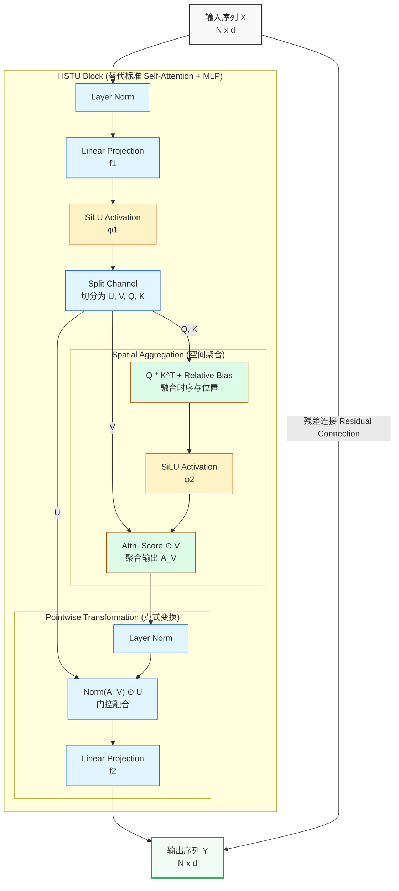
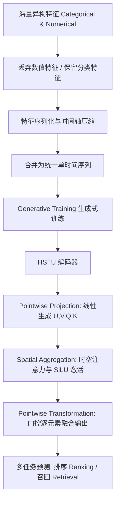

> 本文是关于 Meta AI 重磅论文《Actions Speak Louder than Words: Trillion-Parameter Sequential Transducers for Generative Recommendations》（[arXiv:2402.17152](https://arxiv.org/pdf/2402.17152)）的阅读笔记，重点探讨 HSTU 架构如何改进传统的自注意力机制。

在自然语言处理（NLP）领域，基于 Transformer 的大模型通过 Scaling Law（缩放定律）展现了令人惊叹的涌现能力。然而在推荐系统领域，传统的深度学习推荐模型（DLRMs）极度依赖人工交叉特征，难以随着计算资源的增加实现模型效果的对数线性增长。

为了解决这一痛点，Meta AI 提出了**生成式推荐（Generative Recommenders, GRs）**的新范式，并专门为推荐场景设计了 **HSTU（Hierarchical Sequential Transduction Unit）** 架构。HSTU 成功将千亿级异构特征统一为序列化表达，在训练效率和效果上大幅超越了标准 Transformer，并在工业界验证了万亿参数推荐大模型的 Scaling Law。

## 1. 传统 Transformer 在推荐系统中的“水土不服”

标准 Transformer 架构在处理工业级推荐系统（十亿级动态词表、高达 $10^5$ 的用户交互序列）时，暴露出极端的计算与推理瓶颈：

1. **计算冗余**：标准 Transformer 包含多头注意力（MHA）和厚重的点式前馈网络（MLP）。在推荐场景下，极度稀疏的特征并不需要如此厚重的 MLP 来进行特征变换，这会导致巨大的计算浪费。
2. **时间复杂度爆炸**：在流式逐样本（Impression-level）训练中，标准 Transformer 的时间复杂度高达 $\mathcal{O}(N^3 d + N^2 d^2)$，根本无法满足在线推理的严苛延迟要求。

## 2. HSTU 相对于 Self-Attention 的核心改进

HSTU 对传统的自注意力架构进行了大刀阔斧的重构，专门针对推荐数据的非平稳、极度稀疏特性进行了优化。

### 2.1 彻底抛弃笨重的 MLP 层
HSTU 最大的架构创新在于**完全移除了传统的 MLP 层**。它将多头注意力与前馈网络融合，替换为单层线性投影与门控网络。HSTU 巧妙地将计算分为两步：空间聚合（Spatial Aggregation）与点式变换（Pointwise Transformation）。

为了更直观地理解，我们可以看下面这张 HSTU 的微观结构图：

**核心计算公式如下：**

$$ U(X), V(X), Q(X), K(X) = \text{Split}(\phi_1(f_1(X))) $$
$$ A(X)V(X) = \phi_2 \left( Q(X)K(X)^T + r_{p,t}^{ab} \right) V(X) $$
$$ Y(X) = f_2(\text{Norm}(A(X)V(X)) \odot U(X)) $$

*其中，$f_1, f_2$ 为单层线性变换，$\phi_1, \phi_2$ 为 SiLU 激活函数，$r_{p,t}^{ab}$ 为融合了时序和位置的相对偏差。*

**改进收益**：
通过使用门控逐元素融合输出，HSTU 极大地减少了浮点运算量（FLOPs），并完美契合底层硬件的算子融合（Fused Kernel），极大提升了显存带宽利用率。

### 2.2 生成式训练与时间复杂度骤降

**为什么标准 Transformer 在推荐系统中复杂度会变成 $\mathcal{O}(N^3)$？**

在 NLP 中，Transformer 处理单条长度为 $N$ 的序列，时间复杂度是大家熟知的 $\mathcal{O}(N^2d + Nd^2)$。但在传统的推荐系统（如早期的 SASRec）中，通常采用**流式逐样本（Impression-level）训练**。
假设用户有历史序列 $[i_1, i_2, \dots, i_N]$，传统框架需要将其拆分为 $N$ 个独立的训练样本：
- 样本 1：历史 $[i_1]$，预测 $i_2$
- 样本 2：历史 $[i_1, i_2]$，预测 $i_3$
- ...
- 样本 $N$：历史 $[i_1, \dots, i_{N-1}]$，预测 $i_N$

这意味着 Transformer 需要对这 $N$ 个逐渐变长的子序列分别进行前向计算。我们将这 $N$ 个独立样本的计算量累加：
$$ \text{Total Complexity} = \sum_{k=1}^{N} \mathcal{O}(k^2d + kd^2) $$
根据求和公式 $\sum_{k=1}^{N} k^2 \approx \frac{N^3}{3}$，总的训练时间复杂度就灾难性地飙升到了 **$\mathcal{O}(N^3d + N^2d^2)$**。当用户序列 $N=10^4$ 时，计算量呈三次方级数爆炸，完全无法训练。

**HSTU 的降维打击：Generative Training**

在训练方式上，HSTU 采用了**生成式训练（Generative Training）**，彻底摒弃了传统的逐样本拆分。它向 LLM 学习，把整个长度为 $N$ 的用户序列作为一个完整的样本送入模型，配合因果掩码（Causal Mask），在**一次前向传播**中同时完成对所有历史节点的预测。

这一改变干掉了那层可怕的 $\sum_{k=1}^{N}$ 循环，成功将训练的时间复杂度指数级降维回了 **$\mathcal{O}(N^2 d + N d^2)$**。同时，在推理阶段引入了 M-FALCON 微批处理算法，能够全面摊销超长序列的计算成本。

### 2.3 极端的特征序列化：丢弃数值特征

这篇论文中一个非常反直觉但极为有效的操作是：**完全移除传统的数值特征（如历史 CTR 统计）**。
HSTU 摒弃了 DLRM 复杂的并行特征网络，将用户交互行为（如点击、点赞）与慢变分类特征（如用户画像）按照时间戳合并压缩为**一条主时间序列**。作者证明了，只要序列模型足够强大，它完全可以直接从极长的原始历史交互中自行捕获这些统计概率，无需人工干预。

## 3. 架构流程图

## 4. 结论与工业界影响

1. **惊人的速度优势**：在长度为 8192 的长序列上，HSTU 的推理和训练速度比基于 FlashAttention2 的标准 Transformer **快了 5.3 倍到 15.2 倍**。
2. **效果跃升**：在公开数据集上，HSTU 的 NDCG 指标最高超越基线模型达 **65.8%**。
3. **万亿参数与 Scaling Law 验证**：包含 1.5 万亿参数的 GRs 模型在十亿级用户的互联网平台上成功落地，线上核心指标提升 12.4%。

最重要的是，该研究首次在推荐系统领域证实了：**推荐模型的质量随训练算力的增加呈幂律分布（Power-law）**，跨越了三个数量级（达到 GPT-3 / LLaMA-2 级别的算力），彻底打破了 DLRM 时代的瓶颈，为推荐领域的“基础大模型（Foundation Models）”铺平了道路。