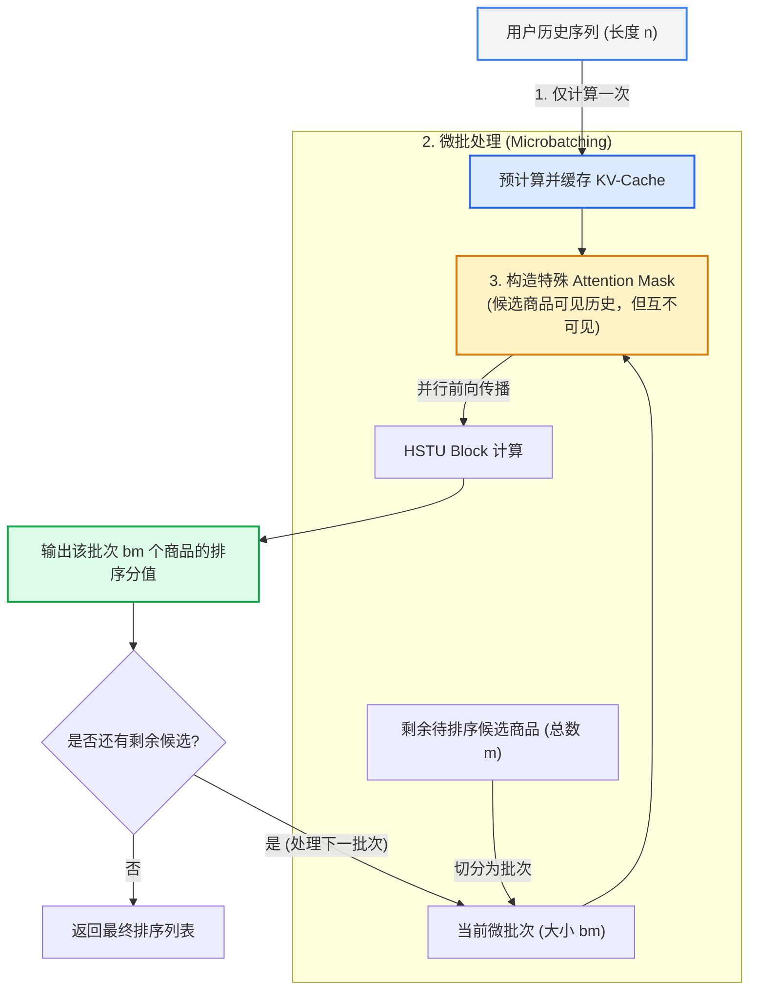

> 在 Meta AI 提出的 HSTU（万亿参数推荐大模型）论文中，除了惊艳的生成式训练范式，还有一个非常硬核的推理加速技术：**M-FALCON**。本文将为你深入浅出地拆解它的原理，以及它和我们常说的 KV-Cache 有什么异同。

## 1. 推荐系统排序阶段的“灾难性”痛点

在推荐系统的排序（Ranking）阶段，我们面临着一个典型的**“一用户对多候选”**（Target-aware Ranking）的场景：
- 我们有一段长度为 $n$ 的用户历史行为序列（比如用户过去看过的 1000 个视频）。
- 我们有 $m$ 个需要被评估打分的候选视频（Target）。

如果我们直接用标准的 Transformer（自回归模式）来计算，意味着每评估一个候选视频，都要把“用户历史 + 这个候选视频”送进模型跑一遍。
对于 $m$ 个候选，这就需要跑 $m$ 次，整体计算复杂度高达 $\mathcal{O}(m \cdot n^2)$。当 $m$ 达到成千上万，且 $n$ 也很长时，在线推理的延迟是不可接受的。

## 2. M-FALCON 是如何破局的？

M-FALCON 全称是 *Microbatched Fast Attention Leveraging Cacheable OperatioNs*。为了打破上述瓶颈，它采用了两个核心策略：**KV-Cache 共享**与**特殊掩码的微批处理 (Microbatching)**。

### 2.1 用户历史的 KV-Cache 预计算
既然这 $m$ 个候选视频都要和**同一段**用户历史进行交互，那么用户历史在 Transformer 中计算出的 Query, Key, Value 其实是完全一致的。
M-FALCON 借用了大语言模型（LLM）中成熟的 **KV-Cache** 思想：首先把长度为 $n$ 的用户历史的 KV 矩阵计算出来并缓存（Cache）住。这样后续计算候选物品时，就不需要再重复计算历史序列的特征了。

### 2.2 微批处理与特殊的 Attention Mask
这是 M-FALCON 最巧妙的地方。如果只用 KV-Cache，逐个计算候选商品依然很慢（内存访存带宽瓶颈，即 Memory-bound）。
M-FALCON 将这 $m$ 个候选商品划分成大小为 $b_m$ 的**微批次（Microbatch）**，把它们拼接在用户历史的后面一起送入模型。

但这里有一个关键问题：**同批次内的候选商品，彼此之间不能产生注意力交互**（也就是候选 A 不能“看到”候选 B），否则就会发生信息泄露（Crosstalk）。
为此，M-FALCON 设计了一种特殊的 Attention Mask（注意力掩码）：
1. 所有的候选商品都可以“看到”（Attend to）前面的用户历史。
2. 候选商品对自己是可见的（对角线为 1）。
3. **候选商品之间互相不可见**。

通过这种方式，一次前向传播就能并行给 $b_m$ 个候选商品打分，将复杂度从 $\mathcal{O}(m \cdot n^2)$ 骤降到 $\mathcal{O}(\lceil m/b_m \rceil \cdot (n+b_m)^2)$。在实际部署中，通常可以带来 2~4 倍的延迟降低！

## 3. M-FALCON 原理流程图

下面这张图直观地展示了 M-FALCON 的工作流：

## 4. 与其他大模型推理技术的对比

M-FALCON 的出现，是 LLM 推理技术向推荐系统迁移的成功典范。我们可以把它和目前当红的几个技术做个对比：

1. **与 KV-Cache 的关系**：M-FALCON 本质上是 KV-Cache 技术在“一对多（One-to-Many）”特殊场景下的深度变种。标准的 KV-Cache 是在**时间维度**（预测下一个 Token）上复用；而 M-FALCON 是在**候选维度**（给多个 Target 打分）上实现了跨样本的复用。
2. **与 PagedAttention (vLLM) 的关系**：两者解决的问题不同。PagedAttention 解决的是多用户并发请求时，如何通过操作系统的“分页内存”机制来减少显存碎片，提高并发吞吐量。而 M-FALCON 解决的是**单用户单次请求中**，如何通过掩码技巧在一次计算内并行评估大量无关候选的问题。

总结来说，如果没有 M-FALCON，拥有万亿参数的 HSTU 在严苛的工业级延迟要求下根本无法上线。它完美地在“生成式序列建模”与“高效在线排序”之间架起了一座桥梁。