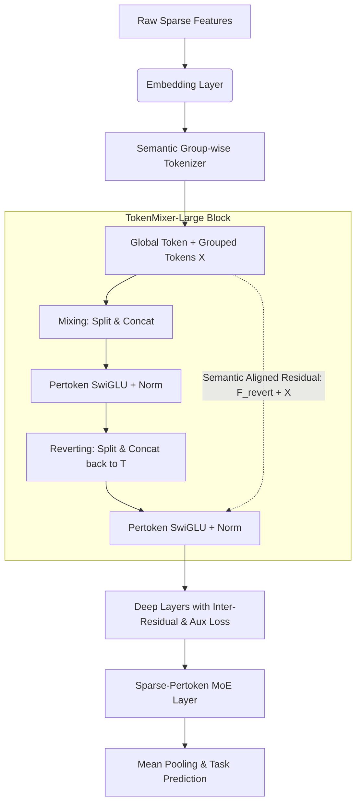

# 来源元数据 (Metadata)

- **原文标题**: TokenMixer-Large: Scaling Up Large Ranking Models in Industrial Recommenders
- **原文链接**: https://arxiv.org/pdf/2602.06563
- **来源**: Arxiv (ByteDance 团队)
- **作者**: Yuchen Jiang, Jie Zhu, Xintian Han, Hui Lu, Kunmin Bai, Mingyu Yang, Shikang Wu 等

---

# 核心摘要 (Executive Summary)

针对工业级推荐系统面临的大模型扩展瓶颈，本文提出了 **TokenMixer-Large** 架构，通过引入“Mixing & Reverting”操作、层间残差、辅助损失以及稀疏 Per-token MoE 等一系列创新，解决了深层网络中的梯度消失、MoE 稀疏化不足以及硬件利用率低等问题，在字节跳动的核心业务（电商、广告、直播）中成功扩展至百亿参数规模，并取得了显著的在线业务增长。

---

# 深度解读 (Deep Dive)

## 核心痛点

随着推荐系统大模型（DLRM）尝试向大规模参数扩展，现有的主流架构（如 RankMixer、Wukong、DHEN）在实际应用中暴露出多个严重瓶颈：

1. **次优的残差设计**: RankMixer 等架构通过 Mixing 操作改变了 Token 的维度和数量，导致前后残差连接时 Token 的语义无法对齐，限制了模型的表现上限。
2. **不纯粹的模型架构**: 由于历史迭代，推荐模型中通常保留了许多琐碎、访存密集型的底层算子（如 LHUC、DCNv2），导致整体模型的计算利用率 (MFU) 极低。
3. **深层网络梯度更新不足**: 传统的 TokenMixer 往往只有浅层配置（如 2 层），随着网络加深，梯度消失问题严重，难以保持训练稳定性。
4. **MoE 稀疏化不足**: 原有的 ReLU-MoE 设计局限于“稠密训练、稀疏推理”范式，并未降低训练成本，且动态激活机制对推理极不友好。
5. **扩展性受限**: 受限于上述原因，工业界之前的探索仅止步于 10亿（1B）参数级别。

## 方法论 (Methodology)

### 1. Mixing & Reverting 机制 (混合与还原)

- **方法 - 改进思路**: 为了解决残差连接错位的问题，作者设计了对称的“双层结构”。第一层负责跨 Token 混合信息（Mixing），第二层专门将混合后的 Token 维度恢复到原始状态（Reverting）。这种设计确保了输入和输出维度的绝对一致性，从而构建出平滑且语义对齐的深度残差通道。
- **伪代码**:

```python
# 输入 X: [T, D], T为Token数, D为维度
# 1. Mixing 阶段
H = Split_and_Concat(X) # 将 T 个 token 混合为 H 个, 维度 [H, T*D/H]
H_next = Norm(pSwiGLU(H) + H)

# 2. Reverting 阶段
X_revert = Split_and_Concat_Back(H_next) # 将 H 个 token 还原为 T 个, 维度 [T, D]
X_next = Norm(pSwiGLU(X_revert) + X) # 语义严格对齐的残差连接
```

### 2. 稀疏 Per-token MoE (Sparse-Pertoken MoE)

- **方法 - 改进思路**: 采用“先扩大，后稀疏”的策略。首先将模型做宽，然后将 Per-token SwiGLU 拆分为多个细粒度专家并进行稀疏激活。为解决稀疏带来的梯度更新不足问题，引入了**门控值缩放 (Gate Value Scaling)**；同时为稳定训练加入了**共享专家 (Shared Expert)**。这使得模型可以真正实现“稀疏训练与稀疏推理”。

### 3. 深层网络稳定性设计 (Deep Model Stabilization)

- **方法 - 改进思路**:
  - **Inter-Residual & Aux Loss**: 每隔 2-3 层引入跨层残差连接，并将底层输出与高层输出结合计算辅助损失（Auxiliary Loss），防止梯度衰减，加速底层网络收敛。
  - **Down-Matrix Small Init**: 参考 Rezero，将 SwiGLU 中最后一个投影矩阵的初始化方差缩小为 0.01，使模块在训练初期接近恒等映射，极大提升了深层网络的稳定性。

## 流程图 (Flowchart)



## 结论 (Conclusion)

TokenMixer-Large 验证了在去除历史碎片化算子后，“纯净架构+大规模堆叠”在推荐领域的有效性。模型在离线实验中成功扩展至 **150亿 (15B)** 参数，在线部署达到了 **70亿 (7B)** 参数。在字节跳动核心业务取得巨大收益：

- **电商**: 订单量提升 1.66%，人均 GMV 提升 2.98%
- **广告**: ADSS 提升 2.0%
- **直播**: 收入增长 1.4%

---

# 关键代码/数据

**核心数据对比 (电商场景 500M 规模基线对比)**:

| 模型 | 参数量 | 训练 FLOPs/Batch | CTCVR AUC 提升 |
| :--- | :--- | :--- | :--- |
| DLRM-MLP | 499 M | 125.1 T | 基线 |
| Wukong | 513 M | 4.6 T | +0.76% |
| RankMixer | 567 M | 4.6 T | +0.84% |
| **TokenMixer-Large 500M** | 501 M | 4.2 T | **+0.94%** |
| **TokenMixer-Large 4B SP-MoE** | 2.3B 激活 | 15.1 T | **+1.14%** |

*注：Sparse-Pertoken MoE 在激活仅一半参数（2.3B in 4.6B）的情况下，不仅显著降低了 FLOPs，还达到了与稠密模型完全相同的业务增益，实现了极高的性价比 (ROI)。*
