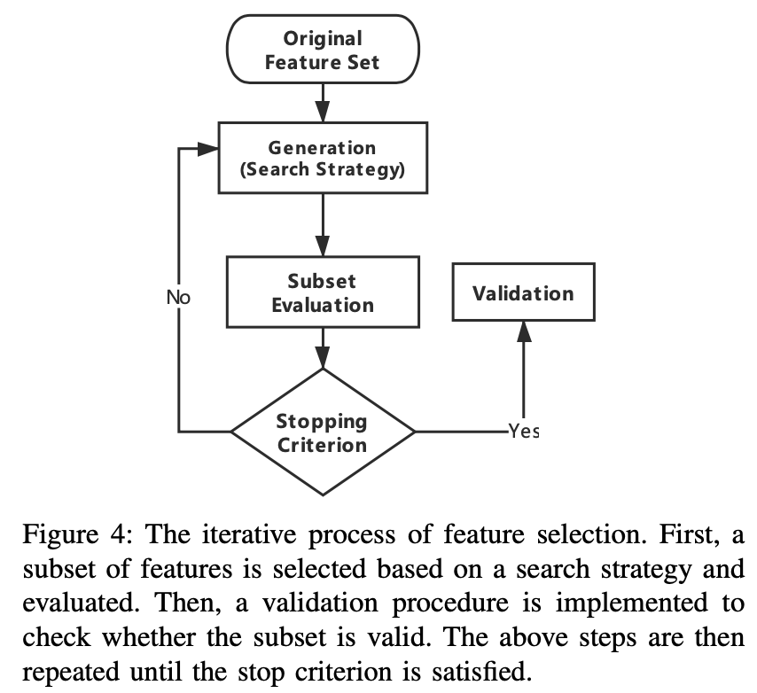
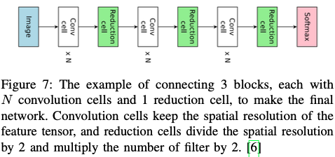
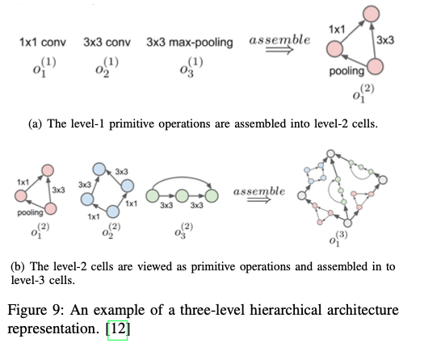
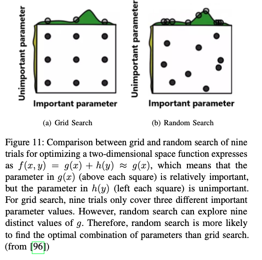
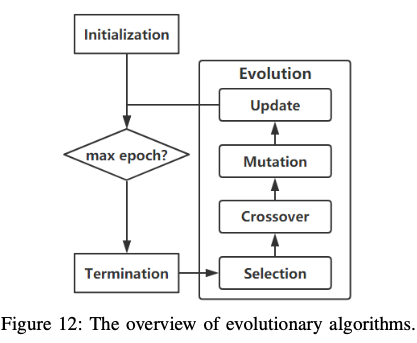
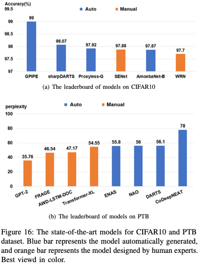

wiki definition:
AutoML is the process of automating the end-to-end process of applying appropriate data-preprocessing, feature engineering, model selection, and model evaluation to solve the certain task

+ Google AutoML
+ [Neural Architecture Search with Reinforcement Learning
](https://arxiv.org/abs/1611.01578)

We will introduce NAS from two perspectives.

+ The first is the structures of the model.
  + entire structure
  + cell-based structure
  + hierarchical structure
  + morphism-based structure
+ The second is hyperparameter optimization (HPO) for designing the model structure.
  + Reinforcement Learning
  + Evolutionary Algorithms
  + Gradient-based
  + Bayesian Optimization

AutoML

+ data preparation
+ feature engineering
+ model generation
+ model evaluation

## 1. Data preparation

### 1.1 data collection

1. data synthesis
    + augment the exsiting dataset
    CV: cropping, flipping, padding, rotation and resize, etc.
    Library: torchvision augmentor
    + data warping
    generates additional samples by applying transformation on data-space
    + synthetic over-sampling
    creates additional samples in feature-space.
    + For text data, synonym insertion is a common way of augmenting同义词插入
    + first translate the text into some foreign language, and then translate it back to the original language
    + non-domain-specific data augmentation strategy that uses noising in RNNs
    + back-translation
    + data simulator
    **OpenAI Gym** is a popular toolkit that provides various simulation environment
    + GAN
2. data searching(search for web data)
    + On the one hand, sometimes the **search results do not exactly match the keywords**.(filter unrelated data)
    + The other problem is that web data may **have wrong labels or even no labels.**(learning-based **self-labeling** method, 分为self-training, co-training, co-learning)
    + the distribution of web data can be extremely different from the target dataset, which would increase the difficulty of training the model.(fine-tune these web data)
    + dataset inbalance(SMOTE, combines boosting method with data generation)

### 1.2 data cleaning

redundant, incomplete, or incorrect data

standardization, scaling, binarization of quantitative characteristic, one-hot encoding qualitative characteristic, and filling missing values with mean value, etc.

## 2. feature engneering

+ feature selection 减少冗余特征
+ extraction 减少特征的维度
+ construction 展开原始特征空间

### 2.1 feature selection

search strategy

+ complete
  + exhaustive
  + non-exhaustive
+ heuristic
  + Sequential Forward Selection(SFS)
  + Sequential Backward Selection(SBS)
  + Bidirectional Search(BS)
+ random search algorithm
  + Simulated Annealing(SA)
  + Genetic Algorithms(GA)

subset evaluation

+ filter method
    scores each feature according to divergence or correlation, and then select features by a threshold
+ Wrapper method
    classifies the sample set with the selected feature subset, the classification accuracy is used as the criterion to measure the quality of the feature subset
+ embedded method
    performs variable selection as part of the learning procedure.
    Regularization, decision tree, **DL**

### 2.2 feature construction

#### definition

**constructs new features** from the basic feature space or raw data to help enhance the robustness and generalization of the model, and its essence is to increase the representative ability of original features.

#### 常用方法 preprocessing transformation

包括

+ standardization
+ normalization
+ feature discretization

#### 自动化检索

人力很难检索所有可能
some automatic feature construction methods have been proposed

These algorithms mainly aim to automate **the process of searching and evaluating the operation combination**实现操作组合搜索和评价的自动化

searching 算法

+ decision tree-based methods
+ genetic algorithm
    需要pre-defined operation space
+ annotation-based approaches
    不需要，将domain知识以注释的形式与训练示例一起使用
    引入了交互式特征空间构建协议，学习者识别出特征空间的不足区域，并与领域专家协作，通过现有的语义资源增加描述性

### 2.3 feature extraction

a dimensionality reduction process through some mapping functions

mapping function

+ Principal Component Analysis(PCA)
+ Independent COmponent Analysis(ICA)
+ isomap
+ nonlinear dimensionality reduction
+ Linear discriminant analysis(LDA)
+ **feed-forward neural networks approach**

## 3. model generation

two types of approaches for model selection:

+ traditional model selection
  + SVM
  + KNN
  + decision tree
  + K-means
+ NAS

主要介绍NAS

### 3.1 model structures

The model is generated by selecting and combining a set of primitive operations, which are pre-defined in the search space. The operations can be broadly divided into convolution, pooling, concatenation, elemental addition, skip connection, etc.

1. entire structure
    缺点：太深，搜索空间太大，消耗时间和计算资源，找到的model的transferability差，意味着小的数据集上找到的模型在完整数据集上表现很差
2. Cell-based structure
    先生成cell，再连起来
    
    优点：搜索空间大大减小，并且更容易从小dataset上转换到大的dataset上(简单叠加cells))
    分成两级：

    + inner:cell level, selects the operation and connection for each node
    + outter level:network level, controls the spatial resolution changes
3. Hierarchical structure
    for a hierarchical structure, there are many levels, each with a fixed number of cells. The higher-level cell is generated by incorporating lower-level cell iteratively.
    
    可以发现更多复杂、灵活的网络结构类型。
4. Network Morphism based structure
    transferring the information stored in an existing neural network into a new neural network
    从现有网络到新网络
    保证性能不低于原有网络

### 3.2 hyperparameter optimization(HPO)

1. Grid & Random Search
    最广泛使用的
    
2. Reinforcement Learning
    分为两部分
    + controller:RNN, used to generate different child networks at different epoch
    + reward network:trains and evaluates the generated child networks and uses the reward (e.g. accuracy) to update RNN controller.
    + 缺点：训练时间长，资源需求大
    + ENAS:子架构被看做是预定义搜索空间的子图，共享参数，从而避免从零开始到收敛地训练每个子模型
3. Evolutionary Algorithm
    通用的基于种群的元启发式优化算法，
    有两种类型的编码方案:直接编码和间接编码。direct, indirect
    直接编码是一种广泛使用的方法，它显式地指定了表现型：Genetic CNN

    + selection 选择
        + fitness selection
        + rank selection
        + Tournament selection
    + crossover 杂交
    + mutation 突变
    + update 更新

    
4. Bayesian Optimization
    + BO
    + Sequential model-based optimization(SMBO)
    + Bayesian Optimization-based Hyperband (BOHB)
5. Gradient Descent

## 4. model estimation

### 4.1 low fidelity

On the one hand, we can reduce the number of images or the resolution of images (for image classification tasks)
在子集上面训练,在低精度训练集上面训练
On the other hand, low fidelity model evaluation can be realized by reducing the model size, such as training with less number of filters per layer
减少网络的大小，比如每层的filter的数目

### 4.2 Transfer learning

+ Transfer Neural AutoML
  uses knowledge from prior tasks to speed up network design
+ ENAS
  shares parameters among child networks
+ The network morphism based algorithms
  inherit the weights of previous architectures

### 4.3 Surrogate代理

一般来说，一旦获得了一个良好的近似，就很容易找到最佳配置，而不是直接优化原来昂贵的目标。
PNAS

this method is not applicable when the optimization space is too large and hard to quantize, and the evaluation of each configuration is extremely expensive

### 4.4 Early stopping

is now being used to speed up model evaluation by **stopping the evaluations which predicted to perform poorly on the validation set**

## 5. NAS PERFORMANCE SUMMARY

## 6. future work

1. Complete AutoML Pipeline
   数据部分
2. Interpretability
3. Reproducibility
4. Flexible Encoding Scheme
5. More Area
   cnn: image classification
   rnn: language modeling
   more
6. Lifelong Learn
