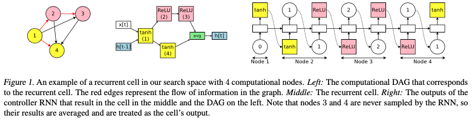
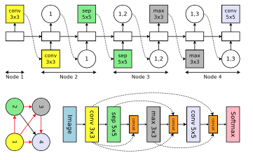
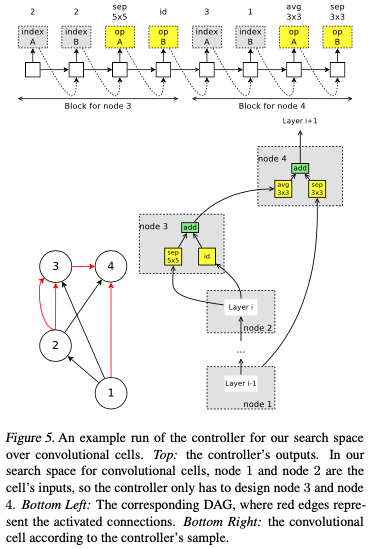

## Efficient Neural Architecture Search via Parameter Sharing

an RNN controller is trained in a loop: the controller first samples a candidate architecture, i.e. a child model, and then trains it to convergence to measure its performance on the task of desire.

## 0. 训练

分为两个网络，controller选择设计子网络的架构，
子网络是一个entire网络的一个子图

分为两种参数 RNN的参数$\theta$ sample网络的$w$
分别使用adam 在validation set训练
SGD在training set上面训练

## 1. RNN cells的设计

controller设计

1. 当前节点连接的前一个节点
2. 使用什么激活函数(relu, sigmod, tanh, identity)4种

search space:the search space has$4N × N!$configurations. In our experiments, N = 12,

## 2. cnn的设计

controller设计

1. 当前节点连接的前一个节点
2. 使用什么计算函数(`conv3*3, conv5*5, sep3*3, sep5*5, maxpooling3*3, average pooling3*3`)6种

search space:
Making the described set of decisions for a total of L times, we can sample a network of L layers. Since all decisions are independent, there are 6L × 2L(L−1)/2 networks in the search space. In our experiments, L = 12, resulting in 1.6 × 1029 possible networks.

## 3. cnn cells设计

controller设计

1. 两个前置连接的节点
2. 两条边的计算种类(`identity, sep3*3, spe5*5, avepooling3*3, maxpooling3*3`) 5种

search space:
Finally, we estimate the complexity of this search space.
At node i (3 ≤ i ≤ B), the controller can select any two nodes from the i − 1 previous nodes, and any two operations from 5 operations. As all decisions are independent, there are (5 × (B − 2)!)2 possible cells. Since we independently sample for a convolutional cell and a reduction cell, the final size of the search space is (5 × (B − 2)!) . With B = 7 as in our experiments, the search space can realize 1.3 × 1011 final networks, making it significantly smaller than the search space for entire convolutional networks
