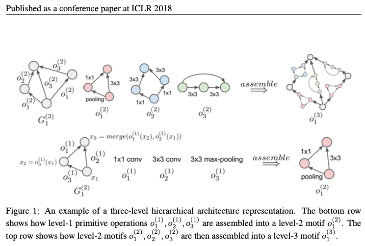

分层设计，底层为一个个最基本的计算操作，顶层为整体架构。

## evolutionary architecture search

### mutation

找到non-primitive level l>=2，选择这个level里面的一个motif，选择motif里面的两个节点，把两个节点中间的边置换为另一种边(三种情况，1.新增边；2.去除边；3.置换边)。

### initialization

原型初始化的处理

1. 先把所有的边置换为identity
2. 执行很大数目(e.g. 1000)次的mutation

### search algorithm

Tournament selection

从初始的随机原型集合中，tournament selection选出最promising 原型，把它的mutated后代放到集合中，重复这个过程，集合中的原型表现会随时间缓慢优化。选择原型集合中在validation set上面表现最好的genotype作为一段时间进化的最后输出。

randon search

不同于tournament selection，random search随机选择集合中的原型进行突变，这样突变的过程可以并行，减少了search time

### implementation

异步的 一个controller负责执行所有原型的进化，其余的worker负责对原型的表现做evaluation。Architectures are trained from scratch for a fixed number of steps with random weight initialization。
