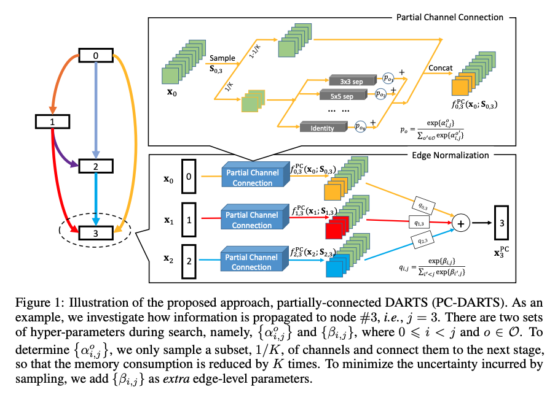
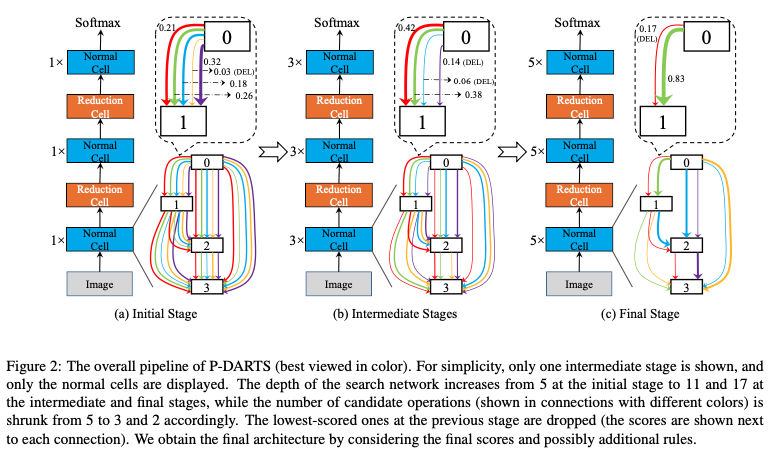
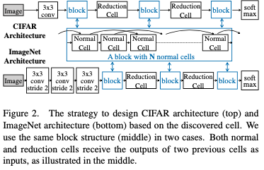

## 1.stabilizing DARTS with Amended grarident estimation on architectural parameters

将darts的loss分为两个部分，对第二个部分进行了推证，提出了新的一种数学形式去近似这个loss，并进行了solid的数学证明。
$$
\mathbf{g}_{2}^{\prime}=-\left.\left.\eta \cdot \nabla_{\boldsymbol{\alpha}, \boldsymbol{\omega}}^{2} \mathcal{L}_{\operatorname{train}}(\boldsymbol{\omega}, \boldsymbol{\alpha})\right|_{\omega=\boldsymbol{\omega}^{*}\left(\boldsymbol{\alpha}_{t}\right), \boldsymbol{\alpha}=\boldsymbol{\alpha}_{t}} \cdot \mathbf{H} \cdot \nabla_{\boldsymbol{\omega}} \mathcal{L}_{\mathrm{val}}(\boldsymbol{\omega}, \boldsymbol{\alpha})\right|_{\boldsymbol{\omega}=\boldsymbol{\omega}^{*}\left(\boldsymbol{\alpha}_{t}\right), \boldsymbol{\alpha}=\boldsymbol{\alpha}_{t}}
$$

提出DARTS的二阶偏导的更合理的近似，下面这个公式，第一个部分称为$g_1$，通过梯度的反向传播得到。第二部分称为$g_2$，更合理的近似为$g_2'$。

$$
\begin{aligned}
\nabla_{\boldsymbol{\alpha}} \mathcal{L}_{\mathrm{val}}\left(\boldsymbol{\omega}^{\star}(\boldsymbol{\alpha}), \boldsymbol{\alpha}\right)|_{\boldsymbol{\alpha}=\boldsymbol{\alpha}_{t}} =& \nabla_{\boldsymbol{\alpha}} \mathcal{L}_{\mathrm{val}}(\boldsymbol{\omega}, \boldsymbol{\alpha})|_{\boldsymbol{\omega}=\boldsymbol{\omega}^{*}\left(\boldsymbol{\alpha}_{t}\right), \boldsymbol{\alpha}=\boldsymbol{\alpha}_{t}} -
\\
& \nabla_{\boldsymbol{\alpha}, \boldsymbol{\omega}}^{2} \mathcal{L}_{\mathrm{train}}(\boldsymbol{\omega},
\boldsymbol{\alpha})|_{\omega=\boldsymbol{\omega}^{*}
\left(\boldsymbol{\alpha}_{t}\right),
\boldsymbol{\alpha}=\boldsymbol{\alpha}_{t}} \cdot \mathbf{H}^{-1} \cdot \nabla_{\boldsymbol{\omega}} \mathcal{L}_{\mathrm{val}}(\boldsymbol{\omega}, \boldsymbol{\alpha})|_{\omega=\boldsymbol{\omega}^{*}\left(\boldsymbol{\alpha}_{t}\right), \boldsymbol{\alpha}=\boldsymbol{\alpha}_{t}}
\end{aligned}
$$

$$
\begin{aligned}
\left\langle\mathbf{g}_{2}^{\prime}, \mathbf{g}_{2}\right\rangle=&\left.\left.\eta \cdot \nabla_{\omega} \mathcal{L}_{\mathrm{val}}(\boldsymbol{\omega}, \boldsymbol{\alpha})\right|_{\omega=\omega^{*}\left(\boldsymbol{\alpha}_{t}\right), \boldsymbol{\alpha}=\boldsymbol{\alpha}_{t}} ^{\top} \cdot \mathbf{H}^{-1} \cdot \nabla_{\boldsymbol{\omega}, \boldsymbol{\alpha}}^{2} \mathcal{L}_{\mathrm{train}}(\boldsymbol{\omega}, \boldsymbol{\alpha})\right|_{\omega=\boldsymbol{\omega}^{*}\left(\boldsymbol{\alpha}_{t}\right), \boldsymbol{\alpha}=\boldsymbol{\alpha}_{t}} \\ &\left.\left.\nabla_{\boldsymbol{\alpha}, \boldsymbol{\omega}}^{2} \mathcal{L}_{\mathrm{train}}(\boldsymbol{\omega}, \boldsymbol{\alpha})\right|_{\omega=\boldsymbol{\omega}^{*}\left(\boldsymbol{\alpha}_{t}\right), \boldsymbol{\alpha}=\boldsymbol{\alpha}_{t}} \cdot \mathbf{H} \cdot \nabla_{\boldsymbol{\omega}} \mathcal{L}_{\mathrm{val}}(\boldsymbol{\omega}, \boldsymbol{\alpha})\right|_{\omega=\omega^{*}\left(\boldsymbol{\alpha}_{t}\right), \boldsymbol{\alpha}=\boldsymbol{\alpha}_{t}}
\end{aligned}
$$

并证明$g_2'$与$g_2$的乘积恒大于0，也就是夹角小于90度。

## 2. DARTS+: Improved Differentiable Architecture Search with Early Stopping

随着epoch数量的增多，DARTS倾向于skip-connection，造成模型的表现下降

提出一种提前停止训练的标准，让模型搜索提前停止。

1. 当模型中出现两个skip-connection的时候
2. 当模型中的$\alpha$参数的排列顺序不再发生改变的时候($\alpha$的值是各个Primitives的概率)

## 3. PC-DARTS

uses partial- channel connections to reduce search time,

1. Partial Channel Connections

   只将1/K 的channels使用primitives连接，其余的channels选择直接连接，也就是，从$node_i$到$node_j$的边中，选出一部分channel使用非identity的方式连接，其余的使用identity，经过非identity方式的channel乘以softmax以后的$\alpha$权重相加，再和原来的channel一起concat。**这样做的处理，是希望占用的内存更小，使用更大的batch_size，提升训练和模型表现。**

   削弱了weight-free操作的影响。

2. Edge Normalization

   $node_i$前面所有的$node$都需要输出到它，设计权重$\beta$，乘以这些边，得到$node_i$的值。

## 4. P-DARTS

将layer的数目慢慢增加。

1. searching for 25 epochs instead of 50 epochs,
2. adopting *dropout* after *skip-connect*s
3. manually reducing the number of *skip-connect*s to two

修剪*skip-connection*的数目操作只能发生在第一个

## 5. Searching for A Robust Neural Architecture in Four GPU Hours

每次只计算最大权重的梯度，只BP最大权重的梯度，以此来减少计算量和GPU显存。

## 6. ProxylessNAS

ProxylessNAS 不同于以前的在代理数据集上面进行搜索以后转移到大数据集类似ImageNet上面进行训练测试，而是直接在大数据集上面进行搜索，它的搜素的算子数目被大大减少以减小搜索的空间，降低搜索的难度。

## 7. SNAS

SNAS故事讲的不一样，但是本质上来说，跟DARTS基本一样的原理，即使用operation的加权和来代替单独的operation。
它使用了gumble-softmax trick，**使用概率采样出的权值而不是固定的权值来计算加权和**，同时增加temperature，使得采样出的权值更加接近one-hot的权值，来拟合单独的operation。

