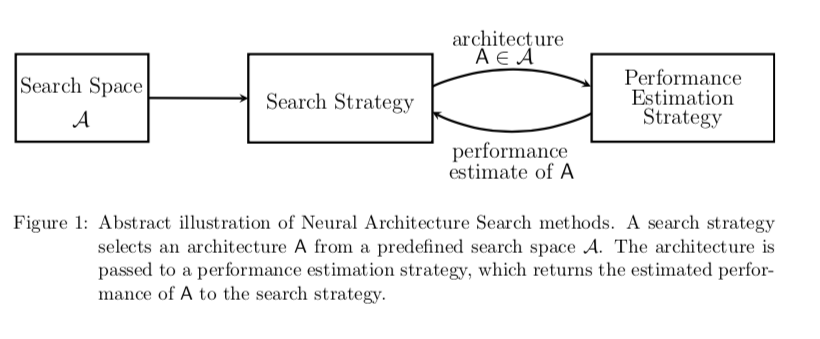
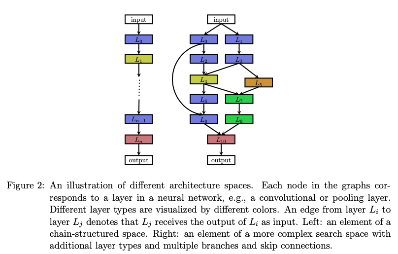
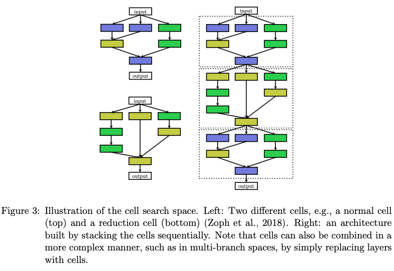
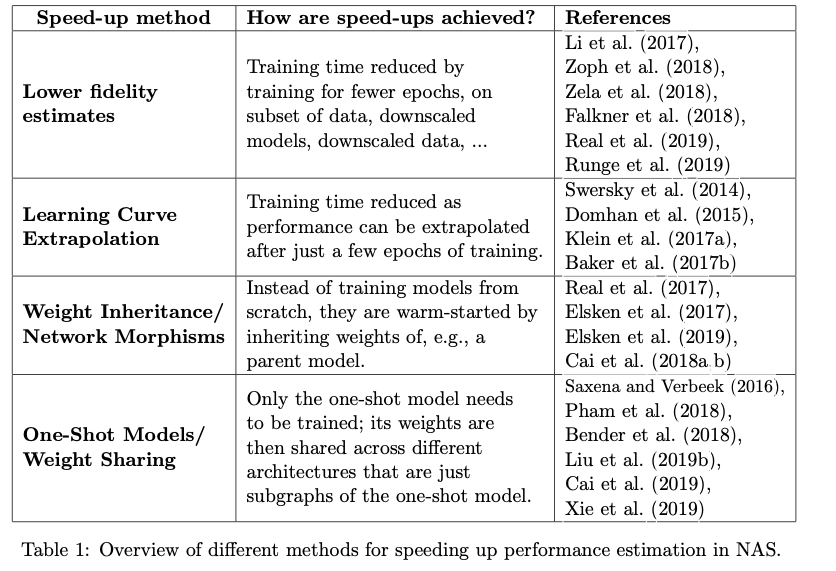

目前存在的应用
image classification
object detection
semantic segmentation

NAS can be seen as subfield of AutoML (Hutter et al., 2019) and has significant overlap with hyperparameter optimization (Feurer and Hutter, 2019) and meta-learning (Vanschoren, 2019).
AutoML的子领域
NAS与元学习和超参数优化有很多重合的地方

NAS的方法分为三类：

1. search space
2. search strategy
3. performance estimation strategy

+ Search Space. 原则上定义了哪些架构可以被表示，先验知识缩小了search space，同时也可能漏掉超出人类认知的架构
+ Search Strategy.搜索策略详细描述了如何探索搜索空间(通常是指数级大的，甚至是无界的)。它包含了物理的探索-利用权衡，因为一方面，快速找到性能良好的架构是可取的，而另一方面，应该避免过早地收敛到次优架构的区域。
+ Performance Estimation Strategy.
简单的对所有数据进行标准训练和测试，但是这种方案计算太过昂贵，并且限制了可以研究的体系结构的数量

## 1. search space

### chain-structured neural network architecture

搜索空间的影响因素

1. 层的数目
2. 每一层的种类 pooling, conv, skip-connection, etc
3. 超参数

### cell-based model

+ normal cell
+ reduction cell

优点：

1. The size of the search space is drastically reduced
搜索空间大大减小
2. Architectures built from cells can more easily be transferred or adapted to other data sets by simply varying the number of cells and filters used within a model
可移植性比较好
3. Creating architectures by repeating building blocks has proven a useful design prin- ciple in general, such as repeating an LSTM block in RNNs or stacking a residual block.
已经证明叠加网络是有效的设计准则，如LSTM，RNN，res-block

### macro-architecture

how many cells shall be used and how should they be connected to build the actual model

## 2. search strategy

+ random search
+ Bayesian optimization
+ evolutionary methods
+ reinforcement learning (RL)
+ gradient-based methods.

1. no interaction with an environment occurs during this sequential process (no external state is observed, and there are no intermediate rewards)
将架构取样的过程当做single action的线性生成过程，将RL问题转换为无状态多武装强盗问题。

2. frame NAS as a sequential decision process

3. deal with variable-length network architectures
**use a bi-directional LSTM to encode architectures into a fixed-length representation**

4. 使用gradient-based method去优化权重，使用进化算法仅仅去优化神经网络的架构

5. Neuro-evolutionary方法不同的地方在于how they sample parents, update populations, and generate offsprings

    [Efficient multi-objective neural architecture search via lamarckian evolution.](https://arxiv.org/abs/1804.09081) 后代从父网络中继承权重

    [Large-scale evolution of image classifiers](https://arxiv.org/pdf/1703.01041.pdf) 后代从父网络中继承没有被突变影响的权重

6. Monte Carlo Tree Search. hill climbing

7. optimize both the network weights and the network architecture by alternating gradient descent steps on training data for weights and on validation data for architectural parameters such as. 交替使用梯度下降法，在训练集上训练权重，在验证集上更改架构参数

8. 在可能的操作集合上面优化带参的分布

9. 优化层的超参数和连接模式

## 3. Performance Estimation Strategy

## 4. directions

人类定义搜索空间的大小相比较寻找性能更好的网络架构更简单，但同时也限制了NAS不太可能找到本质上优于现在架构的网络架构

应用在image restoration
semantic segmentation
reinforcement learning
等等上面

GAN sensor, fusion

multi-task problems
multi-objective problems

extending one-shot NAS to generate different architectures depending on the task or instance on-the-fly.

search space的选择

更加细粒度cell的构建，能否大大加强NAS的能力

新的数据集：Nas-bench-101: Towards reproducible neural architecture search

Learning Augmentation Policies from Data
