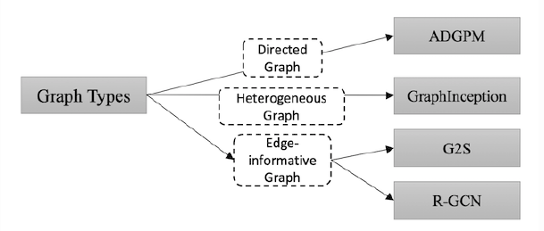
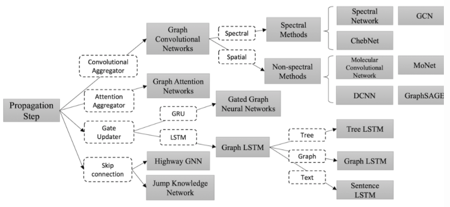
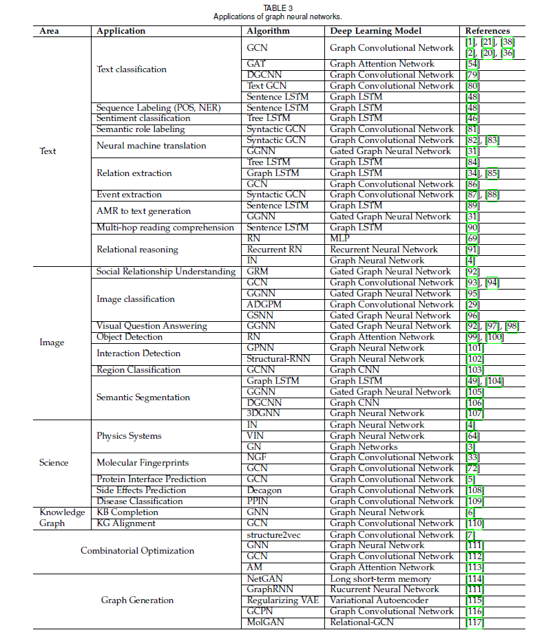

## Graph Neural Networks: A review of methods and applications

## 1. introduction

1. social science (social networks)
2. natural science (physical systems
3. protein-protein interaction networks
4. knowledge graphs

常见的欧几里得结构化数据主要包含：

1D：声音，时间序列等；
2D：图像等；
3D：视频，高光谱图像等；

### 1.1 motivation

 1. CNN
    + 局部连接
    + 共享权重
    + 多层网络
 2. graph embedding
    + 在 encoder 中，节点之间没有共享参数，这导致计算效率低下，因为这意味着参数的数量随着节点的数量线性增长
    + 直接嵌入方法缺乏泛化能力，这意味着它们无法处理动态图形或推广到新图形

### 1.2 优点

1. CNN 和 RNN 这样的标准神经网络无法处理没有自然节点顺序的不规则图数据，而 GNN 在每个节点上分别传播，忽略了节点的输入顺序。即，GNN 的输出对于节点的输入顺序是不变的。

2. 图中的边表示了两个节点之间的依赖关系的信息。在标准的神经网络中，这些依赖信息只是作为节点的特征。然后，GNN 可以通过图形结构进行传播，而不是将其作为特征的一部分。通常，GNN 通过其邻域的状态的**加权和**来更新节点的隐藏状态。

3. 推理是高级人工智能的一个非常重要的研究课题，人脑中的推理过程几乎都是基于从日常经验中提取的图形。标准神经网络已经显示出通过学习数据分布来生成合成图像和文档的能力，同时它们仍然无法从大型实验数据中学习推理图。然而，GNN 探索从场景图片和故事文档等非结构性数据生成图形，这可以成为进一步高级 AI 的强大神经模型。

## 2. 模型

### 2.1 限制

虽然实验结果表明 GNN 是一种用于建模结构数据的强大架构，但原始 GNN 仍然存在一些局限性。

1. 对于固定点来迭代更新节点的隐藏状态是十分低效的。如果放宽固定点的假设，可以设计一个多层 GNN 来获得节点及其邻域的稳定表示。
2. GNN 在迭代中使用相同的参数，而大多数流行的神经网络在不同的层中使用不同的参数来进行分层特征提取。此外，节点隐藏状态的更新是一个顺序过程，可以利用 RNN 内核，如 GRU 和 LSTM，来进一步优化。
3. 存在一些边缘（edges）的信息特征无法在原始 GNN 中有效建模。例如，知识图中的边缘具有关系类型，并且通过不同边缘的消息传播应根据其类型而不同。此外，如何学习边缘的隐藏状态也是一个重要问题。
4. 如果我们专注于节点的表示而不是图形，则不适合使用固定点，因为固定点中的表示分布将在值上非常平滑并且用于区分每个节点的信息量较少。

### 2.2 GNN的 变体

#### 2.2.1 图类型

在原始的 GNN 中，输入的图形包括带有标签信息的节点和无向的边，这是一种最简单的图形式。但在现实生活中，存在多种图的变体，主要包括有向图、异构图和带有边信息的图。

1. 有向图：即图中的边是存在方向的。有向边可以带来比无向边更多的信息。
2. 异构图：即图中存在多种类型的节点。处理异构图的最简单方法是将每个节点的类型转换为与原始特征连接的 one-hot 特征向量。
3. 带有边信息的图：即图中的每条边也存在权重或类型等信息。这种类型的图有两种解决办法，一种是将图形转化为二部图，原始边也作为节点，并将其分割成两条新的边，分别连接原始边的两端节点；第二种方法是调整不同的权重矩阵，以便在不同类型的边缘上传播。

#### 2.2.2 传播类型

对于获取节点或者边的隐藏状态，神经网络中的传播步骤和输出步骤至关重要。在传播步骤方面的改进主要有卷积、注意力机制、门机制和跳跃连接（skip connection），而在输出步骤通常遵循简单的前馈神经网络设置。

1. 卷积。Graph Convolutional Network（GCN）希望将卷积操作应用在图结构数据上，主要分为 Spectral Method 和 Spatial Method（Non-spectral Method）两类。Spectral Method 希望使用谱分解的方法，应用图的拉普拉斯矩阵分解进行节点的信息收集。Spatial Method 直接使用图的拓扑结构，根据图的邻居信息进行信息收集。
2. 注意力机制。Graph Attention Network 致力于将注意力机制应用在图中的信息收集阶段。
3. 门机制。这些变体将门机制应用于节点更新阶段。Gated graph neural network 将 GRU 机制应用于节点更新。很多工作致力于将 LSTM 应用于不同类型的图上，根据具体情境的不同，可以分为 Tree LSTM、Graph LSTM 和 Sentence LSTM 等。
4. 残差连接。注意到堆叠多层图神经网络可能引起信息平滑的问题，很多工作将残差机制应用于图神经网络中，文中介绍了 Highway GNN 和 Jump Knowledge Network 两种不同的处理方式

#### 2.2.3 训练方法

原始图卷积神经网络在训练和优化方法中具有若干缺点。例如，

1. GCN 需要完整的图拉普拉斯算子，这对于大图来说是**计算成本十分高**。
2. 而且，层 𝐿 的节点的嵌入是通过层 $𝐿−1$ 的所有该节点的邻居来进行计算的。因此，单个节点的感知域相对于层数呈指数增长，**单个节点的计算梯度成本很高**。
3. 最后，GCN 针对固定图形进行独立训练，**缺乏归纳学习的能力**。

### 2.3 通用框架

除了提出图神经网络的不同变体之外，一些研究人员从神经网络的框架入手，提出了一些通用框架，旨在将不同模型集成到一个单一框架中。主要包括 Message Passing Neural Networks（MPNN）、Non-local Neural Networks（NLNN）以及 Graph Network（GN）等。

1. Message Passing Neural Networks
    针对图结构的监督学习框架，MPNN框架抽象了几种最流行的图形结构数据模型（如图卷积中的光谱方法和非光谱方法，门控神经网络，交互网络，分子图卷积，深度张量神经网络等）之间的共性，

2. Non-local Neural Networks
    NLNN利用深度学习捕捉长范围的依赖关系，这是对非局部平均运算的一种泛化，非局部运算通过计算对所有位置的特征的加权和来得到当前位置的影响，此处的位置集合可以是空间、时间或者时空。

3. Graph Networks
    GN被提出来泛化和扩展多种图神经网络，以及 MPNN 和 NLNN 方法。本文主要介绍了图的定义、GN block、核心 GN 计算单元、计算步骤和基本设计原则。详细的内容扩展会另外写到专门针对该文献的阅读笔记当中。

## 3. 应用

## 4. 开放性问题

### 4.1 浅层结构

传统的深度神经网络可以堆叠数百层以获得更好的性能，因为更深的结构具有更多的参数，从而能够显著提高表示能力。而图神经网络通常都很浅，大多数不超过三层。正如 [5] 中的实验所示，堆叠多个 GCN 层将导致过度平滑，也就是说，所有顶点将收敛到相同的值。尽管一些研究人员设法解决了这个问题，但它仍然是 GNN 的最大限制。设计真正的深度 GNN 对于未来的研究来说是一个令人兴奋的挑战，并将对理解 GNN 做出相当大的贡献。

### 4.2 动态图结构

另一个具有挑战性的问题是如何处理具有动态结构的图形。静态图是稳定的，因此可以容易地建模，而动态图则引入变化的结构。当边和节点出现或消失时，GNN 无法自适应地更改。
动态 GNN 正在积极研究中，我们认为它是一般 GNN 的稳定性和适应性的重要里程碑。

### 4.3 非结构化场景

虽然我们已经讨论了 GNN 在非结构场景中的应用，但我们发现没有最佳方法可以从原始数据生成图形。因此，找到最佳图形生成方法将提供 GNN 可以做出贡献的更广泛的领域。

### 4.4 可伸缩性

如何在社交网络或推荐系统等网络规模条件下应用嵌入方法对于几乎所有图形嵌入算法来说都是一个致命的问题，而 GNN 也不例外。扩展 GNN 很困难，因为许多核心步骤在大数据环境中的计算成本都十分高。
