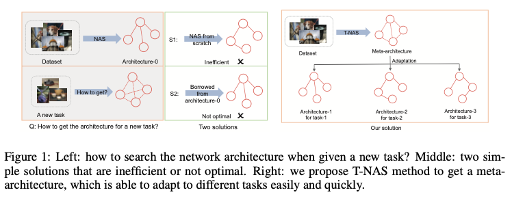
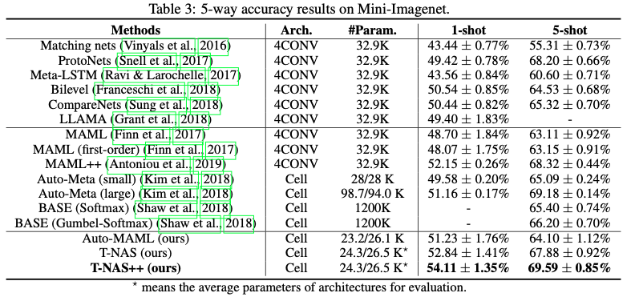
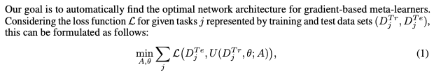
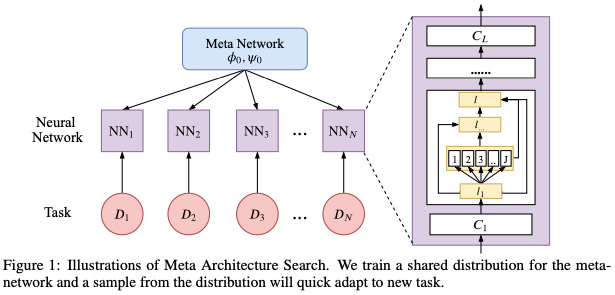
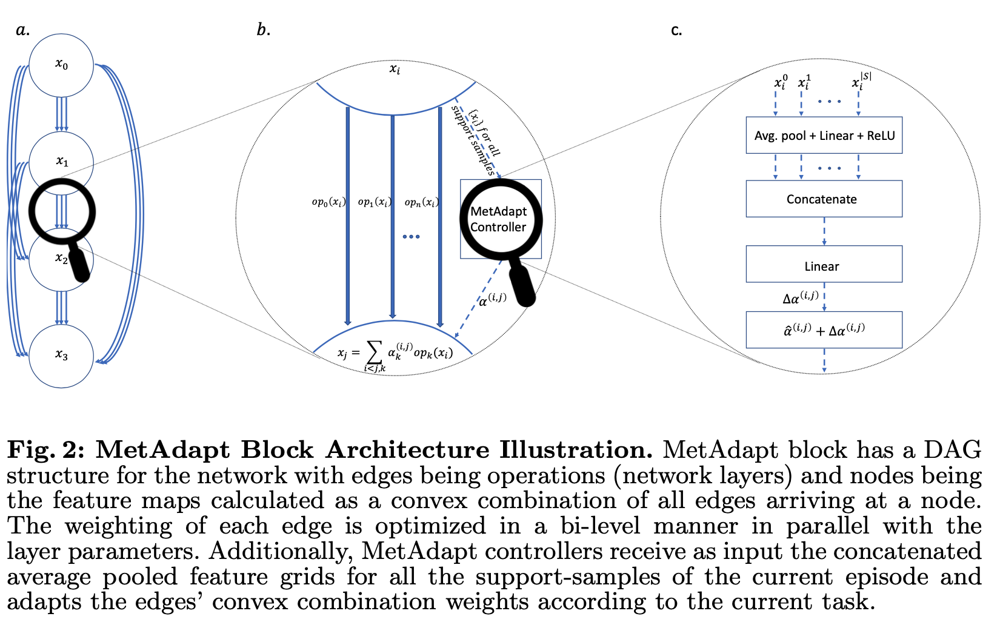
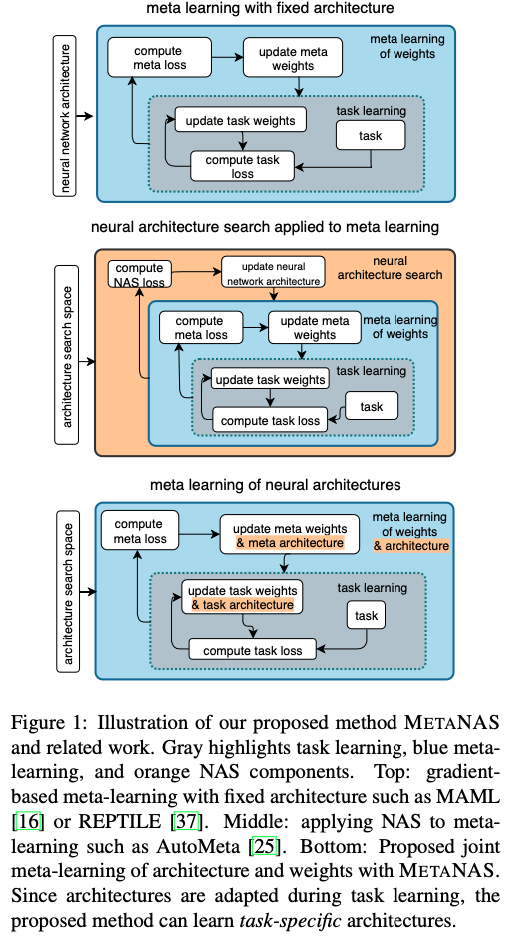

## 1. Towards fast adaptation of neural architectures with meta learning

[ICLR2020](https://openreview.net/forum?id=r1eowANFvr)

文章的的主要思想是，在meta-learning的setting上面，通过不同的task，学习一个可以泛化的architecture，然后在query集上面进行fune-tuning，微调这个结构，使得该结构对不同test task有良好的适用性。

在mini-imagenet上面5-way的结果

## 2. Auto-Meta: Automated Gradient Based Meta Learner Search

[https://arxiv.org/abs/1806.06927](https://arxiv.org/abs/1806.06927)

也是构造cell去stack起来，获取整个的network，但是一开始的cell并不是整个的supernet，而是在搜索的过程中，逐步往这个cell里面去添加opetator，**然后使用一个predictor去预测这个cell的性能**，选择top k性能的cell组成网络进行测试。

## 3. Meta Architecture Search

[NIPS19](https://openreview.net/forum?id=B1M0gBSlLB)

本文从Bayesian的角度，推理了一遍NAS的原理，提出用Coupled Variational Bayes (CVB)去生成参数的表达，同时进行了推理（hard math）。本质上来说，这篇工作基本上还是darts，不过它首先将meta learning的在imagenet上面获取的先验知识拿出来放到其他任务上去train。
首先使用gumble_softmaxed darts(参见SNAS)，取得meta network的arch和init，然后针对不同任务进行fine tuning。

## MetAdapt: Meta-Learned Task-Adaptive Architecture for Few-Shot Classification

[https://arxiv.org/abs/1912.00412](https://arxiv.org/abs/1912.00412)

在darts的基础上，提出了一个MetAdapt Controllers，就是说，对于不同的task，产生不同的叠加权重

## Meta-Learning of Neural Architectures for Few-Shot Learning

[https://arxiv.org/abs/1911.11090](https://arxiv.org/abs/1911.11090)
提出了gradient-based NAS + meta learning 结合的框架，直接想把所有方法都框到自己下面。

