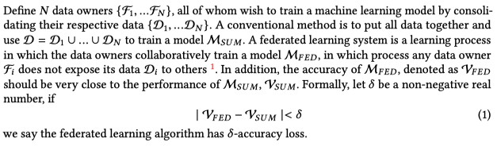

Examples of potential applications include: learning sentiment, semantic location, or activities of mobile phone users; adapting to pedestrian behavior in autonomous vehicles; and predicting health events like heart attack risk from wearable devices [6, 52, 84].

## 1. Overview

### 1.1 问题定义

简单来说，就是说联邦学习的目标是训练一个"尽可能接近把各个节点数据聚合起来训练"的模型。

### 1.2 典型应用

+ smart phone
+ Organizations
+ internet of things 物联网 收集各种模态的信息

### 1.3 主要挑战

1. expensive communication
    + reducing the total number of communication rounds
    + reducing the size of transmitted messages at each round.
2. systems heterogeneity
    + only a small fraction of the devices being active at once
    + anticipate a low amount of participation
    + tolerate heterogeneous hardware
    + be robust to dropped devices in the network.
3. Statistical Heterogeneity
    + independent and identically distributed
    + Both the multi-task and meta-learning perspectives enable personalized or device-specific modeling, which is often a more natural approach to handle the statistical heterogeneity of the data.
4. Privacy Concern
    + secure multiparty computation or differential privacy
    + at the cost of reduced model performance or system efficiency.

## 2. related and current work

### 2.1 Communication-efficiency

1. local updating methods
2. compression schemes
3. decentralized training

### 2.2 Systems Heterogeneity

### 2.3 Statistical Heterogeneity

#### 2.3.1 Modeling heterogeneous Data

+ fairness
+ accountability
+ interpretability

#### 2.3.2 Convergence Guarantees for Non-IID Data

Indeed, when data is not identically distributed across devices in the network, methods such as **FedAvg** have been shown to diverge in practice

Parallel SGD and related variants

FedProx

### 2.4 Ptivacy

#### 2.4.1 privacy in Machine learning

differential privacy： strong information theoretic guarantees, algorithmic simplicity, and relatively small systems overhead

homomorphic encryption同态加密

#### 2.4.2 Privacy in Federated Learning

计算廉价，交流高效，允许丢失device--不能对accuracy做很大让步

1. Secure Multi-party Computation (SMC) 安全的多方计算
    各方除了输入和输出外一无所知

    + 复杂的计算协议
    + 如果提供安全保证，则部分知识公开可能被认为是可以接受的

    要求参与者的数据在非冲突服务器之间秘密共享

2. Differential Privacy 差异隐私
    向数据添加噪音，或使用归纳方法遮盖某些敏感属性，直到第三方无法区分个人

    + 数据也被传输到给了其他人
    + 涉及准确性和隐私之间的权衡

3. Homomorphic Encryption 同态加密
    在机器学习期间通过加密机制下的参数交换来保护用户数据隐私

    + 数据和模型本身不传输
    + 准确性与私密性之间的权衡

## 3. future directions

1. Extreme communication schemes
   + one- shot or divide-and-conquer communication schemes
   + one-shot/few-shot heuristics
2. Communication reduction and the Pareto frontier
   + local updatding 本地更新
   + model compression 模型压缩
3. Novel models of asynchrony
   + 任何设备在任何迭代中都有可能失联
   + 设备随时通过**事件驱动**和central server交换信息
4. Heterogeneity diagnostics
   + 是否存在简单的诊断方法来预先快速确定联合网络的异构程度?
   + 能否开发出类似的诊断方法来量化与系统相关的异质性的数量
   + 可以利用现有的或新的异构定义进一步改进联邦优化方法的收敛性吗?
5. Granular privacy constraints
   + thus providing a weaker form of privacy in exchange for more accurate models
6. Beyond supervised learning
   + scalability, heterogeneity, and privacy.
7. Productionizing federated learning
   + 实际落地的问题 concept drift
   + diurnal variations 设备不同时间表现不同
   + cold start problems 设备新加入
8. Benchmarks
   + reproducibility of empirical results and the dissemination of new solutions for federated learning.
