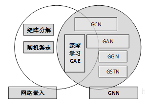
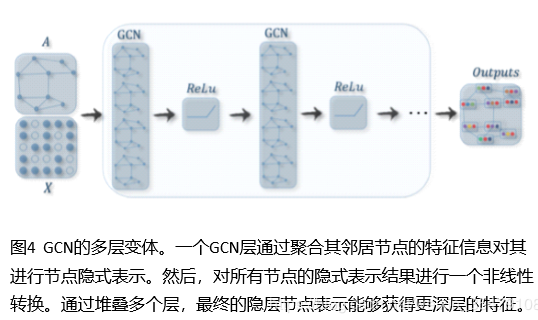
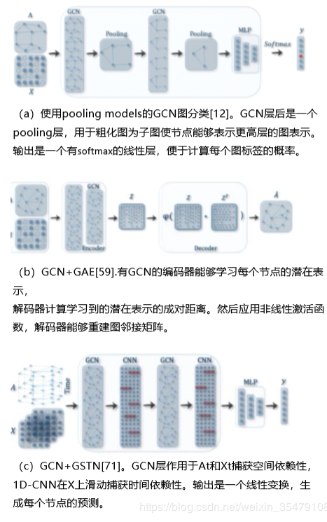
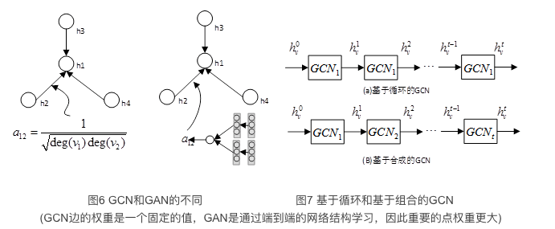
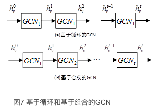

## 1 简介

欧式数据：图片，文本，语言，视频
非欧式数据：图

图数据不规则，每个图的无序节点大小是可变的，且每个结点有不同数量的邻居结点，因此一些重要的操作如卷积能够在图像数据上轻易计算，但是不适用于图数据，可见图数据的复杂性给现有的机器学习算法带来了巨大的挑战 。此外，现有的机器学习算法假设数据之间是相互独立的，但是，图数据中每个结点都通过一些复杂的连接信息与其他邻居相关，这些连接信息用于捕获数据之间的相互依赖关系，包括，引用，关系，交互。

1. Graph attention networks（图注意力网络)
2. Graph autoencoders（图自编码）
3. Graph generative networks（图生成网络）
4. Graph spatial-temporal networks（图时空网络

GNN vs 图嵌入

网络嵌入致力于**在一个低维向量空间进行网络节点表示，同时保护网络拓扑结构和节点的信息**，便于后续的图像分析任务，包括分类，聚类，推荐等，能够使用简单现成的机器学习算法（例如，使用SVM分类）。许多网络嵌入算法都是典型的无监督算法，它们可以大致分为三种类型，即，

   1. 矩阵分解
   2. 随机游走
   3. 深度学习

## 2 GNN分类及框架

五种类型 GCN GAN GAE GGN GSTN

### 2.1 分类

#### 2.1.1 GCN

GCNs将传统数据的卷积算子泛化到图数据，这个算法的关键是学习一个函数$f$，能够结合$v_i$邻居节点的特征$X_j$和其本身特征$X_i$生成$v_i$的新表示.

#### 2.1.2 GAN

GAN与GCN类似，致力于寻找一个聚合函数，融合图中相邻的节点，随机游动和候选模型，学习一种新的表示。**关键区别是：GAN使用注意力机制为更重要的节点，步或者模型分配更大的权重，权重个网络一起学习。**下图展示了GCN和GAN在聚合邻居节点信息时候的不同。

#### 2.1.3 GAE

GAE是一种无监督学习框架，通过编码器学习一种低维点向量，然后通过解码器重构图数据。GAE是一种常用的学习图嵌入的方法，既适用于无属性信息的普通图，还适用于是有属性图。对于普通的图，大多数算法直接预先得到一个邻接矩阵，或者构建一个信息丰富的矩阵，也就是点对互信息矩阵，或者邻接矩阵填充自编码模型，并捕获一阶和二阶信息。对于属性图，图自编码模型利用GCN作为一个构建块用于编码，并且通过链路预测解码器重构结构信息。

#### 2.1.4 GGN

GGN旨在从数据中生成可信的信息，生成给定图经验分布的图从根本上来说是具有挑战性的，主要因为图是复杂的数据结构。为了解决这个问题，研究员探索了将交替形成节点和边作为生成过程的因素，并借助作为训练过程。GGN一个很有前途的应用领域是化合物合成。在化学图中，视原子为节点，化学键为边，任务是发现具有一定化学和物理性质的可合成的新分子。

#### 2.1.5 GSTN

GSTN从时空图中学习不可见的模式，在交通预测和人类活动预测等应用中越来越重要。例如，底层道路交通网络是一个自然图，其中每个关键位置是一个节点，它的交通数据是被连续监测的。通过建立有效的GSTN，能够准确预测整个交通的系统的交通状态。GSTN的核心观点是，**同时考虑空间依赖性和时间依赖性。** 目前很多方法使用GCNs捕获依赖性，同时使用RNN,或者CNN建模时间依赖关系。

### 2.2 框架

1. node_level
    输出用于**点回归和分类任务**。图卷积模型直接给定节点的潜在表示，然后一个多层感知机或者softmax层用作GCN最后一层。
2. Edge-level
    输出与**边分类和链路预测任务**相关。为了预测一条边的标签或者连接强度，附加函数从图卷积模型中提取两个节点的潜在表示作为输入。
3. Graph-level
    输出和**图分类任务**相关，池化模块用于池化一个图为子图或者对节点表示求和/求平均，以获得图级别上的紧凑表示。

端到端训练框架：GCN可以在端到端学习框架中进行(半)监督或无监督的训练，取决于学习任务和标签信息的可用性。

1. node-level 半监督分类。给定一个部分节点被标记而其他节点未标记的网络，GCN可以学习一个鲁棒的模型，有效地识别未标记节点的类标签。为此，可以构建一个端到端的多分类框架，通过叠加几个图形卷积层，紧跟着一个softmax层。
2. graph-level 监督分类。给定一个图数据集，图级分类旨在预测整个图的类标签(s)，端到端学习框架，通过结合GCN和池化过程实现。具体的，通过GCN获得每个图里每个节点固定维数的特征表示，然后，通过池化求图中所有节点的表示向量的和，以得到整个图的表示。最后，加上多层感知机和softmax层，可以构造一个端到端的图分类。图5（a）展示了这样一个过程。
3. 无监督图嵌入。图中没有标签数据的时候，可以在端到端的框架中以无监督的方式学习一种图嵌入。这些算法以两种方式利用边级信息。一种简单的：利用自编码框架，编码器利用GCN将图嵌入到潜在的表示中，解码器利用潜在的表示重构图结构。另一种方式：利用负采样方法，抽取一部分节点对作为负对，图中剩余的节点对作为正对，之后利用逻辑回归层，形成一个端到端的学习框架。

## 3. 图卷积网络

分为两类

1. Spectral-based方法
    从图信号处理的角度引入滤波器来定义图卷积，此使图卷积被解释为从图信号中去除噪声。
2. Spatial-based的方法
    将图卷积表示为来自邻居节点的特征信息的结合

### 3.1 基于图谱的GCN

$$
x * G g_{\theta}=U g_{\theta} U^{T} x
$$

基于谱的GCN都遵循这个定义，不同的是滤波器$g_{\theta}$的选择不同。

**缺陷**
首先，对图的任何扰动都会导致特征基的变化。其次，学习的过滤器依赖于不同领域，这意味着它们不能应用于具有不同结构的图。第三，特征分解需要$O(N^3)$计算和$O(N^2)$内存

谱方法的一个常见缺点是需要将整个图加载到内存中进行图卷积，这在处理大图时效率不高。

### 3.2 基于空间的GCN

分为基于循环和基于组合的GCNs。基于循环的GCN使用一个相同的GCL个更新隐含表示，基于组合GCN则使用不同的GCL更新隐含表示。

**基于循环的空间GCNs**
基于递归的方法的主要思想是递归地更新节点的潜在表示，直到达到稳定的不动点。通过对循环函数施加约束、使用门循环单元架构、异步和随机更新节点潜在表示来实现。

**基于组合的空间GCNs**
基于组合的方法通过叠加多个图的卷积层来更新节点的表示。

### 3.3 图池模块

### 3.4 基于光谱和空间的GCNs的对比

1. 效率
    基于光谱的方法的计算量会随着图的大小急剧增加，因为模型需要同时计算特征向量或者同时处理大图，这就使得模型很难对大图进行并行处理或缩放。基于空间的图方法由于直接对图域的邻居节点进行聚合，所以有潜力处理大图，方法是对一个batch数据计算而不是在整个图上计算。如果邻居节点的数量增加，能够通过采样技术提高效率。
2. 通用性
    基于光谱的图方法假设图是固定的，因此对新的或者不同的图泛化性能很差。基于空间的方法在每个节点上进行局部图卷积，权值可以很容易地在不同地位置和结构之间共享。
3. 灵活性
    基于谱的模型只适用于无向图，谱方法用于有向图的唯一方法是u将有向图转换为无向图，因为没有有向图的拉普拉斯矩阵明确的定义。基于空间的模型可以将输入合并到聚合函数中，所以在处理多源输入像是边特征，边方向上更灵活。

因此，近年来，基于空间的方法更受关注。

## 4. 超GCN网络

GAN GAT GGN GSTN

### 4.1 图注意力网络GAN

1. GAT
2. GAAN
3. GAM
4. 注意力游走
5. 深度游走

注意力机制对GNN的贡献分为三个方面，在聚合特征信息的时候对不同的邻居节点分配不同的权值，根据注意力权重集成多个模型，使用注意力权重指导随机游走。尽管将GAT和GAAN归为图的注意网络的范畴，它们也同时是基于空间的GCN。GAT和GAAN的优点是可以自适应学习邻居的重要性权重，如图6所示。但是，由于必须计算每对邻居之间的注意力权重，计算成本和内存消耗迅速增加。

### 4.2 图自编码

网络嵌入致力于使用神经网络架构将**网络顶点在低维向量空间进行表示**，图自编码是网络嵌入的一种类型。典型做法是利用多层感知机作为编码器，获得节点嵌入，然后解码器据此重构节点的邻域统计信息，如正点态互信息(positive pointwise mutual information, PPMI)或一阶和二阶近似。近期，研究员探索将GCN[作为编码器,设计图自编码器的时候或结合HCN与GAN，或结合GAN与LSTM。

这些方法都学习节点嵌入，但是DNGR和SDNE只给定拓扑结构，而GAE、ARGA、NetRA和DRNE不仅给定拓扑结构而且给定节点内容特性。图自编码的一个挑战是邻接矩阵的稀疏性，使解码器的正项数远少于负项数。为了解决这个问题，DNGR重构了一个更紧密的矩阵即PPMI矩阵，SDNE对邻接矩阵的零项进行了惩罚，GAE对邻接矩阵中的项进行了加权，NetRA将图线性化为序列。

### 4.3 图生成网络

图生成网络（GGN）的目标是，在给定一组观察到的图的前提下生成图。很多图生成方法是与特定领域相关的，例如，分子图生成，一些方法是对分子图进行字符串表示建模，叫做SMILES，自然语言处理，以给定的句子为条件生成语义图或者知识图。最近，提出了一些统一的生成方法，一些方法将生成过程看作交替生成节点和边，其他的方法利用生成对抗训练。GGN中的方法或者利用GCN作为构建块，或者使用不同的架构。

对生成的图进行评估仍然是一个难题。与人工合成图像或者音频不同，他们能够直接被人类专家评估，生成的图的质量很难直观检测。MolGAN和DGMG利用外部知识来评估生成分子图的有效性。GraphRNN和NetGAN通过图统计信息(如节点度)评估生成的图形。DGMG和GraphRNN依次生成节点和边缘，MolGAN和NetGAN同时生成节点和边缘。根据[68]，前一种方法的缺点是当图变大时，对长序列建模是不现实的。后一种方法的挑战是很难控制图的全局属性。最近一种方法[68]采用变分自编码器通过生成邻接矩阵来生成图形，引入惩罚项来解决有效性约束。然而，由于具有n个节点的图的输出空间为$n^2$
 ，这些方法都不能扩展到大型图。

### 4.4 图时空网络

图时空网络同时捕获时空图的时空依赖性。时空图具有全局图结构，每个节点的输入随时间变化。例如，在交通网络中，将每个传感器作为一个节点，连续记录某条道路的交通速度，其中交通网络的边由传感器对之间的距离决定。图时空网络的目标是预测未来的节点值或标签，或预测时空图标签。最近的研究探索了单独使用GCNs[72]，结GCNs与RNN[70]或CNN[71]，以及一种为图结构定制的循环架构[73]。

DCRNN由于利用了循环网络架构能够处理长时间依赖关系。虽然CNN-GCN比DCRNN简单，但是由于他首先实现了1D-CNN，所以在处理时空图上更加高效。ST-GCN将时间流作为图的边，使邻接矩阵的大小呈二次增长。一方面，增加了图卷积层的计算成本。另一方面，为了捕获长期依赖关系，图卷积层必须多次叠加。Structural-RNN通过在相同的语义组共享相同的RNN提高了模型的有效性。但是，需要人类先验知识来划分语义组。
